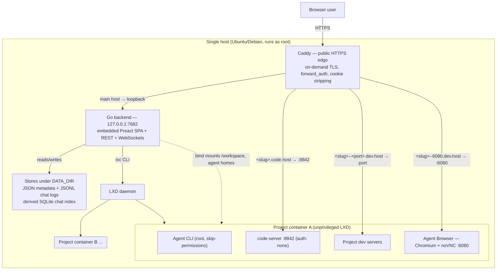
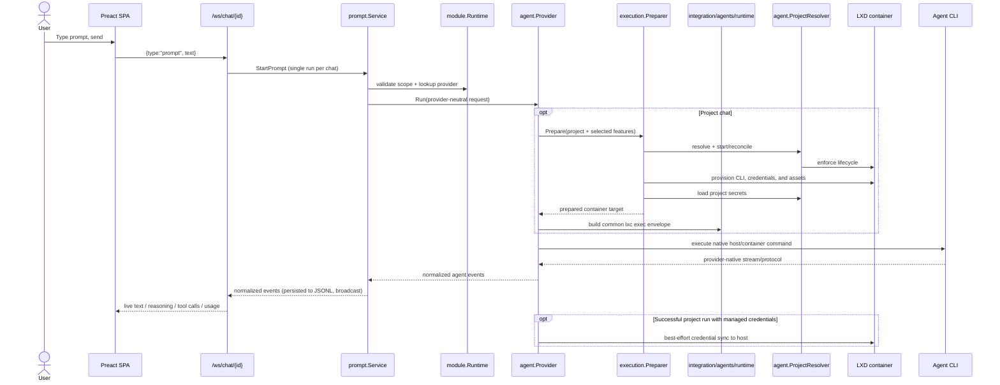

# Architecture

This document describes how remote.futrx is put together: its runtime topology, the layers of the backend, the trust boundaries that matter for security, and where the load-bearing code lives. It is the map; the [`docs/`](docs/) tree holds the per-subsystem deep dives, and the [threat model](docs/threat-model.md) analyzes the boundaries described here.

## What it is

remote.futrx is a **single-server, self-hosted** workspace for Claude Code,
Codex, MiniMax through the Codex harness, Kimi Code, and Antigravity. A user creates a project,
the platform gives that project an isolated Linux container, and the user
drives interactive or scheduled agent turns against the project's files from
the browser—with chat, terminal, code editor, file manager, Git history, task
schedules, and live app previews attached to the same project.

Everything runs on one host. There is no clustering, no external database, and no multi-node story (see [Known limitations](docs/known-limitations.md)).

## Runtime topology



**Key facts about the topology:**

- The Go backend is **one process, bound to loopback** (`HOST=127.0.0.1:7682`, [`backend/internal/config/config.go`](backend/internal/config/config.go)). Caddy is the only thing listening on the public interface.
- The backend runs as **root** ([`infra/templates/remote.futrx.service.tmpl`](infra/templates/remote.futrx.service.tmpl), `User=root`) because it drives the `lxc` CLI and chowns workspace files into the container idmap. This is a deliberate design choice with security consequences — see the [threat model](docs/threat-model.md).
- There is **no external database service.** Authoritative platform state is flat files under `DATA_DIR` (`/opt/remote.futrx/data`): JSON for auth/users/projects/access/secrets and append-only JSONL for chat event logs. A disposable embedded SQLite database persists chat event offsets and transcript-turn ranges for bounded reads, validating them against JSONL file metadata and a prefix fingerprint before extending them. Concurrency is guarded by in-process mutexes only.
- Each project is **one unprivileged LXD container** built from a shared base image (`futrx-remote-dev-base`: Ubuntu 24.04 + Node 22 + pinned agent CLIs + Chromium + code-server). Durable state lives on the host and is bind-mounted in.

## The four public host classes

Caddy ([`infra/templates/Caddyfile.tmpl`](infra/templates/Caddyfile.tmpl)) terminates HTTPS for four classes of hostname and routes each differently. This routing table *is* the external attack surface:

| Host pattern | Routes to | Auth at the edge |
| --- | --- | --- |
| `remote.example.com` (main) | Go backend on loopback | App session middleware; `/internal/*` blocked externally; `/portal/*` is token-gated instead ([client portal](docs/02-workspaces/14-client-portal.md)) |
| `code.<host>` and `<slug>.code.<host>` | code-server IDE in container on `:8842` | `forward_auth` → `/auth/verify` (**registered user only — no project membership check**) |
| `<slug>--<port>.dev.<host>` | Project dev server on `<slug>.lxd:<port>` | `forward_auth` → `/auth/verify` (**project membership enforced**, or a valid public share link for that exact slug+port) |
| `<slug>--6080.dev.<host>` | Agent Browser noVNC on `:6080` | `forward_auth` → `/auth/verify` (project membership, via the dev pattern) |

Two properties of this table are load-bearing and both are analyzed in the threat model:

1. **Wildcard subdomains use on-demand TLS**, gated by the backend's `/internal/tls-ask` so only slugs of existing projects can mint certificates ([`project_handler.go` `HandleTLSAsk`](backend/internal/transport/http/handlers/project_handler.go)).
2. **Caddy strips the platform cookies** (`remote_session`, `remote_2fa_pending`, `remote_oauth_state`, `return_to`, `remote_share`) via `header_up` before proxying any request into a container, so untrusted in-container code can never see a replayable session token. This is the mechanism behind the "isolated previews" claim.

## Backend layering

The Go backend is strictly stratified. Requests flow **down** through the layers; lower layers never call up.

```
transport/  ── HTTP handlers, WebSocket sockets, auth middleware
    │
service/    ── business logic: chat, prompt, project, user, auth, container/*, workspacefiles, ...
    │
integration/ & stores/  ── the outside world: lxc CLI, git CLI, tmux, host fs, Google OAuth; file-backed stores
```

| Layer | Responsibility | Entry points |
| --- | --- | --- |
| **transport** | Route parsing, session/membership gates, JSON encoding, WS upgrades | [`transport/transport.go`](backend/internal/transport/transport.go), [`http/middleware/auth.go`](backend/internal/transport/http/middleware/auth.go) |
| **service** | All policy: what a request is allowed to do and what it means | [`service/services.go`](backend/internal/service/services.go) |
| **integration** | Typed wrappers over host tools (`lxc`, `git`, `tmux`, `/proc`, Google) | [`integration/`](backend/internal/integration/) |
| **stores** | File-backed persistence with in-process mutexes | [`stores/`](backend/internal/stores/) |

Composition roots: [`backend/cmd/remote/main.go`](backend/cmd/remote/main.go) (server), [`backend/internal/service/services.go`](backend/internal/service/services.go) (services), [`backend/internal/config/containers.go`](backend/internal/config/containers.go) (the container-capability stack).

## Identity, sessions, and access

Three **separate** concerns, deliberately not conflated ([deep dive](docs/02-workspaces/02-auth-users-and-access.md)):

1. **Platform identity.** Exactly one local-admin account (email + password, argon2id, min 12 chars, in `local-admin.json`); every other user signs in through **Google OAuth only** and must be invited first. There is no self-signup. The first claim is gated on a one-time token generated at startup and printed only to the server terminal (`setup-token.json` holds its SHA-256, never the token), so an unclaimed server cannot be taken over by whoever loads the page first; once an administrator exists, that administrator authorises any further claim instead.
2. **Agent-provider credentials.** Host-wide OAuth tokens for
   Claude/Codex/Kimi, connected once by an admin and **shared by all projects
   and users** on the box. MiniMax instead reads `MINIMAX_API_KEY` from each
   project's secret store, while Antigravity authenticates through `agy`
   inside one project and stores that state in its project-specific durable
   provider mount.
3. **Per-project membership.** A flat email access-list per project (`projectaccess/<id>.json`). Any member — not only admins — can read/write that project's secrets and edit its member list.

**Sessions** are stateless HMAC-SHA256 tokens (`{email, sub, iat, exp, sid}`, 30-day expiry) signed by a random key at `DATA_DIR/session.key` ([`session_codec.go`](backend/internal/service/auth/session_codec.go)). The cookie is `HttpOnly; Secure; SameSite=Lax` and **domain-scoped to the base host** so it reaches the preview/IDE subdomains for `forward_auth`. By default there is still no server-side session store: logout only clears the cookie, and per-request `IsRegistered` checks are the only way a session is invalidated early.

An account can opt in, from Settings → Security, to a small tracked-session model layered on top of the same stateless cookie, via three independent per-account toggles held in `SessionRegistry` ([`session_registry.go`](backend/internal/service/auth/session_registry.go)): **single active session** (a new login supersedes the account's previous session id, checked inside `CurrentSession` alongside the existing local-admin-vs-Google rule), **sign-in history** (a bounded, newest-first record of past logins), and **recovery-code alert** (settable only while TOTP 2FA is also enabled; flags a login that used a recovery code instead of the authenticator app, surfaced on `/auth/me`). TOTP 2FA itself is a fourth, independent toggle (`twofactor.go`) that adds a second factor to the login flow (`/auth/2fa/verify`) without requiring any of the other three. None of the four toggles affects an account that has not turned it on: `CurrentSession`'s registry lookup, the history write, and the alert check are all short-circuited by the account's cached `SecurityPreferences`/2FA-enrollment state, so the stateless, zero-lookup path described above is exactly what unopted accounts still get.

**Request gating** ([`middleware/auth.go`](backend/internal/transport/http/middleware/auth.go)): the middleware covers `/api/*` and `/ws*` only. It requires a valid session for a registered user, then two setup preconditions: local admin claimed, and at least one module marked `SatisfiesAccessGate` ready. A no-auth gate module is ready immediately; managed code/device modules require an authenticated binding; external auth cannot be a gate because Remote has no authoritative status signal for it. The module-driven auth catalog and streams remain reachable while this gate is closed. Admin-only routes and project-membership routes re-check authorization per handler.

## Request lifecycle: a prompt



The run hub ([`service/runhub/hub.go`](backend/internal/service/runhub/hub.go))
enforces **one run per chat**, persists every event through the chat repository,
and replays history to reconnecting subscribers by sequence number. Provider
adapters ([`integration/agents/claude`](backend/internal/integration/agents/claude),
[`integration/agents/codex`](backend/internal/integration/agents/codex),
[`integration/agents/minimax`](backend/internal/integration/agents/minimax),
[`integration/agents/kimi`](backend/internal/integration/agents/kimi), and
[`integration/agents/antigravity`](backend/internal/integration/agents/antigravity)) normalize each
provider's available output into a shared event stream. Antigravity print mode
provides plain streamed text rather than structured tool/usage events.

Agent composition uses the validated provider-owned factory contract in
[`service/agent/module`](backend/internal/service/agent/module). Each adapter
package exposes one `NewFactory()` from its local `factory.go` and is
compile-time checked against `module.FactoryBuilder`. The factory keeps public
descriptor metadata separate from its private provisioning profile and
project-preparation policy. `AuthNone` modules omit the binding; all other auth
modes require one. Project-capable modules must provide a profile; a host-only
module may provide one when it runs a locally installed CLI, or omit it for a
remote integration.

Catalog construction rejects duplicate or unsafe IDs, multiple defaults,
invalid auth/scope/feature combinations, and overlapping persistent-state
mounts before the server starts. `Catalog.Build` then returns one
`module.Runtime` that owns matching provider and authentication registries, so
consumers cannot combine state built from different catalogs. The provider
runtime contract itself stays narrow: identity, capability discovery, and
execution.

Provider-specific commands, protocols, parsers, credentials, capability
probes, and profiles live in the concrete
[`integration/agents`](backend/internal/integration/agents) adapters. Neutral
provider contracts remain in [`agent`](backend/internal/agent), and shared project
start/provision/secret orchestration lives in
[`service/agent/execution`](backend/internal/service/agent/execution), while
[`integration/agents/runtime`](backend/internal/integration/agents/runtime)
assembles the common process and `lxc exec` command shapes used by those
adapters. Each provider factory declares its small preparation policy and
retains native CLI argument and transport ownership.

The explicit composition root in
[`config/agents.go`](backend/internal/config/agents.go) only lists provider
`NewFactory` functions in deterministic order. There is no plugin discovery or
package `init` registration. `service.New` passes application-facing
`module.BuildDependencies`—the narrow
[`ProjectResolver`](backend/internal/agent/project.go), full container ports,
and global credential-sync timeout—to `Catalog.Build`. For every project-scoped
module, `module.Factory` constructs `execution.Preparer` from a deep clone of
the validated profile and the provider's `ProjectPreparationPolicy`. It then
projects only `ProjectPreparer`, `CredentialCollector`, and the sync timeout
into the provider callback, alongside an independent validated profile clone.
Those factory dependencies do not expose project-service models or the full
container port set. Current adapters use the shared preparer; importing project
services directly or copying its CLI/workspace/browser/lifecycle workflow would
violate the integration contract.

When application authentication is enabled, service startup additionally
requires at least one managed or no-auth module that declares
`SatisfiesAccessGate`; this prevents a valid-looking catalog from leaving every
application route permanently behind an impossible onboarding gate.

The catalog also owns the provider default. At most one module may be marked
default, and it must support host execution; Codex is the current built-in
default. When no explicit provider is stored, chat creation, user settings,
and skill lookup ask the catalog for the default compatible with the requested
scope, falling back deterministically to the first compatible module.

A chat with **no project** ("loose chat") runs the CLI directly on the host instead of in a container. This path is convenient but removes the container boundary; its consequences are the subject of several threat-model entries.

## Data and persistence model

| Data | Location | Format | Notes |
| --- | --- | --- | --- |
| Local admin | `DATA_DIR/local-admin.json` | JSON | argon2id hash, mode 0600 |
| Users / roles | `DATA_DIR/users.json` | JSON | admin/member rows |
| Project metadata | `DATA_DIR/projects/<id>/meta.json` | JSON | slug is the container name |
| Project membership | `DATA_DIR/projectaccess/<id>.json` | JSON | flat email list |
| Project secrets | `DATA_DIR/projectsecrets/<id>.json` | JSON | **plaintext**, mode 0600, not encrypted at rest |
| Platform secrets vault | `DATA_DIR/globalsecrets.json` | JSON | **plaintext**, mode 0600, env/file/SSH entries injected into every scoped project container ([deep dive](docs/02-workspaces/16-secrets-vault.md)) |
| Public preview links | `DATA_DIR/projectshares/<id>.json` | JSON | SHA-256 token digests only, mode 0600 |
| Client portals | `DATA_DIR/portals/<id>.json` | JSON | SHA-256 token digest plus display toggles, mode 0600 ([deep dive](docs/02-workspaces/14-client-portal.md)) |
| Preview screenshots | `DATA_DIR/screenshots/<id>/` | PNG files + `index.json` | headless captures of a project's preview ports, newest 20 per project, mode 0600; the index stores a SHA-256 digest of any 24h public link ([deep dive](docs/02-user-guide/06-previews-and-inspector.md#share-a-screenshot)) |
| Chat events | `DATA_DIR/chats/<id>/events.jsonl` | JSONL | append-only, monotonic `seq`, no rotation |
| Chat event index | `DATA_DIR/transcript-index.sqlite` | SQLite | disposable event-offset and transcript-turn index rebuilt from chat JSONL |
| Scheduled tasks | `DATA_DIR/scheduled-tasks/tasks.json` | JSON | definitions, deadlines, durable claims, pending state, and last outcomes |
| Notification settings | `DATA_DIR/notifications.json` | JSON | Telegram bot token, WhatsApp credential, webhook secret, and the weekly digest schedule, **plaintext**, mode 0600 |
| Monitoring settings | `DATA_DIR/monitoring.json` | JSON | Outbound heartbeat URL and interval plus the last push outcome, **plaintext**, mode 0600 ([deep dive](docs/04-operations/11-uptime-monitoring.md)) |
| Auxiliary model settings | `DATA_DIR/aux-model.json` | JSON | Endpoint, model, optional API key (**plaintext**, mode 0600), timeout, and the per-job toggles for the optional small text model ([deep dive](docs/02-workspaces/24-auxiliary-model.md)) |
| Client site watcher | `DATA_DIR/sitewatch/sites.json` + `history/<id>.jsonl` | JSON + JSONL | The watched client websites (mode 0600 — a site may carry a shared request token) plus one append-only check log per site, trimmed to 500 records ([deep dive](docs/04-operations/12-client-site-monitoring.md)) |
| MCP server registry | `DATA_DIR/mcpservers.json` + `DATA_DIR/projectmcp/<id>.json` | JSON | Platform entries plus per-project overrides for the external tool servers agents may call. **No credential is stored**: an entry carries `${KEY}` placeholders and the vault keys behind them, resolved at materialization ([deep dive](docs/02-workspaces/25-mcp-servers.md)) |
| Free-tier provider pool | `DATA_DIR/providers.json` + `DATA_DIR/providerpool/usage-YYYY-MM.jsonl` | JSON + JSONL | The registry of connected third-party model APIs (Gemini, Groq, Cerebras, OpenRouter…) plus one append-only usage line per request, failover, and cooldown. Both mode 0600: an entry may carry an inline API key, and the ledger names which providers this server leans on. Documented free-tier limits are **seed data, not truth** — editable, nullable, and always losing to the vendor's own rate-limit headers ([deep dive](docs/02-workspaces/26-ai-providers.md)) |
| Global skills library | `DATA_DIR/skills-global/<name>/` | SKILL.md dirs + `_index.json` | admin-published skills pushed into every project container ([deep dive](docs/02-workspaces/09-global-skills.md)) |
| Third-party agent endpoints | `DATA_DIR/agent-endpoints.json` | JSON | The register of vendor-published compatibility endpoints one chat's agent may be pointed at, mode 0600, seeded on first run with **disabled** templates. **No API key is stored**: a profile carries the name of a Secrets-vault key, resolved per run and injected as environment for that run only ([deep dive](docs/02-workspaces/27-agent-endpoints.md)) |
| Model routing policy | `DATA_DIR/model-routing.json` | JSON | Automatic model routing: the master switch, the ordered rule list, and the cheap/default/expensive destinations, mode 0600, seeded disabled on first run ([deep dive](docs/02-workspaces/23-model-routing.md)) |
| Fleet resource policy | `DATA_DIR/resources.json` | JSON | container defaults, host reserve, per-project ceiling, running-container cap |
| Playbook library | `DATA_DIR/playbooks.json` | JSON | admin-curated composer prompt templates, seeded once on first run ([deep dive](docs/02-workspaces/13-playbooks.md)) |
| Personal snippets | `DATA_DIR/snippets/<owner>-<digest>.json` | JSON | one private library per user: saved prompts plus bilingual client message templates, seeded on that user's first read, mode 0600 ([deep dive](docs/02-workspaces/21-snippets-and-client-messages.md)) |
| GitHub automation | `DATA_DIR/github/<id>.json` | JSON | Per-project webhook secret (**plaintext**, mode 0600 — HMAC verification needs the secret itself), automation toggles, and the last 20 inbound deliveries ([deep dive](docs/02-workspaces/22-github-integration.md)) |
| Audit log | `DATA_DIR/audit/audit-YYYY-MM.jsonl` | JSONL | append-only, one file per month, mode 0600, pruned by retention |
| Push subscriptions | `DATA_DIR/push-subscriptions/sha256-<hash>.json` | JSON | one file per user, filename hashes the email |
| Web Push signing key | `DATA_DIR/webpush-vapid.json` | JSON | VAPID P-256 pair, mode 0600; rotating it invalidates every browser subscription |
| Session key | `DATA_DIR/session.key` | 32 random bytes | mode 0600 |
| Google OAuth secret | `DATA_DIR/oauth.json` | JSON | plaintext, mode 0600 |
| Provider tokens | `/root/.claude*`, `/root/.codex`, `/root/.kimi-code` | provider files | copied into every container |
| MiniMax project state | `/var/lib/remote/projects/<slug>/agent-home/minimax` | Codex-harness files | bind-mounted to `/root/.minimax`; its API key remains in the project secret store |
| Antigravity project auth/session | `/var/lib/remote/projects/<slug>/agent-home/antigravity` | provider files | bind-mounted to `/root/.gemini/antigravity-cli`; survives container replacement |
| Workspace files | `/var/lib/remote/projects/<slug>/workspace` | on-disk tree | bind-mounted to `/workspace` |
| Agent homes | `/var/lib/remote/projects/<slug>/agent-home/*` | on-disk tree | bind-mounted to `/root/.claude` etc. |

JSON and metadata writes use temp-file + rename. Chat events are different: they append directly to JSONL with `O_APPEND`. The SQLite chat index is derived state, transactionally refreshed from those logs, and is not a source of truth. The authoritative file paths do not add `fsync`, file locking, or a transaction spanning multiple stores. The design assumes exactly one backend process touching `DATA_DIR`.

## Container model

Containers are **cattle**; durable state lives on the host and is bind-mounted in ([deep dive](docs/02-workspaces/03-projects-and-containers.md), [`lifecycle/service.go`](backend/internal/service/container/lifecycle/service.go)):

- **Six bind mounts per project:** `workspace` → `/workspace`, plus the
  provider-declared persistent directories for Claude, Codex, MiniMax, Kimi,
  and Antigravity. Antigravity mounts only `/root/.gemini/antigravity-cli`, not the
  whole `.gemini` tree. Host dirs are chowned to uid/gid `1000000` (the
  unprivileged-root idmap) via `os.OpenRoot`+`Lchown` to defeat symlink-swap
  races.
- **A managed LXD profile** (`futrx-workspace`, [`resources/manager.go`](backend/internal/integration/containers/resources/manager.go)) carries the fleet resource envelope and sets `security.nesting=true` for nested-container workloads. Chromium currently launches with `--no-sandbox`, so that setting is not a Chromium sandbox guarantee. The envelope itself is **operator policy at runtime** ([`service/resources`](backend/internal/service/resources/), persisted to `DATA_DIR/resources.json`, derived from host capacity on first run) rather than a compiled constant, and an aggregate guard refuses a start that would commit more memory than the host has outside its reserve. Profile convergence on the launch path stays best-effort because errors from `resources.Ensure` are discarded; explicit per-project overrides fail launch when they cannot be applied. The **root-disk quota** needs a btrfs/zfs/lvm/ceph pool; on a `dir` pool it is reported unsupported and skipped. See [Resource limits](docs/02-workspaces/11-resource-limits.md).
- **Networking:** containers share LXD's default bridge; Caddy reaches them by `<slug>.lxd:<port>` DNS. The bridge has no inter-container ACLs by default.
- **Everything else crosses via `lxc file push/pull` and `lxc exec`:** credentials, project secrets (as `environment.*` config and `--env` args), agent instructions, provider runtime assets, and skill links.
- **Platform secrets** are merged in underneath the project's own: vault entries in scope are applied first (environment variables, files at mode 0600, SSH keys plus a managed `~/.ssh/config` region), then project secrets on top, so a project key always wins. What the vault materialized is recorded in `/root/.remote-secrets.json` inside the container, which is what makes removal exact.

The rootfs is disposable — [`upgrade-workspaces`](backend/cmd/upgrade-workspaces/main.go) replaces containers wholesale onto a new base image, so anything installed outside `/workspace` and the agent homes is lost on upgrade.

## Scheduled execution

Scheduled tasks are a control-plane capability, not container cron jobs. The
backend stores definitions and persisted claims in
`DATA_DIR/scheduled-tasks/tasks.json`, owns one timer loop, and injects each due
prompt through the normal prompt service and one-run-per-chat hub.

Interactive agents receive a short-lived, owner/chat/project-fenced `manage`
capability only when the **Scheduled Tasks** skill is selected. A scheduled
turn receives a narrower `complete-self` capability for its own task and run.
Agent-created tasks start disabled and require a human **Arm** action. Default
guardrails are a five-minute minimum recurrence, two concurrent scheduled
runs, and twenty standing tasks per project.

See [Scheduled tasks](docs/02-workspaces/06-scheduled-tasks.md) for the claim,
overlap, authorization, cron, and crash-recovery state machine.

## Previews, IDE, and the Agent Browser

Three capabilities live inside each container ([deep dive](docs/03-platform/06-previews-and-browser.md)):

- **App previews:** the backend runs `ss` inside the container to discover listening ports ([`listeners/scanner.go`](backend/internal/integration/containers/listeners/scanner.go), loopback binds excluded), and each becomes a `<slug>--<port>.dev.<host>` URL. No per-app proxy config is written — DNS + Caddy regex do the routing.
- **Per-project IDE:** a pinned code-server listens on `127.0.0.1:8081` with `auth: none`, reachable only through a socket-activated proxy on `:8842` that scales to zero when idle. Authentication is entirely at the Caddy edge.
- **Agent Browser:** one shared headed Chromium per project, driven by the user via noVNC (`:6080`) and by the agent via MCP-over-CDP (`127.0.0.1:9222`) — the *same* browser session, so the agent inherits whatever sites the user logged into. The human UI can start and view it directly; selecting the `browser` skill enables agent MCP access for Claude, Codex, or MiniMax.

## Frontend

A **Preact** (not React) SPA built with Vite + Tailwind, whose production build is embedded into the Go binary via `go:embed` and served same-origin ([deep dive](docs/03-platform/07-data-and-frontend-state.md)). It is an installable **PWA**: `frontend/public/` supplies the manifest, icons, and a service worker for Web Push plus network-first navigation. The worker deliberately does not cache the app shell or API data; it caches only the self-contained `/offline.html` fallback and serves it when navigation cannot reach the network. Cache cleanup is restricted to Remote-owned offline-cache names. (The `code.<host>` **IDE launcher** in [`infra/launcher/`](infra/launcher/) is a separate PWA on a separate origin, with its own manifest and worker.)

**Notifications.** The backend raises a Web Push notification when an agent calls `AskUserQuestion`, when a turn completes or fails, and when a scheduled run finishes. The trigger hangs off the chat repository's append path ([`push_notifier.go`](backend/internal/service/push_notifier.go)), so every producer — interactive prompts, scheduled runs, crash recovery — is covered by construction. The audience mirrors chat visibility: project members plus admins, or every registered user for a loose chat. VAPID signing and RFC 8291 payload encryption are implemented against the standard library only ([`integration/webpush`](backend/internal/integration/webpush/)), so push services relay ciphertext they cannot read and the dependency list is unchanged. It is strictly layered (`config → models → transport → api → state → app → ui`), uses no external state store and no URL router, and talks to the backend over REST (`fetch`, cookie session) plus WebSockets for live data. All auth is the same-origin cookie — **no token ever touches JavaScript**, and there are no CSRF tokens (protection rests on `SameSite=Lax` and the same-origin edge). The markdown renderer emits vnodes only, with an href allowlist and no `innerHTML` anywhere, keeping the XSS surface narrow.

**Agent authentication UI.** The frontend loads ordered module metadata and a
normalized auth snapshot from `GET /api/agent-auth`, then subscribes to
`/ws/agent-auth/<provider>` for each managed flow. The same descriptor fields
drive onboarding eligibility, Settings cards, provider labels/instructions,
and code-versus-device controls. External and no-auth modules render without
inventing managed login actions. Legacy provider-specific status endpoints and
WebSockets remain available for compatibility, but the current UI does not
depend on their provider-specific payloads.

## Deployment and supply chain

Deployment is a single-box, root-driven, idempotent-converge model ([deep dive](docs/04-operations/09-deployment-and-operations.md)):

- **[`infra/install.sh`](infra/install.sh)** is both bootstrap and deployer. It
  clones/selects `/opt/remote.futrx`, re-executes the chosen checkout, then
  walks `infra/steps/00..07` (checkout guard, host deps, host agents/app build,
  Caddy, systemd service, base image, SSH hardening, network-heal timer). It is
  re-runnable without mixing manifests from the old and selected commits.
- **Host agent CLI installation is catalog-driven.** After selecting the target
  checkout, the application step runs `cmd/install-host-agents`, which
  converges every host-scoped module with
  a local profile using that profile's binary, provider-declared version
  arguments, exact semver pin, npm package or install script, timeout, and
  verification policy. Every installer mode targets the application-owned
  `data/host-clis` prefix; the installer, systemd service, and login-shell
  profile all put its `bin` directory first and verify that ordinary command
  resolution selects the same absolute executable that was installed. This
  prevents a stale host-global binary from shadowing a newly installed pin.
  Host-only remote integrations may
  omit a profile and install nothing. The base image and runtime repair consume
  the same profiles for project-scoped modules.
- **[`infra/update.sh`](infra/update.sh)** fetches and hard-resets to the
  requested tag/ref (default `origin/main`), rebuilds, and recycles containers
  onto a fresh base image. Busy-workspace detection is intended to skip active
  runs but is not currently reliable; use a maintenance window or
  `--skip-workspaces` when interruption is unacceptable.
- **CI publishes releases; it does not deploy production.**
  [`.github/workflows/release-on-tag.yml`](.github/workflows/release-on-tag.yml)
  creates a GitHub Release for a semantic-version tag after classifying it.
  Production changes are applied separately by an operator through Remote's
  updater or `infra/update.sh`.
- **Version pinning:** every pin — agent CLIs, host toolchain, code-server, Playwright/Chrome-for-Testing — lives in one manifest ([`versions.env`](backend/internal/agent/provisioning/versions.env), symlinked at [`infra/versions.env`](infra/versions.env)), embedded by the backend and sourced by the infra scripts. The Playwright browser archives additionally have sha256 pins backing a vendored fallback ([`vendors/`](vendors/README.md)) for servers geo-blocked by Google's CDN; the remaining upstream fetches (NodeSource, the Go tarball, the code-server `.deb`, the Ubuntu base image) are version-pinned but not checksum- or signature-verified.

The security consequences of applying unsigned update refs as root and of
unverified upstream fetches are covered in the
[threat model](docs/threat-model.md).

## Trust boundaries at a glance

These are the boundaries the [threat model](docs/threat-model.md) reasons about:

1. **Internet → Caddy → backend.** External users hit only Caddy; the backend trusts Caddy's `X-Forwarded-*` headers because only loopback reaches it.
2. **Registered user → other users' projects.** Enforced per-resource in handlers and at `forward_auth` — but unevenly (dev previews check membership; the IDE host class does not).
3. **Container → host, and container → sibling container.** Unprivileged LXC namespaces plus resource caps are the boundary; the shared bridge and in-container `auth: none` services are the soft spots.
4. **Agent → everything it can reach.** The agent runs as root inside its container (or on the host for loose chats) with safety rails off, so any content it ingests (web pages, files, attachments) is a potential injection vector.
5. **Host → upstreams.** The root-run installer, updater, and base-image build
   pull code and packages from GitHub and external registries; release CI is a
   separate publication path and does not deploy the host.

## Where to read next

- [`docs/01-overview/`](docs/01-overview/) — system overview and the code map
- [`docs/02-workspaces/`](docs/02-workspaces/) — auth, projects/containers, chat/agents, workspace tools
- [`docs/dev/agents/`](docs/dev/agents/) — agent module contracts and the complete extension guide
- [`docs/03-platform/`](docs/03-platform/) — previews & browser, data & frontend state, API & realtime
- [`docs/04-operations/`](docs/04-operations/) — deployment, operations, and the [audit log](docs/04-operations/10-audit-log.md)
- [Threat model](docs/threat-model.md) · [Known limitations](docs/known-limitations.md)
