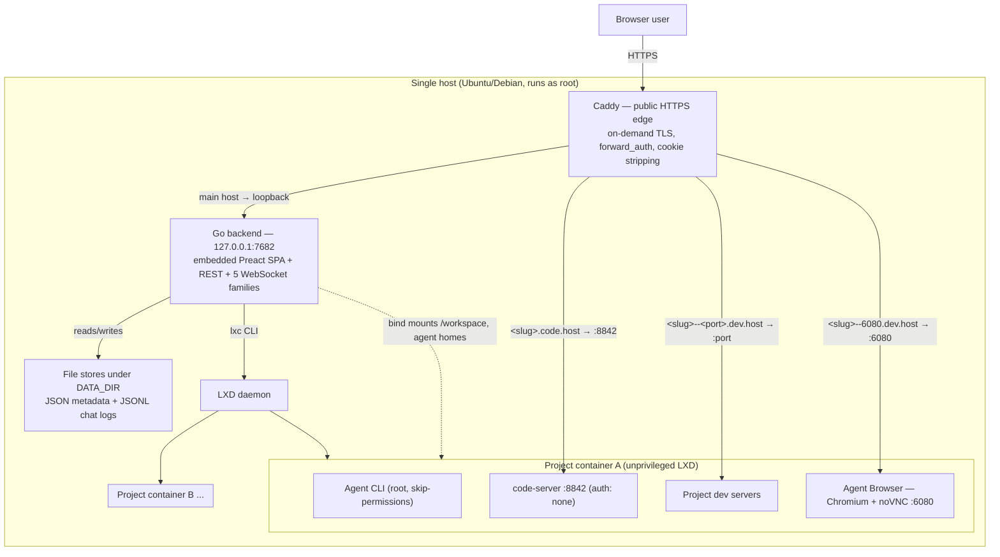
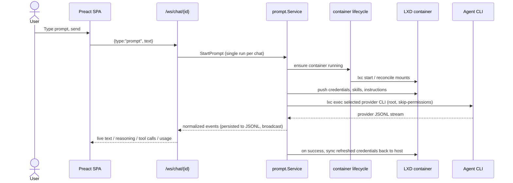

# Architecture

This document describes how remote.futrx is put together: its runtime topology, the layers of the backend, the trust boundaries that matter for security, and where the load-bearing code lives. It is the map; the [`docs/`](docs/) tree holds the per-subsystem deep dives, and the [threat model](docs/threat-model.md) analyzes the boundaries described here.

## What it is

remote.futrx is a **single-server, self-hosted** workspace for the Claude
Code, Codex, Kimi Code, and Antigravity agent CLIs. A user creates a project,
the platform gives that project an isolated Linux container, and the user
drives interactive or scheduled agent turns against the project's files from
the browser—with chat, terminal, code editor, file manager, Git history, task
schedules, and live app previews attached to the same project.

Everything runs on one host. There is no clustering, no external database, and no multi-node story (see [Known limitations](docs/known-limitations.md)).

## Runtime topology



**Key facts about the topology:**

- The Go backend is **one process, bound to loopback** (`HOST=127.0.0.1:7682`, [`backend/internal/config/config.go`](backend/internal/config/config.go)). Caddy is the only thing listening on the public interface.
- The backend runs as **root** ([`infra/templates/remote.futrx.service.tmpl`](infra/templates/remote.futrx.service.tmpl), `User=root`) because it drives the `lxc` CLI and chowns workspace files into the container idmap. This is a deliberate design choice with security consequences — see the [threat model](docs/threat-model.md).
- There is **no database.** All platform state is flat files under `DATA_DIR` (`/opt/remote.futrx/data`): JSON for auth/users/projects/access/secrets, append-only JSONL for chat event logs. Concurrency is guarded by in-process mutexes only.
- Each project is **one unprivileged LXD container** built from a shared base image (`futrx-remote-dev-base`: Ubuntu 24.04 + Node 22 + pinned agent CLIs + Chromium + code-server). Durable state lives on the host and is bind-mounted in.

## The four public host classes

Caddy ([`infra/templates/Caddyfile.tmpl`](infra/templates/Caddyfile.tmpl)) terminates HTTPS for four classes of hostname and routes each differently. This routing table *is* the external attack surface:

| Host pattern | Routes to | Auth at the edge |
| --- | --- | --- |
| `remote.example.com` (main) | Go backend on loopback | App session middleware; `/internal/*` blocked externally; `/portal/*` is token-gated instead ([client portal](docs/02-workspaces/14-client-portal.md)) |
| `code.<host>` and `<slug>.code.<host>` | code-server IDE in container on `:8842` | `forward_auth` → `/auth/verify` (**registered user only — no project membership check**) |
| `<slug>--<port>.dev.<host>` | Project dev server on `<slug>.lxd:<port>` | `forward_auth` → `/auth/verify` (**project membership enforced**, or a valid public share link for that exact slug+port) |
| `<slug>--6080.dev.<host>` | Agent Browser noVNC on `:6080` | `forward_auth` → `/auth/verify` (project membership, via the dev pattern) |

Two properties of this table are load-bearing and both are analyzed in the threat model:

1. **Wildcard subdomains use on-demand TLS**, gated by the backend's `/internal/tls-ask` so only slugs of existing projects can mint certificates ([`project_handler.go` `HandleTLSAsk`](backend/internal/transport/http/handlers/project_handler.go)).
2. **Caddy strips the platform cookies** (`remote_session`, `remote_oauth_state`, `return_to`, `remote_share`) via `header_up` before proxying any request into a container, so untrusted in-container code can never see a replayable session token. This is the mechanism behind the "isolated previews" claim.

## Backend layering

The Go backend is strictly stratified. Requests flow **down** through the layers; lower layers never call up.

```
transport/  ── HTTP handlers, WebSocket sockets, auth middleware
    │
service/    ── business logic: chat, prompt, project, user, auth, container/*, workspacefiles, ...
    │
integration/ & stores/  ── the outside world: lxc CLI, git CLI, tmux, host fs, Google OAuth; file-backed stores
```

| Layer | Responsibility | Entry points |
| --- | --- | --- |
| **transport** | Route parsing, session/membership gates, JSON encoding, WS upgrades | [`transport/transport.go`](backend/internal/transport/transport.go), [`http/middleware/auth.go`](backend/internal/transport/http/middleware/auth.go) |
| **service** | All policy: what a request is allowed to do and what it means | [`service/services.go`](backend/internal/service/services.go) |
| **integration** | Typed wrappers over host tools (`lxc`, `git`, `tmux`, `/proc`, Google) | [`integration/`](backend/internal/integration/) |
| **stores** | File-backed persistence with in-process mutexes | [`stores/`](backend/internal/stores/) |

Composition roots: [`backend/cmd/remote/main.go`](backend/cmd/remote/main.go) (server), [`backend/internal/service/services.go`](backend/internal/service/services.go) (services), [`backend/internal/config/containers.go`](backend/internal/config/containers.go) (the container-capability stack).

## Identity, sessions, and access

Three **separate** concerns, deliberately not conflated ([deep dive](docs/02-workspaces/02-auth-users-and-access.md)):

1. **Platform identity.** Exactly one local-admin account (email + password, argon2id, min 12 chars, in `local-admin.json`); every other user signs in through **Google OAuth only** and must be invited first. There is no self-signup.
2. **Agent-provider credentials.** Host-wide OAuth tokens for
   Claude/Codex/Kimi, connected once by an admin and **shared by all projects
   and users** on the box. Antigravity instead authenticates through `agy`
   inside one project and stores that state in the replaceable container root.
3. **Per-project membership.** A flat email access-list per project (`projectaccess/<id>.json`). Any member — not only admins — can read/write that project's secrets and edit its member list.

**Sessions** are stateless HMAC-SHA256 tokens (`{email, sub, iat, exp}`, 30-day expiry) signed by a random key at `DATA_DIR/session.key` ([`session_codec.go`](backend/internal/service/auth/session_codec.go)). The cookie is `HttpOnly; Secure; SameSite=Lax` and **domain-scoped to the base host** so it reaches the preview/IDE subdomains for `forward_auth`. There is no server-side session store: logout only clears the cookie, and per-request `IsRegistered` checks are the only way a session is invalidated early.

**Request gating** ([`middleware/auth.go`](backend/internal/transport/http/middleware/auth.go)): the middleware covers `/api/*` and `/ws*` only. It requires a valid session for a registered user, then two setup preconditions (local admin claimed; at least one provider authenticated). Admin-only routes and project-membership routes re-check authorization per handler.

## Request lifecycle: a prompt



The run hub ([`service/runhub/hub.go`](backend/internal/service/runhub/hub.go))
enforces **one run per chat**, persists every event through the chat repository,
and replays history to reconnecting subscribers by sequence number. Provider
adapters ([`agent/claude`](backend/internal/agent/claude),
[`agent/codex`](backend/internal/agent/codex),
[`agent/kimi`](backend/internal/agent/kimi), and
[`agent/antigravity`](backend/internal/agent/antigravity)) normalize each
CLI's available output into a shared event stream. Antigravity print mode
provides plain streamed text rather than structured tool/usage events.

A chat with **no project** ("loose chat") runs the CLI directly on the host instead of in a container. This path is convenient but removes the container boundary; its consequences are the subject of several threat-model entries.

## Data and persistence model

| Data | Location | Format | Notes |
| --- | --- | --- | --- |
| Local admin | `DATA_DIR/local-admin.json` | JSON | argon2id hash, mode 0600 |
| Users / roles | `DATA_DIR/users.json` | JSON | admin/member rows |
| Project metadata | `DATA_DIR/projects/<id>/meta.json` | JSON | slug is the container name |
| Project membership | `DATA_DIR/projectaccess/<id>.json` | JSON | flat email list |
| Project secrets | `DATA_DIR/projectsecrets/<id>.json` | JSON | **plaintext**, mode 0600, not encrypted at rest |
| Public preview links | `DATA_DIR/projectshares/<id>.json` | JSON | SHA-256 token digests only, mode 0600 |
| Client portals | `DATA_DIR/portals/<id>.json` | JSON | SHA-256 token digest plus display toggles, mode 0600 ([deep dive](docs/02-workspaces/14-client-portal.md)) |
| Chat events | `DATA_DIR/chats/<id>/events.jsonl` | JSONL | append-only, monotonic `seq`, no rotation |
| Scheduled tasks | `DATA_DIR/scheduled-tasks/tasks.json` | JSON | definitions, deadlines, durable claims, pending state, and last outcomes |
| Notification settings | `DATA_DIR/notifications.json` | JSON | Telegram bot token, WhatsApp credential, webhook secret, and the weekly digest schedule, **plaintext**, mode 0600 |
| Global skills library | `DATA_DIR/skills-global/<name>/` | SKILL.md dirs + `_index.json` | admin-published skills pushed into every project container ([deep dive](docs/02-workspaces/09-global-skills.md)) |
| Fleet resource policy | `DATA_DIR/resources.json` | JSON | container defaults, host reserve, per-project ceiling, running-container cap |
| Audit log | `DATA_DIR/audit/audit-YYYY-MM.jsonl` | JSONL | append-only, one file per month, mode 0600, pruned by retention |
| Session key | `DATA_DIR/session.key` | 32 random bytes | mode 0600 |
| Google OAuth secret | `DATA_DIR/oauth.json` | JSON | plaintext, mode 0600 |
| Provider tokens | `/root/.claude*`, `/root/.codex`, `/root/.kimi-code` | provider files | copied into every container |
| Antigravity project auth/session | project container `/root/.gemini/antigravity-cli` | provider files | survives stop/start, not container replacement |
| Workspace files | `/var/lib/remote/projects/<slug>/workspace` | on-disk tree | bind-mounted to `/workspace` |
| Agent homes | `/var/lib/remote/projects/<slug>/agent-home/*` | on-disk tree | bind-mounted to `/root/.claude` etc. |

JSON and metadata writes use temp-file + rename. Chat events are different: they append directly to JSONL with `O_APPEND`. Neither path adds `fsync`, file locking, or a transaction spanning multiple stores. The design assumes exactly one backend process touching `DATA_DIR`.

## Container model

Containers are **cattle**; durable state lives on the host and is bind-mounted in ([deep dive](docs/02-workspaces/03-projects-and-containers.md), [`lifecycle/service.go`](backend/internal/service/container/lifecycle/service.go)):

- **Four bind mounts per project:** `workspace` → `/workspace`, and `agent-home/{claude,codex,kimi}` → `/root/.{claude,codex,kimi-code}`. Host dirs are chowned to uid/gid `1000000` (the unprivileged-root idmap) via `os.OpenRoot`+`Lchown` to defeat symlink-swap races.
- **Antigravity is not a fifth mount.** Its `agy` state currently lives under
  `/root/.gemini` in the replaceable rootfs.
- **A managed LXD profile** (`futrx-workspace`, [`resources/manager.go`](backend/internal/integration/containers/resources/manager.go)) carries the fleet resource envelope and sets `security.nesting=true` for nested-container workloads. Chromium currently launches with `--no-sandbox`, so that setting is not a Chromium sandbox guarantee. The envelope itself is **operator policy at runtime** ([`service/resources`](backend/internal/service/resources/), persisted to `DATA_DIR/resources.json`, derived from host capacity on first run) rather than a compiled constant, and an aggregate guard refuses a start that would commit more memory than the host has outside its reserve. Profile convergence on the launch path stays best-effort because errors from `resources.Ensure` are discarded; explicit per-project overrides fail launch when they cannot be applied. The **root-disk quota** needs a btrfs/zfs/lvm/ceph pool; on a `dir` pool it is reported unsupported and skipped. See [Resource limits](docs/02-workspaces/11-resource-limits.md).
- **Networking:** containers share LXD's default bridge; Caddy reaches them by `<slug>.lxd:<port>` DNS. The bridge has no inter-container ACLs by default.
- **Everything else crosses via `lxc file push/pull` and `lxc exec`:** credentials, project secrets (as `environment.*` config and `--env` args), agent instructions, and skill links.

The rootfs is disposable — [`upgrade-workspaces`](backend/cmd/upgrade-workspaces/main.go) replaces containers wholesale onto a new base image, so anything installed outside `/workspace` and the agent homes is lost on upgrade.

## Scheduled execution

Scheduled tasks are a control-plane capability, not container cron jobs. The
backend stores definitions and persisted claims in
`DATA_DIR/scheduled-tasks/tasks.json`, owns one timer loop, and injects each due
prompt through the normal prompt service and one-run-per-chat hub.

Interactive agents receive a short-lived, owner/chat/project-fenced `manage`
capability only when the **Scheduled Tasks** skill is selected. A scheduled
turn receives a narrower `complete-self` capability for its own task and run.
Agent-created tasks start disabled and require a human **Arm** action. Default
guardrails are a five-minute minimum recurrence, two concurrent scheduled
runs, and twenty standing tasks per project.

See [Scheduled tasks](docs/02-workspaces/06-scheduled-tasks.md) for the claim,
overlap, authorization, cron, and crash-recovery state machine.

## Previews, IDE, and the Agent Browser

Three capabilities live inside each container ([deep dive](docs/03-platform/06-previews-and-browser.md)):

- **App previews:** the backend runs `ss` inside the container to discover listening ports ([`listeners/scanner.go`](backend/internal/integration/containers/listeners/scanner.go), loopback binds excluded), and each becomes a `<slug>--<port>.dev.<host>` URL. No per-app proxy config is written — DNS + Caddy regex do the routing.
- **Per-project IDE:** a pinned code-server listens on `127.0.0.1:8081` with `auth: none`, reachable only through a socket-activated proxy on `:8842` that scales to zero when idle. Authentication is entirely at the Caddy edge.
- **Agent Browser:** one shared headed Chromium per project, driven by the user via noVNC (`:6080`) and by the agent via MCP-over-CDP (`127.0.0.1:9222`) — the *same* browser session, so the agent inherits whatever sites the user logged into. The human UI can start and view it directly; selecting the `browser` skill enables agent MCP access for Claude or Codex.

## Frontend

A **Preact** (not React) SPA built with Vite + Tailwind, whose production build is embedded into the Go binary via `go:embed` and served same-origin ([deep dive](docs/03-platform/07-data-and-frontend-state.md)). It is strictly layered (`config → models → transport → api → state → app → ui`), uses no external state store and no URL router, and talks to the backend over REST (`fetch`, cookie session) plus WebSockets for live data. All auth is the same-origin cookie — **no token ever touches JavaScript**, and there are no CSRF tokens (protection rests on `SameSite=Lax` and the same-origin edge). The markdown renderer emits vnodes only, with an href allowlist and no `innerHTML` anywhere, keeping the XSS surface narrow.

## Deployment and supply chain

Deployment is a single-box, root-driven, idempotent-converge model ([deep dive](docs/04-operations/09-deployment-and-operations.md)):

- **[`infra/install.sh`](infra/install.sh)** is both bootstrap and deployer. It clones to `/opt/remote.futrx`, walks `infra/steps/01..07` (host deps, app build, Caddy, systemd service, base image, SSH hardening, network-heal timer), and is re-runnable.
- **[`infra/update.sh`](infra/update.sh)** fetches and hard-resets to `origin/main`, rebuilds, and recycles containers onto a fresh base image. Busy-workspace detection is intended to skip active runs but is not currently reliable; use a maintenance window or `--skip-workspaces` when interruption is unacceptable.
- **CI** ([`.github/workflows/deploy.yml`](.github/workflows/deploy.yml)) deploys on push to `main` by SSHing to the box as root and running the fast build-and-restart path.
- **Version pinning:** every pin — agent CLIs, host toolchain, code-server, Playwright/Chrome-for-Testing — lives in one manifest ([`versions.env`](backend/internal/agent/provisioning/versions.env), symlinked at [`infra/versions.env`](infra/versions.env)), embedded by the backend and sourced by the infra scripts. The Playwright browser archives additionally have sha256 pins backing a vendored fallback ([`vendors/`](vendors/README.md)) for servers geo-blocked by Google's CDN; the remaining upstream fetches (NodeSource, the Go tarball, the code-server `.deb`, the Ubuntu base image) are version-pinned but not checksum- or signature-verified.

The security consequences of the root-on-push deploy chain and the unverified fetches are covered in the [threat model](docs/threat-model.md).

## Trust boundaries at a glance

These are the boundaries the [threat model](docs/threat-model.md) reasons about:

1. **Internet → Caddy → backend.** External users hit only Caddy; the backend trusts Caddy's `X-Forwarded-*` headers because only loopback reaches it.
2. **Registered user → other users' projects.** Enforced per-resource in handlers and at `forward_auth` — but unevenly (dev previews check membership; the IDE host class does not).
3. **Container → host, and container → sibling container.** Unprivileged LXC namespaces plus resource caps are the boundary; the shared bridge and in-container `auth: none` services are the soft spots.
4. **Agent → everything it can reach.** The agent runs as root inside its container (or on the host for loose chats) with safety rails off, so any content it ingests (web pages, files, attachments) is a potential injection vector.
5. **Host → upstreams.** The installer, updater, base-image build, and CI all pull code from GitHub and package registries as root.

## Where to read next

- [`docs/01-overview/`](docs/01-overview/) — system overview and the code map
- [`docs/02-workspaces/`](docs/02-workspaces/) — auth, projects/containers, chat/agents, workspace tools
- [`docs/03-platform/`](docs/03-platform/) — previews & browser, data & frontend state, API & realtime
- [`docs/04-operations/`](docs/04-operations/) — deployment, operations, and the [audit log](docs/04-operations/10-audit-log.md)
- [Threat model](docs/threat-model.md) · [Known limitations](docs/known-limitations.md)
