<p align="center">
  <a href="https://remote.futrx.com/">
    
  </a>
</p>

<h1 align="center">Give every AI project its own computer.</h1>

<p align="center">
  Run Codex, MiniMax, Claude Code, Kimi, and Antigravity in separate, always-on Linux workspaces on your own server.
  Use everything from one browser: chat, IDE, terminal, files, Git, live previews, and a shared browser.
</p>

<p align="center">
  <a href="https://remote.futrx.com/"><strong>Website</strong></a>
  ·
  <a href="https://docs.remote.futrx.com/"><strong>Documentation</strong></a>
  ·
  <a href="#quick-start"><strong>Install</strong></a>
  ·
  <a href="https://github.com/futrx-com/remote.futrx.com/issues"><strong>Roadmap</strong></a>
</p>

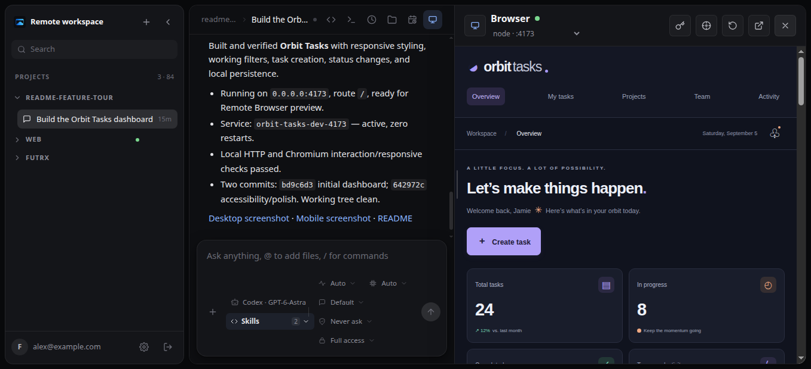

> **This fork (mustafzidan74/remote.futrx)** adds 23 features on top of upstream — trash & snapshots, share links & client portal, Telegram/WhatsApp/webhook notifications, audit log, project templates (WordPress pre-installed, Laravel, Node, Python), global skills, usage & cost dashboard, resource limits, autopilot & Playwright auto-test, playbooks & slash commands, secrets vault with SSH targets, voice input (Arabic), full-text chat search, command palette, health monitor, `/healthz` + heartbeat, and a full RTL/UX pass. See **[docs/whats-new.html](docs/whats-new.html)** (Arabic + English) and the per-feature docs under `docs/02-workspaces/`. Upstream PRs: futrx-com/remote.futrx#41–#48; the rest is offered as follow-ups.

## What is Remote?

Remote is an open-source, self-hosted home for AI coding agents.

Think of every project as its own server-side computer:

- It has a durable workspace, processes, ports, settings, and agent sessions.
- Codex, MiniMax, Claude Code, Kimi, and Antigravity can work in the same project without moving files between tools.
- The work keeps running on your server when you close your laptop.
- You can watch, review, edit, restart, or take over from any browser.

Remote is not another AI model. It gives the models you already use a complete place to work.

## A real project, end to end

These screenshots come from a real Remote project. An agent created the Orbit
Tasks demo, made two Git commits, started its server, and left the app running
for Remote to discover and preview.

### Create a project and let an agent work

<table>
  <tr>
    <td width="50%" valign="top">
      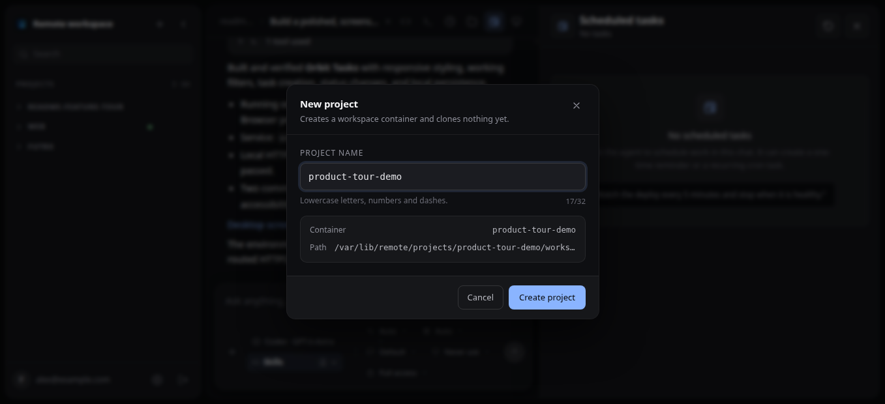
      <br>
      <strong>Isolated project computers</strong><br>
      Name a project and Remote prepares its durable workspace, container, ports, and provider homes.
    </td>
    <td width="50%" valign="top">
      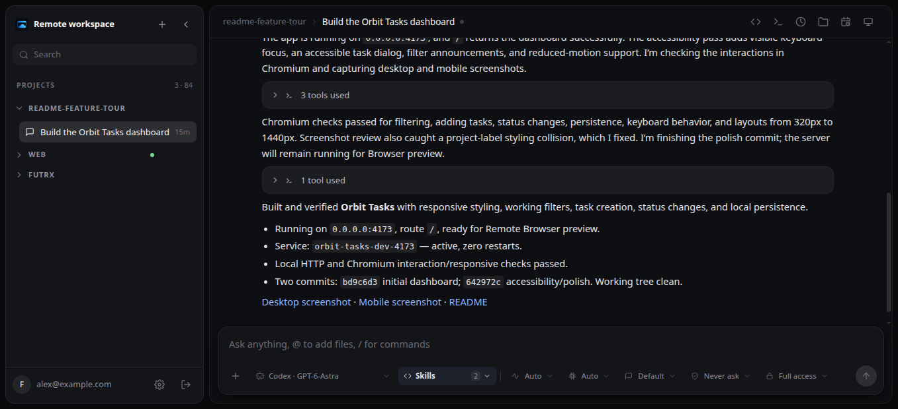
      <br>
      <strong>Durable agent conversations</strong><br>
      Follow Markdown output plus provider-supported reasoning, grouped tool calls, questions, and usage. Queue or cancel work while it runs, then rewind or fork when you want another direction.
    </td>
  </tr>
</table>

<p align="center">
  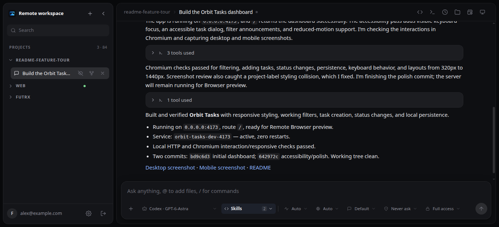
</p>

The sidebar searches projects and chats, remembers project order, and reports
running or unread work. Expand a project to start another chat; hover a chat to
mark it read or unread, fork its history, or delete it.

### Choose the agent and shape each run

<table>
  <tr>
    <td width="50%" valign="top">
      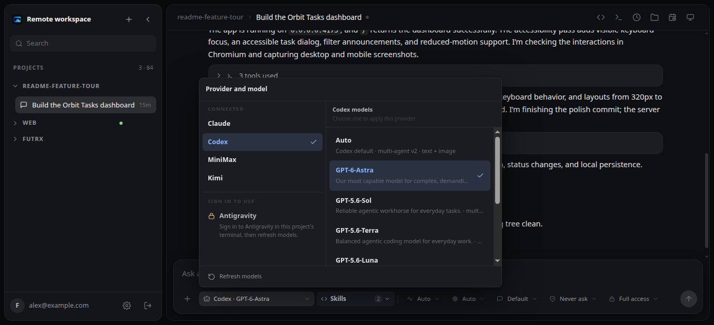
      <br>
      <strong>Five agent integrations</strong><br>
      Switch among Codex, MiniMax, Claude Code, Kimi, and Antigravity. Model choices come from the provider tooling installed in the current project.
    </td>
    <td width="50%" valign="top">
      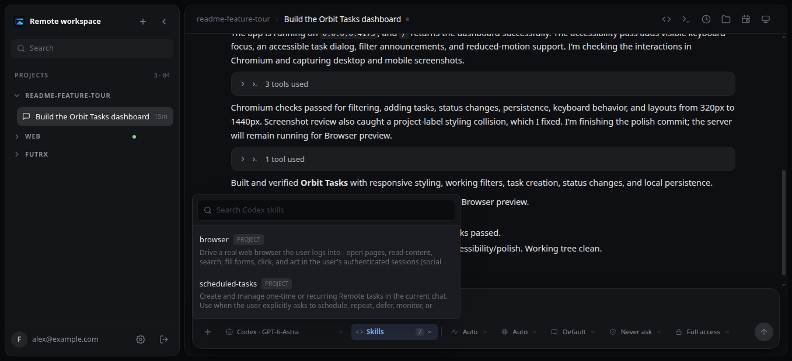
      <br>
      <strong>Skills and per-run controls</strong><br>
      Combine reusable project or host skills, then tune supported thinking, speed, mode, approval, and sandbox policies before the next prompt.
    </td>
  </tr>
</table>

### See the application and point the agent at details

The live preview above is not a mockup: Remote found the demo server listening
on port 4173 and opened its authenticated project URL beside the chat. Preview
controls switch ports, resize or reload the pane, and open the app in a new tab.

<table>
  <tr>
    <td width="50%" valign="top">
      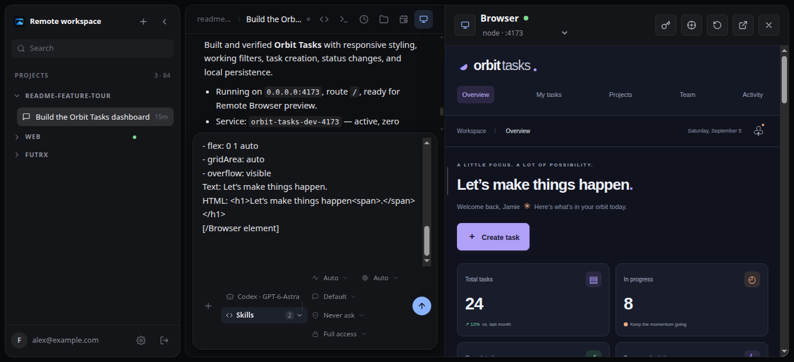
      <br>
      <strong>Visual element inspector</strong><br>
      Select an element in the preview and Remote inserts its selector, text, HTML, bounds, parents, and computed styles directly into the composer.
    </td>
    <td width="50%" valign="top">
      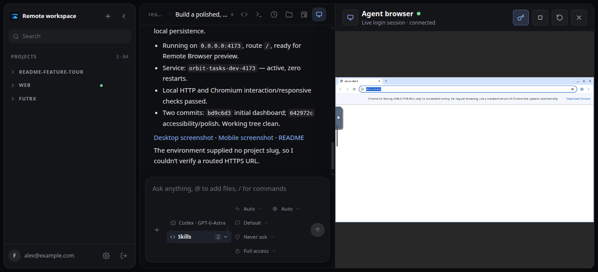
      <br>
      <strong>One browser for agents and humans</strong><br>
      Start a headed Chromium session with a durable profile, sign in yourself when needed, watch the agent work, and take over the same page at any moment.
    </td>
  </tr>
</table>

### Open the actual workspace

<table>
  <tr>
    <td width="50%" valign="top">
      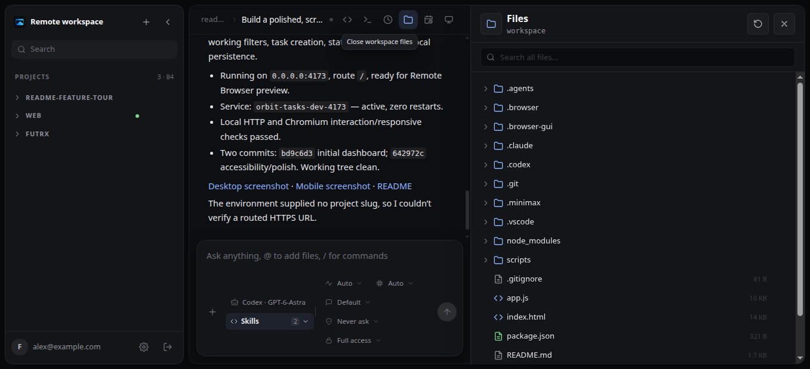
      <br>
      <strong>Files without leaving the chat</strong><br>
      Browse a lazy-loaded tree, search by filename, download files or folders, preview supported media, and open source files in the IDE.
    </td>
    <td width="50%" valign="top">
      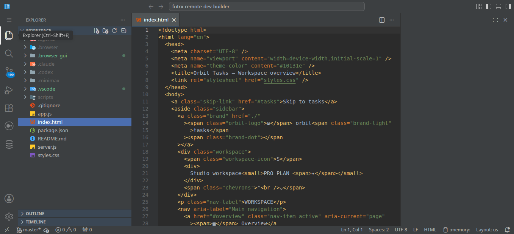
      <br>
      <strong>A complete browser IDE</strong><br>
      Every project includes code-server rooted at the same durable workspace the agents use.
    </td>
  </tr>
  <tr>
    <td width="50%" valign="top">
      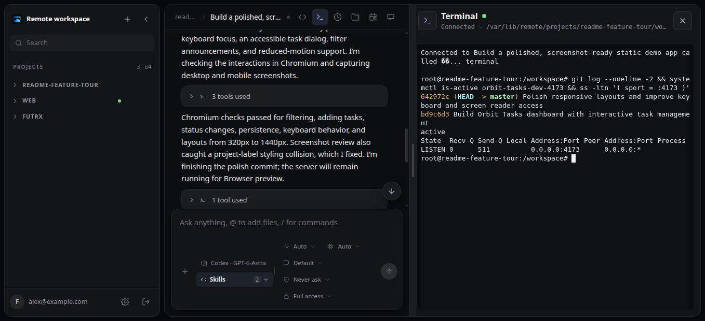
      <br>
      <strong>A live container terminal</strong><br>
      Install dependencies, inspect processes, run tests, or take over manually in a resizable terminal attached to the project computer.
    </td>
    <td width="50%" valign="top">
      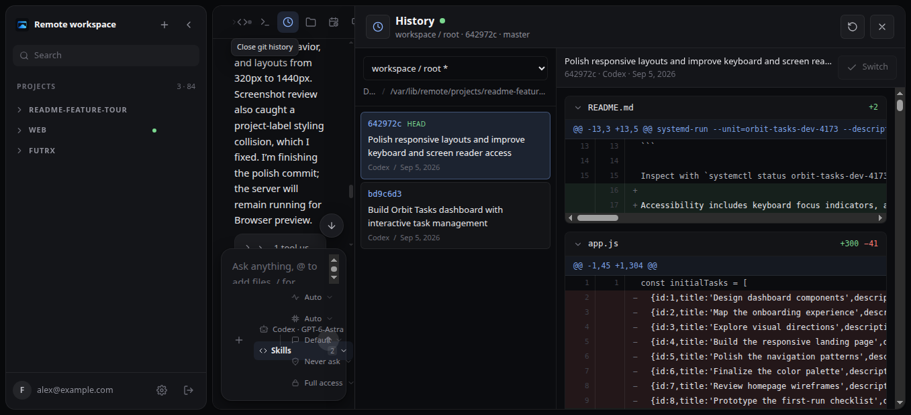
      <br>
      <strong>Repository-aware Git history</strong><br>
      Discover repositories, review commits and structured file diffs, refresh state, and switch a clean worktree to an earlier commit.
    </td>
  </tr>
</table>

### Run work later

<p align="center">
  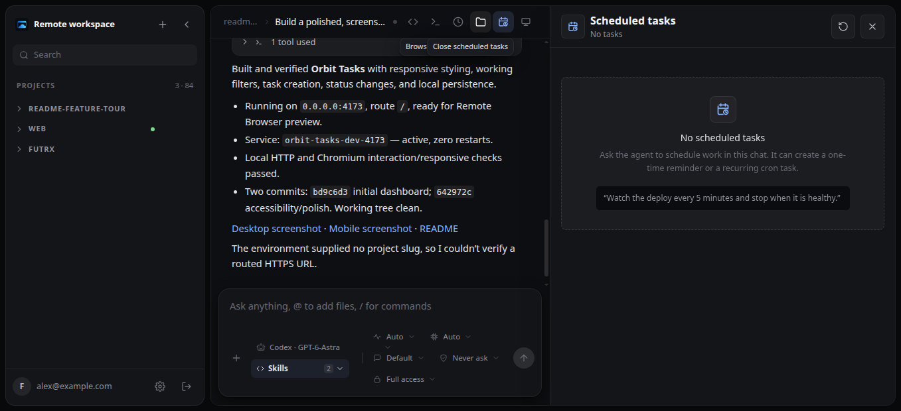
</p>

Select the Scheduled Tasks skill and ask in normal language for a one-time or
recurring job. New schedules start paused for human review; the drawer can arm,
edit, pause, resume, run, inspect, and delete them. Runs return to the same chat
even when your browser is closed.

### Operate and share each project

<table>
  <tr>
    <td width="50%" valign="top">
      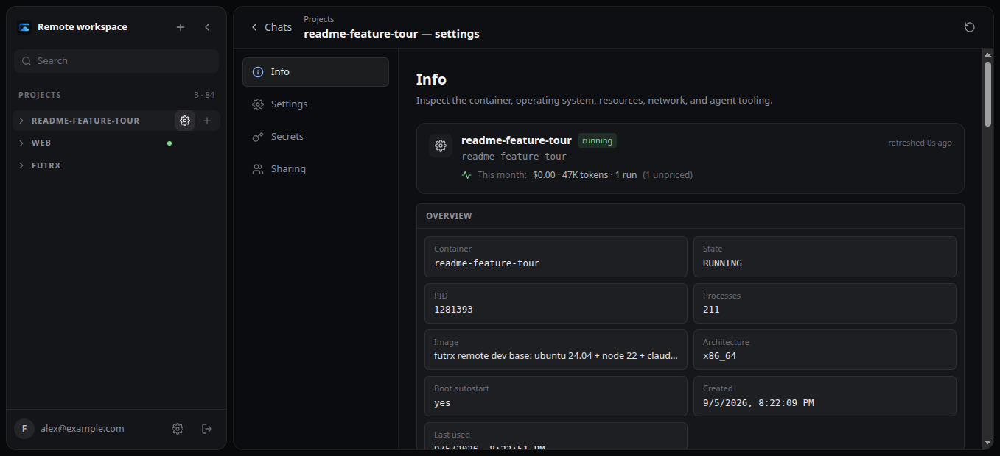
      <br>
      <strong>Container observability</strong><br>
      Inspect state, OS, CPU, memory, disks, network, mounts, agent versions, and provider-auth synchronization from the project page.
    </td>
    <td width="50%" valign="top">
      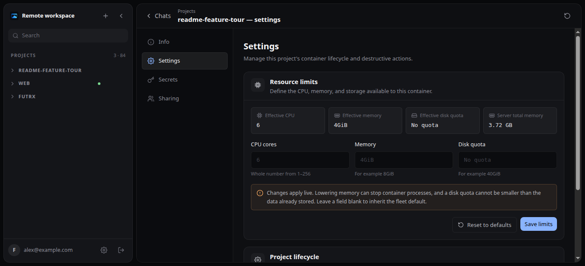
      <br>
      <strong>Resource and lifecycle controls</strong><br>
      Administrators can set CPU, memory, and disk limits; start, stop, restart, or remove a project without entering its container.
    </td>
  </tr>
  <tr>
    <td width="50%" valign="top">
      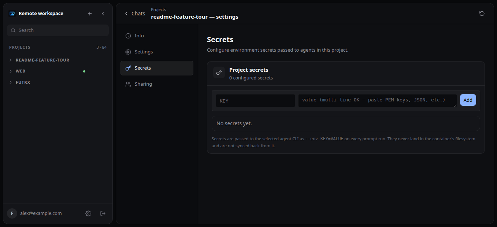
      <br>
      <strong>Project-scoped secrets</strong><br>
      Add, reveal, edit, and remove environment values, including multiline PEM keys and JSON, without committing them to the workspace.
    </td>
    <td width="50%" valign="top">
      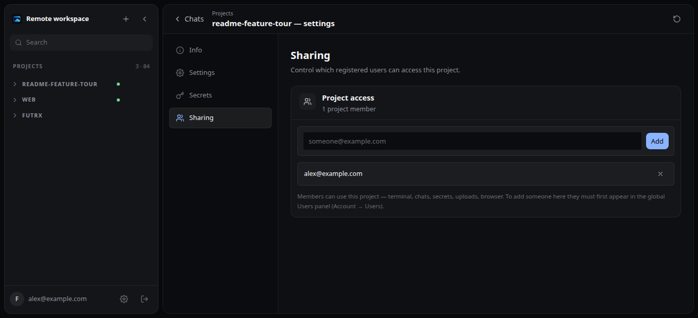
      <br>
      <strong>Explicit project membership</strong><br>
      Give registered users access to a project's chats, files, terminal, previews, secrets, and browser, then remove access from the same page.
    </td>
  </tr>
</table>

### Administer the whole Remote server

<table>
  <tr>
    <td width="50%" valign="top">
      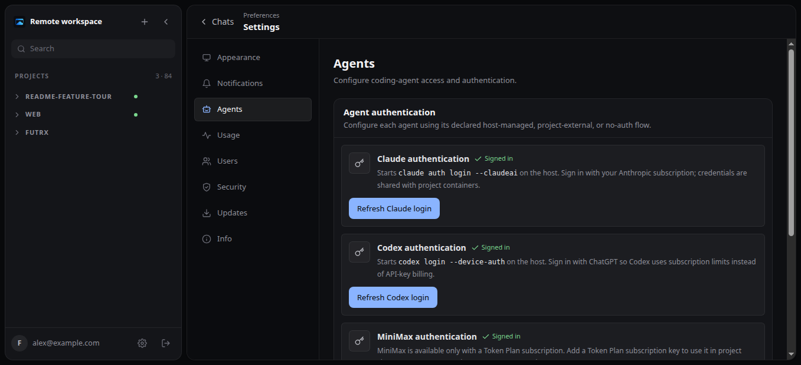
      <br>
      <strong>Provider connections</strong><br>
      Connect managed providers, review provider-specific setup instructions, and synchronize the appropriate host-managed state into projects.
    </td>
    <td width="50%" valign="top">
      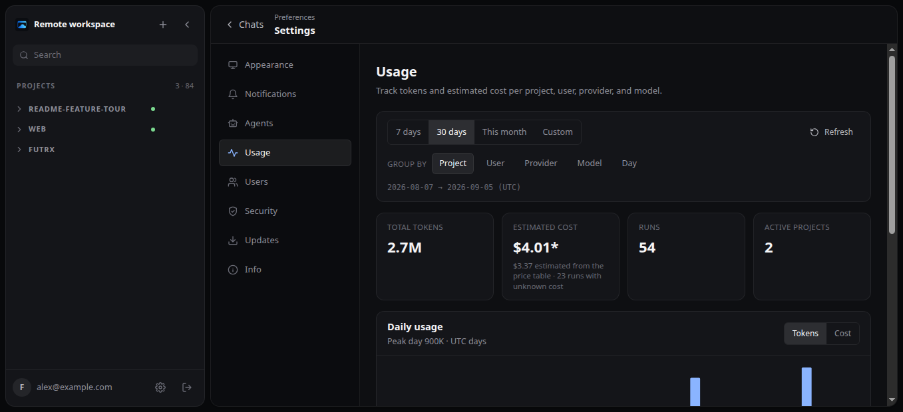
      <br>
      <strong>Usage and estimated cost</strong><br>
      Compare tokens, runs, active projects, and estimated cost by project, user, provider, model, or day.
    </td>
  </tr>
  <tr>
    <td width="50%" valign="top">
      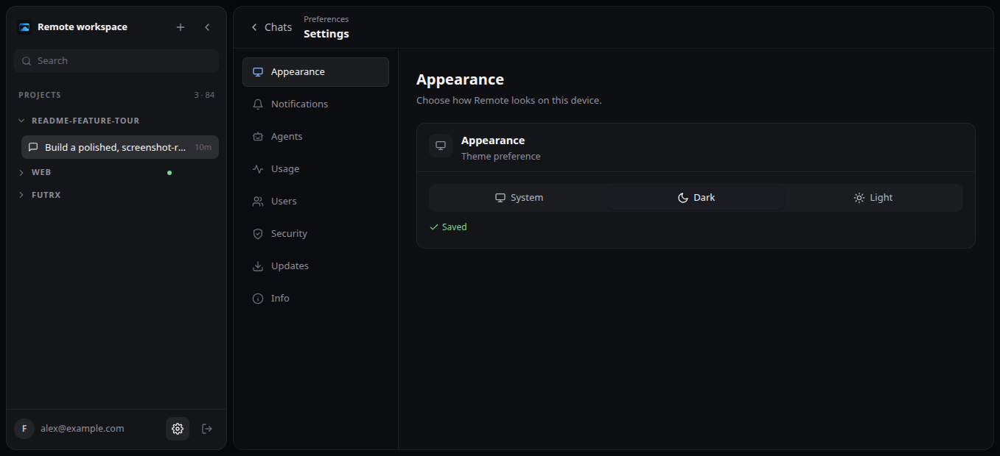
      <br>
      <strong>Per-device appearance</strong><br>
      Follow the operating system or choose a dark or light theme.
    </td>
    <td width="50%" valign="top">
      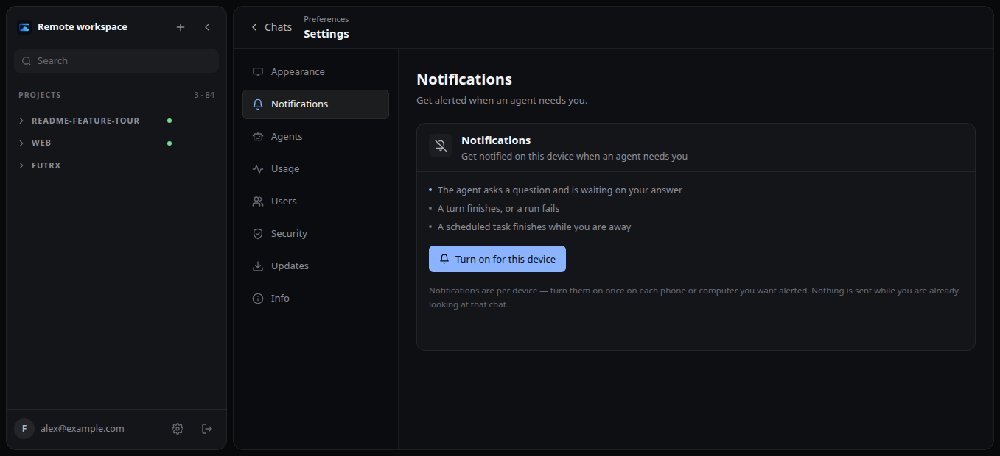
      <br>
      <strong>Push notifications</strong><br>
      Opt in per device for agent questions, completed or failed runs, and scheduled-task results while you are away.
    </td>
  </tr>
  <tr>
    <td width="50%" valign="top">
      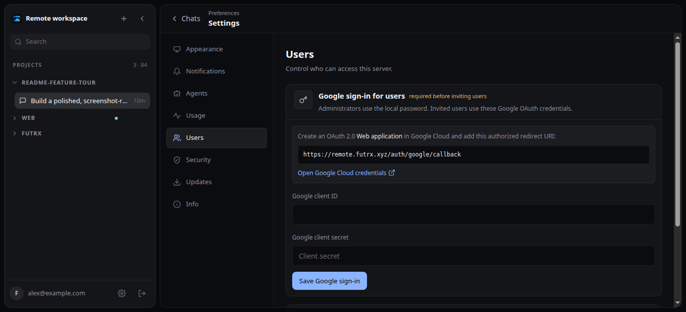
      <br>
      <strong>Server user management</strong><br>
      Configure Google sign-in, invite or remove users, and assign member or administrator roles.
    </td>
    <td width="50%" valign="top">
      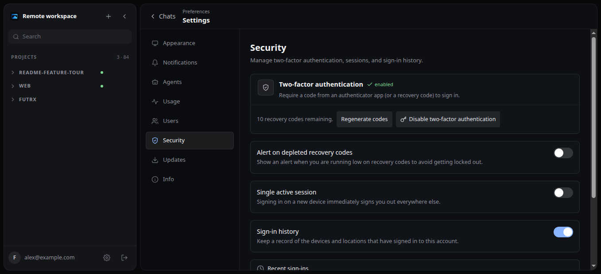
      <br>
      <strong>Account security</strong><br>
      Manage two-factor authentication, recovery codes, active-session policy, and sign-in history.
    </td>
  </tr>
</table>

<p align="center">
  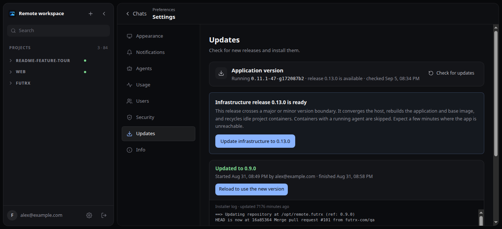
</p>

Remote checks releases from the app. Patch updates rebuild the application;
major and minor releases can converge host infrastructure, rebuild the project
image, and recycle idle containers through a controlled administrator flow.

See the continuous five-step product tour at [remote.futrx.com](https://remote.futrx.com/#product-tour), or use the [complete feature reference](docs/02-user-guide/13-feature-reference.md) for exact behavior and current limits.

## What you get

- **One project computer per project** — an unprivileged LXC container with durable files and agent homes.
- **Your choice of agent** — use Codex, MiniMax, Claude Code, Kimi, or Antigravity with provider-specific models, thinking, speed, mode, approval, and sandbox controls where supported.
- **Durable, inspectable conversations** — stream Markdown, reasoning, tools, questions, errors, and usage; queue, cancel, rewind, fork, mark unread, or continue later.
- **A complete development surface** — chat, browser IDE, root terminal, files, uploads, Git history, structured diffs, and reusable skills.
- **Live applications** — Remote finds listening ports, creates project URLs, adds HTTPS, and shows the app beside the conversation.
- **A browser agents and humans can share** — reuse authenticated sessions, let an agent browse visually, watch it work, or take over.
- **Scheduled work** — create reviewed one-time or recurring prompts that run later, even when your browser is closed.
- **Controls outside the workspace** — manage access, secrets, CPU, memory, lifecycle, provider connections, usage, notifications, security, updates, and recovery from the Remote host.

## How it works

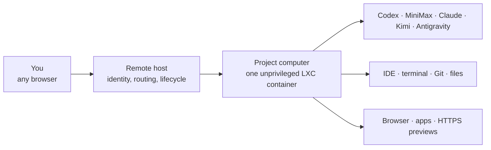
```mermaid
flowchart LR
    A["You<br>any browser"] --> B["Remote host<br>identity, routing, lifecycle"]
    B --> C["Project computer<br>one unprivileged LXC container"]
    C --> D["Codex · MiniMax · Claude · Kimi · Antigravity"]
    C --> E["IDE · terminal · Git · files"]
    C --> F["Browser · apps · HTTPS previews"]
```

The project computer is the capability boundary: agents can install tools, run servers, use Git, and browse inside it. The Remote host keeps authentication, routing, membership, and container lifecycle controls outside that boundary.

## Quick start

### What you need

- A fresh Ubuntu or Debian server
- Root or `sudo` access
- A hostname pointing at that server — one you own, or a free one
- A working SSH key
- Ports 80 and 443 open

> [!IMPORTANT]
> The installer disables SSH password login. Confirm that key-based SSH access works before you run it.

### 1. Point DNS to the server

Every project gets its own HTTPS address, so Remote needs a hostname with wildcard subdomains under it. Pick whichever case describes you — HTTPS is automatic in all three, with free Let's Encrypt certificates issued and renewed for you.

**If you already own a domain,** use a subdomain of it. For a base domain such as `remote.example.com`, create these records, all pointing at your server's IP address:

| DNS name | Purpose |
| --- | --- |
| `remote.example.com` | Remote web app |
| `code.remote.example.com` | Browser IDE |
| `*.code.remote.example.com` | Per-project browser IDEs |
| `*.dev.remote.example.com` | Per-project application previews |

**If you want a free hostname,** [DuckDNS](https://www.duckdns.org) is the quickest, because it resolves every subdomain automatically and there are no DNS records to create:

1. Sign in with GitHub or Google.
2. Add a name such as `yourname`. You now own `yourname.duckdns.org`.
3. Replace the pre-filled IP address with **your server's** address, then select **update ip**. The page fills in the address of the computer you are browsing from, which is usually not your server.

Then install using `yourname.duckdns.org` as the hostname.

[deSEC](https://desec.io) is a good alternative, run by a non-profit and less likely to be filtered on corporate networks. It is a full DNS host rather than a wildcard service, so create the four records from the table above under your `yourname.dedyn.io` name.

> [!NOTE]
> Free dynamic-DNS providers are community-run with no uptime guarantee, and some corporate networks block all of `*.duckdns.org` because of unrelated abuse elsewhere on it. If a preview link refuses to open at the office, that is usually why, and a domain you own avoids it.

**If you have neither,** a domain costs around $10 a year and gives you the shortest, most reliable URLs. Register one and follow the first case.

### 2. Install Remote

Connect to the server and run:

```bash
curl -fsSL https://remote.futrx.com/get | sudo bash -s -- remote.example.com
```

Replace `remote.example.com` with the hostname you set up above. The installer downloads Remote, installs its dependencies, builds the workspace image, starts the services, and enables HTTPS.

### 3. Create your first project

1. When Remote starts for the first time, it prints a one-time setup link to
   the server's log. To see it, connect to the server and run:
   `journalctl -u remote --since "-10 min" | grep -A2 "first-time setup"`.
   The link looks like `https://remote.example.com/?token=...` and works for
   30 minutes. If it has expired or you lost it, run `sudo remote setup-token` on
   the server to print a fresh one. The setup data is root-owned; omit
   `sudo` if you are already root.
2. Open that link in your browser and create your administrator account —
   this is the login you'll use to manage the server. Only someone who can
   read that link on the server (not just visit the page) can do this, so a
   stranger who finds the URL cannot claim the server before you do.
3. Open **Settings → Agents** and connect Codex, Claude Code, or Kimi.
4. Select **New project**.
5. To use MiniMax, open **Settings → Agents**, choose the MiniMax sign-in action, and save a Token Plan subscription key. Pay-as-you-go MiniMax API keys are not supported.
6. Start a chat and describe what you want in normal language.

Remote will show the agent's progress. When the work is ready, review it in the chat, IDE, terminal, file manager, Git history, or live preview.

## Security in plain language

Remote is designed to reduce the blast radius of agent work, not to promise an air gap:

- Projects use separate unprivileged LXC containers, but they share the host kernel.
- The host administrator can access project data and controls.
- Secrets given to a project are readable by agents working in that project.
- Durable storage survives routine container replacement, but it is not a backup.

Before using Remote with valuable code or credentials, read the [threat model](docs/threat-model.md), [known limitations](docs/known-limitations.md), and [security policy](SECURITY.md).

## Updating

The in-app updater selects the deployment path from the release version:
patch releases rebuild and restart only the frontend/backend application,
while major or minor releases also converge host infrastructure, rebuild the
workspace image, and recycle idle containers.

To force a full infrastructure convergence from the server, run:

```bash
sudo bash /opt/remote.futrx/infra/update.sh
```

The full updater preserves project files and provider homes. Coordinate a maintenance window, or use `--skip-workspaces`, when agents are actively running. See [Deployment and operations](docs/04-operations/09-deployment-and-operations.md#update-flow) for details.

## Learn more

- [Documentation](https://docs.remote.futrx.com/) — operator and user guides
- [System architecture](ARCHITECTURE.md) — components, data flow, and trust boundaries
- [Project philosophy](docs/01-overview/00-philosophy.md) — why Remote treats each project as a computer
- [Contributing](CONTRIBUTING.md) — local development and contribution workflow
- [Issue tracker](https://github.com/futrx-com/remote.futrx.com/issues) — bugs, ideas, and roadmap

## License

Copyright © 2026 FutrX.

Remote is free software licensed under the [GNU Affero General Public License v3.0](LICENSE). You may self-host, modify, and redistribute it under the AGPL's terms. If you offer a modified version as a network service, the AGPL requires you to make the modified source available to its users.
