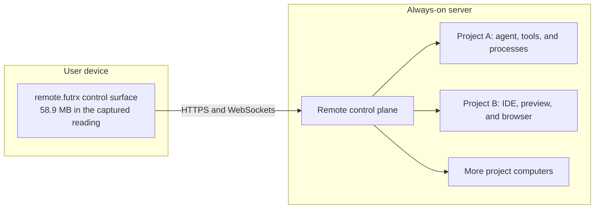
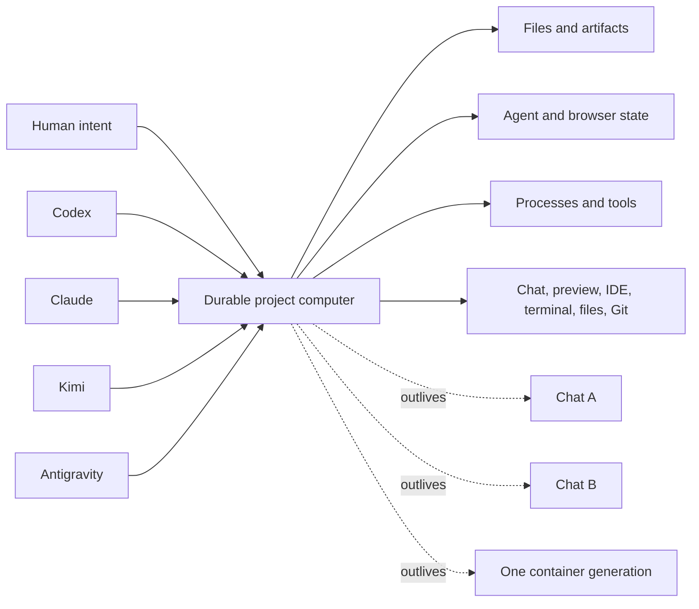
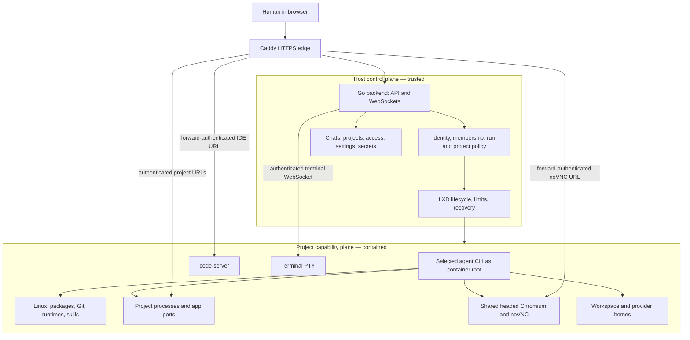
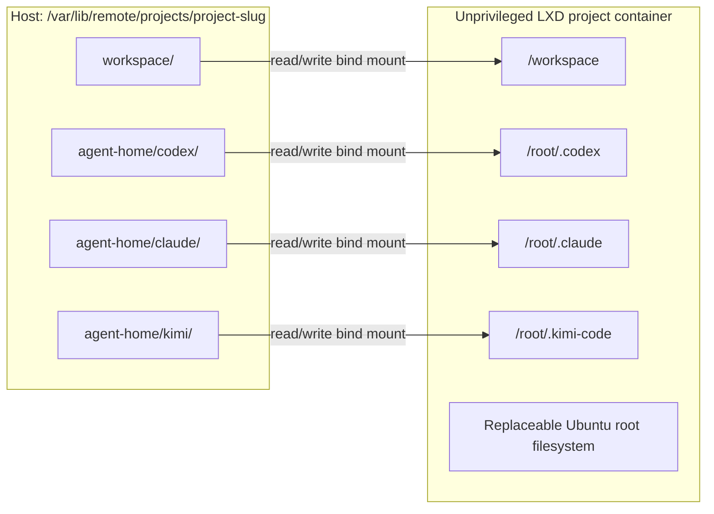
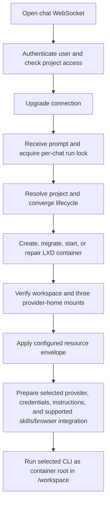
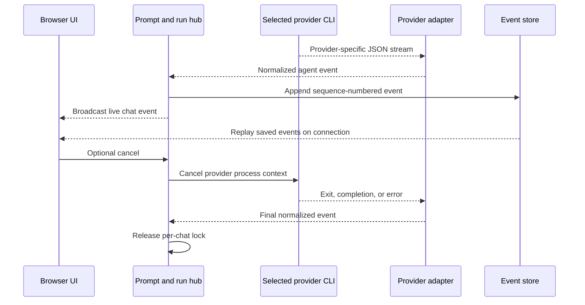
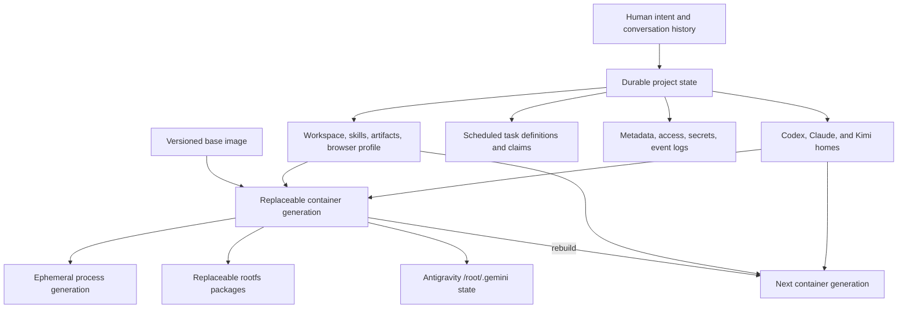
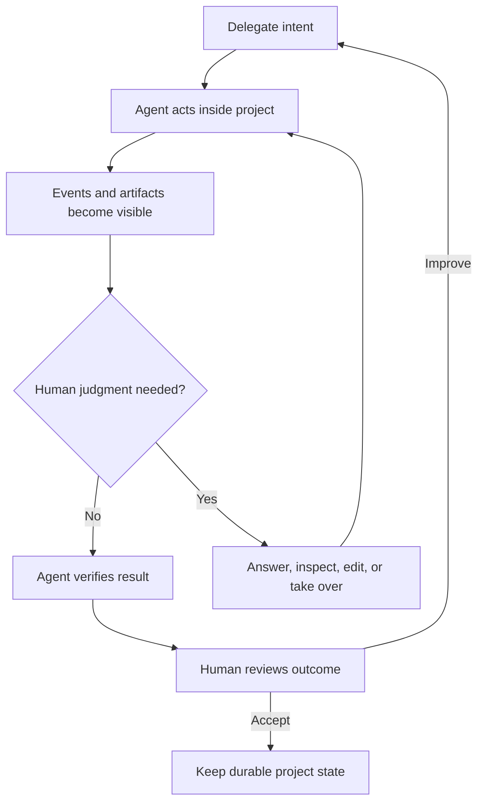

# Philosophy

Remote (`remote.futrx`) gives an AI agent a durable home, a complete set of working tools, and broad authority inside a deliberately narrow project boundary. The goal is maximum useful agency without giving one agent the host, another project, or the platform control plane as its blast radius.

> **Broad authority inside a narrow boundary.**

This is both a product doctrine and an architecture contract. It explains why Remote treats a project as a computer, why the agent is trusted inside that computer, why the human keeps control outside it, and what “complete isolation” must mean in concrete engineering terms.

## The thesis

An agent is limited by more than its model. Its useful capability is the combination of reasoning, context, tools, permission, continuity, and feedback:

```text
useful agency = intelligence × context × tools × authority × continuity × feedback
```

A strong model in a chat window still cannot finish work if it cannot install a dependency, keep a process alive, inspect the result, use a browser, or retain what it learned about the project. Removing those constraints one permission dialog at a time creates power without a coherent safety boundary.

Remote moves the boundary outward instead:

- the **agent receives a project computer** where it can work with very little friction;
- the **host retains the control plane** that authenticates people, contains projects, limits resources, records provider-emitted run activity, and can stop the computer from outside;
- the **human can supervise through any useful surface**: chat, preview, browser, files, Git, IDE, terminal, or project controls;
- the **project survives the worker**: models, chats, processes, and containers may change while the project remains the durable center.

The intended result is not an agent that is safe because it can do little. It is an agent that can do a great deal because the scope of that authority is explicit.

## The local-resource dividend

Remote moves the workshop off the user's computer without moving the human out of the loop. The laptop runs a control surface; the server runs the agent CLIs, project processes, browser, IDE, builds, and long-lived background work.

```text
local resource cost ≈ one control surface
server resource cost ≈ shared platform overhead + the project computers doing the work
```



The supplied macOS Activity Monitor captures make that architectural difference visible. These are the values shown in the Memory tab around 2:06–2:07 PM on July 22, 2026; totals below sum only the rows visible under each search filter.

| Captured surface | Visible rows | Memory shown or summed | Threads shown or summed | Relative to the Remote app process |
| --- | ---: | ---: | ---: | ---: |
| `remote.futrx.dev` app | 1 | **58.9 MB** | 8 | 1× |
| All `remote.futrx.dev` matches, including macOS Open/Save and Quick Look helpers | 3 | **140.8 MB** | 21 | 2.4× |
| Codex process-family matches | 9 | **2,322.4 MB** | 180 | 39.4× |
| Claude process-family matches | 19 | **2,886.8 MB** | 466 | 49.0× |
| WebStorm | 1 | **3.12 GB** | 156 | approximately 53× |

### Captured evidence


Even under the conservative comparison that charges both visible macOS helper processes to Remote, the captured memory difference is approximately:

- Codex-family matches used **16.5× as much**; Remote was **93.9% lower**;
- Claude-family matches used **20.5× as much**; Remote was **95.1% lower**;
- WebStorm used **22.2× as much**; Remote was **95.5% lower**.

This is the practical advantage of making the project—not the laptop—the computer. One lightweight client can supervise several server-side agents without opening another local IDE, renderer tree, language server, browser, and toolchain for every project. The server can remain online when the laptop closes, while the host provides project resource controls and the human keeps one consistent interface.

These captures are evidence of the design, not a controlled benchmark. Memory changes with workload; the Claude and Codex filters may represent different numbers of active sessions; search filters can omit related processes; and the screenshots do not include server-side consumption. Ratios use the displayed values with `1 GB ≈ 1,000 MB`. Remote does not eliminate compute—it relocates it to the host where capacity can be shared, monitored, and governed deliberately.

## The project is the unit

Remote's primary unit is neither a prompt nor a chat. It is the project computer.



This gives Remote five foundational rules:

1. **One project, one containment boundary.** Files, processes, tools, browser state, and project authority belong to that project.
2. **The project, not the conversation, is durable.** A new chat or a different provider should enter the same world rather than reconstruct it.
3. **The model is a replaceable worker.** Codex, Claude, Kimi, and
   Antigravity can work against the same project without becoming its owner.
4. **Work is durable; machinery is replaceable.** Source, artifacts, skills, and provider homes persist while the runtime can be rebuilt.
5. **Failure should be local and repairable.** A bad install, runaway process, or broken root filesystem should not require repairing another project. Recovery of agent-modified durable files still depends on Git, remotes, snapshots, or backups outside the current runtime.

## Two planes: capability and control

Remote deliberately separates the place where work happens from the place that governs it.



The main UI, API, and WebSockets authenticate in the Go backend. Caddy's forward-authentication and platform-cookie stripping apply to project-facing IDE, preview, and noVNC routes. The control plane is intentionally not another tool available to container root. The agent may be root **inside** the project, but it does not receive the host's LXD controls, platform session store, other project mounts, or arbitrary host filesystem access beyond the project paths explicitly mounted into its container.

The separation is the core safety mechanism:

| Capability plane | Control plane |
| --- | --- |
| Does the work | Decides who and what may enter |
| Has broad local authority | Defines the boundary of that authority |
| Installs tools and starts processes | Applies configured CPU, memory, process, and root-filesystem limits |
| Reads and changes project state | Persists metadata and access policy |
| May fail, hang, or exhaust its allocation | Can stop, force-restart, rebuild, or delete it |
| Produces provider-emitted tool and result events | Persists and presents those events to the human |

Maximum agency does not mean the agent controls both planes. It means the capability plane is rich enough to finish real work while the control plane remains outside its reach.

## The project home and provider homes

Remote gives the agent a home in the product sense: the durable project. It is the continuity that lets an agent or human return to the same work, skills, browser identity, provider state, and host-stored history. In filesystem terms, **provider homes** are narrower: they are the three CLI-owned directories mounted under `/root`.

Each converged project currently has four required writable mounts. They live on the host under the project root and are attached before a new container's first work run. A legacy migration may briefly start an existing container to recover old provider state before stopping it, attaching the missing homes, and returning it to the converged layout.



| Durable layer | Container path | Purpose |
| --- | --- | --- |
| Project workspace | `/workspace` | Source, artifacts, uploads, project skills, generated `.env`, browser profile, and project-owned state |
| Codex home | `/root/.codex` | Codex provider configuration, authentication, sessions, and provider-owned state |
| Claude home | `/root/.claude` | Claude provider configuration, authentication, sessions, and provider-owned state |
| Kimi home | `/root/.kimi-code` | Kimi provider configuration, authentication, sessions, and provider-owned state |
| Host control-plane data | Application data directory | Project metadata, chats, event logs, scheduled tasks, access lists, settings, and the authoritative secret store |
| Replaceable runtime | Container root filesystem outside the mounts | Base image, installed packages, temporary files, Antigravity state, and operating-system state |

The workspace is shared by all agents in the project. The three mounted
provider homes are separate because Claude, Codex, and Kimi own different
configuration and session formats; they are **format-separated, not
security-separated**. Container root can read and modify all three regardless
of the selected provider. Antigravity currently keeps its state under
`/root/.gemini` in the replaceable rootfs rather than a fourth durable mount.
Project skills have one canonical source at `/workspace/.agents/skills`;
provider-specific paths are compatibility links rather than competing copies.

The host also manages provider authentication. Host-wide provider credentials may be synchronized into the project before a run and back after it. Most synchronized files live in provider homes; Claude also uses `/root/.claude.json` in the replaceable root filesystem. Bidirectional synchronization means a project agent can potentially change host-wide provider state that is later used by other projects. That makes provider identity fleet-scoped even though project files, browser profiles, and project secrets are project-scoped. These are different trust domains and should remain visibly distinct.

## What the agent receives

The capability envelope should be complete enough that the agent can move from intent to a verified result without asking the user to become its hands.

| Capability | Current project contract |
| --- | --- |
| Operating system | A full Ubuntu userspace in an unprivileged LXD container |
| Local authority | Container root, mapped to a low-privilege host UID rather than host root |
| Kernel and devices | The shared host kernel and only explicitly attached mounts/devices; project root does not imply host kernel administration, KVM, GPU, arbitrary device, or host-socket access |
| Approval model | Project agent CLIs run in approval-free modes; routine local actions do not pause on provider permission prompts |
| Working directory | `/workspace` for every project-bound agent run |
| Filesystem | Read and write the complete project workspace and all provider homes mounted in that project container |
| Package installation | `apt`, `npm`, `pip`, and project-local package managers may install what the work requires |
| Core toolchain | Git, SSH client, `gh`, `jq`, build tools, Python, Node.js 22, npm, and npx |
| Agent choice | Claude Code, Codex, Kimi Code, and Antigravity at pinned versions, behind one provider-neutral run model |
| Skills | Project-authored procedures under `/workspace/.agents/skills`, including skills the agent creates for future work. Claude and Codex receive general selected-skill triggers; Kimi and Antigravity do not. Scheduled Tasks is the explicit provider-neutral exception |
| Processes | Foreground and background processes; background work may continue between prompts while the container stays running |
| Network | Outbound networking and project app listeners; the current project instructions describe network access as open |
| Web applications | Any non-loopback TCP listener on an allowed preview port from 1024 through 65535 can be discovered and exposed through an authenticated project URL |
| Browser automation | A headless Playwright utility plus a shared headed Chromium. Claude and Codex can receive per-run MCP/CDP preparation; Kimi and Antigravity do not yet have equivalent browser enablement |
| Human-visible desktop | noVNC lets the user view and take over the same headed browser session |
| Development surfaces | Terminal, browser IDE, files and media, uploads, Git history, app preview, element inspection, and scheduled tasks over the same workspace |
| Project credentials | Agent runs receive project secrets as environment values; persistable single-line values also reach new container processes, and all values are mirrored to `/workspace/.env` for dotenv-aware tools |
| Concurrency | Several chats may work concurrently; the execution lock is per chat, so agents sharing files, Git state, ports, and processes can race and must coordinate |

This is intentionally more than a fixed list of model tools. The most important tool is the ability to acquire the next appropriate userspace tool inside the project's network, kernel, device, and resource boundary.

## What the human retains

Broad agent authority is paired with a complete control envelope. The human should be able to delegate at a high level, inspect at any depth, intervene through a familiar interface, and regain control without cooperation from a misbehaving process.

| Control | Human or host capability |
| --- | --- |
| Identity | Claim the server, sign in, manage registered users, and separate administrators from members |
| Provider identity | Administrators connect, refresh, or replace host-wide Claude, Codex, and Kimi identities; Antigravity signs in per project and has no global card |
| Project access | Current members can add or remove registered project members; the backend gates project API, chat, upload, terminal, and preview resources |
| Project secrets | Current members can create, read, change, or delete the authoritative secret record; propagation to and removal from managed copies is currently best-effort |
| Agent selection | Choose provider, model, reasoning effort, service tier or speed, mode, and selected skills |
| Run control | Send, queue, cancel, fork, rewind, mark read or unread, or delete conversations; create schedules through the agent, then arm, pause, edit, run, or delete them in the drawer |
| Transparency | See provider-emitted text, reasoning, tool inputs, tool outputs, errors, sessions, and usage as normalized events |
| Direct intervention | Project members can inspect the same work in the terminal, IDE, file manager, Git history, app preview, or Agent Browser |
| Change recovery | Inspect Git diffs and return a clean repository to an earlier commit while usable local history or a remote copy survives; the backend checkpoint path exists, but its dirty-tree form is not rendered in the current UI |
| Runtime lifecycle | Project members can start, stop, and force-restart; administrators can delete a project, and host upgrades can rebuild its runtime |
| Resource governance | Administrators set per-project CPU, memory, and optional root-disk overrides; host configuration defines fleet CPU, memory, and fixed process ceilings |
| Operational recovery | Repair networking, reconcile missing containers, verify mounts, and reprovision tools from the host |
| Browser takeover | Project members can start or stop the browser, log in, complete MFA or CAPTCHA, review state, and take direct control of the shared session |
| Public boundary | Authenticate preview requests by project membership, constrain certificate issuance, and strip platform cookies before proxying into project code; IDE membership parity is a current gap |
| Destruction boundary | Project deletion is an explicit control-plane action; container root cannot delete another project through the project API |

The control surfaces are not secondary dashboards. They are the human half of the architecture. Chat is for delegation; the other surfaces exist so delegation never becomes surrender.

## How a prompt becomes work

Project-bound execution follows one convergence path regardless of whether the container is already running, stopped, missing, or being recreated after an upgrade.



Once the provider process is running, its provider-specific stream is converted into one durable chat protocol:



The agent is not simulated by the web application. Remote launches the real provider CLI in the real project computer, normalizes the events it emits, and gives the user a common control surface over different providers.

Preparation happens before every run where correctness requires it. That allows
a missing container to be recreated, a stale CLI to be repaired, current
shared instructions to be republished, and compatibility links to be
converged. General selected-skill prompt triggers and per-run browser MCP
preparation currently apply to Claude and Codex, not Kimi or Antigravity.
Scheduled Tasks is the explicit provider-neutral exception.

## Persistence and replaceability

Remote separates valuable state from replaceable machinery. This lets the runtime be repaired or replaced without automatically discarding the work it exists to perform.



| State | Next prompt | Stop/start | Force restart | Container replacement | Project deletion |
| --- | ---: | ---: | ---: | ---: | ---: |
| `/workspace` files and skills | Survive | Survive | Survive | Survive | Removed |
| Provider homes | Survive | Survive | Survive | Survive | Removed with the project root |
| Browser profile in the workspace | Survive | Survive | Survive | Survive | Removed |
| Root-filesystem packages and ad-hoc files | Survive | Survive | Survive | Lost | Removed |
| Background processes | May continue | Stop | Stop | Stop | Stop |
| Chat metadata and event history | Survive | Survive | Survive | Survive | Stored separately; current project deletion does not cascade chat deletion |
| Scheduled task definitions and run claims | Survive | Survive | Survive | Survive | Stored separately; invalid project/chat ownership is detected when the task next fires |
| Antigravity state under `/root/.gemini` | Survive | Survive | Survive | Lost | Removed with the container |

If a project depends on a package added to the replaceable root filesystem, the durable project should describe how to restore it—for example in `/workspace/setup.sh`. Reproducibility converts a one-off machine mutation into project knowledge.

Persistence is not backup. Container root has read/write access to the workspace and all provider homes, so it can delete or corrupt durable source, `.git`, skills, browser state, and provider state. The current platform does not add snapshots or backups for those paths; recovery depends on checkpoints, remotes, or backups the operator maintains separately.

## Isolation as blast-radius engineering

“Complete isolation” is Remote's north star, but it must be stated as an engineering property rather than a slogan.

The intended boundary has four dimensions:

| Dimension | Intended property | Current mechanism |
| --- | --- | --- |
| Filesystem and process | One project cannot read or control another project's files and processes | One unprivileged LXD namespace and project-specific mounts per project; this does not prevent access through reachable network services |
| Host privilege | Container root is not host root | LXD user-namespace mapping to a low-privilege host UID |
| Resource | CPU, memory, and process count remain within a project envelope; durable storage also needs an enforceable ceiling | LXD/cgroup CPU, memory, and process limits plus an optional root-filesystem disk limit; host-backed workspace and provider homes are not currently quota-bound |
| Access | Only authorized people and projects can reach project surfaces | Platform sessions, project membership checks, forward authentication, constrained TLS, and platform-cookie stripping protect routed ingress; the shared bridge has no lateral project ACL |

The practical security claim is therefore:

> Remote is designed to contain direct namespace and mount effects—and CPU, memory, and process exhaustion covered by successfully applied ceilings—from ordinary agent mistakes, destructive commands, broken dependencies, and runaway processes to one project computer, while preserving a host-side stop and repair path.

That is a namespace-and-mount claim, not complete lateral isolation. It does not contain effects exercised through open network access or explicitly granted external credentials: a project can reach sibling services on the shared bridge, a compromised project application can attack reachable services, and an agent can act on provider, secret, or browser authority assigned to it. It is not accurate to equate the boundary with an air gap, a separate physical machine, or a hardened hostile multi-tenant VM. LXD containers share the host kernel. Mounted state and synchronized credentials intentionally cross the container boundary. The administrator and the host control plane remain trusted.

## Credentials are authority

Remote has four credential classes, each with a different scope:

| Credential class | Scope | Current behavior |
| --- | --- | --- |
| Platform session | User and Remote control plane | Kept in secure HTTP-only cookies and stripped before requests enter project-controlled apps and IDEs |
| Agent-provider identity | Host-wide for Claude, Codex, and Kimi; project runtime for Antigravity | The three host providers are connected by an administrator and synchronized bidirectionally with project state. Antigravity is authenticated inside each project and its current state is not durable across container replacement |
| Project secret | One project | Stored in a host file with mode `0600` but without application-level encryption; passed to agent runs, persisted as container environment when single-line, and mirrored into the managed `.env` file |
| Browser-session identity | One project browser profile | Created through human login and persisted with the project so the agent can use the authenticated session |

Project secrets are **agent-readable authority**. They are not hidden capabilities: a sufficiently authorized agent process can read its environment and `/workspace/.env`. The correct safety question is not whether the model can see a secret it has been given, but whether that authority is scoped, observable, revocable, and appropriate for the project. The [audit log](../04-operations/10-audit-log.md) makes the control-plane half observable — every secret read, write, and delete is recorded — but in-container use of an already-injected secret is not.

Provider identities cross a wider boundary. Because all provider homes are writable and selected credential files synchronize back to the host, project code can potentially mutate authentication state later used by the fleet and other projects. This is a current shared-authority risk, not project-local secret isolation.

Likewise, a persistent authenticated browser is deliberately powerful. Web content may be hostile, prompt injection can influence the agent, and a logged-in session can perform external actions. Human confirmation rules in the browser skill are an agent policy; they are not a universal transaction gate enforced by the platform.

The design principle is:

> Give a project only the external authority it needs, and treat adding a member, secret, provider identity, or browser login as a high-trust act.

## Human supervision without micromanagement

Remote does not choose between autonomy and control. It separates their timescales:

- **before work**, the human chooses the project, agent, mode, skills, resources, access, credentials, and whether an agent-created schedule should be armed;
- **during work**, the agent can act without constant local approval while provider-emitted progress and tool activity stream back;
- **at judgment boundaries**, the human can answer a question, take over the browser, inspect a rendered element, or work directly in the IDE or terminal;
- **after work**, the human can review artifacts, diffs, commits, processes, resource use, and the running application;
- **on failure**, the host can cancel the run, pause a schedule, stop or force-restart the container, restore Git state when a checkpoint survives, or replace the runtime.

This is the desired operating loop:



The ideal experience is low-friction for reversible work and high-clarity at irreversible, public, financial, destructive, or identity-bearing boundaries.

## Architectural invariants

Future features should preserve these invariants:

1. **A full-tool run belongs to a project boundary.** If the project cannot be named, neither can the blast radius.
2. **Container root must never imply host root.** New mounts, devices, sockets, and APIs must be reviewed as boundary crossings.
3. **Every durable path must be deliberate.** State is either explicitly durable, reproducible, or disposable; it should not survive by accident.
4. **Every authority has a visible scope.** Platform, provider, project, and browser credentials must not be described as interchangeable.
5. **The control plane remains operable from outside.** Stop, force restart, resource enforcement, and deletion cannot depend on container cooperation.
6. **Provider choice must not fork the project.** Switching agents should preserve shared project state and avoid provider-specific copies where a canonical project representation exists.
7. **Tools should be real and composable.** Prefer a complete Ubuntu userspace inside the declared boundary over a growing set of shallow, product-specific actions.
8. **Human and agent views converge on the same state.** Chat, terminal, IDE, files, Git, preview, and browser must not become parallel realities.
9. **Observability is part of autonomy.** A long-running agent that cannot show what it is doing is not fully controllable.
10. **Deletion is explicit; replacement is routine.** Rebuilding machinery should be safe. Destroying durable project state should be unmistakable.

## Current conformance gaps

The philosophy is also an acceptance test. The following current behaviors narrow the claim that can honestly be made today:

| Gap | Consequence |
| --- | --- |
| Loose chats run approval-free provider CLIs directly as the production host service user, currently root, and are visible to all registered users | A loose chat can reach platform data, provider credentials, project roots, and host controls such as `lxc`; it is outside the project-isolation promise and is the highest-priority boundary violation |
| Project containers share the default LXD bridge without repository-defined inter-project network policy; code-server and noVNC listen on non-loopback interfaces without their own authentication | A sibling project can potentially bypass Caddy and reach another project's IDE or browser directly, crossing from network reach into files, processes, or browser identity |
| IDE forward authentication checks registered-user status but not project membership | An IDE URL does not yet enforce the same project boundary as a preview URL |
| Incremental workspace-hub events are broadly broadcast after the initial filtered snapshot | Metadata synchronization does not yet have uniform per-event project filtering |
| Membership is checked when chat and terminal WebSockets open, but active sockets are not revoked when membership changes | Removing a member blocks future checked connections but may not immediately stop an already-open control channel |
| Provider login is host-wide and the application has no logout or credential-revoke control | Removing a connected identity requires operator-side file removal or revocation at the provider |
| Provider credentials are host-wide, all provider homes are writable by container root, and selected state synchronizes back | A project can potentially alter account-level identity later consumed by the host or another project |
| Project secrets are stored without application-level encryption and are available to the agent through execution environment and `/workspace/.env` | Secrets must not be marketed as encrypted at rest, hidden from the model, or absent from the filesystem |
| Secret-to-`.env` and LXD-environment propagation is best-effort after the authoritative store commits | A failed update or delete can leave a stale managed copy, and running processes retain old values; deleting the record is not guaranteed immediate revocation |
| Default resource convergence is best-effort, while explicit project overrides fail the launch on error | CPU, memory, and process defaults can fail open if host-side application fails |
| The optional LXD disk limit covers only the replaceable root filesystem | Writable workspace and provider-home bind mounts have no default quota and can exhaust host storage |
| Durable project mounts have no built-in snapshot or backup layer | Container replacement preserves state, but destructive in-project writes may be unrecoverable without external Git history or operator backups |
| Same-project chats can execute concurrently against shared files, Git state, ports, and processes | Per-chat locking prevents duplicate runs in one chat but does not prevent cross-chat races or conflicting work |
| Kimi lacks the selected-skill prompt triggers and per-run browser MCP preparation used by Claude and Codex | Provider-neutral controls do not yet imply provider feature parity |
| The [audit log](../04-operations/10-audit-log.md) records control-plane actions — including secret reads, terminal and IDE openings, and agent run starts — but stops at the container boundary | Remote records that a session was opened, not the commands, background processes, or network calls inside it |
| Run ownership and cancellation state are in memory while provider children may survive a backend restart | The control plane may lose visibility and cancellation authority over a surviving process and accept a new concurrent run |
| Upgrade busy detection does not currently match the argument order used by provider `lxc exec` commands | An active project may be recycled during an upgrade instead of being safely skipped |
| The Agent Browser runs without its own Chromium sandbox inside the container | Its primary containment boundary is the outer LXD project container |
| Containers share the host kernel | This is container isolation, not a VM or physical-machine boundary |
| Irreversible browser confirmation is instruction policy | The platform does not yet enforce a universal approval gate for every external side effect |

These are not reasons to weaken the philosophy. They are the roadmap it creates. Until they are resolved, the precise public language is **project-scoped**, **isolated by design**, **bounded blast radius**, and **built for human supervision**—not “perfectly isolated” or “completely safe.”

## Path to complete project isolation

The next hardening steps follow directly from the doctrine:

1. Require a project container for every approval-free, full-tool agent run; remove unrestricted host execution from loose chats.
2. Add per-project network policy that blocks lateral container access and protects host control-plane services while preserving intentional internet egress.
3. Enforce project membership consistently on IDE hosts and every realtime project event, and revoke active long-lived connections when access is removed.
4. Choose an explicit secret contract: agent-readable project environment, or brokered capabilities the agent can invoke without reading. Document and implement one truth.
5. Replace fleet-wide provider credential copying with project-scoped identities or a host-side credential broker where provider support allows it.
6. Make resource containment fail closed, and quota the host-backed workspace, provider homes, and unbounded event output—not only the replaceable root filesystem.
7. Add snapshots or documented backup integration for durable project state, with restore tests that do not depend on the current container.
8. Add platform-enforced approval for external, irreversible, public, financial, and identity-bearing actions, and extend the [audit log](../04-operations/10-audit-log.md) past the container boundary to the actions taken inside a run.
9. Persist or reconstruct run ownership so a control-plane restart can rediscover, observe, and cancel surviving provider processes.
10. Correct and test upgrade busy detection before treating active-container recycling as safe.
11. Continuously test the boundary: mount escape, path traversal, cross-project network access, credential leakage, preview-cookie theft, resource exhaustion, concurrent-run conflicts, and recovery under a wedged container.

Complete isolation should eventually mean that every durable state path, network route, credential, control API, and recovery action has an explicit project scope or an explicit reason to cross it.

## What Remote is not

- It is not another model vendor. Models are workers brought into a durable environment.
- It is not a thin chat wrapper. The chat is one control surface over a complete project computer.
- It is not a host shell exposed through a browser. Project work belongs in a contained project runtime.
- It is not a stateless serverless task runner. Continuity and long-running project state are part of the product.
- It is not security through endless permission prompts. The primary defense is architectural scope, supported by human judgment at meaningful boundaries.
- It is not physically unlimited. Parallelism is bounded by host resources, provider quotas, network capacity, and operational policy.
- It is not a claim that autonomous actions are inherently safe. More capability increases the need for explicit authority and observation.

## The feature test

Before adding a feature, ask:

1. Does it make the project computer more capable or the human more in control?
2. Which plane owns it: capability or control?
3. What project, user, credential, network, and persistence scope does it have?
4. Can it widen access to the host, another project, or an external account?
5. What survives a prompt, restart, container replacement, and project deletion?
6. Can the human observe it, interrupt it, and recover from its failure?
7. Does it work across providers, or does it fragment the durable project around one agent?
8. Can its authority be explained plainly before the user grants it?

If those questions have no concrete answers, the feature is not yet compatible with the Remote philosophy.

## Vocabulary

| Term | Meaning |
| --- | --- |
| Project computer | The durable project state plus its current namespaced runtime and work surfaces |
| Project home | Product-level continuity across workspace, provider homes, browser state, and host-side project/chat records |
| Provider home | One CLI-owned directory: `/root/.codex`, `/root/.claude`, or `/root/.kimi-code` |
| Capability plane | The contained environment where agents, tools, apps, and browsers perform work |
| Control plane | The host-owned system for identity, access, persistence, orchestration, limits, observation, and recovery |
| Full-tool run | An agent invocation with approval-free local execution and access to the project computer |
| Project-scoped authority | Permission whose filesystem, process, credential, network, and user boundary is the project |
| Bounded blast radius | A failure is designed to damage no more than the project and external authority explicitly granted to it |
| Replaceable runtime | Container root filesystem, packages, and processes that can be recreated from the base image and project state |
| Human takeover | Direct intervention through browser, IDE, terminal, files, Git, or lifecycle controls |
| Complete isolation | The architectural north star in which every boundary crossing is explicit, scoped, enforced, and testable |

## Related documentation

- [Architecture](https://github.com/futrx-com/remote.futrx.com/blob/main/ARCHITECTURE.md) maps the single-host topology and trust boundaries.
- [Threat model](../threat-model.md) evaluates concrete attacks and residual security risk.
- [Known limitations](../known-limitations.md) records operational, scaling, durability, and product constraints.
- [System overview](01-system-overview.md) describes the complete runtime and application layers.
- [Authentication, users, and access](../02-workspaces/02-auth-users-and-access.md) defines platform identity and current membership enforcement.
- [Projects and containers](../02-workspaces/03-projects-and-containers.md) documents lifecycle, mounts, limits, secrets, and inspection.
- [Chat and agents](../02-workspaces/04-chat-and-agents.md) explains provider-neutral execution, modes, events, skills, and conversation controls.
- [Workspace tools](../02-workspaces/05-workspace-tools.md) covers the human control surfaces over the project.
- [Previews and browser features](../03-platform/06-previews-and-browser.md) defines app preview, inspection, and the shared Agent Browser.
- [Data and frontend state](../03-platform/07-data-and-frontend-state.md) maps durable host and project state.
- [API and realtime](../03-platform/08-api-and-realtime.md) maps HTTP, WebSocket, access, and event boundaries.
- [Deployment and operations](../04-operations/09-deployment-and-operations.md) documents the host, proxy, LXD fleet, updates, and recovery.

## Code map

- Container composition: [`backend/internal/config/containers.go`](../../backend/internal/config/containers.go)
- Durable mount and lifecycle policy: [`backend/internal/service/container/lifecycle/service.go`](../../backend/internal/service/container/lifecycle/service.go)
- LXD runtime adapter: [`backend/internal/integration/containers/lifecycle/runtime.go`](../../backend/internal/integration/containers/lifecycle/runtime.go)
- Resource envelope: [`backend/internal/integration/containers/resources/manager.go`](../../backend/internal/integration/containers/resources/manager.go)
- Agent provisioning contract: [`backend/internal/agent/provisioning/container_dependencies.go`](../../backend/internal/agent/provisioning/container_dependencies.go)
- Shared agent instructions: [`backend/internal/agent/provisioning/assets/AGENTS.md`](https://github.com/futrx-com/remote.futrx.com/blob/main/backend/internal/agent/provisioning/assets/AGENTS.md)
- Codex execution: [`backend/internal/agent/codex/command.go`](../../backend/internal/agent/codex/command.go)
- Claude execution: [`backend/internal/agent/claude/command.go`](../../backend/internal/agent/claude/command.go)
- Kimi execution: [`backend/internal/agent/kimi/command.go`](../../backend/internal/agent/kimi/command.go)
- Project secrets and `.env`: [`backend/internal/service/project/env_writer.go`](../../backend/internal/service/project/env_writer.go)
- Reverse-proxy boundary: [`infra/templates/Caddyfile.tmpl`](../../infra/templates/Caddyfile.tmpl)
