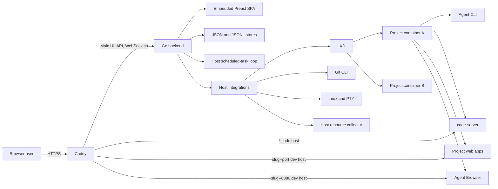
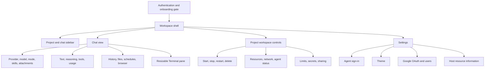
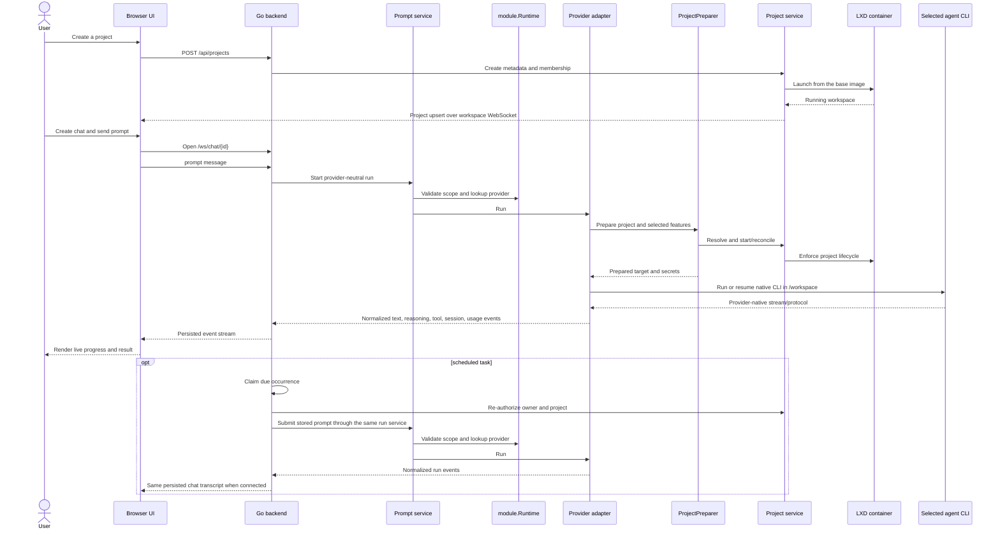

# System overview

## What the application is

`remote.futrx` is a self-hosted browser workspace for Claude Code, Codex,
MiniMax, Kimi Code, and Antigravity. Users create project-scoped containers, run interactive
or scheduled agent turns against those projects, and inspect the result through
chat, files, Git, a terminal, an IDE, or a live app preview.

Read [Philosophy](00-philosophy.md) for the design rationale behind project-scoped authority, durable project and provider homes, the host control plane, and the isolation contract.

## Runtime architecture

## Application layers

| Layer | Responsibility |
| --- | --- |
| Frontend | Authentication gates, workspace navigation, chat rendering, drawers, settings, and API clients |
| HTTP and WebSocket transport | Routes, JSON responses, upgrades, session checks, and project membership checks |
| Services | Agent module catalog/runtime, auth, capability and execution orchestration, chat, prompt, schedule, project, user, settings, skills, Git, files, browser, and container policy |
| Integrations | LXD, Git, tmux, host filesystem, Google OAuth, host metrics, and container commands |
| Stores | File-backed auth, users, settings, chats, scheduled tasks, projects, access lists, and secrets |
| Infrastructure | Installation, systemd, Caddy, LXD image creation, updates, and recovery timers |

## Main user surfaces

## End-to-end work flow

## Workspace navigation

The sidebar groups chats under projects and keeps loose chats in a separate section. It supports project/chat search, project reordering, unread and running indicators, new project or chat creation, chat fork/delete, and read/unread toggling. Project start and stop controls live under the project's Settings tab. Selecting a chat closes the mobile sidebar and opens its active `ChatContainer`.

The main shell switches between three views without browser routing:

| View | Main features |
| --- | --- |
| Chat | Streaming thread, composer, terminal, files, Git history, schedules, and browsers |
| Project workspaces | Lifecycle, diagnostics, limits, secrets, and sharing |
| Settings | Provider sign-in, system/dark/light theme, Google users, and server metrics |

## Important boundaries

- The host owns authentication, metadata, HTTPS, access decisions, and container orchestration.
- Each concrete agent adapter owns one factory declaration that binds its
  runtime, authentication, feature policy, provisioning profile, and
  preparation policy. The generic module factory constructs shared project
  preparation and narrows dependencies. Config owns reviewed registration
  order and application-wide policy; the catalog builds one runtime containing
  matching provider and auth registries.
- Each project owns its `/workspace` files and processes.
- Each project also has durable Codex, MiniMax, Claude, Kimi, and Antigravity
  homes mounted at their provider-native paths. Antigravity mounts only
  `/root/.gemini/antigravity-cli`.
- Claude, Codex, and Kimi credentials are host-managed and synchronized into
  project credential locations, primarily those homes; Claude also uses
  `/root/.claude.json` outside its mounted home. Remote injects MiniMax's
  host-managed Token Plan subscription key only into MiniMax runs.
- Remote's supported Antigravity flow authenticates inside each project and
  stores its current state in the durable
  `/root/.gemini/antigravity-cli` provider mount.
- Scheduled-task definitions and claims live in the host control plane. A due
  task enters the same project chat and one-run-per-chat path as an interactive
  prompt.
- The workspace WebSocket carries project/chat list updates; each chat has its own event stream.
- Caddy authenticates IDE and preview requests before proxying them into containers.

## Code map

- Frontend entry: [`frontend/src/app/App.tsx`](../../frontend/src/app/App.tsx)
- Backend composition root: [`backend/cmd/remote/main.go`](../../backend/cmd/remote/main.go)
- Service composition: [`backend/internal/service/services.go`](../../backend/internal/service/services.go)
- Container composition: [`backend/internal/config/containers.go`](../../backend/internal/config/containers.go)
- Reverse proxy template: [`infra/templates/Caddyfile.tmpl`](../../infra/templates/Caddyfile.tmpl)
