# Application guide

This documentation maps the complete `remote.futrx` application: how to use every product surface, why it is designed around project-scoped agent computers, who can use each capability, and how requests move through the system.

## Choose your path

| Reader | Start here |
| --- | --- |
| Product user | [User guide](../02-user-guide/README.md) |
| Server operator | [Deployment and operations](../04-operations/09-deployment-and-operations.md) |
| Architect or security reviewer | [Philosophy](00-philosophy.md), then [System overview](01-system-overview.md) and the [Threat model](../threat-model.md) |
| Contributor | [API and realtime](../03-platform/08-api-and-realtime.md), [Data and frontend state](../03-platform/07-data-and-frontend-state.md), then the code maps |

## Read in this order

| Document | Covers |
| --- | --- |
| [User guide](../02-user-guide/README.md) | Task-oriented walkthroughs, screenshots, daily recipes, troubleshooting, and the complete feature reference |
| [00-philosophy.md](00-philosophy.md) | Product doctrine, local-resource model, project and provider homes, capability and control envelopes, isolation boundaries, invariants, and hardening path |
| [01-system-overview.md](01-system-overview.md) | Product surfaces, runtime components, and the main end-to-end flow |
| [02-auth-users-and-access.md](../02-workspaces/02-auth-users-and-access.md) | Admin setup, Google users, provider login, roles, and project access |
| [03-projects-and-containers.md](../02-workspaces/03-projects-and-containers.md) | Project creation, LXD lifecycle, secrets, sharing, limits, and inspection |
| [04-chat-and-agents.md](../02-workspaces/04-chat-and-agents.md) | Chats, prompt execution, providers, modes, skills, streaming, fork, and rewind |
| [05-workspace-tools.md](../02-workspaces/05-workspace-tools.md) | Attachments, files, terminal, Git history, and browser IDE |
| [06-scheduled-tasks.md](../02-workspaces/06-scheduled-tasks.md) | Host scheduler, task state, capability-scoped agent tools, overlap, guardrails, and recovery |
| [07-notifications.md](../02-workspaces/07-notifications.md) | Outbound Telegram, WhatsApp, and webhook alerts for run, attention, and scheduled-task events, plus the weekly cost digest |
| [09-global-skills.md](../02-workspaces/09-global-skills.md) | Platform-wide skills library: storage, shadowing, container sync, always-on policy, and the admin API |
| [10-usage-and-cost.md](../02-workspaces/10-usage-and-cost.md) | Token and cost ledger, per-provider accuracy, price table, aggregation API, and rebuild |
| [11-resource-limits.md](../02-workspaces/11-resource-limits.md) | Fleet defaults, host-aware derivation, per-project overrides, disk quotas, and the aggregate start guard |
| [12-snapshots-and-trash.md](../02-workspaces/12-snapshots-and-trash.md) | Per-project snapshot archives (files + database), soft delete with restore, and the trash janitor |
| [14-client-portal.md](../02-workspaces/14-client-portal.md) | Public read-only status page per project: token gate, what it shows, storage, API, and audit |
| [15-autopilot-and-auto-test.md](../02-workspaces/15-autopilot-and-auto-test.md) | Per-chat post-run policies: autopilot rounds and completion markers, Playwright auto-test, the composer Test menu, guards, and attribution |
| [16-secrets-vault.md](../02-workspaces/16-secrets-vault.md) | Platform secrets vault: env/file/SSH entries, scoping and shadowing, container materialization and manifest cleanup, the SSH env contract, and the admin API |
| [08-project-templates.md](../02-workspaces/08-project-templates.md) | Stack presets, in-container provisioning, pre-built template images, and adding a template |
| [13-playbooks.md](../02-workspaces/13-playbooks.md) | One-click composer prompt templates: storage, seeding, placeholders, skill/mode/provider application, and the admin API |
| [06-previews-and-browser.md](../03-platform/06-previews-and-browser.md) | App discovery, HTTPS preview URLs, element inspection, and Agent Browser |
| [07-data-and-frontend-state.md](../03-platform/07-data-and-frontend-state.md) | File-backed persistence, workspace files, entities, and UI state |
| [08-api-and-realtime.md](../03-platform/08-api-and-realtime.md) | HTTP endpoints, WebSockets, events, and access gates |
| [09-deployment-and-operations.md](../04-operations/09-deployment-and-operations.md) | Install, proxying, base images, updates, recovery, and security hardening |
| [10-audit-log.md](../04-operations/10-audit-log.md) | Append-only audit trail: entry format, action names, admin API, and retention |

## Cross-cutting references

| Document | Covers |
| --- | --- |
| [../../ARCHITECTURE.md](../../ARCHITECTURE.md) | Top-level architecture: topology, layers, data flow, and trust boundaries |
| [../threat-model.md](../threat-model.md) | STRIDE threat model per trust boundary, with mitigations and residual gaps |
| [../known-limitations.md](../known-limitations.md) | Current scaling, operational, and functional constraints |

## Feature map

```mermaid
flowchart TD
    App["remote.futrx"]
    App --> Identity["Identity and access"]
    App --> Workspace["AI workspaces"]
    App --> Tools["Workspace tools"]
    App --> Runtime["Container runtime"]
    App --> Ops["Self-hosting operations"]

    Identity --> Admin["Local administrator"]
    Identity --> Users["Invited Google users"]
    Identity --> Sharing["Per-project membership"]

    Workspace --> Providers["Claude, Codex, Kimi, Antigravity"]
    Workspace --> Chat["Streaming chats"]
    Workspace --> Skills["Reusable skills"]
    Workspace --> Schedules["One-time and recurring tasks"]
    Workspace --> Autopilot["Autopilot and auto-test"]

    Tools --> Files["Files and uploads"]
    Tools --> Terminal["Interactive terminal"]
    Tools --> Git["Git history and restore"]
    Tools --> Browser["IDE and browser views"]

    Runtime --> Projects["One LXD container per project"]
    Runtime --> Previews["Discovered app ports"]
    Runtime --> Secrets["Managed environment values"]

    Ops --> Install["Install and HTTPS"]
    Ops --> Update["App and workspace updates"]
    Ops --> Recovery["Health and network repair"]
```

## Scope notes

- The User Guide describes the current UI and calls out source-vs-demo discrepancies rather than promoting features that are no longer implemented.
- Product screenshots are authentic captures from the July 22, 2026 walkthrough; diagrams explain behavior that a still image cannot prove.
- The browser UI is Preact, TypeScript, Vite, and Tailwind.
- The backend is one Go process serving the API, WebSockets, and embedded frontend.
- Project execution happens in LXD containers; the durable workspace and provider homes live on the host and are bind-mounted into each container.
- Metadata uses JSON and JSONL files rather than a database.
