# Application guide

This documentation maps the complete `remote.futrx` application: how to use every product surface, why it is designed around project-scoped agent computers, who can use each capability, and how requests move through the system.

## Choose your path

| Reader | Start here |
| --- | --- |
| Product user | [User guide](../02-user-guide/README.md) |
| Server operator | [Deployment and operations](../04-operations/09-deployment-and-operations.md) |
| Architect or security reviewer | [Philosophy](00-philosophy.md), then [System overview](01-system-overview.md) and the [Threat model](../threat-model.md) |
| Contributor | [API and realtime](../03-platform/08-api-and-realtime.md), [Data and frontend state](../03-platform/07-data-and-frontend-state.md), then the code maps |

## Read in this order

| Document | Covers |
| --- | --- |
| [User guide](../02-user-guide/README.md) | Task-oriented walkthroughs, screenshots, daily recipes, troubleshooting, and the complete feature reference |
| [00-philosophy.md](00-philosophy.md) | Product doctrine, local-resource model, project and provider homes, capability and control envelopes, isolation boundaries, invariants, and hardening path |
| [01-system-overview.md](01-system-overview.md) | Product surfaces, runtime components, and the main end-to-end flow |
| [02-auth-users-and-access.md](../02-workspaces/02-auth-users-and-access.md) | Admin setup, Google users, provider login, roles, and project access |
| [03-projects-and-containers.md](../02-workspaces/03-projects-and-containers.md) | Project creation, LXD lifecycle, secrets, sharing, limits, and inspection |
| [04-chat-and-agents.md](../02-workspaces/04-chat-and-agents.md) | Chats, prompt execution, providers, modes, skills, streaming, fork, and rewind |
| [05-workspace-tools.md](../02-workspaces/05-workspace-tools.md) | Attachments, files, terminal, Git history, and browser IDE |
| [06-scheduled-tasks.md](../02-workspaces/06-scheduled-tasks.md) | Host scheduler, task state, capability-scoped agent tools, overlap, guardrails, and recovery |
| [07-notifications.md](../02-workspaces/07-notifications.md) | Outbound Telegram, WhatsApp, and webhook alerts for run, attention, and scheduled-task events, plus the weekly cost digest |
| [09-global-skills.md](../02-workspaces/09-global-skills.md) | Platform-wide skills library: storage, shadowing, container sync, always-on policy, and the admin API |
| [10-usage-and-cost.md](../02-workspaces/10-usage-and-cost.md) | Token and cost ledger, per-provider accuracy, price table, aggregation API, and rebuild |
| [11-resource-limits.md](../02-workspaces/11-resource-limits.md) | Fleet defaults, host-aware derivation, per-project overrides, disk quotas, and the aggregate start guard |
| [12-snapshots-and-trash.md](../02-workspaces/12-snapshots-and-trash.md) | Per-project snapshot archives (files + database), soft delete with restore, and the trash janitor |
| [14-client-portal.md](../02-workspaces/14-client-portal.md) | Public read-only status page per project: token gate, what it shows, storage, API, and audit |
| [15-autopilot-and-auto-test.md](../02-workspaces/15-autopilot-and-auto-test.md) | Per-chat post-run policies: autopilot rounds and completion markers, Playwright auto-test, the composer Test menu, guards, and attribution |
| [16-secrets-vault.md](../02-workspaces/16-secrets-vault.md) | Platform secrets vault: env/file/SSH entries, scoping and shadowing, container materialization and manifest cleanup, the SSH env contract, and the admin API |
| [08-project-templates.md](../02-workspaces/08-project-templates.md) | Stack presets, in-container provisioning, pre-built template images, and adding a template |
| [13-playbooks.md](../02-workspaces/13-playbooks.md) | One-click composer prompt templates: storage, seeding, placeholders, skill/mode/provider application, and the admin API |
| [17-voice-input.md](../02-workspaces/17-voice-input.md) | Dictation in the chat composer: the browser Web Speech engine, the optional server transcription fallback, Arabic and RTL handling, limits, and privacy |
| [19-slash-commands.md](../02-workspaces/19-slash-commands.md) | The composer's `/` menu: built-in verbs, playbooks and skills as commands, keyboard model, argument parsing, and the literal-slash escape |
| [21-snippets-and-client-messages.md](../02-workspaces/21-snippets-and-client-messages.md) | Per-user snippet library and bilingual client message templates: storage and seeding, placeholders, the composer menu and `/s-` commands, the Message client panel, and the API |
| [18-reply-preferences-and-search.md](../02-workspaces/18-reply-preferences-and-search.md) | Platform-wide agent reply language, tone, and house rules (managed AGENTS.md block plus prompt preamble, per-user language override), and full-text Arabic-aware search across chat transcripts |
| [20-team-mode.md](../02-workspaces/20-team-mode.md) | One-switch multi-agent workflow in one chat: implementer → reviewer → tester across connected providers, companion chats, verdict parsing, loop caps, and the Team panel |
| [22-github-integration.md](../02-workspaces/22-github-integration.md) | Linking a repository, opening pull requests from the chat, importing PR review comments as a prompt, and the signed inbound webhook that can start agent runs |
| [23-model-routing.md](../02-workspaces/23-model-routing.md) | Automatic model routing: the admin policy that sends routine turns to a cheap model and hard ones to the expensive one, the per-chat Auto switch, the fallback rules, and the savings report |
| [24-auxiliary-model.md](../02-workspaces/24-auxiliary-model.md) | The optional small local model (Ollama or any OpenAI-compatible endpoint) behind chat titles, notification summaries, commit subjects, and client-message translation — with the fallback each job keeps |
| [25-mcp-servers.md](../02-workspaces/25-mcp-servers.md) | MCP server registry: platform entries and per-project overrides, container materialization for Claude Code and Codex, vault-backed secret references, manifest cleanup, the in-container probe, and the API |
| [26-ai-providers.md](../02-workspaces/26-ai-providers.md) | The free-tier provider pool: connecting Gemini, Groq, Cerebras, OpenRouter and friends, automatic failover when a quota runs out, the consumption meters and where their numbers come from, per-job routing for the auxiliary model, and the bulk lane |

| [27-agent-endpoints.md](../02-workspaces/27-agent-endpoints.md) | Third-party agent endpoints: pointing one chat's CLI at a vendor's own published compatibility endpoint with the operator's key, per-run env/config isolation, vault-backed key resolution, the red "not Anthropic" badge, and the in-container test |
| [28-visual-comparison-and-lighthouse.md](../02-workspaces/28-visual-comparison-and-lighthouse.md) | Checking work with a headless browser in the container: before/after page comparison with a perceptual pixel diff, and local Lighthouse audits with Core Web Vitals and category scores, neither needing a published site or an API key |
| [06-previews-and-browser.md](../03-platform/06-previews-and-browser.md) | App discovery, HTTPS preview URLs, element inspection, and Agent Browser |
| [07-data-and-frontend-state.md](../03-platform/07-data-and-frontend-state.md) | File-backed persistence, workspace files, entities, and UI state |
| [08-api-and-realtime.md](../03-platform/08-api-and-realtime.md) | HTTP endpoints, WebSockets, events, and access gates |
| [09-deployment-and-operations.md](../04-operations/09-deployment-and-operations.md) | Install, proxying, base images, updates, recovery, and security hardening |
| [10-audit-log.md](../04-operations/10-audit-log.md) | Append-only audit trail: entry format, action names, admin API, and retention |
| [11-uptime-monitoring.md](../04-operations/11-uptime-monitoring.md) | External uptime monitoring: the public `/healthz` endpoint, the outbound heartbeat, restart notifications, and free monitor setups |
| [12-client-site-monitoring.md](../04-operations/12-client-site-monitoring.md) | Always-on watcher for the operator's client websites: HEAD/keyword/TLS/latency checks, the two-consecutive-checks rule, uptime windows, bulk import, and the `siteWatch` alerts |
| [13-whatsapp-on-this-install.md](../04-operations/13-whatsapp-on-this-install.md) | What this deployment actually runs for WhatsApp alerts: the CallMeBot gateway, why its activation number must be read fresh every time, why messages are capped at 900 characters, and what must never be sent through a third-party relay |

## Cross-cutting references

| Document | Covers |
| --- | --- |
| [../../ARCHITECTURE.md](../../ARCHITECTURE.md) | Top-level architecture: topology, layers, data flow, and trust boundaries |
| [../threat-model.md](../threat-model.md) | STRIDE threat model per trust boundary, with mitigations and residual gaps |
| [../known-limitations.md](../known-limitations.md) | Current scaling, operational, and functional constraints |

## Feature map

```mermaid
flowchart TD
    App["remote.futrx"]
    App --> Identity["Identity and access"]
    App --> Workspace["AI workspaces"]
    App --> Tools["Workspace tools"]
    App --> Runtime["Container runtime"]
    App --> Ops["Self-hosting operations"]

    Identity --> Admin["Local administrator"]
    Identity --> Users["Invited Google users"]
    Identity --> Sharing["Per-project membership"]

    Workspace --> Providers["Claude, Codex, Kimi, Antigravity"]
    Workspace --> Chat["Streaming chats"]
    Workspace --> Skills["Reusable skills"]
    Workspace --> Schedules["One-time and recurring tasks"]
    Workspace --> Autopilot["Autopilot and auto-test"]

    Tools --> Files["Files and uploads"]
    Tools --> Terminal["Interactive terminal"]
    Tools --> Git["Git history and restore"]
    Tools --> Browser["IDE and browser views"]

    Runtime --> Projects["One LXD container per project"]
    Runtime --> Previews["Discovered app ports"]
    Runtime --> Secrets["Managed environment values"]

    Ops --> Install["Install and HTTPS"]
    Ops --> Update["App and workspace updates"]
    Ops --> Recovery["Health and network repair"]
```

## Scope notes

- The User Guide describes the current UI and calls out source-vs-demo discrepancies rather than promoting features that are no longer implemented.
- Product screenshots are authentic captures from the July 22, 2026 walkthrough; diagrams explain behavior that a still image cannot prove.
- The browser UI is Preact, TypeScript, Vite, and Tailwind.
- The backend is one Go process serving the API, WebSockets, and embedded frontend.
- Project execution happens in LXD containers; the durable workspace and provider homes live on the host and are bind-mounted into each container.
- Metadata uses JSON and JSONL files rather than a database.
