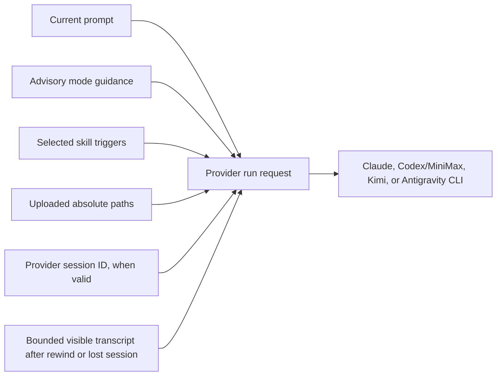

# Prompts, context, and conversation

A Remote chat is a durable event history around provider CLI sessions. The
browser streams the current run, stores completed events on the server, and
lets you continue, queue, cancel, rewind, or fork the work.

## Send a prompt

1. Open a project and select **New chat**, or select an existing chat.
2. Configure the provider, model, skills, thinking, speed, and mode as needed.
3. Enter a concrete request in the composer.
4. To include files, select **Attach files**, drag files onto the composer, or
   paste file data such as an image.
5. Wait for every attachment to finish uploading.
6. Select **Send**, or press Enter. Use Shift+Enter for a newline.

**Outcome:** Remote appends the user prompt to the chat, starts or resumes the
chosen provider CLI in the chat's working directory, persists normalized
events, and streams the result. In a project chat, the normal working directory
is `/workspace`.

The composer does not currently provide general-purpose `@` file mentions or
slash commands. Attach files with **Attach files**, drag-and-drop, or paste.

## How context reaches the agent

Remote normally resumes the provider's own session. The visible event log and
the provider session are related but not identical.

- A normal continuation sends the current prompt with the stored provider
  session identifier.
- A rewind clears provider session identifiers. The next run starts fresh and
  prepends a bounded transcript of the remaining visible user and assistant
  text.
- If provider session state is missing, Remote can use the same visible-history
  recovery path.
- The recovery transcript is bounded to roughly 24 KiB, so very old detail may
  be omitted. Put essential constraints, decisions, and filenames in the new
  prompt after a rewind or recovery.

Tool output, hidden provider context, and every historical event are not
guaranteed to be reconstructed into a fresh session.

## Attachments

Project-chat uploads are placed in `/workspace/.uploads` with unique filenames.
Remote adds their absolute paths to the prompt, so the agent can read them
directly. The uploads directory contains a `.gitignore` rule so attachments do
not normally appear in repository status.

Uploads are resumable at the transport layer, but attachment chips in the
composer are local page state. Do not reload until the uploads have completed
and the prompt has been sent. Remove an attachment chip to abort an in-progress
upload or exclude a completed one from the prompt.

## Queue the next prompt

While the agent is working, the composer changes to **Queue next prompt while
the agent is working** and the send button becomes **Queue prompt**.

1. Enter the follow-up.
2. Select **Queue prompt**.
3. Repeat to build an ordered list.
4. Remove a queued item if it should not be sent.
5. Keep or return to that chat in the same loaded page.

The first queued prompt is sent after the active run unlocks. A prompt remains
queued until the server acknowledges that it accepted the next run; a rejected
or interrupted dispatch stays at the front for the next send window.
Only the active chat has a live composer controller, so a queue in a background
chat waits until you open that chat again.

> Draft text and queued prompts are mirrored to `sessionStorage`, keyed by
> chat. They survive chat switching, app navigation, and a reload in the same
> browser tab. They are not server-side jobs and are not shared with another
> tab, browser, device, or user; closing the tab ends their intended lifetime.

There is still only one active run per chat. To run work concurrently, create
separate chats and switch between them in the sidebar.

## Follow a run

During a run, Remote can show:

- streamed assistant text and Markdown;
- syntax-highlighted code;
- reasoning blocks that stay collapsed by default and can be expanded at any
  time, including while the provider is still streaming them;
- grouped read, write, edit, search, shell, and other tool calls;
- working, completion, usage, and error states; and
- a question form when the agent emits a supported `AskUserQuestion` tool.

Antigravity currently emits plain streamed text rather than structured
reasoning, tool, or usage events.

Answer a displayed question and submit it to send that answer as the next
prompt. Use **Jump to latest** after scrolling away from new output.

Select **Cancel** or press Escape to request cancellation. Cancellation stops
the active provider context known to the current backend process and releases
the chat lock. A backend restart can leave a provider child process running
without a control-plane attachment; Remote does not currently reattach to
orphaned runs.

For work that must start when no browser tab is open, use
[Scheduled tasks](09-scheduled-tasks.md) rather than the per-tab prompt queue.

## Continue and manage a conversation

| Control | Task and outcome |
| --- | --- |
| **Load older messages** / **Show _n_ older messages** | Page backward through complete earlier turns without splitting an assistant response |
| **Rewind** | Remove the selected user prompt and every event after it, then place that prompt text back in the composer |
| **Fork from last message** | Create a separate chat from the visible history without changing the parent |
| **Mark read** / **Mark unread** | Change the sidebar unread marker |
| **Delete chat** | Cancel an active run and remove that chat's metadata and event history |

### Rewind and edit

1. Hover or focus the user message from which you want to restart.
2. Select **Rewind**.
3. Confirm **Rewind to this prompt? Messages from this point forward will be
   removed.**
4. Edit the restored prompt in the composer.
5. Send it to start a fresh provider session with bounded visible-history
   context.

Rewind is unavailable while the chat is running. Select **Cancel** first.
Rewind also clears the chat's page-memory prompt queue.

### Fork a chat

1. Find the chat in the sidebar.
2. Select **Fork from last message**.
3. Open the newly created chat.
4. Continue with different controls or instructions.

Claude can request a provider session fork. Codex and MiniMax clone their
stored app-server thread to a new session identifier. Kimi and Antigravity
currently start the fork's next run as a fresh session. In all cases, the
parent chat remains unchanged.

## Parallel conversation pattern

1. Give each independent task its own chat.
2. Start a run in the first chat.
3. Switch to another chat and start its task.
4. Use sidebar spinners and unread dots to track progress.
5. Review output before starting dependent follow-ups.

Parallel chats share the project's filesystem. Two agents can edit the same
file or Git worktree at the same time, so separate projects or explicit
coordination are safer for conflicting tasks.

## Security boundary

Project chats execute approval-free provider CLIs as root inside an
unprivileged project container. A **Loose chat** executes the approval-free CLI
directly as the backend service user on the parent host—root in production.
Loose chats are outside the project-isolation model and should be restricted to
fully trusted administrative work.

## Architecture references

- [Chat and agents](../02-workspaces/04-chat-and-agents.md)
- [Workspace tools](../02-workspaces/05-workspace-tools.md)
- [Frontend state and persistence](../03-platform/07-data-and-frontend-state.md)
- [API and realtime transport](../03-platform/08-api-and-realtime.md)
- [Known limitations](../known-limitations.md)
