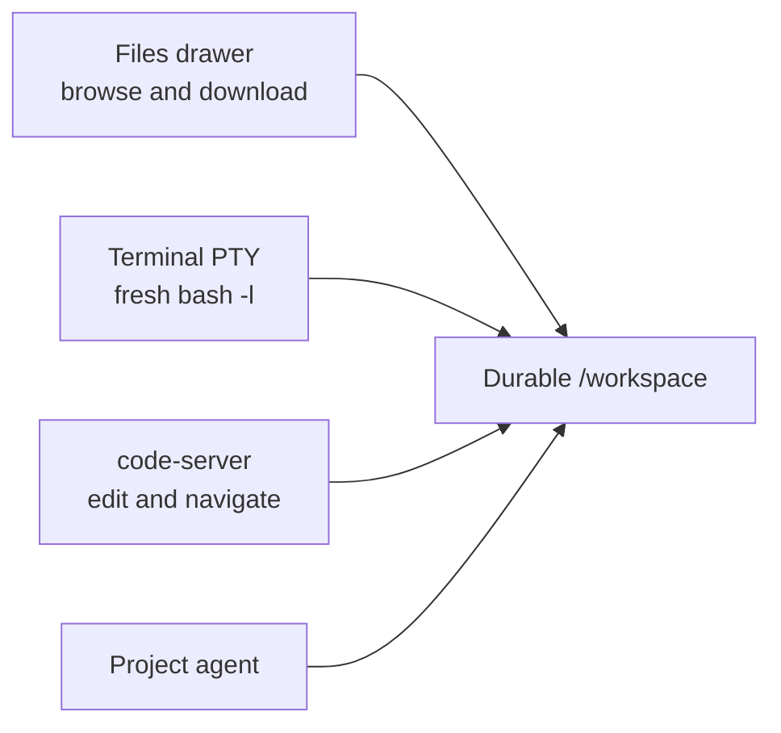

# Files, Terminal, and IDE

Files, Terminal, and IDE are three views of the same project workspace. Use
**Files** to inspect and download, **Open Terminal** for direct shell work, and
**Open in IDE** for code editing.


## Before you begin

- Open a chat inside the intended project. These workspace controls are not
  the isolation boundary for a **Loose chat**.
- Confirm the project is one you are allowed to change. Terminal and IDE
  actions can modify the durable workspace immediately.
- Remember that `/workspace` and the provider homes are durable, while
  arbitrary files elsewhere in the container root filesystem may disappear
  after container replacement.

## Choose the right surface

| Task | Surface | What it changes |
| --- | --- | --- |
| Browse directories, open media/code, or download a file | **Files** | Nothing unless the opened IDE file is edited or a download is saved locally |
| Find a file by name | **Files** | Nothing |
| Download a directory as ZIP | **Files** | Creates a temporary server-side archive, then downloads it |
| Run a command or inspect a process | **Open Terminal** | Whatever the command changes |
| Read and edit a codebase | **Open in IDE** | Whatever is saved through code-server |

All three start from the chat's current working directory. In a normal project
chat that is `/workspace`; a chat working in a contained subdirectory opens
that location where supported.

## Browse and download files

1. Open the project chat.
2. Select **Files** in the chat header.
3. Select a folder row to expand it. Subdirectories load as they are opened.
4. Select a file row to open it in the media viewer, IDE, or download path
   described below.
5. Hover or focus a file and select **Download _filename_** to download
   directly instead.
6. To export a directory, hover or focus it and select **Download _folder_ as
   zip**.
7. Select **Refresh** after an agent or terminal command changes the tree.
8. Select **Close files** when finished.

**Outcome:** supported media opens inside Remote, code/data/text opens in the
project IDE, unsupported media and archives download, and folders download as
ZIP archives. Editing still happens in code-server rather than inside the
Files drawer.

### Search by filename

1. Open **Files**.
2. Enter at least two Unicode code points in **Search all files...**.
3. Select a matching file row to open it, or use its download control. Search
   result directories can be downloaded but are not expanded in the flat
   search view.
4. If Remote says **Showing the first matches only — refine your search to
   narrow it down**, add a more specific substring.
5. Select **Clear search** to return to the directory tree.

Search matches path names by substring. It does not search file contents.

### Exact Files limits

| Operation | Current limit |
| --- | --- |
| One directory listing | 10,000 entries |
| Minimum search query | 2 Unicode code points |
| Returned search matches | 300 |
| Entries visited by one search | 200,000 |
| Folder ZIP source data | 1 GiB |
| Folder ZIP compressed spool | 1 GiB |
| Entries in one folder ZIP | 200,000 |
| Folder ZIP jobs | 2 concurrently across the entire Remote server |

A directory can therefore show a truncated warning even when its contents
exist. Search can stop at its visit cap before finding every possible match.
A ZIP fails when either its source-byte, compressed-spool, or entry limit is
reached.

Folder archives omit broken symlinks, symlinks that escape the workspace, and
special files such as sockets or devices. They include regular files and safe
directories.

### What happens when you select a file

| File type | Selection result |
| --- | --- |
| Supported image, audio, video, or PDF | Opens in Remote's full-screen media viewer |
| Code, data, text, log, or unknown non-media file | Opens that exact file in the project IDE |
| Archive or unsupported image/audio/video format | Downloads the file |

The media viewer provides **Open in new tab**, **Download**, and **Close**.
Press Escape or select outside the content to close it.

### Open workspace links from chat

Validated absolute workspace links in an agent message follow the same split:
supported media opens in the in-app viewer; other safe files redirect to the
project IDE. A path can include `:line` or `:line:column`, and code-server opens
the file at that exact location.

Examples:

```text
/workspace/src/app.ts:42
/workspace/src/app.ts:42:7
```

Current inline media types are:

- images: `.avif`, `.bmp`, `.gif`, `.ico`, `.jpeg`, `.jpg`, `.png`, `.svg`,
  `.tif`, `.tiff`, and `.webp`;
- audio: `.aac`, `.flac`, `.m4a`, `.mp3`, `.oga`, `.ogg`, `.opus`, and `.wav`;
- video: `.m4v`, `.mov`, `.mp4`, `.ogv`, and `.webm`; and
- PDF: `.pdf`.

Path containment is checked server-side; an outside or traversal path is
rejected.

## Run a terminal command

1. Select **Open Terminal** in a project chat.
2. Wait until the header reads **Terminal** and the status becomes
   **Connected**.
3. Check the path shown beside the status before running a command.
4. Run the command in the interactive login shell.
5. Select **Close terminal** when finished.

**Outcome:** Remote starts a fresh `bash -l` through a PTY inside the project
container. The shell begins in the chat working directory when that path maps
into the container, otherwise it falls back to `/workspace`.

On desktop, Terminal opens as a pane beside the chat. Drag its left edge to
resize it; Remote remembers that width in this browser. Opening Files, History,
Schedules, or Browser hides Terminal because workspace panes are mutually
exclusive.

The status can read **Connecting**, **Connected**, **Error**, or **Closed**.
If the project is stopped, opening the terminal first starts it.

> The PTY is intentionally tied to its WebSocket. Hiding and reopening the
> Terminal pane in the same loaded chat preserves its shell and current input.
> Switching chats, losing the socket, reloading, or closing the page kills that
> shell. There is no reconnect after the socket is lost.

Use a process manager or a terminal multiplexer that you configure inside the
project for work that must survive the page. Do not treat the Terminal pane
itself as a durable process supervisor.

## Open the browser IDE

1. Open the intended project chat.
2. Select **Open in IDE**.
3. Allow the new tab if the browser blocks it.
4. Wait for code-server to open the chat path, normally `/workspace`.
5. Use the IDE's explorer, search, editor, and integrated tools normally.

**Outcome:** the browser opens the project's code-server instance on its
dedicated IDE endpoint. File rows and agent-produced workspace links can target
a validated file and optional line/column inside that IDE.


### IDE authorization caveat

The current IDE proxy verifies that the browser belongs to a registered Remote
user, but it does **not** verify membership in the selected project. Any user
invited to the Remote server can potentially open any project IDE.

This differs from Files, Terminal, and Preview endpoints, which enforce project
membership or administrator access. Do not place mutually untrusted users on
the same Remote installation until IDE membership enforcement is added.

### Use the installable IDE launcher

Open `https://code.<your-remote-host>` to see the available project IDEs in a dedicated launcher. That launcher includes a web-app manifest and minimal service worker, so a supporting browser can install it as a PWA for faster access to project editors.

The launcher always loads the live project list and does not provide offline
project access. The main Remote chat application is also installable as a PWA,
but it remains network-first: only a self-contained offline status page is
cached, never the live workspace or agent data.

## How the three paths meet



A change saved by the agent, terminal, or IDE is visible to the other surfaces
after refresh. The surfaces do not create separate copies or per-chat
worktrees.

## Related documentation

- [Projects and containers](../02-workspaces/03-projects-and-containers.md)
- [Workspace tools architecture](../02-workspaces/05-workspace-tools.md)
- [Git history and restore](08-git-history-and-restore.md)
- [Known limitations](../known-limitations.md)
- [Threat model](../threat-model.md)
