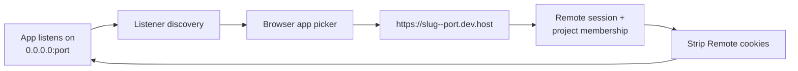

# Previews and element inspector

Preview puts a web app running inside the project beside its chat. Inspect mode
then turns a visible element into structured context that can be sent back to
the agent.


## Before you begin

- Use a project chat for a project you belong to, or an administrator account.
- Start an HTTP app inside the project container.
- Bind the app to `0.0.0.0` or another non-loopback interface. A process bound
  only to `127.0.0.1` or `localhost` is not discoverable.
- Listen on a port from **1024 through 65535**, inclusive.

For example, many development servers accept a command shaped like:

```bash
npm run dev -- --host 0.0.0.0 --port 3000
```

The exact flags belong to the framework. The essential requirements are a
non-loopback binding and a supported port.

## Open a live preview

1. Ask the agent to start the application, or start it with **Open Terminal**.
2. Select **Open Browser** in the chat header.
3. If the header reads **Looking for running apps…**, wait for discovery.
4. If it reads **No apps listening in _project_**, select **Refresh running
   apps** after confirming the process is listening.
5. Use the app picker to choose the desired `process · :port`.
6. Use **Reload** after rebuilding or restarting the app.
7. Use **Open in new tab** when the app needs more room or browser developer
   tools.

**Outcome:** Remote loads the selected project listener through its
authenticated HTTPS preview hostname. The drawer stays beside the chat so the
implementation and result can be reviewed together.

The UI can prefer a recent preview URL mentioned in the current chat when its
project and port match a discovered listener. Otherwise it uses the selected
listener from the picker.

## Open a port in the Agent Browser

The preview panels — the globe button on a sidebar project row, and the caret
on the chat header's **Preview** chip — list every port the project is
listening on. Each row offers **Open**, **Copy URL**, **Agent Browser**, and
**Share 24h**.

**Agent Browser** loads that port in the project's shared headed browser
instead of your own:

1. Select **Agent Browser** on the port you want.
2. Remote starts the shared browser if it is not already up. A cold container
   takes about a minute the first time, while Chromium is installed.
3. From the chat header chip, the workspace Browser pane switches to the Agent
   Browser view so you watch it load. From the sidebar, the panel confirms the
   port was loaded and tells you where to look.

**Outcome:** the page is open in the same browser session the agent drives, so
a login you complete there is a login the agent has. The browser is pointed at
`http://127.0.0.1:<port>/` from inside the container, which is why the platform
sign-in page never appears inside that session.

Platform ports (6080, 8842, 8081, 9222) carry no **Agent Browser** action —
pointing the Agent Browser at its own view or its own debugging port achieves
nothing. If the browser cannot start, or the port is refused, the reason is
shown on that row.

## Preview request path



The first request for a new project-and-port hostname can be slower while
on-demand TLS is issued. The TLS allow check confirms that the project slug and
port are valid before a certificate is approved.

## Select an element for the agent

1. Open the running app in **Browser** preview mode.
2. Select **Inspect element**. The control changes to an active crosshair
   state.
3. Move across the preview and use the highlight to find the target.
4. Select the element once.
5. Confirm that a **[Browser element]** context block appears in the composer.
6. Add the desired change—for example, “Reduce the spacing above this card and
   preserve the mobile layout.”
7. Send the prompt.

**Outcome:** selection exits inspect mode and gives the agent bounded,
machine-readable context for the exact element instead of relying only on a
verbal description.


The captured context can include the preview URL and page title, a CSS selector,
tag, ID, classes, role, accessible label, visible text, bounded HTML, element
rectangle, viewport, a subset of computed styles, and a short parent chain.
Text, markup, and ancestry are deliberately bounded; this is targeted element
context, not a full-page source export.

## Preview and inspector boundaries

| Boundary | Current behavior |
| --- | --- |
| Listener discovery | Non-loopback TCP listeners only |
| Allowed ports | 1024–65535 |
| Preview access | Administrator or project member with a valid Remote session |
| Public sharing | No anonymous or public preview link |
| Platform cookies | Remote session, OAuth-state, and return-location cookies are removed before proxying to project code |
| Inspector origin | Same project preview origin through `/__remote_inspector` |
| Selected target | One preview process and port at a time |
| Browser modes | Inspect mode and Agent Browser mode are mutually exclusive |

Project code can still set and receive its own cookies. The cookie stripping
protects Remote's control-plane cookies from being forwarded into the
untrusted project application; it does not make that application trusted.

Inspect mode depends on the Remote same-origin wrapper. It is for the local app
preview, not for arbitrary internet sites and not for the shared Agent Browser.
Use [Agent Browser](07-agent-browser.md) when the task requires a real website
or a signed-in browser profile.

## When no app appears

Check these in order:

1. The project is running.
2. The app process is still alive.
3. Its socket is bound to `0.0.0.0` or another non-loopback interface.
4. Its port is between 1024 and 65535.
5. **Refresh running apps** has been selected.
6. The project has a usable non-loopback IPv4 address.

If the picker is correct but the page still fails, check preview DNS, Caddy,
project membership, and on-demand TLS. See
[Troubleshooting](12-troubleshooting.md) for the operator path.

## Related documentation

- [Previews and browser architecture](../03-platform/06-previews-and-browser.md)
- [Files, Terminal, and IDE](05-files-terminal-and-ide.md)
- [Agent Browser](07-agent-browser.md)
- [Projects and containers](../02-workspaces/03-projects-and-containers.md)
- [Threat model](../threat-model.md)
