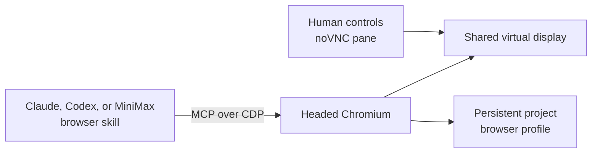
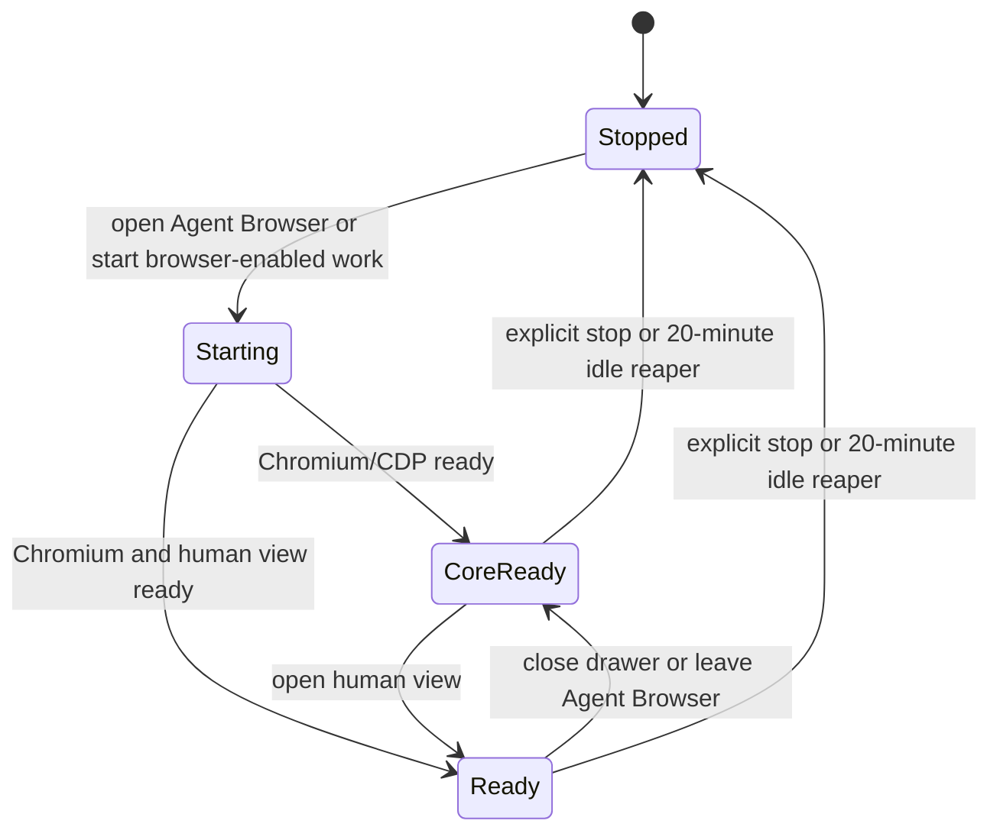

# Agent Browser

Agent Browser is one headed Chromium session shared by a person and an agent
inside a project. Use it when the work depends on a real website, a visual
login, consent, or another step that cannot be completed through the local app
preview.

## Before you begin

- Use a project chat. Agent Browser is scoped to a project, not to one chat.
- For agent control, choose Claude, Codex, or MiniMax and add the `browser`
  skill before sending the prompt. Kimi and Antigravity do not currently
  receive equivalent Browser MCP access.
- Decide whether the selected agent may access the sites and account data in
  this browser profile. Login state is deliberately shared and persistent.
- Follow the target site's terms. Human intervention is not permission to
  bypass an access-control challenge.

## Sign in once, then let the agent work

1. Open the project chat and select **Open Browser**.
2. Select **Agent browser — log into a site and let the agent drive it**.
3. Wait for the drawer title to change to **Agent browser** and for **Live
   login session · connected**. During startup it can read **starting…** or
   **core ready**.
4. In the live browser, navigate to the site and complete the permitted login,
   consent, or account-selection steps.
5. In the chat, select Claude, Codex, or MiniMax, add the `browser` skill, and
   send a precise browser task.
6. Watch the same window. Take over with the mouse and keyboard whenever the
   site needs a human decision, then tell the agent to continue.
7. When finished, either select **Close browser** to leave the agent-facing
   browser core available, or select **Stop the agent browser** to stop the
   complete stack.

**Outcome:** the human noVNC pane and the agent's CDP/MCP tools operate the same
Chromium window and persistent profile. A login completed by the human is
therefore immediately available to the browser-enabled agent.

## Shared-session architecture

There is one Agent Browser session per project, not one per user, chat, or
agent run. Its viewport is fixed at **1366×768**. Human and agent input can
collide, so pause one side before the other types or clicks.

## Start, close, and stop mean different things

| Action | Human view | Agent-facing browser core | Profile and login data |
| --- | --- | --- | --- |
| Select Agent Browser | Starts or reconnects | Starts if needed | Reused |
| Select **Close browser** | Stops | Keeps running | Kept |
| Toggle back to app preview | Stops | Keeps running | Kept |
| Select **Stop the agent browser** | Stops | Stops | Kept |
| Replace the project container | Stops | Stops until restarted | Kept in durable workspace storage |

Closing the pane is therefore not a full browser stop. Use **Stop the agent
browser** when the project should no longer have a live Chromium process.
Stopping does not sign out of websites or delete the profile.

## Idle reaping

The backend checks browser activity every minute. It stops the complete stack
after **20 minutes** without pane or browser-enabled agent activity.

An attached VNC TCP viewer counts as an active viewer. Close or leave the pane
if you expect the idle reaper to reclaim the browser. A browser-enabled agent
run also sends activity heartbeats while it is using the session.

## Security and operating boundaries

- Every authorized actor and browser-enabled agent working in the project
  reaches the same profile and window.
- The profile survives normal container replacement, so cookies and site
  sessions can outlive one Chromium process.
- The browser has normal outbound network access; it is not restricted to
  project preview hosts.
- There is no per-task browser profile, per-chat session, or incognito
  boundary.
- A screenshot or noVNC view exposes what is on the virtual display. The agent
  can also read and operate pages through CDP.
- Stop semantics preserve the profile. Sign out on the website or clear its
  data when persistence is not desired.
- Some sites block automation. Do not defeat CAPTCHA, anti-bot, consent, or
  authorization controls that the site requires.

Treat the profile like a project credential store: only sign in to accounts
whose scope is appropriate for every trusted agent and project collaborator.

## Related documentation

- [Previews and browser architecture](../03-platform/06-previews-and-browser.md)
- [Previews and element inspector](06-previews-and-inspector.md)
- [Chat and agent controls](03-chat-and-agent-controls.md)
- [Threat model](../threat-model.md)
- [Known limitations](../known-limitations.md)
