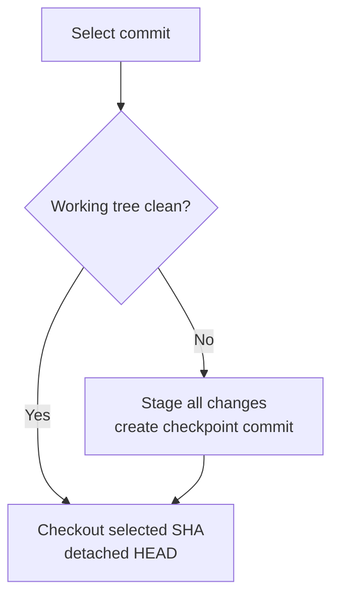

# Git history and restore

**History** lets you discover Git repositories in the workspace, inspect
commits and patches, and place a repository at an earlier commit. It is a
targeted recovery surface, not a replacement for the complete Git CLI.

The **History** button appears only after Remote confirms that the chat
workspace contains a Git repository. Remote checks when the chat becomes ready
and checks again after each agent run, so a newly initialized or cloned
repository can appear without a page reload.

## Before you begin

- Confirm the intended directory is a Git repository with at least one commit.
- Stop or coordinate any agent, terminal, or IDE process that may write to the
  same repository during the switch.
- Save important uncommitted work. A clean switch is simple; a dirty tree
  requires a checkpoint first.
- Know the branch you want to return to. History switches to a detached HEAD
  and does not create a recovery branch.

## Inspect a repository and commit

1. Open the project chat and select **History**.
2. Use **Git repository** to choose the workspace root or a discovered nested
   repository.
3. Check the repository state shown as **Clean** or **Dirty**, its path, current
   short SHA, and current ref.
4. Select a commit. The selected row shows its short SHA, subject, author, and
   date; the current commit is marked **HEAD**.
5. Review the structured patch in the right pane. Each changed file is a
   collapsible card with addition/deletion counts, old and new line numbers,
   hunk boundaries, and badges for new, deleted, or binary files.
6. Select **Refresh history** after another tool changes commits or working-tree
   state.

**Outcome:** the repository remains unchanged. Only selecting **Switch**
requests a checkout.

The drawer lists commits from all refs in date order. Mode-only, rename-only,
and binary changes can have no textual hunk. If a response cannot be parsed as
a normal unified diff, Remote falls back to the raw patch instead of hiding it.
**No diff** alone does not prove that the repository has no history.

## Switch a clean repository to a commit

1. Confirm that the repository reads **Clean**.
2. Select the desired commit and review its SHA and patch.
3. Select **Switch**.
4. Wait for **Switched to _short-sha_.**
5. Confirm the header shows the chosen SHA and `detached` as the current ref.

**Outcome:** Git checks out the selected commit with `checkout --detach`. The
working tree now reflects that commit, but no branch pointer is moved and no
new branch is created.



## Preserve a dirty working tree

The restore service supports a safety checkpoint before switching:

1. It detects every line reported by `git status --porcelain`.
2. It requires a non-empty checkpoint message, normalized and capped at 200
   bytes.
3. It runs `git add -A`, including tracked changes, deletions, and untracked
   files that are not ignored.
4. It commits with identity `remote.futrx
   <checkpoint@remote.futrx.com>`.
5. It records the checkpoint SHA, then checks out the selected commit in
   detached HEAD state.

When that flow completes, the success message includes **Checkpoint
_short-sha_ saved.**

### Current drawer limitation

In the current source build, **Switch** detects a dirty tree and prepares the
checkpoint state, but the History drawer does not render the checkpoint form
needed to submit its message. A dirty switch therefore cannot be completed
through the visible drawer yet.

Use **Open Terminal** to create the checkpoint, then return to History:

```bash
git status --short
git add -A
git -c user.name=remote.futrx \
  -c user.email=checkpoint@remote.futrx.com \
  commit -m "Checkpoint before history switch"
```

Then select **Refresh history**, select the target commit, and select
**Switch**. If the changes should not all be committed together, handle them
with normal Git commands instead of staging everything.

This workaround advances the current branch when one is checked out. If the
repository was already detached, record the resulting checkpoint SHA because
it may otherwise be reachable only through the reflog after the next switch.

## Work safely after a restore

Detached HEAD is useful for inspection and testing, but new commits made there
do not automatically belong to a named branch.

To keep new work, create a branch before editing:

```bash
git switch -c recovery/my-change
```

To return to an existing branch, first make the restored tree clean, then use
the IDE or Terminal:

```bash
git switch main
```

Replace `main` with the actual branch. History does not provide a branch
picker, merge, rebase, reset, stash, cherry-pick, or remote synchronization
workflow.

## Discovery and display limits

| Area | Current behavior |
| --- | --- |
| Repository discovery | Workspace root through maximum depth 6 |
| Skipped directories | `.git`, `.agents`, `.browser`, `.cache`, `.claude`, `.codex`, `.minimax`, `.media`, `.vscode`, `node_modules`, `.next`, `dist`, `build`, `out`, `coverage`, `vendor`, `tmp`, and `__pycache__` |
| Commit source | All refs, date ordered |
| Commits requested by the drawer | 100 |
| Backend commit cap | 200 |
| Displayed commit patch | 768 KiB, followed by `[diff truncated]` |
| Checkout target | A verified commit object inside the selected repository |
| Checkout mode | Detached HEAD |

Repositories outside the chat workspace are rejected. A repository nested
deeper than the discovery bound or beneath a skipped directory does not appear
in the picker. Use the IDE or Terminal for a full diff when History reports
**Diff truncated at 768 KB.**

## What restore does not protect against

- It cannot coordinate simultaneous writes from multiple chats or agents.
- It does not back up ignored files, external services, databases, secrets, or
  files outside the repository.
- It does not move the original branch to the selected historical commit.
- It does not create a branch for work made after the detached checkout.
- A checkpoint intentionally stages all visible changes; it is not a selective
  commit.

Use separate projects or explicit agent coordination for conflicting work, and
use an external backup for data that Git does not contain.

## Related documentation

- [Files, Terminal, and IDE](05-files-terminal-and-ide.md)
- [Workspace tools architecture](../02-workspaces/05-workspace-tools.md)
- [Prompts, context, and conversation](04-prompts-context-and-conversation.md)
- [Troubleshooting](12-troubleshooting.md)
- [Known limitations](../known-limitations.md)
