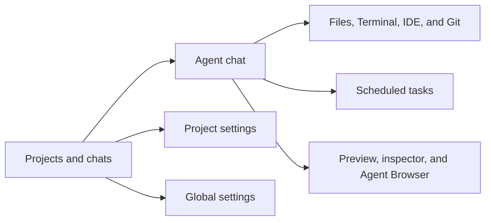

# User guide

This guide explains how to use every user-facing part of Remote: onboarding,
projects, chats, four agent providers, scheduled tasks, workspace tools,
previews, the shared Agent Browser, Git recovery, secrets, sharing, users, and
server information.

Remote is built around one idea: create a project computer, give an agent broad authority inside that project, and keep the human in control through the browser.

## Start here

If this is your first session:

1. [Sign in and finish setup](01-first-run-and-sign-in.md).
2. [Create a project and learn the sidebar](02-projects-and-sidebar.md).
3. [Create a chat and choose an agent](03-chat-and-agent-controls.md).
4. [Send work, attach context, queue a follow-up, or answer an agent question](04-prompts-context-and-conversation.md).
5. Open the result through [Files, Terminal, or IDE](05-files-terminal-and-ide.md).
6. For a web app, use [Preview and Inspect](06-previews-and-inspector.md).
7. For a real signed-in website, use the [Agent Browser](07-agent-browser.md).
8. Use [Git History](08-git-history-and-restore.md) before or after risky changes.
9. Use [Scheduled tasks](09-scheduled-tasks.md) when a project chat should work
   again later without keeping the browser open.

## Find a task

| I want to… | Go to |
| --- | --- |
| Claim a new server or sign in | [First run and sign-in](01-first-run-and-sign-in.md) |
| Connect Claude, Codex, or Kimi | [Global settings, users, and providers](10-global-settings-users-providers.md) |
| Sign in to Antigravity for one project | [Global settings, users, and providers](10-global-settings-users-providers.md#use-antigravity) |
| See what is happening across every project at once | [Home dashboard](02-projects-and-sidebar.md#the-home-dashboard) |
| Create, search, reorder, start, or stop projects | [Projects and sidebar](02-projects-and-sidebar.md) |
| Pick a provider, model, thinking level, speed, mode, or skill | [Chat and agent controls](03-chat-and-agent-controls.md) |
| Attach files, queue work, cancel a run, fork, rewind, or mark unread | [Prompts, context, and conversation](04-prompts-context-and-conversation.md) |
| Browse or download files | [Files, Terminal, and IDE](05-files-terminal-and-ide.md) |
| Run a command manually | [Files, Terminal, and IDE](05-files-terminal-and-ide.md) |
| Open the browser IDE | [Files, Terminal, and IDE](05-files-terminal-and-ide.md) |
| Preview a local web app or select an element | [Previews and inspector](06-previews-and-inspector.md) |
| Let an agent use a website where I am signed in | [Agent Browser](07-agent-browser.md) |
| Inspect commits, prepare a recovery point, or switch clean versions | [Git history and restore](08-git-history-and-restore.md) |
| Schedule, pause, edit, run, or delete future agent work | [Scheduled tasks](09-scheduled-tasks.md) |
| Add secrets, share a project, set limits, or recover a container | [Project settings](09-project-settings.md) |
| Invite a user, change a role, choose a theme, or inspect the host | [Global settings](10-global-settings-users-providers.md) |
| Follow a complete end-to-end recipe | [Everyday workflows](11-everyday-workflows.md) |
| Diagnose a problem | [Troubleshooting](12-troubleshooting.md) |
| Check whether a feature exists and who may use it | [Complete feature reference](13-feature-reference.md) |

## The application surfaces

| Surface | What it controls |
| --- | --- |
| Projects sidebar | Project and chat creation, search, status, ordering, read state, forking, and deletion |
| Chat | Agent selection, prompt context, streamed reasoning and tool activity, per-tab drafts and queues, questions, usage, and history |
| Workspace tools | The durable `/workspace` through files, downloads, a shell, code-server, and Git |
| Scheduled tasks | Host-owned one-time or recurring prompts that return to a project chat |
| Project settings | Container state, diagnostics, resource limits, secrets, membership, and recovery |
| Global settings | Appearance, host-wide agent credentials, platform users, Google OAuth, and host metrics |

## Roles at a glance

| Capability | Server admin | Project member |
| --- | ---: | ---: |
| Use a project and its chats | Yes | Yes, when added |
| Create projects and chats | Yes | Yes |
| Use files, terminal, preview, IDE, and browser | Yes | Yes, with the IDE caveat below |
| Create and manage scheduled tasks | Yes, including all owners | Yes, for their own tasks |
| Read or change project secrets | Yes | Yes |
| Add or remove project members | Yes | Yes |
| Start, stop, restart, inspect, or repair a project | Yes | Yes |
| Change CPU, memory, or root-disk limits | Yes | No |
| Delete a project | Yes | No |
| Connect agent-provider accounts | Yes | No |
| Configure Google OAuth or global users | Yes | No |

> **IDE access caveat:** the current IDE proxy checks that a person is a registered Remote user, but it does not enforce project membership. Treat every invited user as able to reach every project IDE until that boundary is hardened.

## What persists

The durable center is the project, not one chat or one container generation.

- `/workspace` survives normal stop, restart, and container replacement.
- Claude, Codex, and Kimi provider homes are separate durable mounts.
- Antigravity stores its sign-in and conversation state in the replaceable
  container root; it survives ordinary stop/start but not container
  replacement.
- The Agent Browser profile lives in the workspace, so site sessions can survive container replacement.
- Chat metadata and event history live in the host control plane.
- Scheduled-task definitions, claims, and run state live in the host control
  plane.
- Packages or files installed elsewhere in a container root filesystem can disappear when the container is recycled.
- Drafts and queued prompts are stored in `sessionStorage` per browser tab.
  They survive a reload in that tab, but not tab closure, a different tab,
  another browser, or another device.

For the architecture behind those guarantees, read [Philosophy](../01-overview/00-philosophy.md) and [Projects and containers](../02-workspaces/03-projects-and-containers.md).

## Screenshot notes

The screenshots in this guide are authentic captures of the application walkthrough recorded on July 22, 2026. They show demo projects and point-in-time UI states, not synthetic mockups. A screenshot proves the visible surface; architecture diagrams and source-backed reference pages document behavior that a still image cannot prove.
