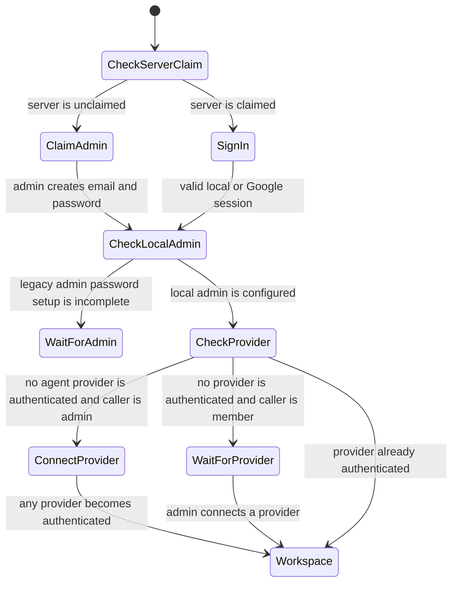
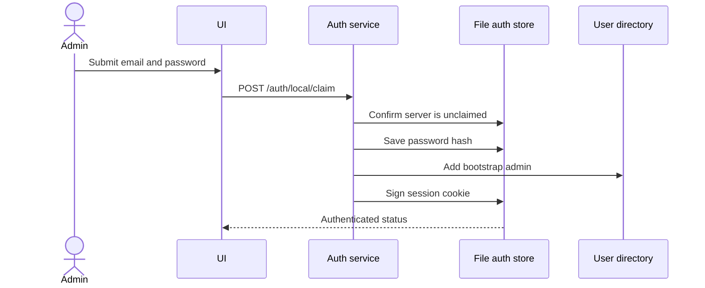
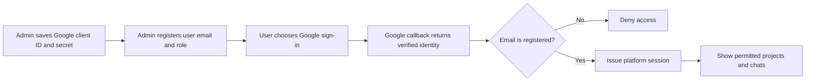
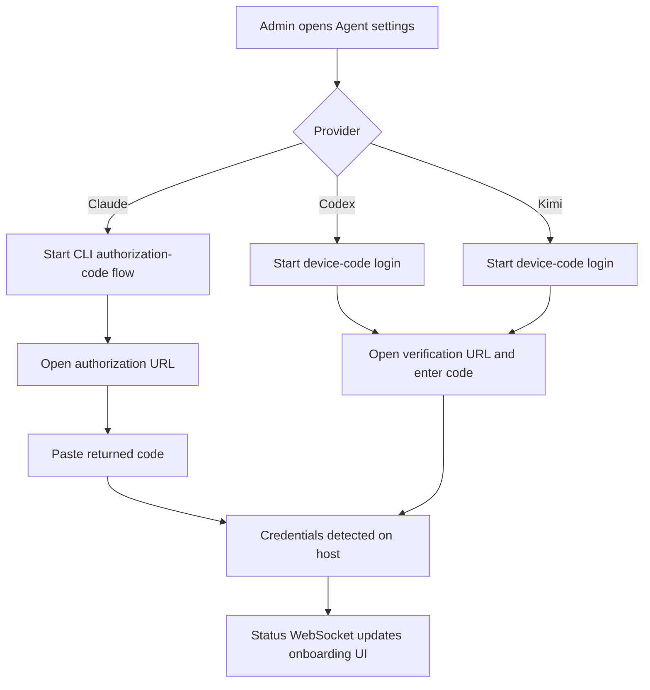
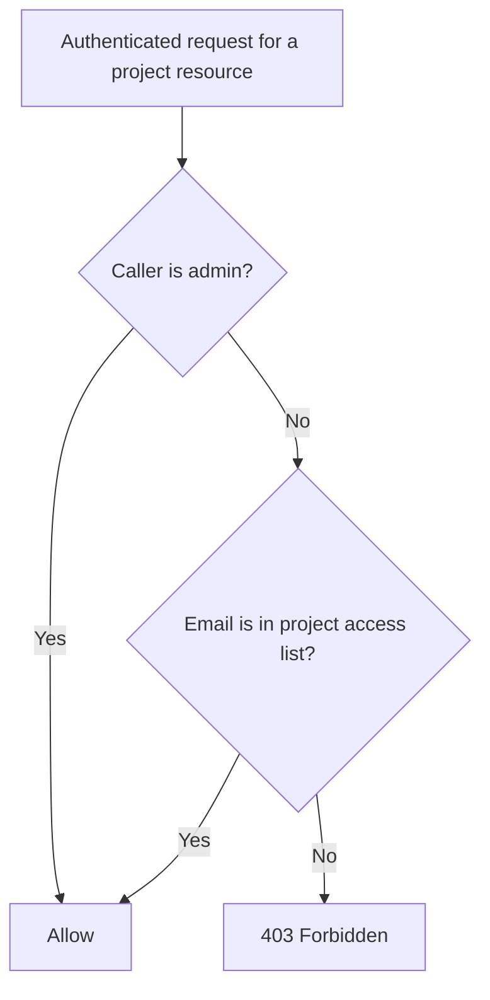
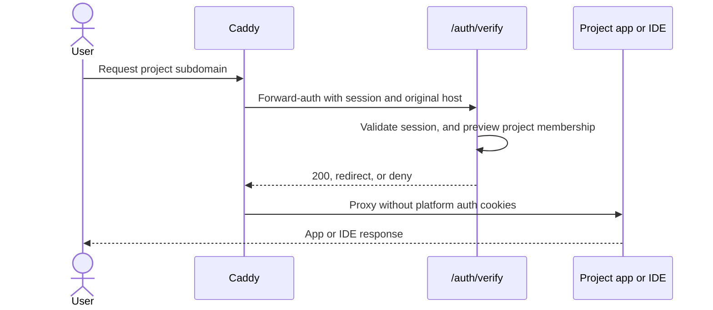

# Authentication, users, and access

The application separates three concerns:

1. Platform identity: who may open `remote.futrx`.
2. Agent credentials: whether a provider can run, with host-wide onboarding
   for Claude, Codex, and Kimi and project-local sign-in for Antigravity.
3. Project membership: which registered users may access a project.

## Application gate

The backend middleware applies the same order to `/api/*` and `/ws*`: valid registered session, completed local-admin setup, then at least one authenticated agent provider. Provider-login endpoints are exempt from the final check so onboarding can finish.

## Identities and roles

| Identity | Sign-in | Scope |
| --- | --- | --- |
| Local administrator | Email and a password of 12–1024 characters | Cannot be removed or demoted; manages host-wide setup |
| Invited administrator | Google OAuth | Admin routes and all projects |
| Invited member | Google OAuth | Only projects where their email is a member, plus loose chats |

Sessions are signed in the `remote_session` secure, HTTP-only cookie and last 30 days. Passwords use a salted, one-way hash. Google OAuth is optional until the admin wants to invite users.

## First administrator flow

The first claim is public only while no admin exists. A legacy installation that already has an administrator identity but no password requires authorization by that existing admin.

## Invited user flow

User guardrails:

- Google sign-in must be configured before users can be added.
- Only admins can add users, remove users, or change roles.
- The last administrator cannot be removed or demoted.
- The local administrator cannot be removed or demoted.

## Agent-provider authentication

Claude, Codex, and Kimi credentials are host-wide and admin-managed.

Claude uses an interactive authorization URL plus a pasted code. Codex and Kimi use device-code flows. Credential files are later synchronized into project containers before agent execution.

Antigravity is deliberately outside this host-wide flow. Its bare `agy` sign-in
never exits the interactive TUI, so Remote exposes no Antigravity card or
onboarding status. A user runs `agy` once in a project Terminal and completes
the URL-and-code flow there. That project-local state does not satisfy the
application's initial provider gate and is not synchronized by the host
credential service.

## Project access rules

| Operation | Admin | Project member |
| --- | ---: | ---: |
| See project and its chats | Yes | Yes |
| Create chat in project | Yes | Yes |
| Start, stop, restart, inspect, repair | Yes | Yes |
| Read or change secrets | Yes | Yes |
| Edit project membership | Yes | Yes, but cannot remove the final member |
| Set resource limits | Yes | No |
| Delete project | Yes | No |
| Manage global users or Google OAuth | Yes | No |
| Connect agent providers | Yes | No |

Project access is enforced independently on project/chat HTTP resources, chat sockets, terminal sockets, uploads, workspace snapshots, project skills, and preview requests.

## Preview and IDE authentication

Caddy calls `/auth/verify` before forwarding IDE or preview traffic. For a preview host, the backend extracts the project slug and checks membership; failing that, it accepts a valid [public share link](../03-platform/06-previews-and-browser.md#public-share-links) for that exact slug and port, which is the one path that authorizes a caller with no platform account. IDE hosts currently receive the registered-user check but not a per-project membership check, and never accept share links. After verification, Caddy strips platform session and share cookies before the request enters project-controlled code.

## Code map

- Frontend gate: [`frontend/src/app/containers/AuthGate.tsx`](../../frontend/src/app/containers/AuthGate.tsx)
- Auth middleware: [`backend/internal/transport/http/middleware/auth.go`](../../backend/internal/transport/http/middleware/auth.go)
- Auth service: [`backend/internal/service/auth/service.go`](../../backend/internal/service/auth/service.go)
- User service: [`backend/internal/service/user/service.go`](../../backend/internal/service/user/service.go)
- Access adapter: [`backend/internal/transport/transport.go`](../../backend/internal/transport/transport.go)
