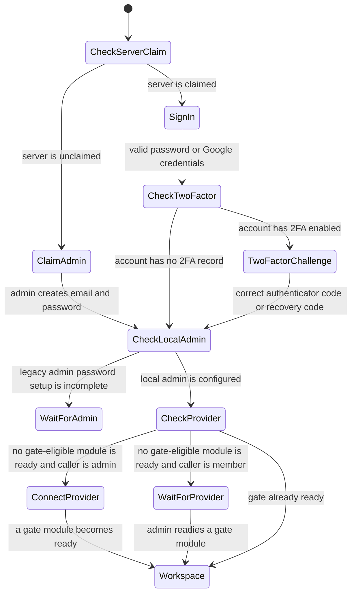
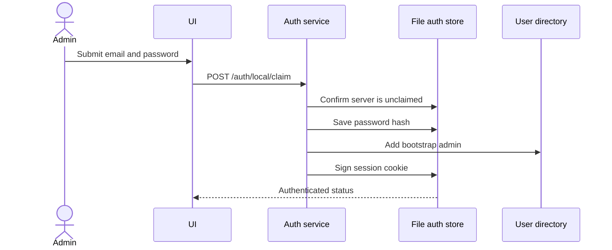
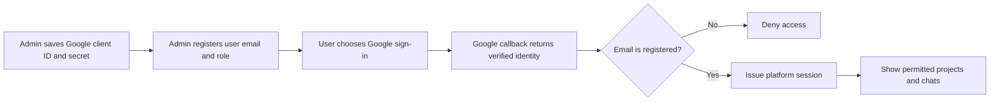
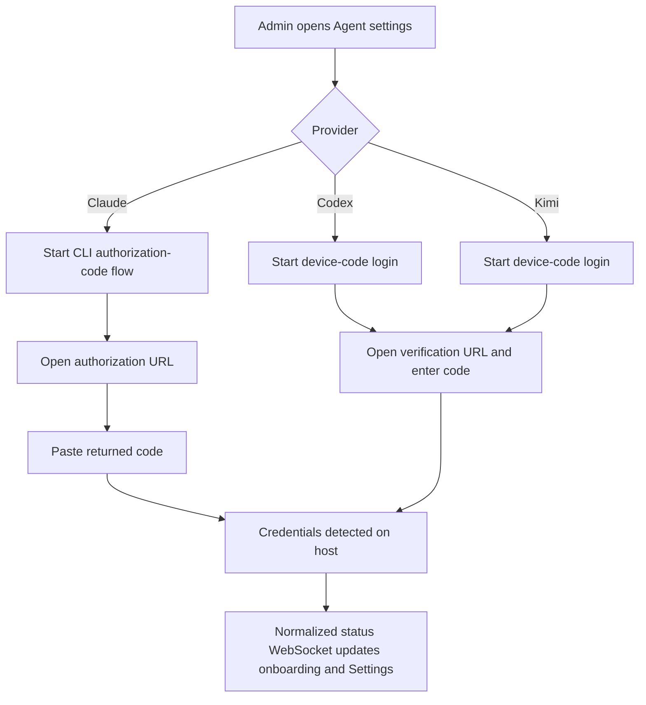
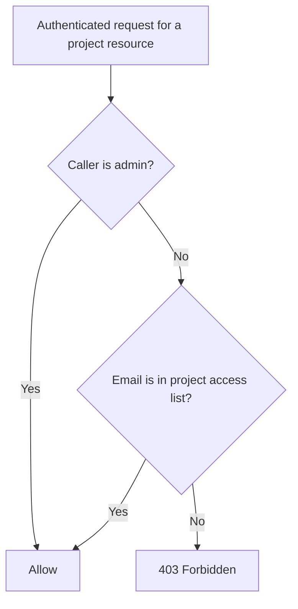
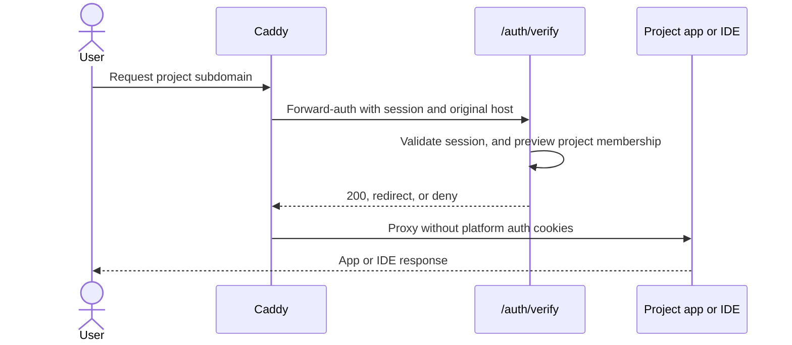

# Authentication, users, and access

The application separates three concerns:

1. Platform identity: who may open `remote.futrx`.
2. Agent credentials: whether a provider can run, with host-wide onboarding
   for Claude, Codex, Kimi, and MiniMax, plus a supported project-local sign-in
   flow for Antigravity.
3. Project membership: which registered users may access a project.

## Application gate

The backend middleware applies the same order to `/api/*` and `/ws*`: valid
registered session, completed local-admin setup, then at least one agent module
marked `SatisfiesAccessGate` ready. Managed code/device/API-key modules require an
authenticated binding; no-auth modules are ready immediately; external flows
cannot be gate providers because Remote has no authoritative status signal.
`GET /api/agent-auth`, normalized `/ws/agent-auth/<provider>` streams, and
legacy provider-auth routes are exempt from the final check so onboarding can
finish.

The `CheckTwoFactor`/`TwoFactorChallenge` step only exists for accounts that
have opted into TOTP 2FA (see below); every other account skips straight from
`SignIn` to `CheckLocalAdmin`, unchanged from before 2FA existed.

## Identities and roles

| Identity | Sign-in | Scope |
| --- | --- | --- |
| Local administrator | Email and a password of 12–1024 characters | Cannot be removed or demoted; manages host-wide setup |
| Invited administrator | Google OAuth | Admin routes and all projects |
| Invited member | Google OAuth | Only projects where their email is a member, plus loose chats |

Sessions are signed in the `remote_session` secure, HTTP-only cookie and last 30 days. Passwords use a salted, one-way hash. Google OAuth is optional until the admin wants to invite users.

## First administrator flow

The first claim is public only while no admin exists. A legacy installation that already has an administrator identity but no password requires authorization by that existing admin.

## Two-factor authentication

From Settings → Security, any account (local admin or invited user) can independently turn on:

| Toggle | Effect | Depends on |
| --- | --- | --- |
| **Two-factor authentication (TOTP)** | Password/Google login returns a pending challenge instead of a session; `POST /auth/2fa/verify` (a 6-digit authenticator code, or an unused recovery code) completes it | Nothing |
| **Single active session** | A new login immediately supersedes the account's previous session | Nothing — works with or without 2FA |
| **Sign-in history** | Every login (bounded, newest-first) is recorded and shown in the Security tab | Nothing — works with or without 2FA |
| **Recovery-code alert** | A login completed with a recovery code (instead of a normal authenticator code) sets an alert shown on `/auth/me` until acknowledged | Two-factor authentication must already be on — recovery codes only exist once 2FA is enrolled |

Enrollment issues a TOTP secret (shown as a QR code and as text for manual entry), confirms one code from the user's authenticator app, and returns ten one-time recovery codes shown exactly once. Because that is the only time they are shown, the panel offers them as a downloadable PDF or `.txt` file (built in the browser from the codes already on screen — they are never re-fetched, and no download endpoint exists). Confirming enrollment, or turning on single active session, re-issues the browser's *current* session as tracked in the same response, so the tab that just made the change is never immediately treated as "the other device."

An account that leaves all four toggles off — the default for every account, including ones that predate this feature — sees byte-for-byte the same login flow, session cookie, and `/auth/me` response as before any of this existed.

## Invited user flow

User guardrails:

- Google sign-in must be configured before users can be added.
- Only admins can add users, remove users, or change roles.
- The last administrator cannot be removed or demoted.
- The local administrator cannot be removed or demoted.

## Agent-provider authentication

The frontend obtains ordered auth policy and normalized status from
`GET /api/agent-auth`. Onboarding renders only gate-eligible module cards;
**Settings → Agents** renders every compiled-in module. Managed bindings receive
live normalized status through `/ws/agent-auth/<provider>`, so the UI chooses
authorization-code, device-code, external-instructions, or no-auth rendering
from the descriptor rather than provider-specific components. No-auth modules
arrive as already authenticated and expose no login mutation.

Claude, Codex, and Kimi credentials are host-wide and admin-managed.

Claude uses an interactive authorization URL plus a pasted code. Codex and Kimi use device-code flows. Credential files are later synchronized into project containers before agent execution.

MiniMax is project-only but uses a host-managed API-key binding for Token Plan
subscription keys only. Its global card opens a write-only key field, states
that pay-as-you-go keys are unsupported, and links only to MiniMax's Token Plan
subscription page. The backend requires the documented `sk-cp-…` prefix and
validates a submitted key against MiniMax's non-generation Token Plan quota
endpoint before storing it; rejected keys remain unconfigured. The status
stream publishes only whether a validated key exists. Before setup, the project
picker lists MiniMax as locked under **Sign in to use** and does not expose its
models. MiniMax does not satisfy the initial provider gate.

Antigravity is deliberately outside this host-wide flow. Its global card shows
the module's provider-managed instructions but has no managed login action or
status stream. A user runs `agy` once in a project Terminal and completes
the URL-and-code flow there, exits the CLI, and chooses **Refresh models** in
the chat picker. That project-local state does not satisfy the application's
initial provider gate and is not synchronized by the host credential service.

Loose-chat Antigravity execution can technically read `agy` state already
configured on the host, but Remote exposes no host Antigravity login surface
and its chat Terminal requires a project. The supported interactive workflow is
therefore project-local.

## Project access rules

| Operation | Admin | Project member |
| --- | ---: | ---: |
| See project and its chats | Yes | Yes |
| Create chat in project | Yes | Yes |
| Start, stop, restart, inspect, repair | Yes | Yes |
| Read or change secrets | Yes | Yes |
| Edit project membership | Yes | Yes, but cannot remove the final member |
| Set resource limits | Yes | No |
| Delete project | Yes | No |
| Manage global users or Google OAuth | Yes | No |
| Connect agent providers | Yes | No |

Project access is enforced independently on project/chat HTTP resources, chat sockets, terminal sockets, uploads, workspace snapshots, project skills, and preview requests.

## Preview and IDE authentication

Caddy calls `/auth/verify` before forwarding IDE or preview traffic. For a preview host, the backend extracts the project slug and checks membership; failing that, it accepts a valid [public share link](../03-platform/06-previews-and-browser.md#public-share-links) for that exact slug and port, which is the one path that authorizes a caller with no platform account. IDE hosts currently receive the registered-user check but not a per-project membership check, and never accept share links. After verification, Caddy strips platform session and share cookies before the request enters project-controlled code.

## Code map

- Frontend gate: [`frontend/src/app/containers/AuthGate.tsx`](../../frontend/src/app/containers/AuthGate.tsx)
- Frontend agent-auth registry: [`frontend/src/state/hooks/auth/useAgentAuthRegistry.ts`](../../frontend/src/state/hooks/auth/useAgentAuthRegistry.ts)
- Agent module contract and runtime: [`backend/internal/service/agent/module/`](../../backend/internal/service/agent/module/)
- Agent authentication bindings and lifecycle: [`backend/internal/service/agent/auth/`](../../backend/internal/service/agent/auth/)
- Agent composition root: [`backend/internal/config/agents.go`](../../backend/internal/config/agents.go)
- Agent-auth handler: [`backend/internal/transport/http/handlers/agent_auth_handler.go`](../../backend/internal/transport/http/handlers/agent_auth_handler.go)
- Auth middleware: [`backend/internal/transport/http/middleware/auth.go`](../../backend/internal/transport/http/middleware/auth.go)
- Auth service: [`backend/internal/service/auth/service.go`](../../backend/internal/service/auth/service.go)
- TOTP/recovery-code sub-component: [`backend/internal/service/auth/twofactor.go`](../../backend/internal/service/auth/twofactor.go)
- Session registry (single-session, history, alert): [`backend/internal/service/auth/session_registry.go`](../../backend/internal/service/auth/session_registry.go)
- 2FA challenge and Security-tab handlers: [`backend/internal/transport/http/handlers/auth_twofactor_handler.go`](../../backend/internal/transport/http/handlers/auth_twofactor_handler.go), [`backend/internal/transport/http/handlers/security_handler.go`](../../backend/internal/transport/http/handlers/security_handler.go)
- User service: [`backend/internal/service/user/service.go`](../../backend/internal/service/user/service.go)
- Access adapter: [`backend/internal/transport/transport.go`](../../backend/internal/transport/transport.go)
