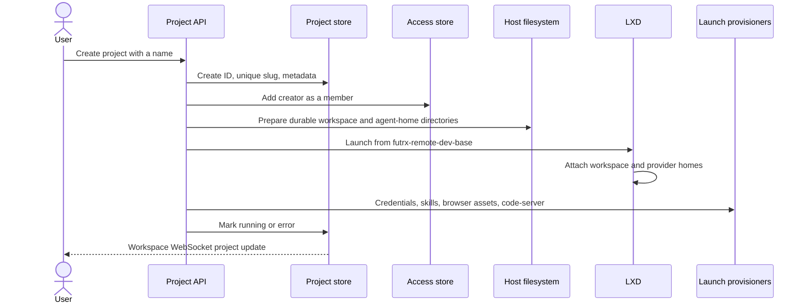
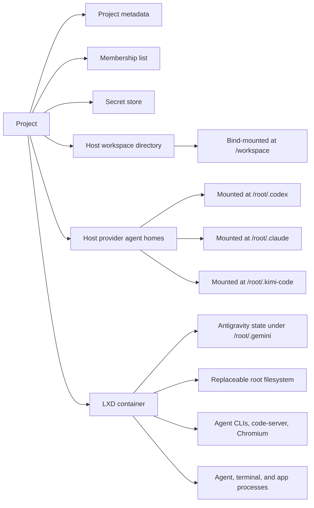
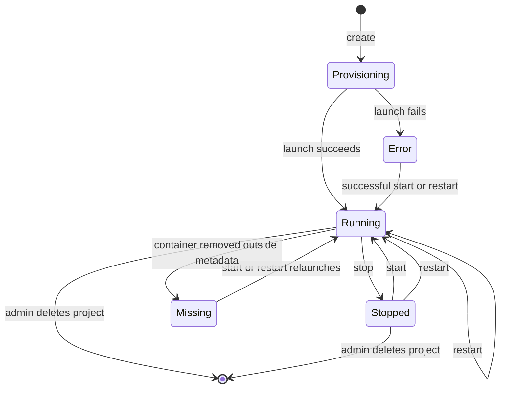
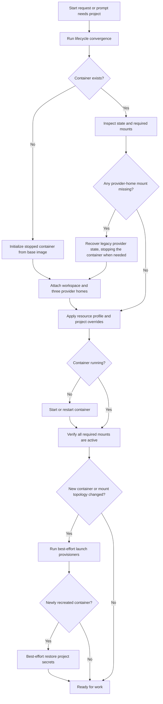
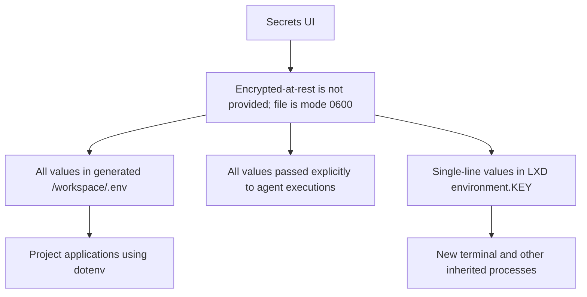

# Projects and containers

A project is a durable workspace, three mounted provider agent homes, and an
LXD container that supplies processes and tools for four agent providers. The
durable directories survive container rebuilds; the container can be replaced.

## Project creation

The slug becomes the container name and is used in IDE and preview hostnames. Duplicate names receive a unique slug.

## Durable and replaceable parts

Files in `/workspace` and the three provider homes survive stop, restart, container deletion during upgrades, and image replacement. Provider homes preserve most provider-owned configuration, authentication, and session state. Claude also uses `/root/.claude.json` outside its mounted home and relies on host credential synchronization to restore it. Ad-hoc packages or files elsewhere in the container root filesystem do not survive container replacement.

Antigravity is one of those root-filesystem exceptions. Its per-project sign-in
and conversation brain live under `/root/.gemini`, so they survive normal
stop/start of the same container but not container replacement.

## Lifecycle

At backend startup, reconciliation compares stored status with actual LXD state and reapplies the default and per-project resource envelope.

## Container launch contents

The reusable Ubuntu 24.04 base image contains:

- Node.js 22, Git, SSH client, `jq`, build tools, Python, and GitHub CLI.
- Claude Code, Codex, Kimi Code, and Antigravity at pinned versions.
- The Agent Browser stack and Chromium.
- `code-server` with on-demand startup.

Launch-time provisioning then:

1. Seeds or synchronizes registered agent credentials into project credential locations, primarily the durable provider homes.
2. Links agent skill directories into the workspace.
3. publishes current browser scripts and browser skill.
4. applies browser process limits.
5. configures the project IDE.

When a prompt selects **Scheduled Tasks**, Remote also publishes the
provider-neutral `remote-schedule` CLI and skill under `/workspace` before
starting the provider.

These launch steps are best-effort so one optional capability does not prevent the container from starting.

## Start and restart behavior

Restart is host-driven and can recover a container whose internal processes are wedged. If the container is missing, restart delegates to the full launch path. A legacy container missing provider-home mounts may be started briefly to copy old provider state out, then stopped and reattached to the converged layout.

## Secrets

Project secrets are validated environment keys with an authoritative host-side store. They are also mirrored into the managed workspace `.env` file for project tools.

Adding or updating a secret commits the authoritative store, then attempts to write the managed `.env` file and update the container configuration. Multiline values are deliberately omitted from LXD environment configuration but are still passed to agent executions and written to `.env`. Deleting a secret removes the authoritative entry and attempts to remove each managed copy. Those propagation steps are best-effort and log rather than roll back on failure, so a stale copy can remain. Already-running processes retain their old environment until restarted.

## Sharing

- Project creators are added to the membership list automatically.
- Any current member can list members and add a registered user.
- Any current member can remove a user, but a non-admin cannot remove the final member.
- Administrators bypass membership checks and can always recover access.

## Resources and inspection

The project workspace page provides:

| Control or data | Details |
| --- | --- |
| Lifecycle | Start, stop, restart, and admin-only delete |
| Resources | CPU, memory, and root-disk overrides with live usage bars; admin-only changes, bounded by the fleet ceiling ([Resource limits](11-resource-limits.md)) |
| Runtime resources | Processes, CPU time, current/peak memory, swap, and disk usage |
| Container identity | Image, type, architecture, PID, creation, and last use |
| Network | Interfaces, addresses, traffic, MAC, and MTU |
| Operating system | Distribution, kernel, uptime, CPU count, and hostname |
| Agent state | Installed versions, instructions, and credential-bundle freshness |
| Recovery | Manual network repair and automatic IPv4 repair timer |

Fleet defaults come from the operator-editable policy in `DATA_DIR/resources.json` and are reapplied best-effort: an application failure is currently ignored. Explicit project overrides fail the launch when they cannot be applied. The disk quota limits the container root disk only, and only on a storage pool that can enforce quotas; the host bind mounts for `/workspace` and provider homes have no project quota. Before a container is created or started, an aggregate guard refuses a start that would commit more memory than the host has outside its reserve. See [Resource limits](11-resource-limits.md).

## Port discovery

The backend runs `ss` inside a running container and returns non-loopback TCP listeners on allowed ports from 1024 through 65535. The browser drawer turns a selected listener into a `slug--port.dev` URL.

## Deletion

The current backend deletion path removes the LXD container, project metadata, the host project root containing both workspace and agent homes, project secrets, and project access list. Chat records are stored separately; the project service does not currently cascade-delete chats that reference the deleted project.

## Code map

- Project policy: [`backend/internal/service/project/service.go`](../../backend/internal/service/project/service.go)
- Container lifecycle: [`backend/internal/service/container/lifecycle/service.go`](../../backend/internal/service/container/lifecycle/service.go)
- Project handler: [`backend/internal/transport/http/handlers/project_handler.go`](../../backend/internal/transport/http/handlers/project_handler.go)
- Project UI: [`frontend/src/ui/projects/ProjectContainersPage.tsx`](../../frontend/src/ui/projects/ProjectContainersPage.tsx)
