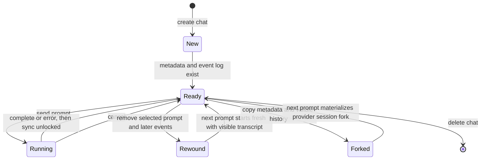
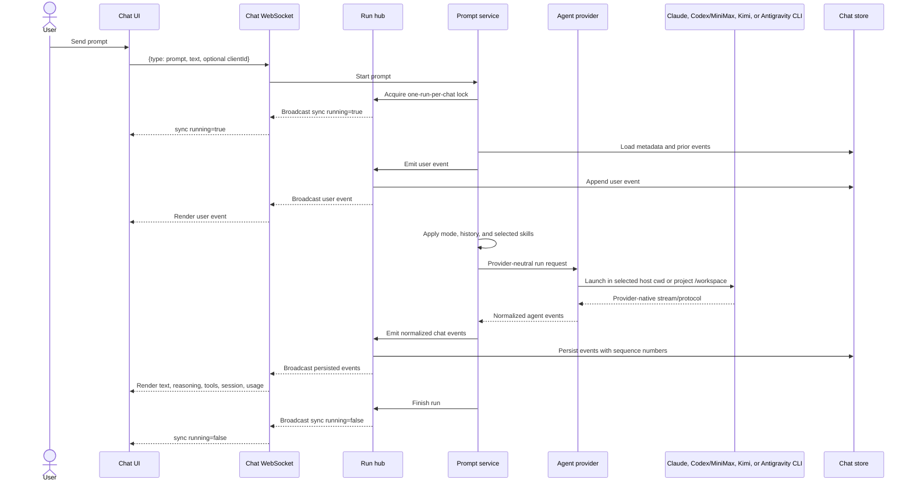
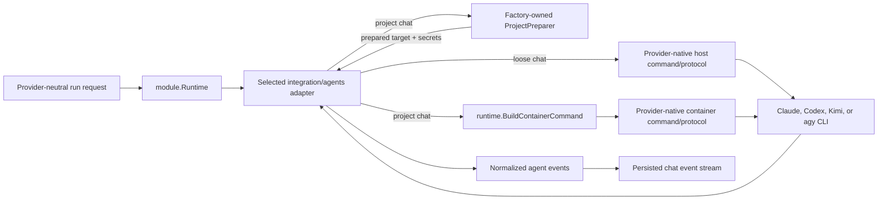
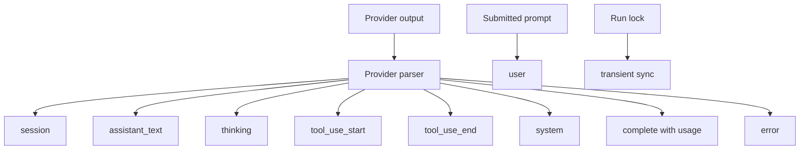
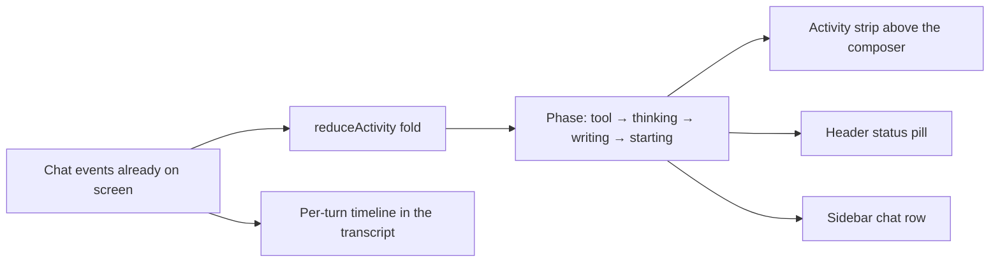

# Chat and agents

A chat stores conversation metadata and an ordered event log. A prompt run selects one provider, starts or resumes its CLI, normalizes the provider output, persists events, and broadcasts them to connected clients.

## Chat lifecycle

Chats may belong to a project or be loose. Project chats inherit the project workspace directory and access rules. A loose chat is visible to every registered user and cannot use the project terminal, preview, or project-specific features. Its approval-free provider CLI currently runs directly as the backend's host service user—root in the production unit—with the host environment and filesystem rather than a project container. Loose chats are therefore outside the project-isolation contract.

## Prompt execution

Only one prompt may run in a chat while the current backend process owns its in-memory lock. A second send is queued in the browser until the run unlocks, or rejected by the server if another client races it. Provider children may survive a backend restart while that lock and cancellation state do not, so the control plane does not yet reattach to an orphaned run.

## Provider abstraction

The run request contains the prompt, working directory, model, mode, prior
provider session ID, fork flag, project ID, reasoning effort, service tier,
browser and scheduled-tool enablement, and short-lived backend runtime
environment.

The compiled-in integrations are composed through validated provider-owned
factories. Each `backend/internal/integration/agents/<id>/factory.go` attaches
the provider's provisioning `Profile()` separately from its public descriptor
and declares the provider-neutral extension contract: stable ID and label,
default-provider flag, host/project execution scopes, authentication
mode/instructions and access-gate policy, resume/fork support, skill strategy,
browser and scheduled-tool support, legacy skill roots, and the few
project-preparation differences it needs.

`Catalog.Build` receives application-facing `BuildDependencies` containing the
project resolver, full container ports, and global credential-sync timeout.
For every project-scoped module, `module.Factory` constructs the shared
`ProjectPreparer` from the exact validated profile and its
`ProjectPreparationPolicy`. It then invokes the provider build callback with
only that preparer, the optional post-run `CredentialCollector`, the sync
timeout, and an independent validated profile clone. Those callback
dependencies do not expose project-service models or the full container port
set. Current adapters use the shared preparer; direct project-service imports
or copied CLI/workspace/browser/lifecycle orchestration would violate the
integration contract. The callback creates the runtime provider and optional
auth binding; mutable runtime and auth state is fresh for every catalog build.

`AuthNone` modules omit the binding; all other modes require one. Startup
validation rejects inconsistent IDs, auth bindings, multiple defaults, project
modules without profiles, invalid preparation policy, fork without resume,
external-auth gate providers, and duplicate or overlapping persistent mounts.
Registration order is explicit in `internal/config/agents.go` and is preserved
in provisioning, runtime, authentication, and capability views.
`Catalog.Build` exposes those live views through one `module.Runtime`; adding
an integration does not depend on package `init` hooks. Every registered
function satisfies `module.FactoryBuilder` at compile time.
Authenticated service startup also requires at least one managed or no-auth
module marked as an access-gate provider, so onboarding cannot deadlock behind
a catalog that has no observable way to become ready.
For a project-capable agent, the profile is the concrete container contract:
CLI binary, strict semver pin, version-command arguments, install/repair
policy, credential synchronization, persistent directories,
shared instruction destination, workspace-skill compatibility links, and any
non-secret runtime assets or browser MCP templates. The built-ins define their module and provisioning
policy in protected provider-local `factory*.go`, `profile*.go`, `install*.go`,
`provisioning*.go`, and `assets/` paths under `internal/integration/agents`.
Changes there require a minor/major full-infrastructure release.

Execution scope is enforced at the service boundary. `host` permits loose-chat
execution and host capability discovery; `project` permits project chats,
project skills, and container provisioning. Project-capable modules must have
a profile. A host-only module may include a profile when it runs a local CLI,
or omit one when it calls a remote integration. Codex is the current explicit
built-in default; if no default is declared, the catalog chooses the first
compatible module in stable registration order.

Each provider has its own command builder and parser. Claude, Codex, MiniMax,
and Kimi produce structured streams; MiniMax shares Codex's app-server
transport while retaining its own provider identity and isolated home.
Antigravity print mode emits plain text, and its
adapter recovers the conversation ID from the CLI brain directory. The shared
layer sees whichever normalized session, text, reasoning, tool, completion,
usage, and error events that provider can supply.

## Modes

Remote does not define workflow prompts. The mode selector contains the
provider-native modes reported by the selected provider adapter. Codex, Kimi,
and Antigravity derive availability from CLI output; Claude and MiniMax declare
their known native Default and Plan modes:

| Mode | Behavior |
| --- | --- |
| Default | Use the provider's normal agent behavior |
| Plan | Use the provider's native planning mode; shown when the adapter reports it |

The selector is hidden when Default is the provider's only available mode.
Codex and MiniMax modes are sent through app-server collaboration modes. Claude and
Antigravity receive their native Plan CLI flag. Kimi currently advertises Plan
from CLI help, but the currently pinned Kimi CLI rejects `--plan` together with
the prompt mode Remote requires; Kimi runs must use Default until that
integration is changed.

Model, reasoning, and speed controls are stored per chat. The user's last
selection also becomes the default for new chats. Codex forwards service tiers
through app-server; Claude Fast mode is applied per run through CLI settings
for Auto and Opus selections.

## Capability discovery

`GET /api/agent-capabilities` returns one provider-neutral catalog built from
the registered backend agents. With `projectId=<id>`, the request is authorized
against that project and probes the CLIs inside its current container through
`lxc exec`; without `projectId`, it probes the host CLIs for a loose chat.
Adding `refresh=1` requests fresh discovery for that scope. Discovery does not
start a stopped or missing project container; start the project before probing
it or the provider adapters will return degraded results.

On a cache miss, the backend probes all registered providers compatible with
the selected host/project execution scope concurrently and
preserves registry order in the response. One global
`AGENT_CAPABILITY_TIMEOUT` bounds each provider's complete discovery operation
(30 seconds by default; `0` disables the deadline). Each adapter normalizes
the CLI-specific output into models, per-model reasoning
efforts, service tiers, and provider-native modes. A failed probe can return a
conservative fallback. A partial probe preserves usable live data when possible
and attaches a concise `warning`; provider failures do not make the whole
catalog request fail.

Each provider owns its catalog adapter because the CLIs expose different
surfaces and a provider may instead declare a stable catalog. The table
describes each primary source; failures can produce a smaller fallback catalog
or partially resolved labels and controls.

| Provider | Discovery source |
| --- | --- |
| Codex | Every page of app-server `model/list` plus `collaborationMode/list`, with `codex debug models` as a structured fallback |
| MiniMax | Remote's provider-owned `MiniMax-M3` catalog, consumed by the Codex app-server harness at launch |
| Claude | The `/model` selection list, with each alias resolved through the CLI to a versioned label; `/effort` is queried in parallel, with `--help` as its fallback; native Default/Plan and eligible Auto/Opus Fast controls are declared by the adapter |
| Kimi | Configured aliases, display/provider models, and effort metadata from `kimi provider list --json`; the plain listing supplies the active default and CLI help supplies the Plan-mode hint |
| Antigravity | Display names from `agy models`; effort and mode choices from `agy --help` |

The normalized model record owns its reasoning-effort and service-tier lists,
so the frontend can update dependent selectors when a model changes without a
compiled model catalog. Mode discovery is reduced to Default plus a native
Plan mode when the provider adapter reports one; Remote does not add mode
prompts.
Provider-required aliases remain model IDs, while the user-facing labels carry
the resolved version and variant. This is particularly important for dynamic
Claude aliases and Antigravity's parenthesized thinking variants.

Each provider result also carries descriptor metadata: the module default flag,
execution scopes,
authentication mode and optional instructions, session resume/fork support,
skill strategy, browser-tool support, and scheduled-tool support. An adapter
can provide a structured `unavailableReason` for a provider that is installed
but cannot currently run; this is separate from partial-discovery warnings.
The catalog uses the registered provider's ID and the descriptor's label as
authoritative rather than trusting CLI output for identity.

Discovery and launch support are not identical for every provider. Kimi's
per-model effort metadata is returned to the frontend, but the current Kimi run
adapter does not forward a selected Thinking value. It relies on the chosen
Kimi model/configuration default. Its advertised Plan choice is also
incompatible with Remote's required prompt mode in the currently pinned Kimi
CLI, as noted above.

### Capability cache and refresh

The authoritative cache lives only in the backend process and is keyed by the
execution environment:

- `host` for loose-chat discovery;
- `project:<project-id>:<container-name>` for project discovery.

A catalog in which every provider is live and warning-free is cached for 24
hours. If any provider uses fallback data or carries a warning, the entire
scope is cached for 2 hours so Remote retries sooner. Expired entries are
removed lazily on the next request. Concurrent discovery requests for one
scope share the same in-flight work, and stored/returned results are cloned so
callers cannot mutate the shared entry.

There is no persistent cache and no separate cache-delete endpoint. A backend
restart or deployment clears every entry. `refresh=1` bypasses a completed
entry; if discovery for the same scope is already running, the request joins
that flight, whose result replaces the entry.
Changing a CLI version, CLI configuration, or account entitlement does not by
itself notify the backend cache.

The frontend separately retains the last response in page memory, keyed by
normalized user plus host/project scope. It always consults the backend when a
scope mounts, keeps the previous response visible during a request, and
coalesces duplicate requests in that page. This browser state does not set the
catalog TTL and disappears on reload.

The composer **Refresh models** action uses `refresh=1`. A managed provider's
authenticated flag changing, or a login reaching completed with a new start
revision, requests a refresh for the scopes currently open in that browser;
intermediate login-status changes do not. Using the sidebar's project **Start**
action requests one for that project. The Project workspaces Start/Restart
actions do not invalidate this cache. The project probe still sees the
credentials and configuration currently present inside the container;
credential propagation performed later during a run has no follow-up
invalidation. A login performed manually in a project terminal, including
Antigravity login, is not observable by the frontend; use **Refresh models**
afterward.

For loose chats, the Antigravity adapter probes host `agy` state. Remote has no
host Antigravity sign-in UI, and a loose chat has no project Terminal, so the
supported interactive sign-in flow is a project chat. An operator can prepare
host `agy` outside Remote, but that is host-level execution outside the
project-local authentication and isolation workflow.

## Event model

Persisted events receive a monotonic `seq`. On reconnect, the UI sends its last sequence so the server can replay only missed events. A transient `sync` event communicates the current run lock without entering history.

The UI groups text, reasoning, and tool events into readable assistant messages. Consecutive reasoning deltas become one live-updating disclosure that is collapsed by default and remains expandable while the run streams. Known read, write, edit, search, shell, and question tools receive specialized renderers; unknown tools use a generic view.

The thread also provides Markdown and syntax-highlighted code, per-turn tool timelines, expandable reasoning blocks, token-usage totals, older-history loading, jump-to-latest behavior, and an error block. An `AskUserQuestion` tool call becomes a paged answer form whose submitted answer is sent as the next prompt.

Antigravity currently contributes streamed assistant text and session/error
state, not structured reasoning, tools, or usage.

## Live agent activity

A turn can take minutes. Rather than a silent spinner, the browser narrates
what the run is doing, using only the events above — no extra backend calls, no
polling, and no new persisted data.

### Activity strip

While a run is in flight a one-line strip sits between the transcript and the
composer. It resolves what to say in this priority order:

| Priority | Shown when | Example |
| --- | --- | --- |
| 1 | A tool call is open | `📄 Reading wp-config.php`, `⚡ Running wp plugin update --all`, `✏️ Editing functions.php +12 −3` |
| 2 | Reasoning deltas are arriving | `💭 Thinking…` |
| 3 | Assistant text deltas are arriving | `✍️ Writing the answer…` |
| 4 | The prompt was sent and nothing has come back | `⏳ Starting…` |

The strip also carries a spinner, the run's elapsed time as `mm:ss`, a **Stop**
button wired to the same cancel path as the composer, and a `· 12.4k tokens`
counter once the provider has reported a token count for the run.

Tool names are mapped to labels by a flat table in
[`frontend/src/state/chat/agentActivity.ts`](../../frontend/src/state/chat/agentActivity.ts).
It is provider-neutral — Claude's `Bash` and Codex's `command_execution` both
read as **Running** — and an unmapped tool falls back to its own raw name
rather than to a vague "working". MCP tools (`mcp__server__tool`) are split
into `server · tool` with the raw identifier kept in the tooltip. Every path,
command, or URL the strip echoes is rendered `dir="auto"`, and the whole line
truncates rather than wrapping on a phone.

### Show thinking

When a provider streams reasoning, the strip offers a **Show thinking**
toggle. Turned on, the strip gains an expandable area (collapsed by default)
that streams the current run's reasoning live, capped at about ten lines and
auto-scrolled to the newest words. The choice is remembered per browser in
`localStorage` (`remote.futrx.showThinking.v1`), not in account settings: it
describes the screen you are watching, not who you are. Providers that never
send reasoning — Antigravity today — never show the toggle.

### Idle hint

If ninety seconds pass with no event of any kind while a run is active, the
strip adds `…still working (no output for 1m30s)`. Any event resets the clock,
so this distinguishes a hung run from a long one.

### Per-turn timeline

A turn's grouped tool calls render as a timeline rather than an opaque
`N tools used` collapsible. Collapsed it reads `3 steps · 6.4s` plus the failed
or final step; expanded, each step is one log row — icon, label, target,
duration, and a short result or error line. A row opens into the existing
specialized renderer (diff view, command output) on demand. Durations come
from the `tool_use_start` and `tool_use_end` timestamps already in the event
log; a transcript written before this existed simply shows no duration.

### Header and sidebar

The header's `ChatStatusPill` shows the same phase and elapsed time
(`Claude · thinking 1:07`) instead of a generic "Working". The sidebar row for
the open chat shows a pulsing dot and the abbreviated phase in place of its
relative timestamp. Only the open chat holds a socket, so every other running
chat keeps the unqualified running indicator.

**Known gap:** the backend declares `run.started` and `usage.updated` event
types but no provider adapter emits them, and neither is forwarded to the chat
event stream. Token counts therefore arrive only with `complete`, so the
strip's token counter appears at the very end of a run rather than climbing
during it.

## Skills

The catalog reads the canonical host or project skill roots and any
provider-declared legacy roots after checking execution scope and project
access. Provider changes clear incompatible selected skills. The module's
declared skill strategy determines prompt preparation: Claude receives
slash-style skill triggers, Codex and MiniMax receive dollar mentions, and Kimi and
Antigravity receive explicit paths to the selected `SKILL.md` files. The
**Scheduled Tasks** skill also receives a scoped schedule capability. Browser
MCP preparation is a separate feature flag and is currently declared only by
Claude, Codex, and MiniMax.

### Skill scopes

| Scope | Source | Where it lives | Editable from |
| --- | --- | --- | --- |
| Host | `user`, `system` | `~/.agents/skills`, `~/.claude/skills`, `~/.codex/skills` on the host | The host filesystem |
| Project | `project` | `<workspace>/.agents/skills` (legacy `.claude` / `.codex` roots are read-only fallbacks) | The project's file manager, IDE, or agent |
| Built-in | `remote` | Published into the workspace by the platform (`browser`, `scheduled-tasks`) | Not editable |
| Global | `global` | `DATA_DIR/skills-global` on the host, published into each container | Settings → Global skills (admin only) |

Project chats receive global skills merged into the same listing, flagged
`scope: "global"` and `readOnly: true`. A project skill of the same name wins:
the container never links the global copy into an occupied slot, and the global
entry is returned `shadowed` so the picker can show it disabled. An admin can
mark a global skill **always on**, which preselects it in every new project
chat. Loose chats have no container and therefore no global skills. See
[Global skills](09-global-skills.md).

## Conversation controls

| Control | Behavior |
| --- | --- |
| Rename | The API can patch the chat title; the current UI has no manual rename control |
| Read/unread | Updates `lastReadAt` for sidebar indicators |
| Cancel | Cancels the active provider context and releases the run lock |
| Queue | Per-tab `sessionStorage` queue sends prompts one at a time after each run unlocks and removes one only after server acceptance |
| Fork | Copies visible history and provider session IDs; next run forks without mutating the parent |
| Rewind | Deletes the selected event and everything after it; unavailable while running |
| Delete | Cancels an active run, then removes chat metadata and history |
| Load older | Pages backward in complete prompt turns projected from the JSONL event log |
| Autopilot / Auto-test | Per-chat post-run policies: keep prompting until the agent reports `<<DONE>>`, and verify each change with Playwright. Both default off — see [Autopilot and auto-test](15-autopilot-and-auto-test.md) |
| Team mode | Per-chat multi-agent workflow: the chat you type in implements, a second connected provider reviews the diff in a companion chat, and a third runs the Playwright pass. Defaults off — see [Team mode](20-team-mode.md) |

Draft text and queued prompts are mirrored into per-tab `sessionStorage` by
chat ID. They survive switching chats, navigation, and reloads in the same tab,
but are not server-authoritative and do not cross tabs, browsers, devices, or
users. A background chat's queue waits until that chat is active again.

Live replay remains event-based and sequence-addressed. Historical reads use a
separate turn projection: new runs carry a durable `turnId`, legacy histories
fall back to `user` event boundaries, and adjacent assistant/reasoning deltas
are compacted before the page is sent. Provider delta size therefore does not
change how many conversation turns a history page contains.

## Scheduled turns

The host scheduler starts a due task through the same prompt service and run
hub used by an interactive WebSocket prompt. It persists the scheduled
envelope as a user event, resumes the chat's selected provider session, and
broadcasts ordinary chat events.

Interactive turns receive a short-lived `manage` capability only when the
**Scheduled Tasks** skill is selected. Scheduled turns receive a narrower
`complete-self` capability tied to one task and one run. Agent-created tasks
start paused and require a human **Arm** action. See
[Scheduled tasks](06-scheduled-tasks.md).

## Post-run policies

A chat can carry two policies that act after a turn settles: **autopilot**
sends one more "keep going" prompt while the agent has not declared the goal
complete, and **auto-test** asks for a Playwright verification pass. Both are
driven by a `RunObserver` on the prompt service
([`internal/service/postrun`](../../backend/internal/service/postrun)), both
respect the one-run-per-chat lock, and neither applies to a chat a scheduled
task drives. Their synthetic prompts are stored as ordinary `user` events
carrying a `synthetic` label, which is what the transcript badges. See
[Autopilot and auto-test](15-autopilot-and-auto-test.md).

## Rewind and fresh-session context

Rewind clears provider session IDs. On the next run, the backend converts remaining user and assistant text into a bounded visible transcript and prepends it to the current request. This keeps the visible conversation meaningful while avoiding a resume into the discarded provider session.

## Code map

- Chat service: [`backend/internal/service/chat/service.go`](../../backend/internal/service/chat/service.go)
- Prompt service: [`backend/internal/service/prompt/service.go`](../../backend/internal/service/prompt/service.go)
- Run hub: [`backend/internal/service/runhub/hub.go`](../../backend/internal/service/runhub/hub.go)
- Post-run driver: [`backend/internal/service/postrun/driver.go`](../../backend/internal/service/postrun/driver.go)
- Agent model: [`backend/internal/agent/model.go`](../../backend/internal/agent/model.go)
- Skill catalog: [`backend/internal/service/skills/catalog.go`](../../backend/internal/service/skills/catalog.go)
- Global skills library: [`backend/internal/service/skills/global.go`](../../backend/internal/service/skills/global.go)
- Agent module contract and runtime: [`backend/internal/service/agent/module/`](../../backend/internal/service/agent/module/)
- Agent authentication: [`backend/internal/service/agent/auth/`](../../backend/internal/service/agent/auth/)
- Agent composition root: [`backend/internal/config/agents.go`](../../backend/internal/config/agents.go)
- Provider-owned adapters and factories: [`backend/internal/integration/agents/`](../../backend/internal/integration/agents/)
- Project-run preparation: [`backend/internal/service/agent/execution/`](../../backend/internal/service/agent/execution/)
- Capability catalog: [`backend/internal/service/agent/capability/`](../../backend/internal/service/agent/capability/)
- Frontend chat hook: [`frontend/src/state/hooks/chat/useChat.ts`](../../frontend/src/state/hooks/chat/useChat.ts)
- Frontend event projector: [`frontend/src/state/chat/chatEventStateProjector.ts`](../../frontend/src/state/chat/chatEventStateProjector.ts)
- Live activity reducer and tool table: [`frontend/src/state/chat/agentActivity.ts`](../../frontend/src/state/chat/agentActivity.ts)
- Activity strip: [`frontend/src/ui/chat/messages/AgentActivityStrip.tsx`](../../frontend/src/ui/chat/messages/AgentActivityStrip.tsx)
- Per-turn timeline: [`frontend/src/ui/chat/messages/TurnTimeline.tsx`](../../frontend/src/ui/chat/messages/TurnTimeline.tsx)
