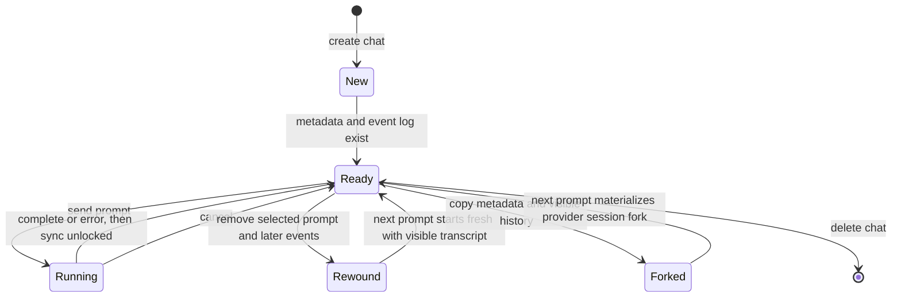
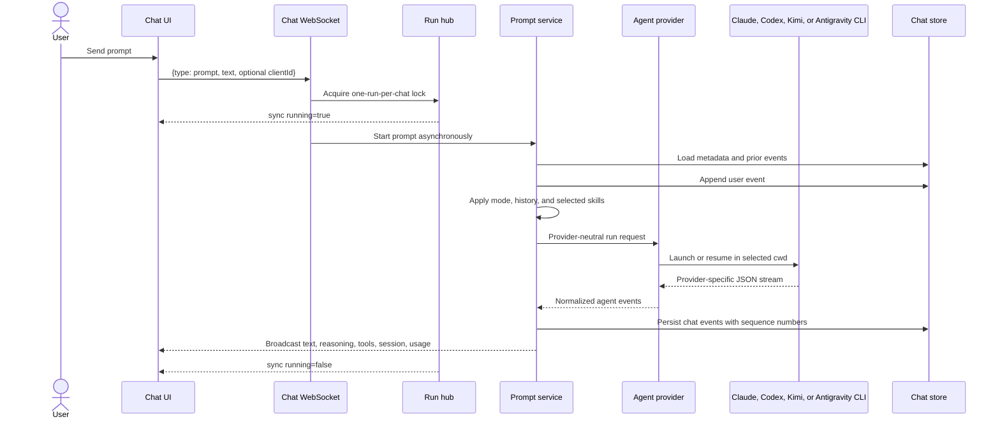
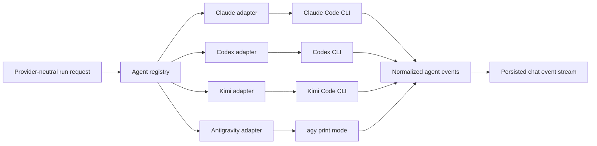
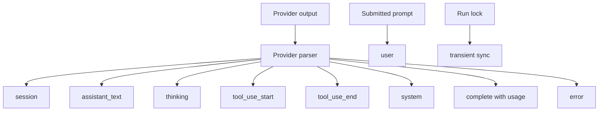
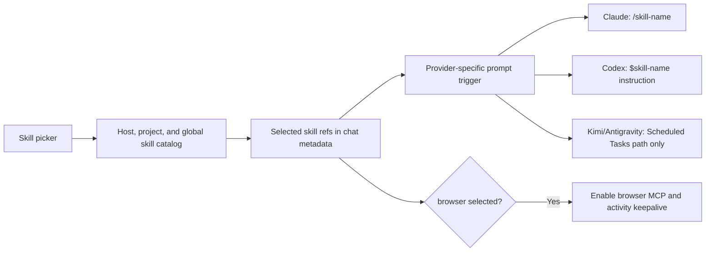

# Chat and agents

A chat stores conversation metadata and an ordered event log. A prompt run selects one provider, starts or resumes its CLI, normalizes the provider output, persists events, and broadcasts them to connected clients.

## Chat lifecycle

Chats may belong to a project or be loose. Project chats inherit the project workspace directory and access rules. A loose chat is visible to every registered user and cannot use the project terminal, preview, or project-specific features. Its approval-free provider CLI currently runs directly as the backend's host service user—root in the production unit—with the host environment and filesystem rather than a project container. Loose chats are therefore outside the project-isolation contract.

## Prompt execution

Only one prompt may run in a chat while the current backend process owns its in-memory lock. A second send is queued in the browser until the run unlocks, or rejected by the server if another client races it. Provider children may survive a backend restart while that lock and cancellation state do not, so the control plane does not yet reattach to an orphaned run.

## Provider abstraction

The run request contains the prompt, working directory, model, mode, prior provider session ID, fork flag, project ID, reasoning effort, service tier, and browser enablement.

Each provider has its own command builder and parser. Claude, Codex, and Kimi
produce structured streams; Antigravity print mode emits plain text, and its
adapter recovers the conversation ID from the CLI brain directory. The shared
layer sees whichever normalized session, text, reasoning, tool, completion,
usage, and error events that provider can supply.

## Modes

| Mode | Prompt policy |
| --- | --- |
| Chat | Answer directly; avoid file changes unless requested |
| Plan | Inspect and propose a concrete plan before editing |
| Code | Normal implementation behavior; no extra mode prefix |
| Review | Lead with bugs, regressions, missing tests, and risks |
| Debug | Reproduce or localize first, then make the smallest root-cause fix |
| Full Auto | Continue through implementation and verification unless blocked |

Model and reasoning controls are stored per chat. The user's last selection also becomes the default for new chats. Service tier is exposed for Codex-style speed/cost selection.

## Event model

Persisted events receive a monotonic `seq`. On reconnect, the UI sends its last sequence so the server can replay only missed events. A transient `sync` event communicates the current run lock without entering history.

The UI groups text, reasoning, and tool events into readable assistant messages. Known read, write, edit, search, shell, and question tools receive specialized renderers; unknown tools use a generic view.

The thread also provides Markdown and syntax-highlighted code, grouped tool calls, visible reasoning blocks, token-usage totals, a working indicator, older-history loading, jump-to-latest behavior, and an error block. An `AskUserQuestion` tool call becomes a paged answer form whose submitted answer is sent as the next prompt.

Antigravity currently contributes streamed assistant text and session/error
state, not structured reasoning, tools, or usage.

## Skills

The catalog reads agent skill roots and, for project chats, project workspace
skills after checking access. Provider changes clear incompatible selected
skills. Current general prompt injection and per-run browser MCP preparation
are implemented for Claude and Codex. Kimi and Antigravity selected-skill
references normally remain metadata only; **Scheduled Tasks** is the explicit
exception, injected as the canonical project skill path and accompanied by a
scoped schedule capability.

### Skill scopes

| Scope | Source | Where it lives | Editable from |
| --- | --- | --- | --- |
| Host | `user`, `system` | `~/.agents/skills`, `~/.claude/skills`, `~/.codex/skills` on the host | The host filesystem |
| Project | `project` | `<workspace>/.agents/skills` (legacy `.claude` / `.codex` roots are read-only fallbacks) | The project's file manager, IDE, or agent |
| Built-in | `remote` | Published into the workspace by the platform (`browser`, `scheduled-tasks`) | Not editable |
| Global | `global` | `DATA_DIR/skills-global` on the host, published into each container | Settings → Global skills (admin only) |

Project chats receive global skills merged into the same listing, flagged
`scope: "global"` and `readOnly: true`. A project skill of the same name wins:
the container never links the global copy into an occupied slot, and the global
entry is returned `shadowed` so the picker can show it disabled. An admin can
mark a global skill **always on**, which preselects it in every new project
chat. Loose chats have no container and therefore no global skills. See
[Global skills](09-global-skills.md).

## Conversation controls

| Control | Behavior |
| --- | --- |
| Rename | The API can patch the chat title; the current UI has no manual rename control |
| Read/unread | Updates `lastReadAt` for sidebar indicators |
| Cancel | Cancels the active provider context and releases the run lock |
| Queue | Per-tab `sessionStorage` queue sends prompts one at a time after each run unlocks and removes one only after server acceptance |
| Fork | Copies visible history and provider session IDs; next run forks without mutating the parent |
| Rewind | Deletes the selected event and everything after it; unavailable while running |
| Delete | Cancels an active run, then removes chat metadata and history |
| Load older | Pages backward through the JSONL event log |
| Autopilot / Auto-test | Per-chat post-run policies: keep prompting until the agent reports `<<DONE>>`, and verify each change with Playwright. Both default off — see [Autopilot and auto-test](15-autopilot-and-auto-test.md) |
| Team mode | Per-chat multi-agent workflow: the chat you type in implements, a second connected provider reviews the diff in a companion chat, and a third runs the Playwright pass. Defaults off — see [Team mode](20-team-mode.md) |

Draft text and queued prompts are mirrored into per-tab `sessionStorage` by
chat ID. They survive switching chats, navigation, and reloads in the same tab,
but are not server-authoritative and do not cross tabs, browsers, devices, or
users. A background chat's queue waits until that chat is active again.

## Scheduled turns

The host scheduler starts a due task through the same prompt service and run
hub used by an interactive WebSocket prompt. It persists the scheduled
envelope as a user event, resumes the chat's selected provider session, and
broadcasts ordinary chat events.

Interactive turns receive a short-lived `manage` capability only when the
**Scheduled Tasks** skill is selected. Scheduled turns receive a narrower
`complete-self` capability tied to one task and one run. Agent-created tasks
start paused and require a human **Arm** action. See
[Scheduled tasks](06-scheduled-tasks.md).

## Post-run policies

A chat can carry two policies that act after a turn settles: **autopilot**
sends one more "keep going" prompt while the agent has not declared the goal
complete, and **auto-test** asks for a Playwright verification pass. Both are
driven by a `RunObserver` on the prompt service
([`internal/service/postrun`](../../backend/internal/service/postrun)), both
respect the one-run-per-chat lock, and neither applies to a chat a scheduled
task drives. Their synthetic prompts are stored as ordinary `user` events
carrying a `synthetic` label, which is what the transcript badges. See
[Autopilot and auto-test](15-autopilot-and-auto-test.md).

## Rewind and fresh-session context

Rewind clears provider session IDs. On the next run, the backend converts remaining user and assistant text into a bounded visible transcript and prepends it to the current request. This keeps the visible conversation meaningful while avoiding a resume into the discarded provider session.

## Code map

- Chat service: [`backend/internal/service/chat/service.go`](../../backend/internal/service/chat/service.go)
- Prompt service: [`backend/internal/service/prompt/service.go`](../../backend/internal/service/prompt/service.go)
- Run hub: [`backend/internal/service/runhub/hub.go`](../../backend/internal/service/runhub/hub.go)
- Post-run driver: [`backend/internal/service/postrun/driver.go`](../../backend/internal/service/postrun/driver.go)
- Agent model: [`backend/internal/agent/model.go`](../../backend/internal/agent/model.go)
- Skill catalog: [`backend/internal/service/skills/catalog.go`](../../backend/internal/service/skills/catalog.go)
- Global skills library: [`backend/internal/service/skills/global.go`](../../backend/internal/service/skills/global.go)
- Frontend chat hook: [`frontend/src/state/hooks/chat/useChat.ts`](../../frontend/src/state/hooks/chat/useChat.ts)
