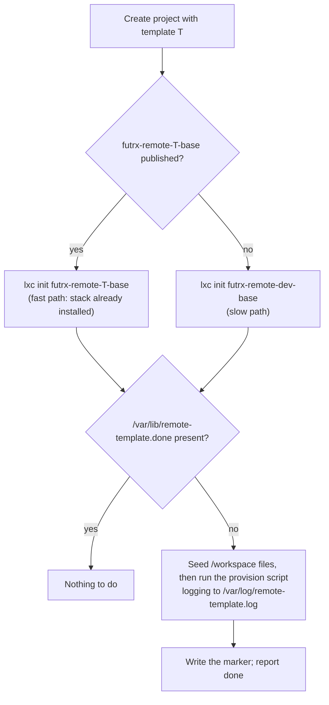
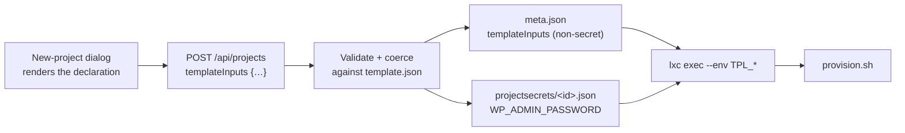

# Project templates

A **template** (stack preset) decides what is installed inside a project's
container. It is chosen once, in the new-project dialog, and cannot be changed
afterwards.

Templates are a **layer**, not a fleet of images. The target deployment is a
single small server, so building one complete image per stack would be
expensive in build time and disk. A template is therefore:

1. the shared base image `futrx-remote-dev-base`, plus
2. a post-provision script run once inside the new container, plus
3. optional seed files written into the durable `/workspace` mount, plus
4. an optional agent-instructions snippet seeded as `/workspace/AGENTS.md`.

A template may *additionally* declare a dedicated pre-built image alias. When
that image is published on the host, the container launches straight from it
and the provisioning is already baked in.



## What each template installs

| Template | Installs | Ports | Pre-built image |
| --- | --- | --- | --- |
| `blank` (default) | Nothing beyond the base image: Ubuntu 24.04, Node 22, Python 3, git, gh, jq, the agent CLIs, code-server, Chromium | — | not applicable |
| `wordpress` | PHP 8.3 CLI + `mysql`, `curl`, `gd`, `mbstring`, `xml`, `zip`, `intl`, `bcmath`, `soap`; MariaDB (enabled as a boot service, root over the unix socket, no password, database `wordpress`); Composer; WP-CLI at `/usr/local/bin/wp` plus a `wp-root` wrapper; WordPress core in `/workspace/public` with a generated `wp-config.php` **and the site already installed** (see [A WordPress that arrives installed](#a-wordpress-that-arrives-installed)); `remote-wordpress.service` serving `/workspace/public` on port 8080 with PHP's built-in server behind a permalink router | 8080 | `futrx-remote-wordpress-base` |
| `laravel` | PHP 8.3 CLI + `mysql`, `sqlite3`, `curl`, `mbstring`, `xml`, `zip`, `intl`, `bcmath`, `gd`; MariaDB (boot service, database `laravel`); Composer; a `laravel/laravel` skeleton in `/workspace/app` with `.env` pointed at the local database. Node 22 for Vite comes from the base image | 8000, 5173 | `futrx-remote-laravel-base` |
| `node` | `pnpm` and `yarn` enabled through corepack, plus a `/workspace/README.md`. Nothing is downloaded from apt | 3000, 5173 | none |
| `python` | `python3.12-venv`, `python3-dev`, `pipx`, `uv` at `/usr/local/bin/uv`, and a project virtualenv at `/workspace/.venv`, plus a `/workspace/README.md`. Poetry is deliberately not installed | 8000 | none |

The port column is informational. Previews are discovered by scanning the
container for listening sockets, so any port bound to `0.0.0.0` becomes a
preview URL regardless of what the template declares.

## Template inputs

A template may declare **inputs**: values the operator supplies in the
new-project dialog, which provisioning then receives as environment variables.
They exist because some stacks cannot be "installed" without a decision — a
WordPress with no site title, admin account or language is an installer wizard,
not a site.

Inputs are settable **only at creation**, like the template itself: the
provision script consumes them once, and re-running it against a site the
operator has since edited would be a reinstall, not an update.



### The declaration

```json
{
  "inputs": [
    {
      "key": "siteTitle",
      "label": "Site title",
      "type": "text",
      "required": true,
      "defaultFrom": "projectName",
      "help": "Shown in the browser tab and the admin bar."
    },
    {
      "key": "language",
      "label": "Site language",
      "type": "select",
      "default": "ar",
      "options": [
        { "value": "ar", "label": "العربية (RTL)" },
        { "value": "en_US", "label": "English (US)" }
      ]
    },
    {
      "key": "adminPassword",
      "label": "Admin password",
      "type": "password",
      "secret": true,
      "secretName": "WP_ADMIN_PASSWORD",
      "generate": true
    }
  ]
}
```

| Field | Meaning |
| --- | --- |
| `key` | camelCase identifier. **It also determines the environment variable** — see the mapping below. Must match `[a-z][A-Za-z0-9]{0,39}` |
| `label` | What the dialog shows, and what validation messages name |
| `type` | `text`, `email`, `password`, `select` or `checkbox` |
| `required` | Rejects an empty value — but only when nothing else can fill it (`default`, `defaultFrom` or `generate`) |
| `default` | Literal default. A `select` default must be one of its options; a `checkbox` default is `"true"` or `"false"` |
| `options` | `select` only: `{value,label}` pairs. `label` may be non-Latin; the dialog renders it as-is |
| `help` | One line under the field |
| `defaultFrom` | A default only the server knows: `projectName` or `userEmail` |
| `secret` | `password` only. The value is stored as a **project secret**, never in `meta.json` |
| `secretName` | The project-secret key a secret input is stored under, e.g. `WP_ADMIN_PASSWORD` |
| `generate` | Mints a strong random value when a secret input is left empty |

The declaration is validated when the catalog loads, so a malformed one fails
the build rather than a user's project creation.

### Environment variable mapping

The environment variable is **derived from the key**, never declared: a capital
starts a new word unless it follows another capital, and the whole thing is
uppercased and prefixed `TPL_`.

| Input key | Environment variable |
| --- | --- |
| `siteTitle` | `TPL_SITE_TITLE` |
| `adminEmail` | `TPL_ADMIN_EMAIL` |
| `adminUser` | `TPL_ADMIN_USER` |
| `adminPassword` | `TPL_ADMIN_PASSWORD` |
| `language` | `TPL_LANGUAGE` |
| `installWoocommerce` | `TPL_INSTALL_WOOCOMMERCE` |
| `demoContent` | `TPL_DEMO_CONTENT` |
| — (supplied by the runner) | `TPL_PREVIEW_URL` |

`TPL_PREVIEW_URL` is not an input. The runner derives it from the project slug
and the public hostname — `https://<slug>--<port>.dev.<host>`, where `<port>`
is the template's `adminAccess.port` or its first `defaultPorts` entry — so a
stack can install itself on the URL the operator will actually open. Without a
configured `BASE_URL` it falls back to `http://localhost:<port>`.

Every declared input is exported on every run, so a script may read
`"$TPL_LANGUAGE"` directly. A checkbox is always the string `true` or `false`.
A value missing from an older project's metadata falls back to the input's
declared default, so adding an input does not break existing projects.

Values reach the container as repeated `lxc exec --env KEY=VALUE` arguments.
They are argv elements, never shell text, so a value containing quotes, spaces
or `$(...)` is inert — but a **script** must still quote its own expansions.
Provisioning output is teed to `/var/log/remote-template.log` inside the
container, so a script must never echo a secret.

### Where the values are stored

| Value | Location |
| --- | --- |
| Non-secret inputs | `DATA_DIR/projects/<id>/meta.json` → `templateInputs` (omitted entirely when empty, so metadata for a template without inputs is byte-compatible with older releases) |
| Secret inputs | `DATA_DIR/projectsecrets/<id>.json` under the declared `secretName`. They therefore appear on the project's **Secrets** tab and are injected into the container's environment like any other project secret |

Non-secret inputs are persisted rather than kept for the create call because
provisioning is offered on **every** convergence: a replaced container has to
be re-provisioned with the same answers.

### Admin access

A template that installs something with a login declares where to find it:

```json
{
  "adminAccess": {
    "label": "WordPress admin",
    "port": 8080,
    "path": "/wp-admin",
    "userInput": "adminUser",
    "passwordSecret": "WP_ADMIN_PASSWORD"
  }
}
```

Once provisioning reports `done`, the project page's **Template** panel shows
the URL, the user name, a reveal toggle for the password, and a **Copy login**
button. The status payload carries the *name* of the secret, never its value;
the panel reads the value from the project's secrets, which is an audited read.

## A WordPress that arrives installed

The `wordpress` template collects seven inputs and finishes the install itself,
so the operator lands on a working site instead of `/wp-admin/install.php`.

| Input | Default | Effect |
| --- | --- | --- |
| `siteTitle` | the project name | `wp core install --title` |
| `adminEmail` | the creating user's email | `wp core install --admin_email`, `--skip-email` |
| `adminUser` | `admin` | `wp core install --admin_user` |
| `adminPassword` | generated | stored as the `WP_ADMIN_PASSWORD` project secret |
| `language` | `ar` — العربية (RTL) | `wp language core install --activate` + `WPLANG`; `ar` also sets the timezone to `Africa/Cairo`. RTL follows from the locale, with no extra setting |
| `installWoocommerce` | off | `wp plugin install woocommerce --activate` |
| `demoContent` | off | off replaces WordPress's sample post and page with a published "Staging notice" page and makes it the front page; on keeps the samples |

Regardless of the answers, the script also sets `/%postname%/` permalinks and
deletes Hello Dolly and Akismet.

Two deliberate non-decisions:

- **WooCommerce store settings are left alone.** Country, currency (no, not
  forced to `SAR`) and the shop pages are a business decision, and
  WooCommerce's own wizard asks for them on the first visit to the store admin.
- **The password is passed to `wp core install` on the command line.** It is
  never written to the template log, but it is briefly visible in the
  container's process table — which only the container's own root, i.e. the
  project's agent, can read.

Pretty permalinks need a front controller, and PHP's built-in server only
serves paths that exist on disk. The template installs
`/usr/local/share/remote-wordpress-router.php` (outside the document root, so
it is not itself reachable) and points `remote-wordpress.service` at it.

### Re-running against a durable workspace

`wp core install` writes into `/workspace`, which the rootfs marker cannot
speak for: a container launched from `futrx-remote-wordpress-base` carries the
marker while its durable workspace is mounted over whatever the image baked.
The template therefore declares

```json
{ "workspaceMarker": "/workspace/public/wp-config.php" }
```

and provisioning re-runs whenever that path is missing, even with the rootfs
marker present. The re-run is cheap: every step is guarded (`core is-installed`,
`plugin is-installed`, `command -v composer`), so it installs only what the
fresh workspace actually lacks. The image bake itself runs with no `TPL_*`
values at all and deliberately leaves the site uninstalled.

## Provisioning contract

Every template's provision script runs inside a shared harness
(`ProvisionProgram` in
[`backend/internal/service/container/templates/provisioning.go`](../../backend/internal/service/container/templates/provisioning.go)),
which supplies:

- `set -eu`, `DEBIAN_FRONTEND=noninteractive`, `NEEDRESTART_MODE=a`, and
  `APT_LISTCHANGES_FRONTEND=none`, so no install can prompt;
- an `apt_retry` helper that runs `apt-get`, then refreshes the index and
  retries **once** — the templates must use it instead of bare `apt-get`;
- the `TPL_*` environment described above, when the template declares inputs;
- output teed to `/var/log/remote-template.log` inside the container;
- the marker protocol below.

| Path (inside the container) | Meaning |
| --- | --- |
| `/var/log/remote-template.log` | Append-only log of every provisioning run |
| `/var/lib/remote-template.done` | Written only after the script completes. Its presence makes every later run a no-op |
| `/var/lib/remote-template.failed` | Written when a run starts, removed on success. Its presence after a backend restart is what distinguishes "failed" from "pending" |
| The optional `workspaceMarker` | A path under `/workspace`. When declared and absent, provisioning runs even though the rootfs marker says it already succeeded |

All three live in the **disposable** container root filesystem, on purpose.
`upgrade-workspaces` re-clones every container from the image, which discards
them — and that is exactly the intent: a replaced container must be
re-provisioned. The lifecycle offers provisioning on **every** convergence
([`lifecycle/service.go`](../../backend/internal/service/container/lifecycle/service.go)),
and the marker file is what makes that offer cheap: one `test -e` per project
start.

Seeding never overwrites. `/workspace` is durable and may already hold the
user's own version of a path, so a seed whose target exists is skipped.

## Provisioning status

Provisioning runs in the background — a WordPress stack on a 1 vCPU host takes
minutes — so project creation returns immediately and the status is polled.

| Status | Meaning |
| --- | --- |
| `none` | The template installs nothing (`blank`); the container was ready on first boot |
| `pending` | Provisioning is required and has not started, or the backend restarted before it could |
| `running` | The provision script is executing |
| `done` | The marker file is present |
| `failed` | The last attempt exited non-zero |

The status is part of the project status payload:

```bash
curl -s -b cookies.txt https://<host>/api/projects/<id>/container | jq .template
```

```json
{
  "name": "wordpress",
  "title": "WordPress",
  "status": "running",
  "logPath": "/var/log/remote-template.log",
  "startedAt": 1755400000000
}
```

Once the status is `done` and the template declares `adminAccess`, the payload
also carries where to sign in:

```json
{
  "admin": {
    "label": "WordPress admin",
    "url": "https://my-shop--8080.dev.remote.example.com/wp-admin",
    "user": "admin",
    "passwordSecret": "WP_ADMIN_PASSWORD"
  }
}
```

The project settings page shows the same thing as a badge next to the project
name and as a **Template** panel on the Info tab.

A failed run is retried on the next convergence, so **restarting the project**
retries provisioning. Read `/var/log/remote-template.log` inside the container
for the cause.

## Building a pre-built template image on a beefier server

The slow path costs every new project the full install. Publishing a dedicated
image moves that cost to build time, once per host:

```bash
cd /opt/remote.futrx/backend

# Which templates can be baked into an image
go run ./cmd/build-template-image -list

# Build. The builder starts from futrx-remote-dev-base, so the base image
# must already be published (infra/steps/05-base-image.sh does that).
go run ./cmd/build-template-image -template wordpress

# Replace an existing one
go run ./cmd/build-template-image -template wordpress -overwrite
```

Publishing compresses the whole root filesystem and regularly exceeds the
default 5-minute budget on a 1 vCPU box. Both budgets are overridable, by flag
or environment variable:

```bash
go run ./cmd/build-template-image -template wordpress \
  -build-timeout 60m -publish-timeout 30m

FUTRX_IMAGE_BUILD_TIMEOUT=60m FUTRX_IMAGE_PUBLISH_TIMEOUT=30m \
  go run ./cmd/build-template-image -template wordpress
```

The image is a plain LXD image, so it can be built on a bigger machine and
moved:

```bash
# On the build host
lxc image export futrx-remote-wordpress-base wordpress-base
scp wordpress-base.tar.gz root@server:/tmp/

# On the small server
lxc image import /tmp/wordpress-base.tar.gz --alias futrx-remote-wordpress-base
```

`GET /api/templates` reports `prebuiltImageAvailable` per template, and the
new-project dialog shows a **prebuilt image** tag on those cards, so you can
confirm the fast path is live without touching the host.

### Keeping template images current

`infra/upgrade-workspaces.sh` rebakes `futrx-remote-dev-base` and recycles
containers onto it. Projects whose template has a published image launch from
**that** image, not from the base, so the base rebake alone leaves them on the
old layer. The script detects published `futrx-remote-*-base` aliases and warns
about it; pass `--rebake-templates` to rebuild each of them on top of the fresh
base:

```bash
sudo bash /opt/remote.futrx/infra/upgrade-workspaces.sh --rebake-templates
```

The rest of the script's behaviour is unchanged: containers with an active
agent process are still skipped unless `--include-busy` is given, and
`/workspace` plus the provider homes still survive.

Deleting a template image is always safe. The next project on that template
falls back to base + provision script.

## Adding a custom template

Templates are data files embedded into the binary. Adding one is a code change,
not a runtime configuration:

1. Create `backend/internal/service/container/templates/<name>/` — the
   directory name **is** the template name and must match `[a-z][a-z0-9-]{0,31}`.
2. Write `template.json`:

   ```json
   {
     "name": "rails",
     "title": "Ruby on Rails",
     "description": "Shown on the picker card. One or two sentences.",
     "icon": "blank",
     "provisionScript": "provision.sh",
     "agentInstructions": "AGENTS.md",
     "seedFiles": [
       { "source": "README.md", "target": "/workspace/README.md", "mode": "644" }
     ],
     "defaultPorts": [3000],
     "prebuiltImage": true
   }
   ```

   Every field except `name`, `title`, `description`, and `icon` is optional.
   Unknown fields are rejected at load time. `seedFiles[].target` must be a
   clean absolute path under `/workspace/`. `prebuiltImage: true` only means
   the runtime will *look* for `futrx-remote-<name>-base`; it does not create
   it.

   Add `inputs` (and optionally `adminAccess` and `workspaceMarker`) when the
   stack needs operator answers — see [Template inputs](#template-inputs).
   Nothing else has to change: `GET /api/templates` publishes the declaration
   and the dialog renders it, project creation validates against it, and the
   runner exports it as `TPL_*`.

3. Write `provision.sh` as a **payload**, not a standalone script: no shebang,
   no `set -e`, no `DEBIAN_FRONTEND`, no marker handling — the harness owns all
   of those. Use `apt_retry` for apt calls. A test enforces this, and a second
   one runs `bash -n` over every assembled program.

   Default every input at the top, because the harness runs under `set -u` and
   `build-template-image` runs the same payload with no inputs at all:

   ```sh
   TPL_SITE_TITLE="${TPL_SITE_TITLE:-}"
   TPL_LANGUAGE="${TPL_LANGUAGE:-en_US}"
   ```

   Then guard each step by the state it produces, so a re-run is a no-op, and
   never `echo` a secret — the whole run is teed into the container log.

4. Write `AGENTS.md` describing the stack for agents: what is installed, where,
   which commands to use, and the preview rules. It is seeded to
   `/workspace/AGENTS.md` and never overwrites an existing file.

5. Add the directory to the `//go:embed` line in
   [`catalog.go`](../../backend/internal/service/container/templates/catalog.go)
   and give it a position in the `order` map (unlisted templates sort
   alphabetically after the listed ones).

6. Optionally map the `icon` key to a glyph in
   [`frontend/src/ui/projects/templateIcons.tsx`](../../frontend/src/ui/projects/templateIcons.tsx).
   An unmapped key falls back to a generic icon rather than failing.

7. Run `go test ./internal/service/container/templates/...`. Catalog
   validation, the harness contract, and the shipped-template properties are
   all covered there.

## Backward compatibility

Project metadata (`DATA_DIR/projects/<id>/meta.json`) gained a `template`
field. It is omitted when the project uses the default, so metadata for a
`blank` project is byte-compatible with what earlier releases wrote, and a
`meta.json` without the field reads as `blank`.

It later gained `templateInputs`, which is omitted the same way. A WordPress
project created before inputs existed keeps working: it has no stored answers,
so provisioning falls back to each input's declared default, finds
`/workspace/public/wp-config.php` already present, and does nothing. Such a
project is **not** retro-installed — it still shows the installer, because no
admin password was ever chosen for it. Finish it by hand with `wp core install`
inside the container.

## Why the template is immutable

The template is applied to the container root filesystem *and* to `/workspace`:
packages, systemd units, a database, a downloaded application skeleton, and
seeded files. Switching a live project to another stack would mean uninstalling
all of that from a workspace the user has since edited, which cannot be done
safely. Create a new project instead; `/workspace` can be copied across with
the file manager or git.
