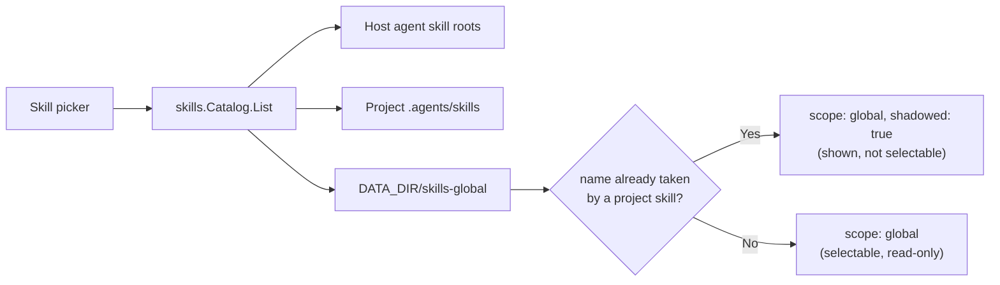
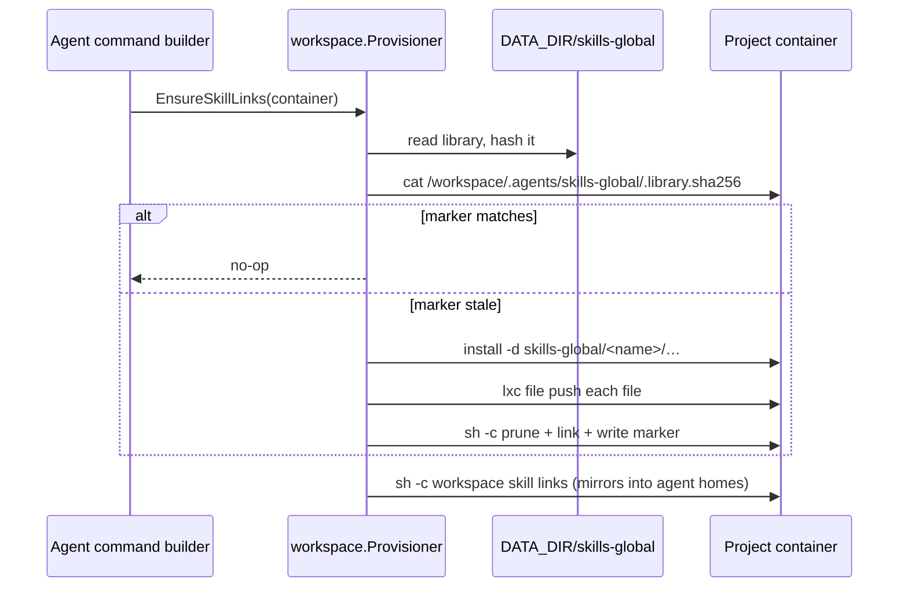

# Global skills

A **global skill** is a skill directory that an administrator publishes once
for the whole server. Every project sees it in the skill picker on top of the
skills that live in its own workspace, and the container linking machinery
mounts it next to the project's own `.agents/skills` tree.

The on-disk format is the same one the agent CLIs already read: a directory
holding `SKILL.md` with YAML frontmatter, plus any supporting files. A global
skill can therefore be copied into a project workspace, or imported out of one,
with no translation.

## Why this exists

Project skills are per-workspace, which means an operator who wants the same
review checklist in fifteen projects has to copy it fifteen times and re-copy
it on every edit. The global library moves that content to one host-owned
directory, and the same convergence step that already links a project's own
skills also pushes the library into each container.

## Storage

| Path | Contents |
| --- | --- |
| `DATA_DIR/skills-global/<name>/SKILL.md` | The skill manifest (required) |
| `DATA_DIR/skills-global/<name>/**` | Supporting files, any depth |
| `DATA_DIR/skills-global/_index.json` | Admin policy flags: `{"skills": {"<name>": {"alwaysOn": true, "updatedAt": 1750000000000}}}` |

Rules the store enforces:

- A directory name is 1–64 characters of `[a-z0-9._-]`, and may not start with
  `.` or `_`. A directory without a `SKILL.md` is not a skill and is invisible.
- File paths inside a skill are relative and slash-separated. Absolute paths,
  `..` segments, and hidden segments are rejected.
- Limits: 64 files, 256 KiB per file, 1 MiB per skill.
- Writes stage into a sibling temp directory and `rename` into place, so a
  failed write never leaves a half-written skill behind.

Names starting with `_` are reserved (that is what keeps `_index.json` from
ever colliding with a skill), and the index is the only piece of state that is
not portable SKILL.md content.

## Listing and shadowing

`GET /api/skills?projectId=…` returns global entries with
`source: "global"`, `scope: "global"`, and `readOnly: true`, plus `alwaysOn`
and `shadowed` flags. The picker badges them and disables the shadowed ones.

**Collision rule: the project-local skill wins.** If a project's workspace
already has `.agents/skills/<name>`, the container never links the global copy
into that slot, so the agent loads the project's version. The listing reports
that global entry as `shadowed` so the reason is visible rather than mysterious.

Shadowing is computed against skills the container actually holds — project
skills and the built-in `remote` ones (`browser`, `scheduled-tasks`). Host-level
user skills under `/root/.claude/skills` are not in a project container and
therefore never shadow a global skill.

Global skills are merged only for **project** chats. A loose chat runs on the
host and has no container to link them into, so its listing is unchanged.

## Container sync

Inside a container:

- `/workspace/.agents/skills-global/<name>/` holds the published copy.
- `/workspace/.agents/skills/<name>` is a **symlink** to
  `../skills-global/<name>`, created only when nothing already occupies that
  path. That single condition is the whole collision rule.
- `/workspace/.agents/skills-global/.library.sha256` is the convergence marker.

Because the canonical directory is walked by `EnsureSkillLinks` *after* the
global sync, the per-provider home mirroring (`/root/.claude/skills/<name>`)
picks up global entries in the same pass.

**Sync timing.** `EnsureSkillLinks` already runs at container launch and at the
start of every agent run, for all four providers. Adding the global sync there
means a running container picks up a library change on its **next chat turn**,
with no restart. The steady-state cost is one `lxc exec cat` of the marker; the
library hash covers skill names, file names, and file bytes, so a rename or a
delete invalidates it just like an edit does. Stale published directories and
stale links are pruned on the same pass, so deleting a global skill removes it
from every container the next time each one runs.

The host library directory is never bind-mounted; content crosses the boundary
with `lxc file push` like every other container asset.

## Policy: always on

An admin can mark a global skill **always on**. `chat.Service.Create` then
preselects it for every new **project** chat through the
`DefaultSkillResolver` port, so the user starts with it applied.

This is a *default*, not an enforced policy: the chat update endpoint still
accepts a selection that omits an always-on skill, and the flag does not
re-apply to chats that already exist. Enforcement at prompt time would require
the prompt service to know about the library and to override a user's explicit
choice mid-run; that trade was deliberately not taken. See
[Known gaps](#known-gaps).

## Admin API

All routes are admin-only and re-check `IsAdmin` per request.

| Method | Route | Body | Result |
| --- | --- | --- | --- |
| `GET` | `/api/admin/skills-global` | — | Library list with `name`, `title`, `description`, `alwaysOn`, `fileNames`, `updatedAt` |
| `POST` | `/api/admin/skills-global` | `{"name","files":{path:content},"alwaysOn"}` **or** a zip body | `201` with the created skill |
| `GET` | `/api/admin/skills-global/{name}` | — | The skill including `files` |
| `PUT` | `/api/admin/skills-global/{name}` | `{"files"?,"alwaysOn"?}` **or** a zip body | `200` with the updated skill |
| `DELETE` | `/api/admin/skills-global/{name}` | — | `{"ok":true}` |
| `POST` | `/api/admin/skills-global/import` | `{"projectId","skill","name"?,"alwaysOn"?}` | `201` with the imported skill |

Notes:

- The JSON files map is the primary shape — it matches how the rest of this
  API moves text. A `Content-Type: application/zip` body is also accepted for
  uploading a whole folder; a single wrapping directory is stripped and, when
  `?name=` is absent, becomes the skill name.
- A `PUT` that omits `files` changes only the flag and leaves content alone.
- `import` reads `<project workspace>/.agents/skills/<skill>` (falling back to
  the legacy `.claude` / `.codex` roots) and copies it into the library. The
  project keeps its own copy — which then shadows the new global one, as
  designed.
- `import` is a reserved name: no global skill may be called `import`, because
  the resource route would be ambiguous.

Error mapping: `400` for validation, `404` for a missing skill or project,
`409` for a duplicate name, `403` for a non-admin, `503` when the library is
not configured.

## Built-in seed content

Two skills are embedded in the binary and installed on first run **only while
the library is empty**:

| Skill | Covers |
| --- | --- |
| `code-review-guard` | Review checklist: correctness, Clean Code / SOLID / DRY / KISS, LLM-specific failure modes, and security basics (input validation, output escaping, prepared statements, secrets, authorization, crypto) |
| `wordpress-guard` | WordPress and WooCommerce safe coding: escaping and sanitization, nonces plus capability checks, `$wpdb->prepare`, core APIs before raw SQL or cURL, HPOS-safe order access via `wc_get_order`, and i18n |

Seeding is idempotent and never destructive: it runs only when the library
contains zero skills, so an operator's edits and deletions survive every
restart. Deleting *both* built-ins and restarting reinstalls them — the
"library is empty" condition is the whole rule.

## Frontend

- **Settings → Global skills** (admin) lists the library with a SKILL.md text
  editor, extra-file editors, an always-on toggle, delete, and an
  "import from project" form. Non-admins see an explanatory notice.
- The chat **skill picker** badges global entries (`global`,
  `global · always on`) and renders shadowed ones disabled with a tooltip
  naming the project skill that wins.
- `frontend/src/state/settings/globalSkillsState.ts` holds the pure
  transitions — frontmatter parsing, name validation and suggestion, draft
  round-tripping, sorted list merges, badge text — and is unit tested.

## Known gaps

- **Always on is a default, not an enforcement.** A user (or an API client)
  can deselect an always-on skill in a chat, and existing chats are not
  retro-fitted when the flag is turned on.
- **Loose chats do not see global skills.** They have no container, so nothing
  links the library into a place the CLI would read.
- **Sync is pull-on-next-run.** A library change reaches an idle container only
  when its next chat turn starts. There is no push to running containers.
- **No versioning or audit trail.** A `PUT` replaces content outright; the
  index records only `updatedAt`.

## Code map

- Store: [`backend/internal/stores/fileskillsglobal/store.go`](../../backend/internal/stores/fileskillsglobal/store.go)
- Service, merge, and policy: [`backend/internal/service/skills/global.go`](../../backend/internal/service/skills/global.go)
- Seed content: [`backend/internal/service/skills/seed.go`](../../backend/internal/service/skills/seed.go)
- Catalog merge: [`backend/internal/service/skills/catalog.go`](../../backend/internal/service/skills/catalog.go)
- Container sync: [`backend/internal/integration/containers/workspace/globalskills.go`](../../backend/internal/integration/containers/workspace/globalskills.go)
- Admin routes: [`backend/internal/transport/http/handlers/global_skill_handler.go`](../../backend/internal/transport/http/handlers/global_skill_handler.go)
- Admin UI: [`frontend/src/ui/settings/GlobalSkillsSettings.tsx`](../../frontend/src/ui/settings/GlobalSkillsSettings.tsx)
- Picker: [`frontend/src/ui/chat/composer/SkillPicker.tsx`](../../frontend/src/ui/chat/composer/SkillPicker.tsx)

See also [Chat and agents → Skills](04-chat-and-agents.md#skills).
