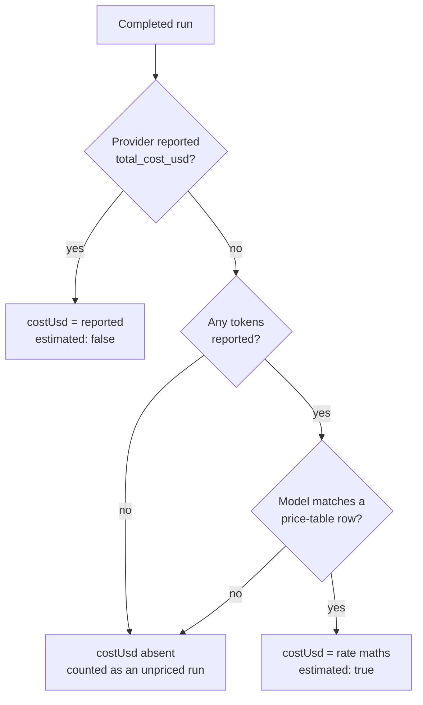

# Usage and cost

Every completed agent run is written to an append-only ledger under `DATA_DIR/usage`. The **Settings → Usage** page reads that ledger and answers the questions an operator of a shared box actually has: which project is spending, who ran it, on which provider and model, and how much it cost.

Two things this document is careful about, because getting them wrong makes the numbers worse than useless:

1. **Exact cost and estimated cost are never mixed silently.** Only Claude Code reports a price. Everything else is estimated from an editable table, and estimates are flagged.
2. **An unknown cost is not zero.** A run the platform cannot price is recorded with no cost at all and counted separately as an *unpriced run*.

## What each provider actually reports

The ledger can only record what a provider CLI prints. The five adapters differ substantially.

| Provider | Tokens | Cost | Duration / turns | Model |
| --- | --- | --- | --- | --- |
| **Claude Code** | Exact — `input_tokens`, `output_tokens`, `cache_read_input_tokens`, `cache_creation_input_tokens` on the `result` message | **Exact** — `total_cost_usd` on the same message | Exact — `duration_ms`, `num_turns` | From the stream (`system`/`result` `model` field) |
| **Codex** | Exact — `input_tokens`, `cached_input_tokens`, `output_tokens`, `reasoning_output_tokens` on `turn.completed` | **Estimated** from the price table | Not reported | From the chat's selected model |
| **MiniMax** | Exact — normalized from the Codex app-server token-usage stream | **Unknown by default**; estimated only after an administrator adds a matching `MiniMax-M3` price row | Not reported | `MiniMax-M3` |
| **Kimi Code** | **Not reported.** `kimi -p --output-format stream-json` emits assistant, tool, and a trailing resume-hint line, with no usage object | **Unknown** — recorded as an unpriced run | Not reported | From the chat's selected model |
| **Antigravity** | **Not reported.** `agy` print mode streams plain text | **Unknown** — recorded as an unpriced run | Not reported | From the chat's selected model |

Kimi and Antigravity runs therefore appear in the ledger with a provider, a model, and zero tokens. They still count toward **Runs**, and their share shows up in the "unpriced runs" note. MiniMax reports tokens, but its runs remain unpriced until a matching price row exists. The Kimi parser forwards a `usage` object opportunistically if a future CLI release starts emitting one, so no change beyond a CLI upgrade would be needed to start counting those tokens.

Normalization happens in the provider adapters ([`internal/agent/usage.go`](../../backend/internal/agent/usage.go)), so the `usage` blob persisted on each `complete` chat event already carries tokens, cost, duration, turns, and model in one shared vocabulary. The input, cache-read, and cache-write buckets are disjoint: the Codex app-server harness used by Codex and MiniMax reports cache tokens as subsets of `input_tokens`, so its parser subtracts those subsets before emitting the normalized event. Each normalized payload carries a schema version, allowing rebuilds to migrate older Codex events without adding provider conditions to the live ledger. That keeps aggregation and pricing provider-neutral and makes an offline rebuild possible.

## Data model

One record per completed run, appended as one JSON line:

```
DATA_DIR/usage/                        mode 0700
DATA_DIR/usage/usage-2026-08.jsonl     mode 0600, append-only
DATA_DIR/usage/prices.json             mode 0600, administrator-editable
```

Files rotate **monthly by the UTC month of the run**, so a query for a date range only opens the files that can contain it.

| Field | Meaning |
| --- | --- |
| `at` | Run completion time, Unix milliseconds |
| `projectId`, `projectSlug` | Empty for a loose (project-less) chat |
| `chatId`, `runId` | `runId` is random per live run; a rebuilt record uses `<chatId>-<seq>` |
| `userEmail` | The account that started the turn, or the owner of a scheduled task |
| `provider`, `model` | `claude`, `codex`, `minimax`, `kimi`, `antigravity`, and the model id when known |
| `inputTokens`, `outputTokens`, `cacheReadTokens`, `cacheWriteTokens` | Disjoint token buckets; `inputTokens` is uncached input. All are zero when the provider reports nothing |
| `costUsd` | **Absent** when the cost is unknown |
| `estimated` | `true` when `costUsd` came from the price table rather than the provider |
| `durationMs`, `turns` | Claude Code only |
| `scheduled` | `true` for an unattended scheduled turn |

Only **completed** runs are recorded. A failed turn's token counts are not persisted in the chat event log, so counting them live would make the ledger impossible to reproduce from disk — see [Known gaps](#known-gaps).

## Cost: exact, estimated, or unknown



The estimate is straightforward per-million-token arithmetic:

```
cost = (uncachedInput × inputPerMTok
      + output × outputPerMTok
      + cacheRead × cacheReadPerMTok
      + cacheWrite × cacheWritePerMTok) / 1_000_000
```

In the UI, an all-estimated total is prefixed with `~`, a partly estimated total is suffixed with `*`, and unpriced runs are called out under the cost tile.

## Editing the price table

`DATA_DIR/usage/prices.json` is seeded on first use with published list prices for the Claude, GPT-5, Kimi, and Gemini families. It does not currently include MiniMax. **Treat the seed as a starting point, not a billing source of truth** — vendor prices move, and your plan may differ.

```json
{
  "version": 1,
  "currency": "USD",
  "models": [
    {
      "match": "gpt-5-codex",
      "label": "GPT-5 Codex",
      "inputPerMTok": 1.25,
      "outputPerMTok": 10,
      "cacheReadPerMTok": 0.125
    }
  ]
}
```

- `match` is a **case-insensitive substring** of the model id. The **longest** matching row wins, so `claude-sonnet-4` beats a bare `sonnet`.
- Rates are US dollars per one million tokens. Omitted cache rates count as zero.
- A model with no matching row is left unpriced rather than being charged zero.

Two ways to change it:

- **API (admin only):** `GET /api/admin/usage/prices` and `PUT /api/admin/usage/prices` with the whole document. The service normalizes on write — match keys are lower-cased, duplicates dropped, rows sorted longest-first — and rejects a table that is empty or has a negative rate, so a bad edit cannot silently disable estimation.
- **On disk:** edit `prices.json` and restart the backend. The table is cached in memory after the first read.

Editing prices **does not retroactively change existing records.** Run a rebuild afterwards if you want history repriced.

## Reading the ledger

| Method | Route | Who |
| --- | --- | --- |
| GET | `/api/usage/summary?from=&to=&groupBy=project\|user\|provider\|model\|day\|chat&projectId=&chatId=` | Any signed-in user, filtered by membership |
| GET | `/api/usage/records?projectId=&chatId=&from=&to=&limit=&cursor=` | Any signed-in user, filtered by membership |
| GET | `/api/projects/{id}/usage?from=&to=` | Project members and admins |
| GET, PUT | `/api/admin/usage/prices` | Admin only |
| POST | `/api/admin/usage/rebuild` | Admin only |

`from` and `to` are Unix milliseconds and both are optional; an open window defaults to the last 30 days. `/api/usage/records` returns newest first; `nextCursor` is opaque and should be echoed back verbatim.

**Visibility rules:**

- An **administrator** sees every record.
- A **member** sees records for the projects they belong to, plus loose-chat runs attributed to their own account. Loose chats have no membership list, so nobody else's project-less spend is exposed.
- Asking for a `projectId` you cannot read returns `403`, rather than an empty result that would look like "no usage".

## The Usage page

**Settings → Usage** shows, for the selected window:

- A range picker: 7 days, 30 days, this month, or a custom pair of dates. All ranges are bounded in **UTC**, matching how the ledger buckets days.
- KPI tiles: total tokens, estimated cost, runs, active projects.
- A per-day bar chart (inline SVG, no chart library), switchable between tokens and cost.
- A table grouped by project, user, provider, model, or day. While grouped by project, selecting a row drills down to that project's individual runs.
- For administrators, a **Rebuild usage ledger** button.

The project page header additionally shows a one-line month-to-date summary for that project.

## Rebuilding

A rebuild re-derives the entire ledger from `DATA_DIR/chats/*/events.jsonl`. Use it to backfill an install that upgraded into this feature with existing chat history, or to reprice history after editing `prices.json`.

```bash
# Online, as an administrator
curl -s -b cookies.txt -X POST https://remote.example.com/api/admin/usage/rebuild

# Offline, with the service stopped — same `go run ./cmd/...` convention the
# installer uses for upgrade-workspaces and build-base-image
sudo systemctl stop remote.futrx
cd /opt/remote.futrx/backend && sudo DATA_DIR=/opt/remote.futrx/data go run ./cmd/usage-rebuild
sudo systemctl start remote.futrx

# See what a rebuild would produce, without writing
cd /opt/remote.futrx/backend && go run ./cmd/usage-rebuild -data-dir /opt/remote.futrx/data -dry-run
```

The CLI is built from [`backend/cmd/usage-rebuild`](../../backend/cmd/usage-rebuild/main.go) and reads `DATA_DIR` from the environment when `-data-dir` is omitted.

**A rebuild is idempotent.** Runs are keyed by `(chatId, event timestamp)` — the same pair a live record carries — so running it twice produces identical files. Attribution that only live recording knows (`userEmail`, `runId`, `scheduled`) is carried across from the current ledger wherever a key matches.

**What a rebuild cannot recover:** chat event logs do not store who typed a prompt. A run that was never recorded live comes back with an empty `userEmail`, so it appears under *Unattributed* when grouping by user, and a member cannot see it if it was a loose chat. Events written before completion events carried their provider can also be ambiguous if the chat later switched agents; a matching live ledger record preserves the original provider/model when one exists.

## Known gaps

- **Failed runs are not billed.** Their tokens are consumed but never written to the chat event log, so the ledger cannot see or reproduce them. Spend on failed turns is invisible here.
- **Kimi and Antigravity contribute no tokens or cost.** Their CLIs disclose nothing; only run counts are meaningful for them.
- **Cache-write pricing is approximate for non-Claude providers,** which generally do not separate cache creation from ordinary input tokens.
- **The ledger has no retention policy.** Monthly files grow without rotation limits, like the chat event logs described in [Known limitations](../known-limitations.md).
- **Rebuilt records lose user attribution** unless a live record already covered the same run, as described above.
