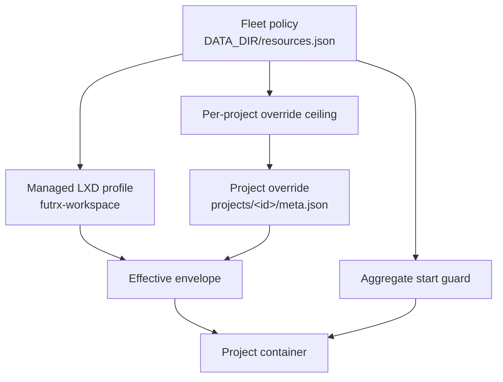

# Resource limits

Every project container runs on one shared host. This page describes the
policy that bounds them: the fleet defaults an admin edits at runtime, the
per-project overrides that sit inside those bounds, the disk quota and the
storage-pool limitation behind it, and the aggregate guard that refuses a
start the host cannot back.

## The three layers



1. **Fleet defaults** apply to every container that has no override of its own.
   They live in the managed LXD profile `futrx-workspace`, which the backend
   converges on startup, on every launch and start, and immediately after an
   admin change.
2. **Per-project overrides** replace individual fields of the default. An
   empty field inherits; a set field wins. Overrides are validated against the
   operator's ceiling and against real host capacity before they are applied.
3. **The aggregate guard** looks at the whole host rather than one container,
   and refuses a start that would commit more memory than the host has.

## Fleet defaults

The policy document is `DATA_DIR/resources.json`:

```json
{
  "defaults": {
    "memory": "3GiB",
    "cpu": 1,
    "processes": 2000,
    "disk": "10GiB"
  },
  "hostReserve": {
    "memory": "768MiB",
    "cpu": 0.5
  },
  "maxProjectOverride": {
    "memory": "3328MiB",
    "cpu": 1,
    "processes": 8000,
    "disk": "40GiB"
  },
  "maxRunningContainers": 0,
  "derived": true,
  "updatedAt": 1755400000
}
```

| Field | Meaning |
| --- | --- |
| `defaults.memory` | Hard memory ceiling per container (`limits.memory`). The container's own OOM killer fires inside the cgroup; the host never feels it |
| `defaults.cpu` | Core count per container (`limits.cpu`). A fractional policy value rounds up |
| `defaults.processes` | Fork-bomb guard (`limits.processes`); the kernel PID table is shared with the host |
| `defaults.disk` | Root-disk quota applied per container. Empty means no quota |
| `hostReserve.memory` | Memory held back from workspaces for the backend, LXD, Caddy, and sshd |
| `hostReserve.cpu` | Cores held back; used when deriving the CPU default |
| `maxProjectOverride.*` | The ceiling a per-project override may not pass |
| `maxRunningContainers` | Cap on simultaneously running containers. `0` means unlimited |
| `derived` | `true` while the document is still the first-run derivation |

Edit it from **Settings → Resources** (admin only) or through
`PUT /api/admin/resources`. Changes converge the managed profile immediately;
LXD applies profile memory and CPU limits to running containers live.

### Host-aware first run

When no `resources.json` exists, the backend derives one from the host's real
capacity, read through the same collector that serves `/api/server/info`:

| Default | Derivation |
| --- | --- |
| `memory` | Host memory minus the reserve, clamped into `[1GiB, 4GiB]`, floored onto a 512 MiB boundary. A host too small for that floor keeps whatever the reserve leaves, on a 256 MiB boundary, never below 256 MiB |
| `cpu` | Whole cores left after the reserve, never below 1 |
| `processes` | 2000 |
| `disk` | A quarter of the host filesystem, clamped into `[5GiB, 20GiB]`, floored onto a 1 GiB boundary |
| `maxProjectOverride` | Everything outside the reserve, every core, the whole filesystem — never below the corresponding default |

On a 1 vCPU / 4 GiB host that yields 3 GiB, 1 core, 10 GiB. On a 4 vCPU /
16 GiB host it yields 4 GiB, 3 cores, 20 GiB. The derived document is written
once and then owned by the operator; growing the host does **not** rewrite it.
Re-derive by deleting `resources.json` and restarting the backend.

## Per-project overrides

**Project settings → Settings → Resources** shows the effective envelope,
live usage bars, and — for admins — the override form. The same data is
available at `GET /api/projects/{id}/resources`:

| Field | Meaning |
| --- | --- |
| `policy` | Fleet defaults, override ceiling, host capacity, and pool quota capability |
| `overrides` | This project's explicit override, absent when it has none |
| `effective` | What LXD reports it is enforcing |
| `state` | Container state (`RUNNING`, `STOPPED`, `MISSING`, …) |
| `usage` | Live processes, CPU seconds, memory, swap, and disk usage |
| `editable` | Whether the caller may change it |

`PUT /api/projects/{id}/resources` takes `{cpu, memory, disk}` and is
**admin only**; members receive `403`. Blank fields clear the corresponding
override so the fleet default applies again. The response reports how the
change landed:

- `appliedNow` — the change reached an existing container.
- `needsRestart` — the disk quota changed on a running container; LXD applies
  the new root-device size on the next start.

An override above `maxProjectOverride`, or above what the host physically has,
is refused with `400` before anything is written.

## Disk quota and storage pools

The disk quota is a root-device `size` property, not an instance config key.
**LXD can only enforce it on `btrfs`, `zfs`, `lvm`, or `ceph` pools.** A `dir`
pool — what `lxd init --auto` picks on a box with no spare block device —
cannot bound a plain directory, so a quota there would be recorded and
silently ignored.

The backend detects this once per five minutes by reading the `default`
profile's root pool and that pool's driver, and reports it rather than failing:

```bash
lxc profile device get default root pool
lxc storage show <pool>   # driver: dir  →  quotas unsupported
```

When the pool cannot enforce quotas, Settings → Resources shows
"unsupported on this pool" with the driver name, the project form marks the
disk field accordingly, and launches skip the quota write instead of erroring.

The quota bounds the **container root filesystem only**. The host bind mounts
for `/workspace` and the provider homes are outside it and still have no
project quota — see [Known limitations](../known-limitations.md).

## The aggregate start guard

Per-container caps bound one workspace. They do not stop ten workspaces from
starting at once, which is exactly what a host reboot does: every container
carries `boot.autostart=true`.

Before a container is created or started, the backend sums the memory ceilings
of every **running** container plus the candidate's own, and compares that to
host memory minus the reserve:

```
committed(running containers) + candidate ≤ hostMemory − hostReserve.memory
```

A container that is already running is not counted twice, and an instance with
no explicit ceiling counts as the fleet default. When the sum would exceed the
budget the start is refused with `409` and a message naming the numbers.
`maxRunningContainers` is checked first, when set.

An admin can override a refusal with `POST /api/projects/{id}/start?force=1`,
surfaced in the UI as **Start anyway (oversubscribe the host)** on the failed
start. The flag is ignored for non-admin callers.

The guard fails **open**: an unreachable LXD or an unreadable instance list
logs and admits the start rather than blocking work.

## HTTP surface

| Method | Path | Auth | Purpose |
| --- | --- | --- | --- |
| GET | `/api/admin/resources` | admin | Fleet policy, host capacity, pool capability |
| PUT | `/api/admin/resources` | admin | Change the fleet policy; partial documents are merged |
| GET | `/api/projects/{id}/resources` | member | Effective envelope, overrides, policy, live usage |
| PUT | `/api/projects/{id}/resources` | admin | Set or clear this project's override |
| POST | `/api/projects/{id}/start?force=1` | admin | Start past the aggregate guard |

## Code map

| Concern | Location |
| --- | --- |
| Policy, derivation, validation, aggregate guard | [`backend/internal/service/resources/`](../../backend/internal/service/resources/) |
| Policy persistence | [`backend/internal/stores/fileresources/`](../../backend/internal/stores/fileresources/) |
| Managed profile, pool capability, instance listing | [`backend/internal/integration/containers/resources/`](../../backend/internal/integration/containers/resources/) |
| Effective-limit resolution, project endpoints | [`backend/internal/service/project/resources.go`](../../backend/internal/service/project/resources.go) |
| Admin HTTP handler | [`backend/internal/transport/http/handlers/admin_resources_handler.go`](../../backend/internal/transport/http/handlers/admin_resources_handler.go) |
| Settings and project UI | [`frontend/src/ui/settings/ResourcesSettings.tsx`](../../frontend/src/ui/settings/ResourcesSettings.tsx), [`frontend/src/ui/projects/project-containers/ProjectResourceLimits.tsx`](../../frontend/src/ui/projects/project-containers/ProjectResourceLimits.tsx) |
