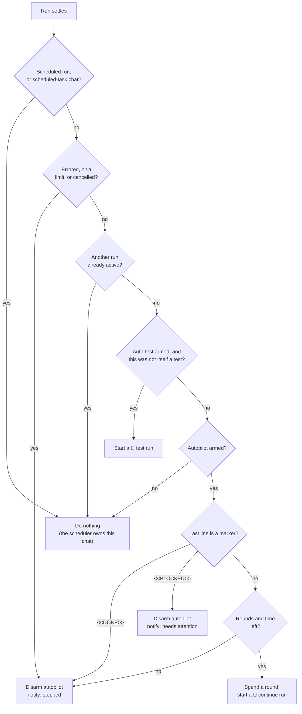

# Autopilot and auto-test

Two per-chat **post-run policies** decide what the platform does on its own
once an agent turn settles:

- **Autopilot** keeps a chat working while you are away. Every time the agent
  ends its turn without declaring the goal complete, Remote sends one more
  "keep going" prompt — bounded by a round count and a wall-clock budget.
- **Auto-test** asks for a Playwright verification pass after every turn that
  changed something, and reports PASS/FAIL.

Both default **off**, are configured per chat from the composer toolbar, and
are stored in the chat's metadata.

The composer also carries a **Test ▾** menu for firing a Playwright check by
hand, whether or not auto-test is armed.

## Why this exists

An agent run already outlives the browser. `prompt.Service.Start` roots every
run in `context.Background()`, so closing the tab, losing Wi-Fi, or walking
away does not stop a run that is in flight
([`internal/service/prompt/service.go`](../../backend/internal/service/prompt/service.go)).

What stops work is different: the agent **ends its turn**. It asks a question,
or finishes the step it was asked for, and then waits. If nobody is at the
keyboard, a five-minute step becomes an eight-hour gap. Autopilot closes that
gap; auto-test closes the related one where an unattended agent reports success
it never verified.

## The two policies

### Autopilot

| Field | Default | Bounds | Meaning |
| --- | --- | --- | --- |
| `enabled` | `false` | — | Whether the loop is armed |
| `maxRounds` | `8` | 1–50 | How many synthetic "keep going" prompts one session may send |
| `roundsUsed` | `0` | — | How many it has spent; server-owned |
| `maxDurationMin` | `120` | 5–1440 | Wall-clock budget, measured from `startedAt` |
| `startedAt` | — | — | When the loop was armed, epoch milliseconds |
| `enabledBy` | — | — | The human who armed it; synthetic runs are attributed to them |

**Arming resets the budget.** Switching autopilot on sets `roundsUsed` back to
zero and restarts the clock, so a chat that already spent its rounds can be
autopiloted again. Adjusting the limits *without* touching the switch
deliberately does not reset anything — a mid-flight loop keeps its progress.

**Stopping never cancels a run.** The Stop button on the header pill disarms
the loop; a turn already in flight runs to completion. Killing an agent
mid-edit to change a scheduling policy would leave the workspace in whatever
half-state the turn had reached. Use the composer's Cancel control to stop
work.

### Auto-test

| Field | Default | Meaning |
| --- | --- | --- |
| `enabled` | `false` | Whether every settled turn gets a verification pass |
| `enabledBy` | — | The human who armed it |

Auto-test starts a **second agent run** after each turn, so it roughly doubles
the token cost of a conversation. The popover says so.

## The completion markers

Autopilot cannot tell "the task is finished" from "the agent finished a step"
by reading prose, so it asks for a signal. Every autopilot prompt ends with:

> When the whole task is truly complete, end your message with the exact line
> `<<DONE>>`. If you are blocked and need the operator, end with
> `<<BLOCKED: reason>>`.

| Marker | Effect |
| --- | --- |
| `<<DONE>>` | Loop stops, reported as a finished run |
| `<<BLOCKED: reason>>` | Loop stops, reported as **needs attention** with the agent's reason |

Only the **last non-empty line** of the message is matched. An agent that
quotes the instruction mid-answer ("I will end with `<<DONE>>` once the
migration lands") does not stop its own loop.

The first prompt in a chat is the human's own and carries no marker
instruction, so the first settle always continues; from round 1 on, the agent
has been told how to declare completion.

## What happens when a run settles

The post-run driver ([`internal/service/postrun`](../../backend/internal/service/postrun))
registers as a `RunObserver` on the prompt service and reacts to every settled
run. The decision itself is a pure function — `postrun.Decide` — over the
settled outcome and the chat's stored policy.



Ordering matters in two places:

1. **Auto-test runs before the next autopilot round.** A chat with both
   policies armed verifies the change before asking for more change, so a
   broken step is caught in the round that caused it rather than three rounds
   later. The test run settling is what releases the next round.
2. **A verification pass is not an autopilot round.** It does not spend the
   round budget.

Follow-up runs start after a **2-second pause**, which lets the run hub release
its lock and the browser paint the finished turn. The one-run-per-chat
invariant is re-checked after the pause: if a human sent their own prompt
during it, theirs wins and the driver drops its follow-up.

## Guards

| Guard | Behavior |
| --- | --- |
| One run per chat | The driver never starts a follow-up while a run is active, before or after the pause |
| Scheduled chats | A chat any scheduled task drives is skipped entirely — the scheduler has its own loop |
| Scheduled runs | A run the scheduler injected never triggers a follow-up |
| Errors, provider limits, cancellation | Autopilot disarms rather than retrying into a failure |
| Round cap | `roundsUsed >= maxRounds` stops the loop |
| Time cap | `startedAt + maxDurationMin` elapsed stops the loop |
| Failed start | A follow-up that cannot start disarms autopilot, so the chat never *looks* like it is working when nothing is |

A round is charged **before** the run starts. If the process dies between the
write and the run, the loop resumes one round short rather than one round over.

## Attribution and audit

Synthetic runs are attributed to the human who armed the policy (`enabledBy`,
falling back to the other policy's owner). That email is what the provider and
the audit trail see — nobody else consented to the work.

Each synthetic run writes the normal `agent.run.start`
[audit entry](../04-operations/10-audit-log.md), with a `synthetic` meta field:

```json
{
  "action": "agent.run.start",
  "actor": { "email": "operator@example.com" },
  "target": { "type": "chat", "id": "9f2c1a0b" },
  "meta": { "chatId": "9f2c1a0b", "provider": "claude", "synthetic": "autopilot" }
}
```

The value is `autopilot` or `autotest`. Anything else is dropped: badging a
prompt as platform-issued is a claim about who asked for the work.

## Notifications

When autopilot stops it publishes through the
[notification service](07-notifications.md):

| Stop reason | Event | Summary |
| --- | --- | --- |
| `<<DONE>>` | `runFinished` | "Autopilot finished after N rounds — the agent reported the task complete." |
| `<<BLOCKED>>` | `needsAttention` | "…the agent is blocked and needs you." plus the agent's reason |
| Round cap | `runFinished` | "…the round limit was reached before the agent reported completion." |
| Time cap | `runFinished` | "…the time limit was reached before the agent reported completion." |
| Failure | `runFinished` | "…the last run did not finish cleanly, so the loop stopped." |

These follow the usual per-event toggles, so a deployment with notifications
off gets none of them.

## The Test menu

The composer's **Test ▾** menu sends a Playwright check right now. All three
items go through the `playwright-e2e` skill, ask for PASS/FAIL with the
assertion output, and forbid weakening assertions to reach a green result.

| Item | Sends |
| --- | --- |
| **Test the last change** | The same prompt auto-test sends — a minimal spec for the journey the agent just touched, fixing the change and re-running once if it fails |
| **Test a URL or flow…** | A URL plus what should be true about it; the expectation is optional |
| **Test the whole app** | A smoke suite over the main journeys with a PASS/FAIL line for each |

Menu items are labelled `autotest`, so a check a human asked for is badged in
the transcript like an automatic one. The menu is disabled while a run holds
the chat, exactly like Send.

> The prompt text is duplicated between
> [`backend/internal/service/postrun/prompts.go`](../../backend/internal/service/postrun/prompts.go)
> and [`frontend/src/state/chat/testPrompts.ts`](../../frontend/src/state/chat/testPrompts.ts).
> A test in each asserts the wording, but they must be changed together.

## In the UI

- **Composer toolbar** — an *Autopilot* button (popover: enable, max rounds,
  max minutes, and a status line reading `round 3/8 · started 12:40 · running`)
  and an *Auto-test* button (popover: one checkbox and the cost warning).
- **Chat header** — while autopilot is armed, a pill reading
  `Autopilot on · round 3/8` with a Stop button.
- **Transcript** — a synthetic prompt bubble is muted and carries a badge above
  it: **auto-continue** for an autopilot round, **auto-test** for a
  verification pass.

The round counter is server-owned. The browser never guesses at it: the
workspace socket pushes a chat upsert on every metadata write, so the pill and
the popover follow an unattended loop without polling.

## API

Both policies are patched through the existing chat endpoint.

```
PATCH /api/chats/{id}
{
  "autopilot": { "enabled": true, "maxRounds": 12, "maxDurationMin": 240 },
  "autoTest":  { "enabled": true }
}
```

Every field is optional. An absent `autopilot` or `autoTest` object leaves that
policy untouched; a present one replaces only the fields it names. Limits
outside the bounds return **400**.

`enabledBy` comes from the session and is never read from the request body.

The response is the updated chat metadata, which now carries:

```json
{
  "autopilot": {
    "enabled": true,
    "maxRounds": 12,
    "roundsUsed": 3,
    "maxDurationMin": 240,
    "startedAt": 1755518400000,
    "enabledBy": "operator@example.com"
  },
  "autoTest": { "enabled": true, "enabledBy": "operator@example.com" }
}
```

A prompt sent over `/ws/chat/{id}` may carry an optional `synthetic` field
(`"autotest"`), which the server validates against the known kinds:

```json
{ "type": "prompt", "text": "Verify the change…", "synthetic": "autotest" }
```

The resulting `user` chat event carries the same label, which is what the
transcript badges.

## Storage

Policies live in the chat's existing metadata document —
`DATA_DIR/chats/<id>/meta.json` — under `autopilot` and `autoTest`. A chat
written before these fields existed reads back with the documented defaults and
both policies off, so an old chat is never mistaken for a loop with zero rounds
available.

## Limits and caveats

- **Playwright is the operator's.** The driver names the `playwright-e2e`
  skill and assumes the project's app is reachable on a local port. It does not
  install Playwright, discover ports, or verify that the skill exists — a
  project without it gets an agent that says so.
- **Autopilot is not a planner.** It repeats one instruction. A goal that needs
  a different approach after round three will get the same nudge in round four.
- **Cost.** Both policies spend tokens without a human in the loop. The round
  and duration caps are the only ceiling; there is no cost ceiling.
- **One backend process.** Round counters are file-backed metadata guarded by
  an in-process mutex, in line with the rest of the platform's
  [known limitations](../known-limitations.md).
