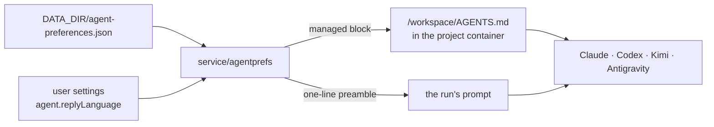

# Reply preferences and chat search

Two independent capabilities that share one page in this document because they
are the two halves of "make the platform's own words findable and consistent":

1. **Reply preferences** — a platform-wide instruction, injected into every
   agent run, that decides the language an answer comes back in, how verbose it
   is, and any house rules every project inherits.
2. **Chat search** — full-text search across chat titles, your prompts, and the
   agents' answers, filtered to the chats you can already see.

---

## Part 1 — Reply preferences

### What an operator sets

**Settings → Agents & skills → Reply preferences** (admin only) edits one
document stored at `DATA_DIR/agent-preferences.json`:

| Field | Values | Meaning |
| --- | --- | --- |
| `replyLanguage` | `auto`, `en`, `ar`, `ar-EG`, or any custom label | The language an agent answers in. `auto` injects nothing — mirroring the user is what agents already do. |
| `tone` | `default`, `concise`, `detailed` | How much prose an answer carries. `default` injects nothing. |
| `extraInstructions` | free text, ≤ 4000 characters | House rules every project inherits. |
| `applyTo` | `all`, `newProjectsOnly` | Which projects the preference governs. |

A **custom label** is rendered verbatim (`Reply in Levantine Arabic unless the
user writes in another language`), which is what lets an operator ask for a
dialect the platform never enumerated. Labels are capped at 64 characters and
must be a single line.

`applyTo: newProjectsOnly` means *projects created at or after the preference
was last saved*. Every save re-dates that boundary. Loose chats (no project)
are excluded, because they have no creation instant to compare against.

Defaults — `auto` / `default` / no extra instructions — inject **nothing at
all**, so the feature is invisible until it is configured.

### The per-user override

A user overrides only the **language**, from **Settings → Appearance → Agent
reply language**. Tone and house rules are platform policy an individual cannot
opt out of.

The value lives in that user's own settings document
(`DATA_DIR/user-settings/sha256-<hash>.json`, field `agent.replyLanguage`) and
is edited through the existing `PATCH /api/me/settings`:

```json
{ "agent": { "replyLanguage": "ar-EG" } }
```

Three distinct values matter:

| Stored value | Meaning |
| --- | --- |
| `""` (empty) | Follow whatever the admin set. |
| `"auto"` | Mirror my own language — **overrides** the platform value. |
| anything else | Use this language — overrides the platform value. |

The override is resolved per run from the session that started it. User
settings are keyed by OAuth subject first and email second, so the chat
WebSocket now carries the session's subject onto the run's actor. Runs started
without a session — the scheduler, autopilot follow-ups — fall back to the
platform value.

### How it reaches the agent

Two channels, because neither alone covers every provider:



**1. A managed block in `/workspace/AGENTS.md`.**
Regenerated on every run start, between two HTML-comment markers:

```markdown
<!-- remote:preferences -->
## Reply preferences (managed by remote.futrx)

- Reply in Egyptian Arabic (عامية مصرية مبسطة) unless the user writes in another language; keep code, identifiers, commands and file paths in English; be concise.

Never force-push.
<!-- /remote:preferences -->
```

Everything outside the markers is left untouched, so a template's seeded
instructions and anything a user wrote survive. The writer
(`ApplyManagedBlock`, in
[`internal/integration/containers/workspace/preferences.go`](../../backend/internal/integration/containers/workspace/preferences.go))
is idempotent, and clearing the preference removes the block and its markers
entirely. An opening marker with no closing one is treated as running to the
end of the file and replaced wholesale — any other reading either appends a
second block on every run or leaves a marker that swallows the next one.

Because the file is shared by everyone working in that project, the block
carries the **platform** language only. Personal overrides never reach it.

**2. A one-line preamble on the run's prompt.**
Prepended ahead of the mode preamble (modes are prompt-preamble policies, see
[Chat and agents](04-chat-and-agents.md)), so the preference applies even
before the agent reads any file, and it is the channel that carries the
personal override. Loose chats — which have no `/workspace` — get the
preference through this channel only.

The preamble carries the language and tone sentence plus up to 600 characters
of the extra instructions; the full text is always in the workspace file. Keep
`extraInstructions` brief: this copy rides on **every prompt**.

### API

| Route | Method | Auth | Body |
| --- | --- | --- | --- |
| `/api/admin/agent-preferences` | `GET` | admin | — |
| `/api/admin/agent-preferences` | `PUT` | admin | any subset of the four fields |
| `/api/me/settings` | `PATCH` | any signed-in user | `{"agent":{"replyLanguage":"…"}}` |

A `PUT` is a partial edit: an absent field keeps its stored value. Validation
failures answer `400`, a deployment with no store answers `503`, and a member
calling either admin verb gets `403` (`401` when not signed in). Every accepted
`PUT` writes a `settings.agent-preferences.update` entry to the
[audit log](../04-operations/10-audit-log.md).

---

## Part 2 — Full-text chat search

### What a user does

Type two or more characters into the sidebar search box. The existing
title/project filter keeps working instantly; a **Search in messages** section
appears below it, debounced by 250 ms, with hits grouped by chat.

- `↑` / `↓` walk the hits (wrapping), `Enter` opens the highlighted one,
  `Esc` clears the box.
- Opening a hit selects its chat and scrolls the thread to that message, which
  flashes once. The same happens for a `/?chat=<id>&at=<unix-ms>` link.

### What is indexed

| Indexed | Not indexed |
| --- | --- |
| Chat titles | Tool-call inputs and outputs |
| `user` events (what you typed) | `thinking` / reasoning deltas |
| `assistant_text` events (what the agent said) | usage, lifecycle, system events |

Tool payloads are mostly JSON and file contents; indexing them turns every
query into a wall of noise.

Assistant text arrives as a stream of small deltas, so consecutive deltas of
one turn are **coalesced into a single entry**. Without that, a phrase spanning
two deltas would never be found and every snippet would be a two-word fragment.
A user message closes the open turn, and a turn is split once it passes 64 KiB.

### Arabic-aware matching

Queries and indexed text are both folded before matching
([`internal/service/search/normalize.go`](../../backend/internal/service/search/normalize.go)):

- Latin is lower-cased.
- Tashkeel, Quranic annotation marks, tatweel (`ـ`), and zero-width/bidi
  controls are dropped.
- `أ إ آ ٱ` → `ا`, `ة` → `ه`, `ى` → `ي`, `ؤ` → `و`, `ئ` → `ي`.
- Arabic-Indic digits (`٢٠٢٥`, `۲۰۲۵`) fold onto ASCII.
- Whitespace runs collapse to single spaces, so a line break never hides a
  match.

So `احمد` finds `أحمد`, `مصريه` finds `مصرية`, and `مرحبا` finds `مَرْحَبًا`.

### Memory bounds

The index is **in memory only** — there is no on-disk cache, and a restart
rebuilds it. It is capped on two axes, whichever binds first:

| Bound | Default | Constant |
| --- | --- | --- |
| Messages | 200 000 | `search.DefaultMaxEntries` |
| Indexed source text | 48 MiB | `search.DefaultMaxBytes` |

Each entry also keeps a folded copy for matching, so peak cost is roughly twice
the byte budget (~100 MiB at the default). Oldest entries are evicted first.
When anything has been evicted the API reports `"truncated": true` and the
sidebar says so, rather than implying the history simply had no match. Neither
bound is configurable at runtime today.

### Lifecycle

- **Startup:** built in a background goroutine so a large history never delays
  the first request. It logs a line on completion:
  `search: indexed 12043 messages from 87 chats in 1.4s (18624 KiB, 0 evicted)`.
- **Live:** every appended chat event is offered to the index by the same
  repository decorator that publishes workspace updates
  ([`internal/service/notifying_repositories.go`](../../backend/internal/service/notifying_repositories.go)),
  so a message is searchable exactly when it becomes durable — including
  messages written by paths the prompt service never sees.
- **Deletes:** deleting a chat drops its entries and its title.

### Membership

Every query is filtered through `servicechat.AccessService.List` — the same
call the sidebar listing uses — so a chat that is invisible in the sidebar is
invisible here by construction rather than by a second, drifting copy of the
rule. The filter runs *before* any text work, so timing cannot reveal that a
chat you cannot see exists. A deployment with no access service returns nothing
at all: failing closed is the only safe default for a cross-chat reader.

### API

```
GET /api/search?q=<text>&projectId=<id>&limit=<n>
```

Any signed-in user. `q` shorter than 2 characters answers `200` with an empty
list rather than `400`, because the browser calls this on every keystroke.
`limit` defaults to 30 and is capped at 100.

```json
{
  "results": [
    {
      "chatId": "a1b2c3",
      "chatTitle": "Caddy rollout",
      "projectId": "p1",
      "projectName": "Platform",
      "role": "user",
      "at": 1712345678901,
      "snippet": "…restart U+0002caddyU+0003 on the box…"
    }
  ],
  "truncated": false
}
```

`role` is `user`, `assistant`, or `title`. The matched span inside `snippet` is
bracketed by **STX (`U+0002`) and ETX (`U+0003`)**: a transcript can contain
any printable sequence, so only something unprintable is an unambiguous
sentinel. Those two characters are stripped from indexed text, so a marker in a
snippet can only ever come from a real match. The browser splits on them and
emits vnodes — nothing is interpolated as HTML.

Snippets carry roughly ±80 characters of context, elided with `…`.

---

## Where the code lives

| Concern | Path |
| --- | --- |
| Preference document, rendering, scoping | `backend/internal/service/agentprefs/` |
| Preference persistence | `backend/internal/stores/fileagentprefs/` |
| Managed-block writer | `backend/internal/integration/containers/workspace/preferences.go` |
| Prompt preamble injection | `backend/internal/service/prompt/service.go` |
| Search index, folding, query | `backend/internal/service/search/` |
| Live index updates | `backend/internal/service/notifying_repositories.go` |
| HTTP | `backend/internal/transport/http/handlers/agent_preferences_handler.go`, `search_handler.go` |
| Admin panel | `frontend/src/ui/settings/ReplyPreferencesSettings.tsx` |
| Personal language picker | `frontend/src/ui/settings/ReplyLanguagePreference.tsx` |
| Sidebar results | `frontend/src/ui/sidebar/MessageSearchResults.tsx` |

## Known limits

- The search index is memory-only and unbounded histories are truncated to the
  newest 200 000 messages / 48 MiB; there is no on-disk cache and no
  configuration knob.
- Matching is substring, not token-based: there is no stemming, no ranking
  beyond "titles first, then newest", and no phrase or boolean operators.
- A deep link scrolls to the *nearest* rendered block, because the thread
  coalesces several events into one block while a hit names a single event.
- The reply-preference block is written on run start, so an admin's edit lands
  on the next prompt in each project rather than immediately.
- Runs the scheduler starts carry no session, so they use the platform language
  rather than the task owner's personal override.
