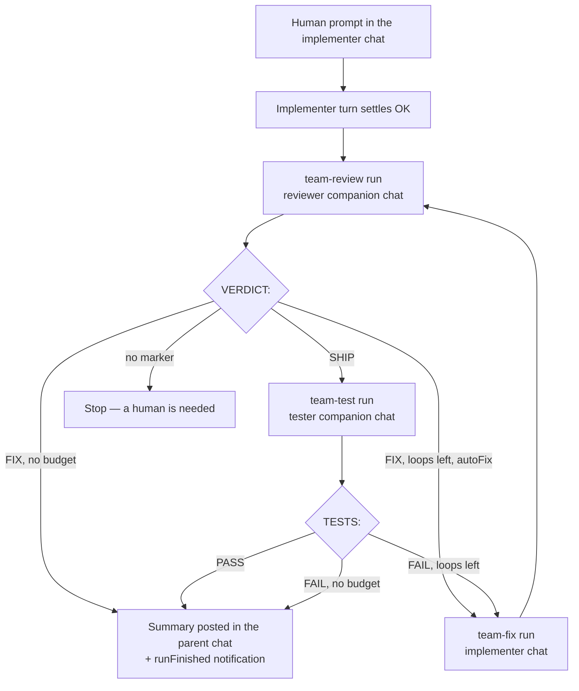

# Team mode

**Team mode** turns one chat into a coordinated multi-agent workflow inside the
same project. The chat you type in is the **implementer**. When one of its turns
settles cleanly, Remote starts a **reviewer** — a *different* connected provider
where one exists — in a companion chat of its own, reads a verdict line out of
what it says, and either hands the findings back to the implementer or moves on
to a **tester** that runs the Playwright pass.

Nobody prompts anything. One switch in the composer's **Run options** arms the
whole chain.

It defaults **off**, is configured per chat, and is stored in the chat's
metadata alongside the [post-run policies](15-autopilot-and-auto-test.md).

## Why this exists

An agent grading its own work is the weakest link in an unattended loop. It has
every incentive to declare success, it has already convinced itself the approach
is right, and its context is full of the reasoning that produced the bug. The
platform already had the pieces to fix that — several connected providers, one
shared workspace, synthetic follow-up runs — but wiring them together meant
copying a diff between chats by hand.

Team mode is that wiring. The review is a second opinion because it runs on a
different provider; it is *fresh* eyes because it runs in a chat with no history
of the implementer's turn, starting from `git diff` like a human reviewer would.

## The loop



Each arrow is one agent run, started by the orchestrator with a synthetic label
(`team-review`, `team-test`, `team-fix`) that shows on the prompt bubble and in
the [audit log](../04-operations/10-audit-log.md).

## The cast

| Seat | Runs in | Provider default | Chat mode | Skills |
| --- | --- | --- | --- | --- |
| **Implementer** | the chat you type in | the chat's own provider | unchanged | unchanged |
| **Reviewer** | `🧐 Reviewer — <parent title>` | a *different* connected provider: Codex, else Kimi, else Claude | `review` | `review-protocol` plus every published `*-guard` skill |
| **Tester** | `🧪 Tester — <parent title>` | the reviewer's provider | `code` | `playwright-e2e` |

**A different provider is preferred, never required.** With only one provider
connected the reviewer runs on that provider anyway — in a companion chat of its
own, which is where the fresh eyes come from. The composer's panel says so
rather than implying a second opinion it cannot give.

**Antigravity is never picked automatically.** Its print mode returns plain
streamed text without structured events, which is a poor fit for a verdict pass.
You can still seat it by hand.

**Skills are narrowed to what exists.** The wish list above is intersected with
the [global skills library](09-global-skills.md), so a box without
`review-protocol` still runs a review — it just runs it without the protocol,
rather than showing a chip for a skill nobody can open. Team mode does **not**
depend on the `codex-delegate` family of skills.

## Companion chats

Each companion is a normal chat in the same project, with two extra fields:

| Field | Meaning |
| --- | --- |
| `companionOf` | the parent chat's id |
| `companionRole` | `reviewer` or `tester` |

They are **hidden from the sidebar** — one team session adds one row to the chat
list, not three — and opened from the parent's **Team panel**, where they render
in the normal chat view like any other chat. You can read them, scroll them, and
type into them.

A prompt *you* send in a companion chat is never read as a verdict. Only a run
the orchestrator started (one carrying the matching synthetic label) is parsed,
so asking the reviewer a follow-up question does not stop the loop.

Companions are **reused** across loops and across sessions: one reviewer chat per
parent keeps every review of that task in one readable thread. Changing a seat's
provider drops its companion, because that chat's provider, session, and skills
all belong to the agent being replaced.

## Verdicts

The reviewer is asked to end its message with `VERDICT: SHIP` or `VERDICT: FIX`,
followed by its findings. The tester is asked for `TESTS: PASS` or `TESTS: FAIL`,
followed by the assertion output.

The parser is forgiving about everything *around* the marker and strict about the
marker itself:

- It scans every line and keeps the **last** match, so an agent that restates the
  instruction before answering it does not stop its own loop.
- It ignores markdown emphasis, backticks, bullets, brackets, and trailing
  punctuation: `- **VERDICT: FIX** —` parses.
- It ignores the bidirectional control characters an RTL reply embeds around
  Latin tokens, so an Arabic review with `الحكم النهائي VERDICT: FIX يحتاج إصلاحاً`
  parses.
- It requires the colon. Prose that merely mentions the word ("my verdict is that
  this looks fine") is **not** a verdict.
- **Silence is not consent.** A run with no marker stops the loop and reports it.
  Reading silence as SHIP would let an agent that ignored its instructions wave
  a broken change through.

Findings are capped at 4 KB, keeping the **end** of a long answer — an agent puts
its conclusions last, and the conclusion is what the next hop needs.

## Settings

| Field | Default | Bounds | Meaning |
| --- | --- | --- | --- |
| `enabled` | `false` | — | Whether the chain is armed |
| `roles.implementer` | the chat's provider | — | Always enabled; has no companion chat |
| `roles.reviewer` | a different connected provider | — | `provider`, optional `model`, `enabled` |
| `roles.tester` | the reviewer's provider | — | `provider`, optional `model`, `enabled` |
| `maxLoops` | `2` | 1–5 | How many fix rounds one session may spend |
| `autoFix` | `true` | — | Whether a FIX verdict goes back to the implementer automatically |
| `loopsUsed` | `0` | — | How many it has spent; server-owned |
| `phase` | `""` | — | `reviewing`, `testing`, `fixing`, `done`, `error`; server-owned |
| `verdict` | `""` | — | The last verdict the loop settled on; server-owned |
| `hops` | `[]` | ≤24 | The timeline the Team panel renders; server-owned |
| `enabledBy` | — | — | The human who armed it; every hop is attributed to them |

An empty seat `provider` means "let the platform pick", which is how a chat armed
before a second provider was connected still gets a fresh-eyes reviewer once one
is. An **unknown** provider is refused with `400` rather than defaulted, because
silently turning `gpt5` into Codex would seat an agent nobody chose.

**Arming resets the session.** Switching team mode on sets `loopsUsed` back to
zero, clears the phase, verdict, and timeline, and keeps the companion chat ids.
Adjusting the limits *without* touching the switch resets nothing.

**Stopping never cancels a run.** Stop disarms the chain; a hop already in flight
runs to completion. Use the composer's Cancel control to stop work.

## Guards

- **One run per chat.** A hop never starts while its target chat is busy. It
  waits out a two-second settle delay, re-checks, and — if a human got there
  first — is held and retried the next time that chat settles. At most one hop is
  ever held per chat; a newer decision supersedes an older one.
- **Failures stop the loop.** A hop whose run errors or is cancelled ends the
  session with `phase: "error"` and a message saying so. A team loop never doubles
  down on a failure. A failed prompt *you* typed is not the loop's to abort.
- **Scheduled runs are left alone.** A chat driven by a
  [scheduled task](06-scheduled-tasks.md) has its own cadence.
- **The loop cap is hard.** `loopsUsed` is spent *before* the fix run starts, so a
  crash in between leaves the budget one short rather than one over.
- **Autopilot stands down.** [Autopilot](15-autopilot-and-auto-test.md) and team
  mode both react to the same settled run and both would prompt the same chat.
  While a team loop has a hop in flight, autopilot yields — the team goes first —
  and resumes on the implementer chat's next turn once the loop has settled. The
  rule lives in `postrun.Decide`, and the post-run driver re-reads the phase after
  its own settle delay so the two observers cannot race.

## What you see

- **Composer → Run options → Who works on it.** The Team switch, one row per
  seat with a provider dropdown limited to *connected* providers and an optional
  model, the loop count, and the automatic-fix checkbox. The Run options button
  itself gains a `👥` badge.
- **Chat header pill.** `👥 Team: reviewing…` / `testing…` / `fix 1/2` / `PASS` /
  `stopped`, pulsing while a hop is in flight.
- **Team panel.** Click the pill. It lists the cast with a link to each companion
  chat, then the timeline of hops — each with its verdict badge, the findings the
  agent wrote, and a link to open the chat it ran in. A review you cannot read is
  a review you have to take on faith.
- **Transcript badges.** `team review`, `team test`, `team fix`, and `team` mark
  every message the platform composed, so an unattended hand-off is never mistaken
  for something you typed.
- **The closing message.** `✅ Team: reviewed by Codex (SHIP), tests PASS in 2
  loops`, posted in the parent chat and published as a `runFinished`
  [notification](07-notifications.md).

## API

Team mode is patched through the existing chat endpoint. There is no new route.

```bash
# Arm the chain with the platform's own cast.
curl -sS -b cookies.txt -X PATCH https://remote.example.com/api/chats/<chatId> \
  -H 'content-type: application/json' \
  -d '{"team":{"enabled":true}}'

# Seat it by hand.
curl -sS -b cookies.txt -X PATCH https://remote.example.com/api/chats/<chatId> \
  -H 'content-type: application/json' \
  -d '{"team":{"enabled":true,"maxLoops":3,"autoFix":true,
        "roles":{"reviewer":{"provider":"codex","enabled":true},
                 "tester":{"provider":"kimi","enabled":true}}}}'

# Switch it off.
curl -sS -b cookies.txt -X PATCH https://remote.example.com/api/chats/<chatId> \
  -H 'content-type: application/json' -d '{"team":{"enabled":false}}'
```

`GET /api/chats/{id}` returns the whole policy, including the server-owned half:

```json
{
  "team": {
    "enabled": true,
    "maxLoops": 2,
    "autoFix": true,
    "phase": "reviewing",
    "loopsUsed": 1,
    "verdict": "fix",
    "enabledBy": "operator@example.com",
    "roles": {
      "implementer": { "provider": "claude", "enabled": true },
      "reviewer": { "provider": "codex", "enabled": true, "chatId": "a1b2c3d4" },
      "tester": { "provider": "codex", "enabled": true, "chatId": "e5f6a7b8" }
    },
    "hops": [
      { "loop": 0, "role": "reviewer", "kind": "team-review", "chatId": "a1b2c3d4",
        "at": 1755518400000 },
      { "loop": 1, "role": "implementer", "kind": "team-fix", "chatId": "9f8e7d6c",
        "verdict": "fix", "findings": "1. cart.ts:44 — the empty cart is not handled",
        "at": 1755518520000 }
    ]
  }
}
```

Sending `phase`, `loopsUsed`, `verdict`, `hops`, or a seat's `chatId` in a PATCH
body changes nothing: that half belongs to the orchestrator, and accepting a
caller-supplied `chatId` would let anyone with PATCH access aim a synthetic run
at a chat of their choosing.

## Storage

Team state lives in the chat's existing metadata document —
`DATA_DIR/chats/<id>/meta.json` — under `team`, with `companionOf` and
`companionRole` on the companions' own documents. There is no new store, no new
`DATA_DIR` file, and no new environment variable.

A chat written before team mode existed reads back with the documented defaults
and the chain off, so an old chat is never mistaken for a loop with zero budget.
The timeline keeps the most recent 24 hops, which is several sessions' worth
without letting `meta.json` grow forever.

## Audit

Every hop is a normal agent run, so it appears as `agent.run.start` with a
`synthetic` field naming the hop:

```
agent.run.start  chat=9f8e7d6c  provider=codex  synthetic=team-review
agent.run.start  chat=9f8e7d6c  provider=claude synthetic=team-fix
```

The actor is whoever armed team mode — nobody else consented to the work.
Creating a companion chat records the usual `chat.create` entry.

## Where the code lives

| Concern | File |
| --- | --- |
| Policy shape, bounds, patch rules | [`internal/service/chat/team_policy.go`](../../backend/internal/service/chat/team_policy.go) |
| Synthetic kinds | [`internal/service/chat/policy.go`](../../backend/internal/service/chat/policy.go) |
| State machine (pure) | [`internal/service/team/policy.go`](../../backend/internal/service/team/policy.go) |
| Verdict parsing | [`internal/service/team/verdict.go`](../../backend/internal/service/team/verdict.go) |
| Prompts and summaries | [`internal/service/team/prompts.go`](../../backend/internal/service/team/prompts.go) |
| Orchestrator (`RunObserver`) | [`internal/service/team/driver.go`](../../backend/internal/service/team/driver.go) |
| Autopilot stand-down | [`internal/service/postrun/policy.go`](../../backend/internal/service/postrun/policy.go) |
| Browser state | [`frontend/src/state/chat/teamState.ts`](../../frontend/src/state/chat/teamState.ts) |
| Composer control | [`frontend/src/ui/chat/composer/TeamModeControl.tsx`](../../frontend/src/ui/chat/composer/TeamModeControl.tsx) |
| Header pill and panel | [`frontend/src/ui/chat/team/TeamPanel.tsx`](../../frontend/src/ui/chat/team/TeamPanel.tsx) |

## Limits and caveats

- **Cost.** Each loop is two extra agent runs on top of the implementer's. The
  loop cap is the only ceiling; there is no cost ceiling. The [usage
  dashboard](10-usage-and-cost.md) attributes every hop to the chat it ran in.
- **The review is only as good as the skill.** `review-protocol` and
  `playwright-e2e` are the operator's own global skills; Remote names them and
  narrows to what is published, but does not author or install them.
- **The reviewer sees the workspace, not the conversation.** It starts from
  `git diff` and the last commits. Intent that was only ever stated in the
  implementer's chat is invisible to it — which is the point, and also its main
  blind spot.
- **A dirty workspace confuses the diff.** Uncommitted work from an earlier task
  is reviewed alongside the change you just made.
- **One backend process.** Loop counters are file-backed metadata guarded by an
  in-process mutex, in line with the rest of the platform's
  [known limitations](../known-limitations.md).
