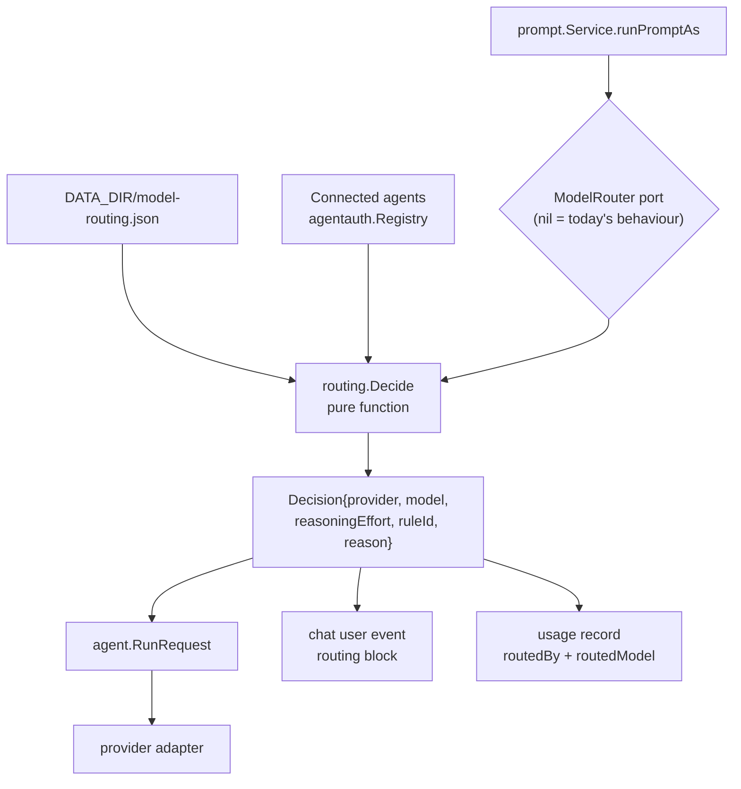

# Automatic model routing

A frontier model answering "what does this flag do?" costs the same per token
as one answering "port this service to the new scheduler". Model routing is the
policy that stops paying that: routine turns go to a cheap model, hard ones to
the expensive one, and the operator owns the rule that decides which is which.

Routing is **off on a fresh install** and every seeded rule ships **disabled**,
so nothing changes until an administrator turns it on. A chat is only routed
once its composer pill is switched to **Auto** — a chat pinned to a model the
user picked always runs that model, whatever the policy says.

## Where the decision happens



The decision is taken **once per turn**, in
[`prompt.Service.runPromptAs`](../../backend/internal/service/prompt/service.go),
immediately after the chat's prior events are read and **before** the user
event is persisted. That position is load-bearing: routing may change the
*provider*, and the provider selects the resume session id, the skill-trigger
syntax, and which adapter the run goes through. Deciding later would leave
those three resolved against the wrong agent.

The prompt service knows nothing about rules. It asks a `ModelRouter` port and
applies the answer; the whole policy lives in
[`internal/service/routing`](../../backend/internal/service/routing). A `nil`
router — a deployment with no `ModelRouting` store wired — leaves every field
exactly as the chat stored it.

## The policy document

`DATA_DIR/model-routing.json`, mode 0600, seeded on first read:

```json
{
  "version": 1,
  "enabled": false,
  "autoHeuristics": true,
  "default":       { "provider": "claude", "model": "sonnet" },
  "cheapModel":    { "provider": "claude", "model": "haiku" },
  "expensiveModel":{ "provider": "claude", "model": "opus" },
  "rules": [
    {
      "id": "synthetic-checks",
      "when": { "kind": "synthetic", "value": "any" },
      "use":  { "provider": "claude", "model": "haiku" },
      "note": "Platform checks (auto-test, team review, team test) run cheap",
      "enabled": false
    }
  ]
}
```

| Field | Meaning |
| --- | --- |
| `enabled` | The master switch. Off means every chat runs the model it names. |
| `default` | Where a routed turn goes when no rule and no heuristic claims it. Also the baseline the savings report prices against. |
| `cheapModel` / `expensiveModel` | The two poles the heuristics point at and the savings report classifies runs by. |
| `autoHeuristics` | Whether the built-in prompt-shape classifier runs after the rule list. |
| `rules` | Ordered. First **enabled** match wins; the scan stops there. |

An `id` is the ledger's attribution key, so the savings report can count a
rule's hits across months. `default` is a reserved id.

### Condition kinds

| `when.kind` | `when.value` | Matches |
| --- | --- | --- |
| `synthetic` | a label, or `any` | A platform-issued run: `autopilot`, `autotest`, `team-review`, `team-test`, `team-fix`, `github-review`. |
| `promptShorterThan` | characters | A prompt shorter than that **and containing no fenced code block** — a pasted snippet is never short work however few characters surround it. |
| `promptLongerThan` | characters | A prompt longer than that. |
| `modeIs` | `chat`, `plan`, `code`, `review`, `debug`, `full-auto` | The chat's mode. |
| `skillSelected` | a skill trigger name | That skill is selected for the run. |
| `projectIs` | project id or slug | The chat's project. |
| `regex` | a Go RE2 expression | The prompt. An expression that does not compile makes the whole policy invalid rather than silently never matching. |

`use` names the destination and may also override `reasoningEffort`; leaving
it empty keeps the chat's own effort.

### Seeded rules

All five ship **disabled** — they are a starting point to review and arm, not a
policy that quietly changes which model answers.

| id | Condition | Destination |
| --- | --- | --- |
| `synthetic-checks` | any platform-issued run | cheap |
| `chat-mode` | mode is `chat` | cheap |
| `short-prompt` | prompt under 200 chars, no code fence | cheap |
| `hard-work` | prompt mentions refactor / architecture / debug / migration / root cause / race condition / redesign | expensive |
| `long-prompt` | prompt over 2000 chars | expensive |

### The heuristics

With `autoHeuristics` on, a turn no rule claimed is classified by prompt shape
before the default is reached. It only ever picks one of the two declared
poles, so changing `cheapModel` changes what it does:

- over 2000 characters, or hard-work wording → **expensive**
- platform-issued, `chat` mode, or under 200 characters with no code fence → **cheap**
- anything else → falls through to `default`

## Precedence, in order

1. **A pinned chat wins over everything.** `modelPolicy: "pinned"` (the default
   for every chat, and what a chat written before this feature reads back as)
   is never routed. Picking a model or an agent by hand pins the chat.
2. Routing off → the chat's own model.
3. First enabled matching rule.
4. Heuristics, when `autoHeuristics` is on.
5. `default`.

### Availability fallback

Routing only ever names a model a human could have picked by hand. A
destination is usable when its provider has a live host credential **and** the
model is in the catalog that backs the composer's picker
([`routing/catalog.go`](../../backend/internal/service/routing/catalog.go)).
Otherwise:

- a rule or heuristic destination falls back to `default`;
- an unusable `default` falls back to the chat's own model.

Either way the reason is recorded, so a transcript never leaves an operator
guessing — for example: `rule "Chat mode is cheap" matched — but Claude is not
connected; used the default model instead`.

## What the operator sees

**The composer pill.** A chat on Auto shows `Auto → Kimi K2`: the model the
*next* turn would use, re-asked from the server as the draft settles. The hint
is evaluated by the same code the run uses, so the two can never disagree.
Choosing any model from the same menu pins the chat again — the stored model is
left untouched, so leaving Auto returns the chat to the model it had.

**The transcript.** Every routed turn's user bubble carries a badge naming the
model that actually answered and the rule that sent it there, with the full
reason (including any fallback) as its tooltip. The block is persisted onto the
user event in `events.jsonl`, so it survives a reload and a ledger rebuild.

**Settings → Agents & skills → Model routing** (admin only) holds the switch,
the three model pickers, the ordered rule list with add/edit/delete/reorder,
and a **Test this policy** box that explains one pasted prompt. Nothing saves
on its own: rule order is behaviour, and dragging rules around should not
change the fleet's model three times on the way.

## The savings report

Each usage record grows two fields, so the report is computed from data rather
than guessed:

- `routedBy` — the rule id, a heuristic id (`heuristic:cheap`,
  `heuristic:expensive`), or `default`. Empty means the run was never routed.
- `routedModel` — the destination the policy named, spelled `provider/model`.
  This is the policy's vocabulary, not the model id the provider later
  reported, so it can be compared against the two poles.

**Settings → Usage** grows an **Auto routing** card: routed runs split by pole,
the top three rules by hits, and an estimated saving.

> The saving is **an estimate, and a counterfactual**. Nobody ran those tokens
> through the default model. The baseline is `default`'s rate from the editable
> table in `DATA_DIR/usage/prices.json` applied to the same token counts, minus
> what the runs actually cost. Runs whose cost is unknown, or whose default is
> that provider's `Auto` (which has no price row), are excluded from the money
> and the card says how many. A negative figure means routing cost more than
> the default would have, and is reported as such rather than clamped to zero.

`Rebuild usage ledger` recovers `routedBy` and `routedModel` from the routing
block on each turn's user event, so the card survives a rebuild.

## HTTP surface

| Route | Method | Who |
| --- | --- | --- |
| `/api/admin/model-routing` | `GET`, `PUT` | admin |
| `/api/admin/model-routing/test` | `POST` | admin |
| `/api/model-routing/preview` | `POST` | any signed-in user |

`preview` is deliberately not admin-gated: the composer pill has to name the
model the next turn will use. It evaluates the inputs the caller posts rather
than looking a chat up, so it grants no read access to anything the caller did
not already have.

Every `PUT` is written to the [audit log](../04-operations/10-audit-log.md) as
`settings.model-routing.update`, with the switch state, the rule count, and the
default destination in its metadata.

## Limits

- Routing decides **per turn, before the turn runs**. It cannot re-route a run
  that turned out harder than its prompt looked.
- A chat that switches provider mid-conversation resumes that provider's own
  session, which is a different context window. Routing across providers inside
  one thread is supported but is not free of that discontinuity.
- The prompt-shape heuristics are heuristics. `promptShorterThan` and the
  hard-work wording list are proxies for difficulty, not measurements of it.
- The catalog mirrors the composer's picker. A model that only exists in a
  provider's CLI, not in the picker, cannot be routed to; pin the chat to it
  instead.

## See also

- [Usage and cost](10-usage-and-cost.md) — the ledger and the price table
- [Chat and agents](04-chat-and-agents.md) — how a run picks its provider
- [Autopilot and auto-test](15-autopilot-and-auto-test.md) and
  [Team mode](20-team-mode.md) — the synthetic runs the seeded rules target
