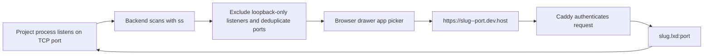
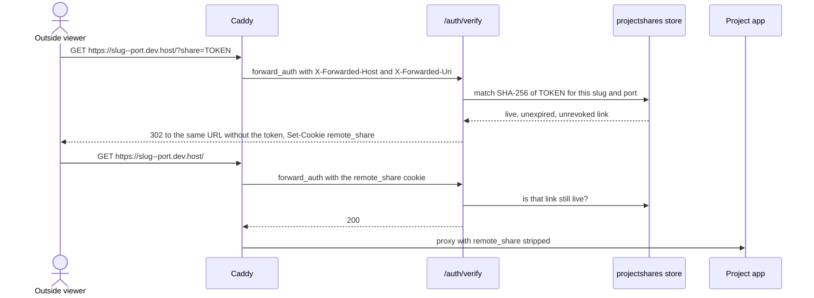
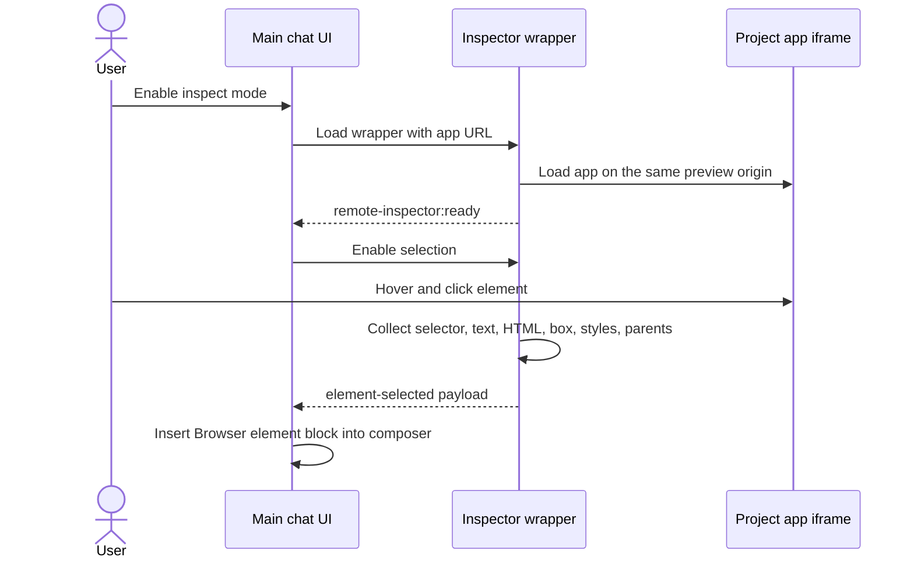
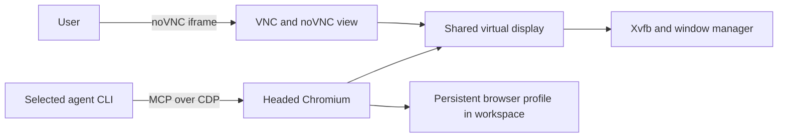
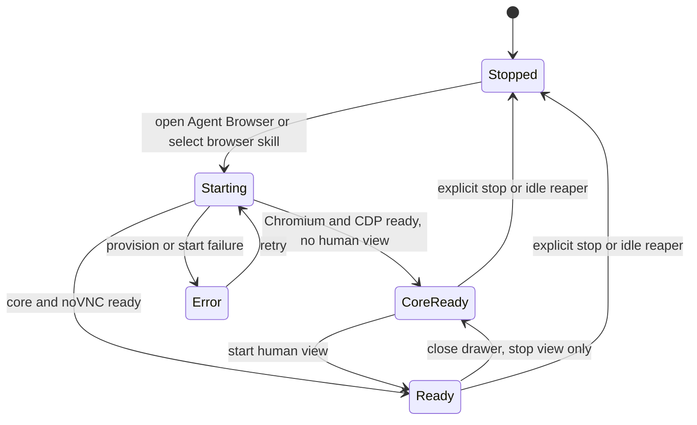
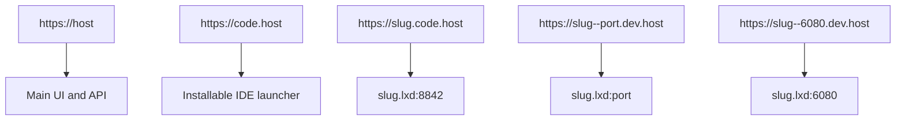
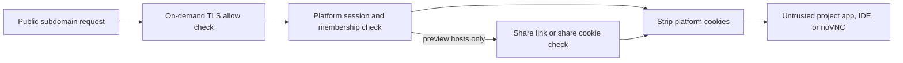

# Previews and browser features

There are two browser systems:

| System | Purpose | Browser process |
| --- | --- | --- |
| App preview | Show a web app already running in the project | The user's normal browser loads the project app in an iframe |
| Agent Browser | Share a signed-in, headed browser between user and agent | Chromium runs inside the project container |

## App discovery and preview URLs

The UI prefers a preview URL recently mentioned in chat when it matches the current project and a discovered port. Otherwise it selects a discovered listener.

Preview host rules:

- Port must be between 1024 and 65535.
- On-demand TLS asks the backend to confirm the slug is a real project before certificate issuance.
- The authenticated user must be an admin or project member, or the request must carry a valid public share link for that exact slug and port.
- Platform cookies are stripped before the request enters project code.

## Quick access to a preview

Reaching a preview does not require the project settings page. Two entry points
open the same panel:

- **Sidebar project row.** A globe button next to each project lists the ports
  that project is listening on right now.
- **Chat header chip.** When the chat's project has at least one shareable
  listener, a `Preview :<port>` chip opens that port in a new tab; its caret
  opens the same panel for the other ports.

Each row offers **Open**, **Copy URL**, and **Share 24h** — the last creates a
public link through the same share API and copies the one-time URL, which is
also printed in the panel in case the clipboard was refused. Platform ports
(6080 noVNC, 8842 and 8081 code-server, 9222 CDP) are listed so their presence
is explained, but they carry no Share action; the share service refuses them
anyway.

The chip picks the port that already has a live public link, falling back to the
lowest non-platform port. Ports are re-scanned when a panel opens, every 15
seconds while it stays open, and once each time an agent turn finishes — the
workspace WebSocket carries no listener events to piggyback on, and each scan
costs an `ss` run inside the container. A project whose container is stopped,
missing, or still provisioning reports that state instead of scanning.

## Public share links

A preview can be shown to someone who has no platform account. A project member creates a share link for one port; the link authorizes that port and nothing else.

Properties that make this safe to hand out:

- **One port, one project.** The token is bound to the project slug and the port. It is refused on any other host, on `*.code.<host>`, on port 6080 (Agent Browser noVNC), and on the main application.
- **Nothing replayable is stored.** `DATA_DIR/projectshares/<projectId>.json` holds only a SHA-256 digest of each token, plus port, label, creator, timestamps, and a revocation stamp.
- **Time-boxed.** Default lifetime 24 hours; the UI offers 1 hour, 24 hours, and 7 days; the service refuses anything under 1 hour or over 30 days.
- **Revocable immediately.** Every request re-reads the link from the store, so revoking one stops the next request, cookie or not.
- **Host-scoped cookie.** `remote_share` is set without a `Domain`, so the browser sends it only to that one `<slug>--<port>.dev.<host>` origin. Its value is `{slug, port, shareId, exp}` signed with the same HMAC key as platform sessions, under a separate domain-separation tag so a share pass can never verify as a session.
- **Token leaves the URL immediately.** The first response is a redirect to the same URL minus `?share=`, so the token stays out of browser history, `Referer`, and the project's own logs. The redirect is also what makes `Set-Cookie` reach the browser: Caddy's `forward_auth` discards the auth response on 2xx and relays only non-2xx responses.
- **Stripped at the container boundary.** `remote_share` is in the Caddyfile `header_up` cookie-strip list, so code running inside the container never sees it.

Endpoints (project membership required; admins reach every project):

| Method | Path | Result |
| --- | --- | --- |
| `POST` | `/api/projects/{id}/shares` | Creates a link from `{port, ttlHours?, label?}` and returns the full URL **once** |
| `GET` | `/api/projects/{id}/shares` | Lists live links as metadata — never a token or digest |
| `DELETE` | `/api/projects/{id}/shares/{shareId}` | Revokes one link |

Operators create and revoke links under **Project settings → Sharing → Public preview links**, which lists each discovered port with a lifetime selector and a Share action.

Changing the cookie-strip list means the Caddyfile template changed, so an existing box needs `sudo bash infra/install.sh` (step `03-caddy.sh`) or `infra/update.sh` before share cookies stop reaching containers.

## Preview inspection

Inspect mode wraps the selected app with `/__remote_inspector` on the same preview origin. Same-origin access lets the wrapper inspect the inner app iframe.

The payload is bounded and includes enough layout and accessibility context for an agent to identify the selected element. Selecting an element exits inspect mode.

## Agent Browser architecture

The user can sign in visually while the agent controls the same Chromium session. Browser profile data lives under the project workspace, so site logins survive container replacement.

## Agent Browser lifecycle

Frontend behavior:

- Opening Agent Browser calls the start endpoint, polls every 1.5 seconds, and sends a status heartbeat every 15 seconds.
- Closing the drawer stops only the noVNC view; the agent-facing core stays available.
- Explicit Stop tears down the complete browser stack but keeps the profile.

Backend behavior:

- Starting the browser first ensures the project container is running.
- Provisioning installs missing browser packages and republishes versioned scripts.
- A selected `browser` skill enables the provider's browser MCP config.
- Active browser-enabled prompts send a keepalive every minute.
- A reaper checks every minute and stops a browser after 20 minutes without pane or agent activity, unless a viewer is connected.

## URL and proxy layout

The installer configures host DNS resolution for `.lxd` names through the LXD bridge. Caddy handles public HTTPS and routes to private container addresses.

## Security boundary

Project apps may set and receive their own cookies. Only the platform's session, OAuth-state, return-location, and share cookies are removed.

## Code map

- App scanning: [`backend/internal/integration/containers/listeners/scanner.go`](../../backend/internal/integration/containers/listeners/scanner.go)
- Browser drawer: [`frontend/src/ui/chat/browser/BrowserDrawer.tsx`](../../frontend/src/ui/chat/browser/BrowserDrawer.tsx)
- Preview quick access: [`frontend/src/ui/preview/`](../../frontend/src/ui/preview/), [`frontend/src/state/projects/projectPreviewLinksState.ts`](../../frontend/src/state/projects/projectPreviewLinksState.ts)
- Inspector handler: [`backend/internal/transport/http/handlers/browser_inspector_handler.go`](../../backend/internal/transport/http/handlers/browser_inspector_handler.go)
- Agent Browser service: [`backend/internal/service/container/browser/service.go`](../../backend/internal/service/container/browser/service.go)
- Caddy routes: [`infra/templates/Caddyfile.tmpl`](../../infra/templates/Caddyfile.tmpl)
- Share links service: [`backend/internal/service/share/service.go`](../../backend/internal/service/share/service.go)
- Share links store: [`backend/internal/stores/fileprojectshares/store.go`](../../backend/internal/stores/fileprojectshares/store.go)
- Edge share check: [`backend/internal/transport/http/handlers/auth_verify_share.go`](../../backend/internal/transport/http/handlers/auth_verify_share.go)
