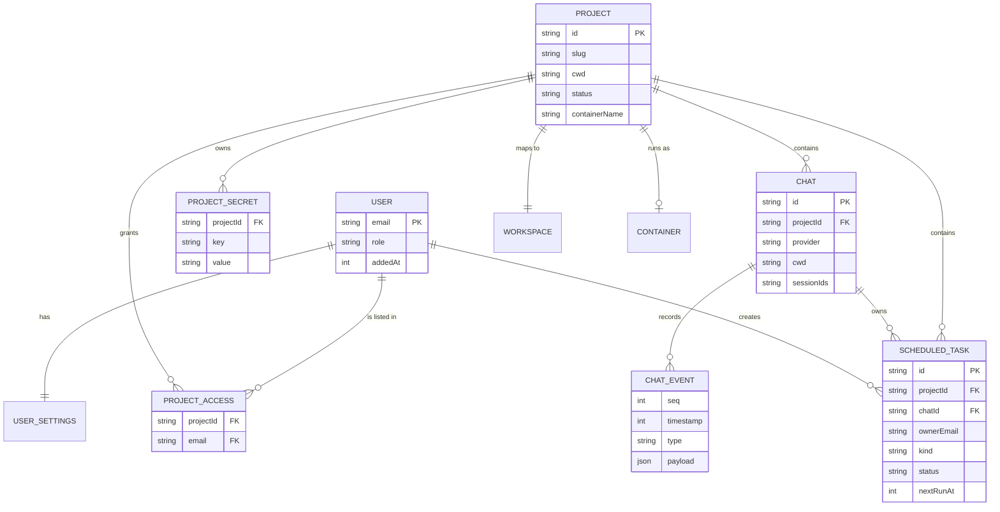
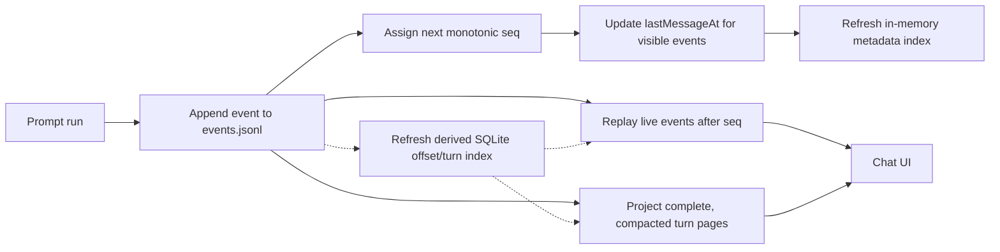
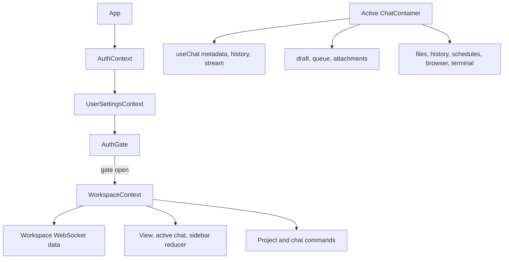
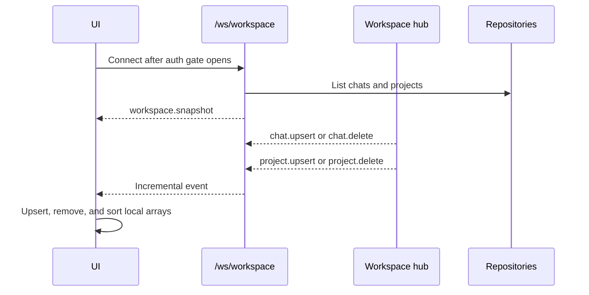

# Data and frontend state

The application does not use an external database service. Durable metadata is stored as JSON files; chat events use append-only JSONL. A disposable embedded SQLite database indexes chat event offsets and transcript turns for bounded reads. Project source files live in a separate host workspace tree.

## Host storage layout

```text
/opt/remote.futrx/data/                 DATA_DIR
├── chats/<chat-id>/
│   ├── meta.json
│   └── events.jsonl
├── transcript-index.sqlite              derived chat event offsets and transcript turns
├── projects/<project-id>/meta.json
├── projectaccess/<project-id>.json
├── projectsecrets/<project-id>.json
├── user-settings/sha256-<identity>.json
├── users.json
├── local-admin.json
├── oauth.json
├── session.key
├── scheduled-tasks/tasks.json          standing definitions, claims, and run state
└── uploads/tmp/                        tus chunks and sidecars

/var/lib/remote/projects/<slug>/
├── workspace/                          durable project files
│   ├── .env                             generated project secrets
│   ├── .uploads/                        chat attachments
│   ├── .browser-gui/                    browser launch assets and profile data
│   └── ...                              user source and generated files
└── agent-home/                         durable provider-owned state
    ├── codex/                           mounted at /root/.codex
    ├── minimax/                         mounted at /root/.minimax
    ├── claude/                          mounted at /root/.claude
    ├── kimi/                            mounted at /root/.kimi-code
    └── antigravity/                     mounted at /root/.gemini/antigravity-cli
```

The host-wide credential sources use provider-owned paths in the host user's home. Credential synchronizers seed or update project-specific credential locations, primarily the mounted provider homes. Claude also requires `/root/.claude.json` outside its mounted home; that file survives replacement through host synchronization rather than the project mount.

## Entity relationships



A chat's project relationship is optional. Project membership is stored as normalized email strings rather than a database foreign key.

## Chat persistence



Chat metadata includes title, provider, provider session IDs, working directory, project ID, read markers, model/mode controls, selected skills, and fork state. The `running` flag and cancellation handle are computed from the in-memory run hub and are not persisted. Provider child processes may survive a backend restart, so the restarted control plane cannot automatically rediscover or cancel them.

The raw event log remains the source for live reconnects. History requests page
a read-time transcript projection by `turnId` (or legacy `user` boundaries) and
coalesce adjacent streaming text/reasoning deltas. The cursor is still a raw
event sequence, so existing chat files require no migration.

`DATA_DIR/transcript-index.sqlite` is derived from the chat JSONL logs. At
startup, a background worker backfills up to the 10 most recently active chats;
other chats are backfilled lazily on first access. The result persists across
backend restarts and is refreshed incrementally as bytes are appended. File
size and modification time, incomplete-tail state, and a prefix fingerprint
checked before untrusted growth decide when to rebuild transactionally. A
rewind requests an immediate rebuild, while deletion removes the chat's rows.
Indexed-read failures fall back to scanning canonical JSONL. The index can be
deleted while the service is stopped and will rebuild automatically. The
browser initially requests 10 complete turns and requests older history in
20-turn pages. See the
[durable chat transcript index developer guide](../dev/chat-transcript-index/)
for the layer ownership and read, write, and recovery flows.

Scheduled-task definitions are separate from chat metadata. One versioned
`scheduled-tasks/tasks.json` document holds every task plus persisted active
claims, pending occurrence state, retry deadline, counts, and last result.
Writes atomically replace the document. The scheduler loop is in-memory, but it
reconstructs deadlines and abandons stale claims after a backend restart.

Rewind rewrites `events.jsonl` atomically with only events before the selected timestamp and best-effort rebuilds that chat's derived index rows. Chat deletion removes the chat directory and corresponding index rows.

## Project persistence

Project metadata and workspaces are separate:

- `data/projects/<id>/meta.json` stores identity, slug, container name, status, order, resource overrides, and timestamps.
- `/var/lib/remote/projects/<slug>/workspace` stores durable project content.
- `/var/lib/remote/projects/<slug>/agent-home/*` stores durable provider configuration, authentication, and session state.
- `/var/lib/remote/projects/<slug>/agent-home/minimax` stores the isolated
  Codex-harness catalog and MiniMax sessions; the host injects the managed key
  only when starting MiniMax.
- `/var/lib/remote/projects/<slug>/agent-home/antigravity` stores durable
  Antigravity state and is mounted at `/root/.gemini/antigravity-cli`.
- Access and secrets use separate mode-`0600` files.
- Metadata writes use a temporary file and rename where implemented.

## Authentication and settings persistence

| File | Content |
| --- | --- |
| `local-admin.json` | Local administrator email and password hash |
| `oauth.json` | Google OAuth client ID and secret |
| `agent-api-keys.json` | Host-managed provider API keys, including MiniMax's Token Plan subscription key; mode `0600` |
| `session.key` | Random key used to sign platform sessions |
| `users.json` | Registered emails, roles, inviter, and timestamps |
| `user-settings/sha256-*.json` | Theme and default chat provider/model/mode/reasoning/tier |

The user-settings filename hashes the authenticated identity key so an email or subject is not used directly as a path.

## Frontend state ownership



| State | Lifetime |
| --- | --- |
| Authentication and user settings | Preact context; reloaded from HTTP after page reload |
| Agent auth registry | Ordered `GET /api/agent-auth` snapshot in `AuthContext`, updated by one normalized WebSocket per managed provider |
| Projects and chat summaries | Workspace WebSocket; server is authoritative. A chat created or forked from this client is seeded into the list on the create response so the new selection holds until its `chat.upsert` arrives |
| Active view, selected chat, sidebar open state | In-memory reducer |
| Chat events | Initial HTTP page plus reconnecting WebSocket updates |
| Composer drafts and queued prompts | In-memory map mirrored to per-tab `sessionStorage`, keyed by chat ID |
| Agent capability catalog | Last response in page memory, keyed by normalized user plus host/project scope; backend process memory owns TTL freshness |
| Service-worker offline cache | Only the versioned, self-contained `/offline.html`; navigation and application data remain network-first |
| Browser drawer width | Browser `localStorage` |
| Answered interactive question state | Browser storage used by the question renderer |

## Agent capability cache ownership

Agent models and their dependent controls are runtime discovery data, not
durable application records. The backend keeps one process-local entry for the
host and one for each project ID plus current container name. Live,
warning-free catalogs expire after 24 hours; a fallback or warning anywhere in
the catalog reduces its TTL to 2 hours. Expiry is lazy, manual refresh replaces
the entry, and a backend restart clears all entries. Overlapping requests for
one scope share a single discovery operation.

The frontend store holds the last response per normalized user and scope only
in the current page. It leaves that response visible while requesting the
backend and coalesces duplicate page-level requests, but it neither persists
the catalog nor decides when backend data is fresh. A managed provider's
authenticated flag changing, or a login reaching completed with a new start
revision, requests refreshes for currently subscribed scopes; intermediate
login-status changes do not. The sidebar's project **Start** action requests
one for that project, while the Project workspaces lifecycle actions do not. A
request already in flight remains coalesced. Terminal-driven changes such as
Antigravity sign-in require the user to choose **Refresh models**.

The capability payload also exposes immutable module metadata alongside live
CLI discovery: execution scopes, authentication mode and instructions,
resume/fork support, skill strategy, and browser/scheduled-tool feature flags.
This metadata is decorated from the validated backend module catalog; it does
not originate from provider CLI output.

## Workspace synchronization



The initial snapshot is filtered to permitted projects for members. Current live workspace hub events are broadcast to every connected workspace subscriber without another per-event membership filter; protected resource reads still perform their own access check.

## Current deletion behavior

| Delete action | Data removed |
| --- | --- |
| Delete chat | Chat metadata and event log; active run is canceled first |
| Delete chat | Does not cascade-delete scheduled tasks; a later fire moves the orphaned task to an error state |
| Delete project | Container, project metadata, host project root containing workspace and provider homes, access list, and secrets |
| Delete project | Does not currently cascade to separate chat records that reference it |
| Delete secret | Authoritative secret entry; removal from generated `.env` and LXD environment is attempted best-effort, so stale copies are possible on sync failure |
| Delete user | User-directory entry; project access records are not globally swept |
| Stop Agent Browser | Processes stop; persistent profile remains in the workspace |

## Code map

- Store composition: [`backend/internal/stores/stores.go`](../../backend/internal/stores/stores.go)
- Chat store: [`backend/internal/stores/filechat/store.go`](../../backend/internal/stores/filechat/store.go)
- Project store: [`backend/internal/stores/fileproject/store.go`](../../backend/internal/stores/fileproject/store.go)
- Scheduled-task store: [`backend/internal/stores/fileschedule/store.go`](../../backend/internal/stores/fileschedule/store.go)
- Workspace context: [`frontend/src/state/context/WorkspaceContext.tsx`](../../frontend/src/state/context/WorkspaceContext.tsx)
- Workspace data hook: [`frontend/src/state/hooks/workspace/useWorkspaceData.ts`](../../frontend/src/state/hooks/workspace/useWorkspaceData.ts)
- Per-tab composer persistence: [`frontend/src/state/chat/composerSessionStore.ts`](../../frontend/src/state/chat/composerSessionStore.ts)
- Scheduled-task drawer and client API: [`frontend/src/ui/chat/schedules/`](../../frontend/src/ui/chat/schedules/), [`frontend/src/api/chat/chatScheduleApi.ts`](../../frontend/src/api/chat/chatScheduleApi.ts)
