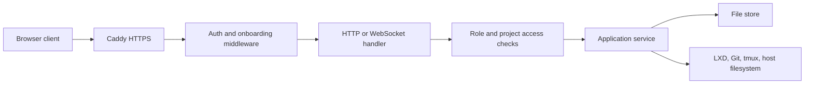
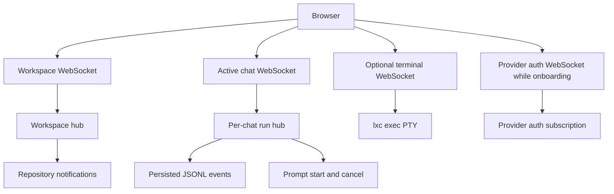
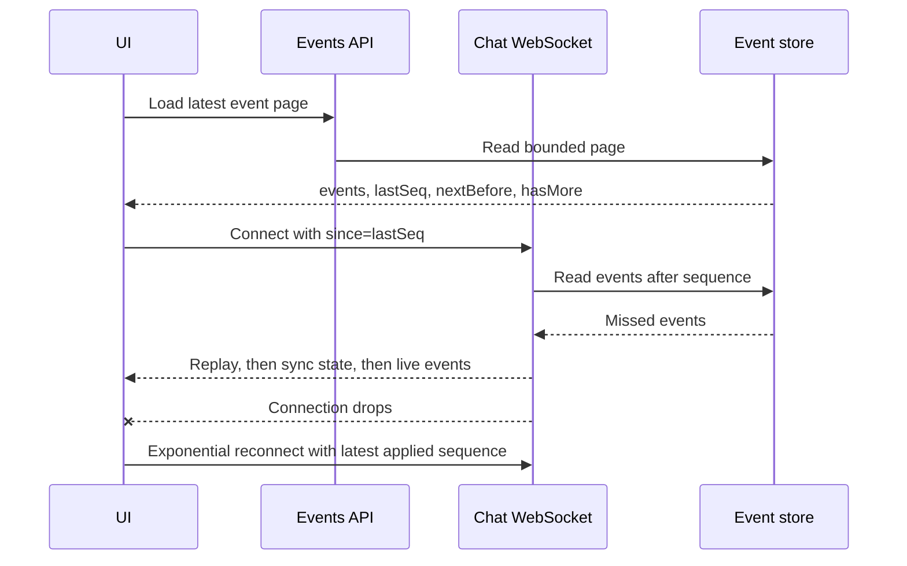

# API and realtime transport

The Go backend serves the embedded SPA, JSON HTTP endpoints, tus uploads, and five WebSocket families from one server.

## Request path

All `/api/*` and `/ws*` requests require a signed session for a registered user. They are also blocked until local-admin setup and at least one provider login are complete, except provider-auth endpoints needed to finish onboarding.

## Authentication routes

| Method | Route | Purpose |
| --- | --- | --- |
| GET | `/auth/me` | Current auth and onboarding status |
| POST | `/auth/local/claim` | Create the local administrator or complete legacy setup |
| POST | `/auth/local/login` | Local administrator password login |
| GET | `/auth/google/login` | Start Google OAuth, optionally preserving a safe return URL |
| GET | `/auth/google/callback` | Validate OAuth state, authorize invited email, and issue session |
| GET | `/auth/logout` | Clear platform cookies and return to the app |
| GET | `/auth/verify` | Caddy forward-auth check; preview hosts also check project membership |
| GET, PUT | `/api/admin/auth/google` | Read or replace Google OAuth configuration; admin only |

## Users and settings

| Method | Route | Purpose |
| --- | --- | --- |
| GET, POST | `/api/admin/users` | List or add registered users; admin only |
| DELETE | `/api/admin/users/{email}` | Remove a user; admin only |
| PUT | `/api/admin/users/{email}/role` | Promote or demote a user; admin only |
| GET, PUT | `/api/admin/resources` | Read or change the fleet resource policy; admin only |
| GET | `/api/admin/audit` | Newest-first page of audit entries, filtered by `actor`, `action` prefix, `target`, `from`, `to`, `limit`, `cursor`; admin only |
| GET | `/api/admin/audit/export` | Stream the stored audit JSONL for a `from`/`to` range as a download; admin only |
| GET, PATCH | `/api/me/settings` | Read or update current user's appearance and chat defaults |
| GET | `/api/server/info` | Host, CPU, memory, storage, network, and process snapshot |

## Agent authentication and skills

| Method | Route | Purpose |
| --- | --- | --- |
| GET | `/api/{provider}/auth-status` | Current host credential and login state |
| POST | `/api/claude/login/start` | Start or resume Claude authorization-code login; admin only |
| POST | `/api/claude/login/code` | Submit Claude authorization code; admin only |
| POST | `/api/claude/login/cancel` | Cancel Claude login; admin only |
| POST | `/api/codex/login/device` | Start Codex device login; admin only |
| POST | `/api/kimi/login/device` | Start Kimi device login; admin only |
| GET | `/api/skills?provider=...&projectId=...` | List accessible provider, project, and global skills |
| GET, POST | `/api/admin/skills-global` | List the global skills library, or publish a skill (JSON files map or zip body); admin only |
| GET, PUT, DELETE | `/api/admin/skills-global/{name}` | Read, replace (files and/or the always-on flag), or delete one global skill; admin only |
| POST | `/api/admin/skills-global/import` | Copy an existing project skill into the global library; admin only |
| GET | `/api/templates` | List project templates and whether each has a pre-built image on this host |

`{provider}` can also be `antigravity` for the generic status binding, but
Antigravity has no host login route. Its status is unavailable by design
because users authenticate `agy` inside each project.

## Project routes

| Method | Route | Purpose |
| --- | --- | --- |
| GET, POST | `/api/projects` | List visible projects or create a project (`{"name","template"}`; an unknown template is a 400) |
| POST | `/api/projects/reorder` | Update project ordering |
| GET, PATCH, DELETE | `/api/projects/{id}` | Read, rename, or admin-delete a project. DELETE is a soft delete: the container is destroyed and the files move to the Trash ([Snapshots and Trash](../02-workspaces/12-snapshots-and-trash.md)) |
| GET | `/api/projects/trash` | Trashed projects with `deletedAt` and `expiresAt`; admins see all, members see theirs |
| POST | `/api/projects/{id}/restore` | Move a trashed project back and re-create its container |
| DELETE | `/api/projects/{id}/purge` | Permanently remove a trashed project and its snapshots; admin only |
| GET, POST | `/api/projects/{id}/snapshots` | List snapshots and running jobs, or start one (`202`) |
| POST | `/api/projects/{id}/snapshots/{sid}/restore` | Replace the project files from a snapshot (`202`); members must send `{"confirm":true}` |
| DELETE | `/api/projects/{id}/snapshots/{sid}` | Delete one snapshot and its archive |
| POST | `/api/projects/{id}/start` | Start or relaunch a project; `?force=1` skips the aggregate resource guard (admin only) |
| POST | `/api/projects/{id}/stop` | Stop a project |
| POST | `/api/projects/{id}/restart` | Force restart or relaunch a project |
| GET | `/api/projects/{id}/container` | Detailed container inspection |
| GET | `/api/projects/{id}/resources` | Effective envelope, project overrides, fleet policy, and live usage |
| PUT | `/api/projects/{id}/resources` | Set or clear CPU, memory, and disk overrides; admin only |
| GET | `/api/projects/{id}/container` | Detailed container inspection, including `template` provisioning status |
| POST | `/api/projects/{id}/repair-network` | Reconfigure container networking and reinspect |
| GET | `/api/projects/{id}/apps` | List externally reachable container listeners |
| GET | `/api/projects/{id}/agent-browser` | Get Agent Browser core/view status and record activity |
| POST | `/api/projects/{id}/agent-browser/start` | Ensure Agent Browser is starting or ready |
| DELETE | `/api/projects/{id}/agent-browser` | Stop the complete Agent Browser |
| DELETE | `/api/projects/{id}/agent-browser?scope=view` | Stop only the noVNC view |
| GET | `/api/projects/{id}/secrets` | List project secrets |
| PUT, DELETE | `/api/projects/{id}/secrets/{key}` | Set or delete one secret |
| GET, POST | `/api/projects/{id}/access` | List members or add a registered email |
| DELETE | `/api/projects/{id}/access/{email}` | Remove a member |
| GET | `/internal/tls-ask?domain=...` | Caddy allow-check for on-demand project certificates |

Every `{id}` project route first requires admin status or project membership. Resource changes, forced starts, project deletion, and purging add an admin-only check; restoring a trashed project deliberately does not, so a member can undo their own accidental delete. A start refused by the aggregate resource guard answers `409`; an override above the fleet ceiling answers `400`. See [Resource limits](../02-workspaces/11-resource-limits.md).

## Chat routes

| Method | Route | Purpose |
| --- | --- | --- |
| GET, POST | `/api/chats` | List visible chats or create a chat |
| GET, PATCH, DELETE | `/api/chats/{id}` | Read, update, or delete chat metadata/history |
| GET | `/api/chats/{id}/events?limit=&before=` | Page persisted events backward by sequence |
| POST | `/api/chats/{id}/rewind` | Remove a selected prompt and later events |
| POST | `/api/chats/{id}/fork` | Copy metadata/history and defer provider-session fork |
| POST | `/api/chats/{id}/read` | Mark current history read |
| POST | `/api/chats/{id}/unread` | Force unread state |
| GET | `/api/chats/{id}/ide-open?path=...` | Validate path and redirect to the correct IDE URL |
| GET | `/api/chats/{id}/media-open?path=...` | Serve supported workspace media inline |
| GET | `/api/chats/{id}/files?path=...` | List a workspace directory |
| GET | `/api/chats/{id}/files/search?q=...` | Search workspace filenames |
| GET | `/api/chats/{id}/files/download?path=...` | Download one file |
| GET | `/api/chats/{id}/files/download-folder?path=...` | Stream a folder ZIP |
| GET | `/api/chats/{id}/history/repos` | Discover workspace Git repositories |
| GET | `/api/chats/{id}/history/commits?repo=&limit=` | List commits |
| GET | `/api/chats/{id}/history/diff?repo=&sha=` | Read one commit patch |
| POST | `/api/chats/{id}/history/checkout` | Optional checkpoint and detached checkout |
| GET, POST | `/api/chats/{id}/schedules` | List the caller's tasks for a project chat, or create one through the user API |

All chat routes resolve the caller and enforce the chat's project membership. Loose chats have no project membership check.

## Scheduled-task routes

| Method | Route | Purpose |
| --- | --- | --- |
| PATCH, DELETE | `/api/schedules/{id}` | Edit/pause/resume or delete a visible owned task; admins can manage all |
| POST | `/api/schedules/{id}/run` | Request an immediate occurrence without moving its regular deadline |
| GET, POST | `/agent-api/schedules` | List or create tasks inside the capability's chat/project fence |
| PATCH, DELETE | `/agent-api/schedules/{id}` | Pause or delete a capability-scoped task; an agent cannot enable it |
| POST | `/agent-api/schedules/{id}/run` | Request a capability-scoped immediate occurrence |
| POST | `/agent-api/schedules/current/complete` | Complete only the task/run named by a `complete-self` capability |

Browser routes use the signed user session. Agent routes require a short-lived
bearer capability issued for one owner, chat, and project; they do not accept a
platform session cookie. Agent-created tasks are forced to `createdByAgent` and
start disabled until a user arms them.

Schedule request bodies cap at 64 KiB and reject unknown fields. Stored prompts
cap at 32 KiB. The service re-checks the owner, chat, project, registration,
and access on every fire.

## Upload and auxiliary routes

| Method | Route | Purpose |
| --- | --- | --- |
| POST, HEAD, PATCH, GET, DELETE | `/api/uploads[/<upload-id>]` | tus resumable upload lifecycle |
| GET | `/__remote_inspector` | Same-origin preview inspection wrapper |
| GET, POST | `/api/sessions` | List or create host tmux sessions |
| DELETE | `/api/sessions/{name}` | Delete tmux session |
| POST | `/api/sessions/{name}/send` | Send text into tmux session |
| POST | `/api/sessions/{name}/upload` | Multipart upload into tmux working directory |

The upload access check happens when the random upload URL is created. Later chunk requests rely on possession of that URL.

## WebSocket routes

| Route | Direction | Messages |
| --- | --- | --- |
| `/ws/workspace` | Server to client | Snapshot, chat upsert/delete, project upsert/delete |
| `/ws/chat/{id}?since=<seq>` | Both | Client `prompt` or `cancel`; server chat events and `sync` |
| `/ws/terminal?chat={id}` | Both | PTY binary data; JSON input and resize control |
| `/ws/{provider}/auth-status` | Server to client | Provider credential and login-state snapshots |
| `/ws?session={name}` | Both | Auxiliary tmux PTY binary data and control messages |

Chat and project-terminal membership is checked before the WebSocket upgrade. Removing a member prevents future checked connections, but the backend does not currently close or reauthorize that member's already-open sockets.

## Realtime channels

## Chat reconnect and replay

The workspace and chat streams send ping frames every 25 seconds. The frontend chat socket reconnects from 400 ms up to 5 seconds and requests only unseen sequences.

## Chat event shapes

| Event | Main fields | Persisted |
| --- | --- | ---: |
| `user` | `text` | Yes |
| `assistant_text` | `text`, optional `messageId` | Yes |
| `thinking` | `text` | Yes |
| `tool_use_start` | `id`, `name`, `input` | Yes |
| `tool_use_end` | `id`, `output`, `isError` | Yes |
| `system` | `subtype`, `data` | Yes |
| `session` | provider and provider session ID | Yes |
| `complete` | usage payload | Yes |
| `error` | message | Usually yes; lock/contention errors may be transient |
| `sync` | `running` | No |

## Common status behavior

- `400`: invalid IDs, paths, values, or JSON.
- `401`: missing or invalid session.
- `403`: valid user without role or project access.
- `404`: missing chat, project, user, file, or repository target.
- `409`: running-chat conflict, dirty Git state, protected last-admin/member guardrail, or duplicate user.
- `412`: onboarding gate is incomplete.
- `413`: upload or request body is too large.

## Code map

- Route composition: [`backend/internal/transport/transport.go`](../../backend/internal/transport/transport.go)
- HTTP server: [`backend/internal/transport/http/server.go`](../../backend/internal/transport/http/server.go)
- Frontend route constants: [`frontend/src/config/routes.ts`](../../frontend/src/config/routes.ts)
- Chat socket: [`backend/internal/transport/ws/chat_socket.go`](../../backend/internal/transport/ws/chat_socket.go)
- Workspace socket: [`backend/internal/transport/ws/workspace_socket.go`](../../backend/internal/transport/ws/workspace_socket.go)
