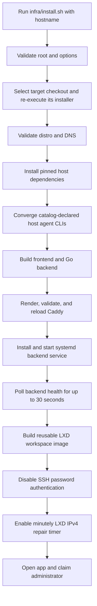
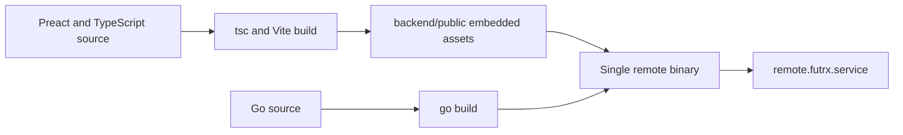
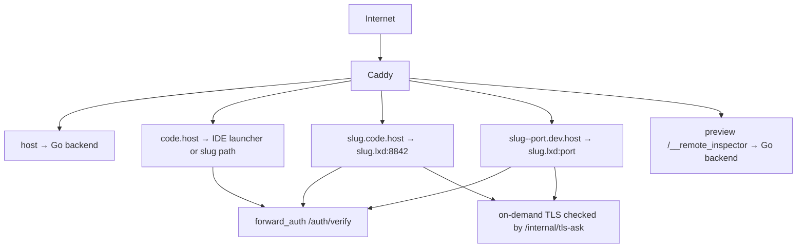
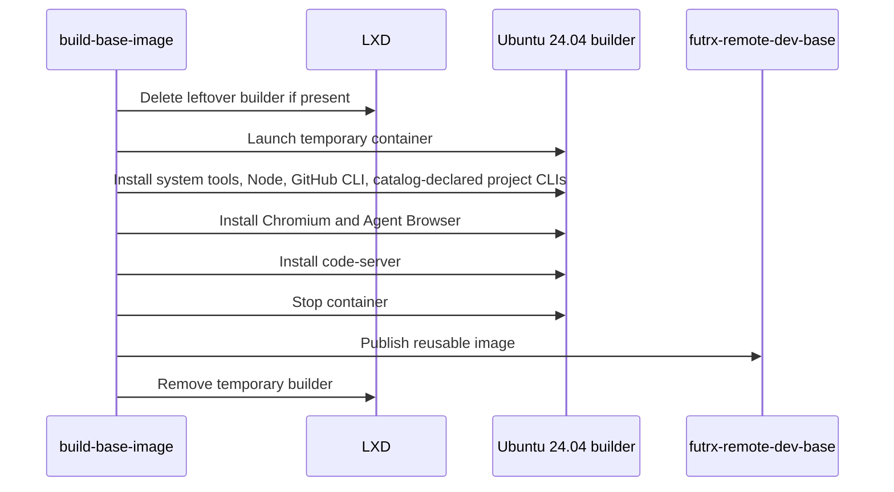
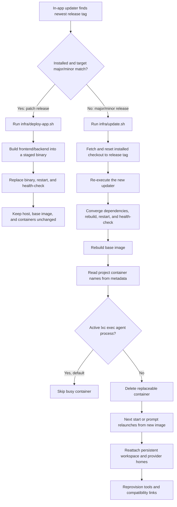
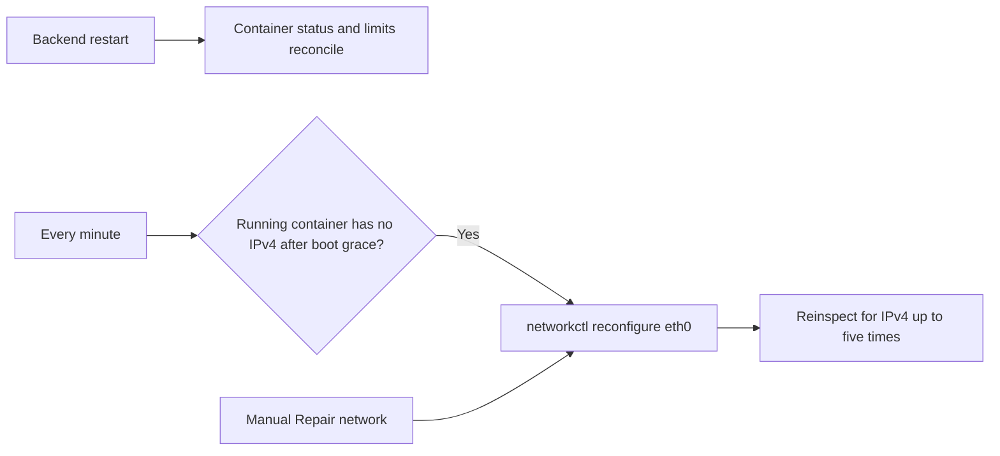

# Deployment and operations

The supported deployment is a root-managed Ubuntu or Debian server with DNS pointing to the host, ports 80 and 443 open, and working SSH key access.

## Installation flow



The curl bootstrap installs Git if needed, clones into `/opt/remote.futrx`, and
re-executes the checked-out installer. Direct repair runs follow the same
select-and-re-execute rule before reading version pins or the agent catalog, so
one convergence cannot mix policy from two commits.

## Installed components

| Component | Purpose |
| --- | --- |
| `/opt/remote.futrx` | Application checkout, built binary, frontend assets, infrastructure scripts, and data |
| `remote.futrx.service` | Go backend on loopback port `7682` by default |
| Caddy | Public HTTPS, compression, authentication, and proxy routing |
| LXD | Project-container runtime and base-image store |
| Catalog-declared host agent CLIs | Local binaries for host-scoped execution and managed authentication |
| `futrx-remote-dev-base` | Reusable Ubuntu workspace image |
| `.lxd` DNS integration | Resolves container names through the LXD bridge |
| `lxc-ipv4-heal.timer` | Repairs running containers that lose IPv4 |
| Main application PWA | Installable chat/control surface, Web Push, and a network-failure offline page |
| code-server launcher PWA | One installable entry point for project IDEs |

## Build flow



The backend embeds the compiled frontend, so Caddy only needs to proxy the main origin to the Go process.

## Host agent CLI convergence

After the host toolchain is available and the target checkout is selected, the
application step builds the explicit compiled-in agent module catalog and runs
`backend/cmd/install-host-agents`, which selects profiles for modules declaring
the `host` execution scope. A host-scoped local CLI module supplies a profile;
a host-only remote integration may omit one and requires no local install.
Each profile originates from the provider's local `NewFactory()`/`Profile()`;
the installer applies the catalog without provider-specific branches.

For each selected profile, the installer runs the provider-declared version
arguments against its application-managed executable under
`/opt/remote.futrx/data/host-clis/bin` and compares the detected semver with the
exact pin (or checks binary existence when version checks are disabled). npm
and standalone-script installers target the same managed prefix. The installer
and backend service put that directory first on `PATH`, and convergence rejects
any state where ordinary command resolution selects a different executable.
The global
`config.AgentOptions.HostCLIVersionTimeout` currently caps each host version
command at 15 seconds. The installer
installs stale/missing npm CLIs at the exact package pin or runs the profile's
pinned install script, then applies the profile's post-install verification
policy with a fresh version-probe budget from that same global setting. The
provider-declared profile timeout bounds only the mutating install command.
Providers are converged sequentially because they share the managed prefix.
Each install runs in an
isolated process group; cancellation terminates its descendants before the
updater returns. Any provider-scoped install or verification error aborts the
infrastructure step. Preview the derived plan without changing the host:

```bash
cd /opt/remote.futrx/backend
go run ./cmd/install-host-agents --plan
```

The same profile CLI policy is consumed by the project base-image and runtime
repair paths, preventing a second provider list from drifting away from host
execution. A CLI pin or module-profile change therefore requires the full
infrastructure update; the application-only deployer does not rerun host
convergence or rebuild project images.

## Public routing



Caddy validates its rendered configuration before replacing the live file. On-demand certificate requests are accepted only for existing project slugs and permitted hostname formats.

## Base-image build



The recipe is generated from the project-scoped module profiles used by
runtime CLI repair. Host convergence uses the host-scoped subset of the same
catalog, keeping provider packages and pins consistent across execution
environments.

## Update flow



Release tags use `MAJOR.MINOR.PATCH`. Crossing a major or minor boundary runs
the full infrastructure updater; movement within one major/minor line runs the
application-only deployer. The decision is relative to the installed version:

| Upgrade | Deployment path |
| --- | --- |
| `0.3.1` → `0.3.2` | Application only |
| `0.3.1` → `0.4.0` | Infrastructure |
| `0.3.1` → `0.4.2` | Infrastructure, because the host missed the `0.4` baseline |
| `0.4.0` → `0.4.2` | Application only |

The application deployer stages the new binary, restores the previous checkout
and binary when restart or health verification fails, and refuses to cross a
major/minor boundary. Unknown and legacy two-component installed versions take
the conservative infrastructure path.

`--include-busy` forces busy workspace recycling. `--skip-workspaces` updates only the host and application. `upgrade-workspaces.sh --dry-run` shows the workspace plan without changing it.

The intended default is to skip active agent containers. The current busy-process matcher expects a different `lxc exec` argument order than the provider commands use, so it may classify an active run as idle. Until that detector is corrected, treat workspace recycling as disruptive: coordinate a maintenance window or use `--skip-workspaces` while runs are active.

The updater intentionally resets the installed application checkout to the
requested tag/ref, defaulting to `origin/main` when none is supplied. The
in-app updater supplies its selected release tag. Persistent application data
and project workspaces live outside the tracked source tree.

## Startup reconciliation

When the backend starts, it:

1. loads file stores and in-memory indexes;
2. builds the agent and container service graph;
3. compares project metadata with LXD state;
4. updates stored project status;
5. loads the fleet resource policy (deriving it from host capacity on first run) and reapplies the managed profile plus project overrides;
6. starts the Agent Browser idle reaper;
7. starts the scheduled-task loop and restores persisted deadlines/claims;
8. begins serving the embedded SPA, API, and WebSockets.

## Container resource guardrails

The per-container envelope is operator policy, not a compile-time constant. It
lives in `DATA_DIR/resources.json`, is derived from this host's real capacity
on the first start that finds no such file, and is edited from
**Settings → Resources** or `PUT /api/admin/resources`. Full reference:
[Resource limits](../02-workspaces/11-resource-limits.md).

| Policy field | Default on first run | Meaning |
| --- | --- | --- |
| `defaults.memory` | host memory minus reserve, clamped to `[1GiB, 4GiB]` | Per-container memory ceiling |
| `defaults.cpu` | whole cores after the reserve, minimum 1 | Per-container core count |
| `defaults.processes` | `2000` | Fork-bomb guard |
| `defaults.disk` | a quarter of the filesystem, clamped to `[5GiB, 20GiB]` | Root-disk quota |
| `hostReserve.memory` | `768MiB` | Memory held back for the backend, LXD, Caddy, and sshd |
| `maxProjectOverride.*` | host capacity | Ceiling for a per-project override |
| `maxRunningContainers` | `0` (unlimited) | Cap on simultaneously running containers |

Two guardrails follow from this policy:

- **Aggregate admission.** Before a container is created or started, the sum of
  the memory ceilings of running containers plus the candidate is compared to
  host memory minus the reserve. A start that would exceed it is refused with
  `409`, which is what stops a host reboot from autostarting every workspace
  into an OOM. An admin can proceed with
  `POST /api/projects/{id}/start?force=1`. The guard fails open when LXD is
  unreachable.
- **Disk quotas need a capable pool.** LXD enforces a root-disk `size` only on
  `btrfs`, `zfs`, `lvm`, or `ceph`. On the `dir` pool that `lxd init --auto`
  often selects, the platform reports "unsupported on this pool" and skips the
  quota rather than failing the launch. Check with:

```bash
lxc profile device get default root pool
lxc storage show "$(lxc profile device get default root pool)"
```

To re-derive the policy after growing the host, stop the backend, delete
`DATA_DIR/resources.json`, and start it again. Editing the file by hand works
too; the backend reads it at startup and normalizes anything out of range.

## Agent capability discovery timeout

Capability discovery probes all registered agents compatible with the selected
host/project execution scope concurrently. One global
deadline applies to each provider's complete probe, including any primary and
fallback commands it runs:

| Environment variable | Default | Meaning |
| --- | ---: | --- |
| `AGENT_CAPABILITY_TIMEOUT` | `30s` | Maximum duration of one provider capability probe; Go duration syntax; `0` disables the deadline |

Set it with a systemd override when slower provider CLIs need more time:

```ini
[Service]
Environment=AGENT_CAPABILITY_TIMEOUT=45s
```

Restarting the service applies the value and also clears the process-local
capability cache. Invalid or negative values fall back to 30 seconds.

## Scheduled-task guardrails

Scheduled tasks are host-owned unattended runs, so the backend applies three
independent limits:

| Environment variable | Default | Meaning |
| --- | ---: | --- |
| `SCHEDULE_MIN_INTERVAL` | `5m` | Minimum time between starts of one recurring task; Go duration syntax |
| `SCHEDULE_MAX_CONCURRENT` | `2` | Simultaneous scheduled runs across all chats |
| `SCHEDULE_MAX_TASKS_PER_PROJECT` | `20` | Non-terminal standing tasks in one project |

An explicit `0` disables a limit. **Run now** bypasses the interval and
concurrency admission limits, but the forced run still counts while active.
Terminal completed/exhausted/error definitions do not consume the
per-project task quota.

Create a systemd override rather than editing the installed unit template:

```bash
sudo systemctl edit remote.futrx
```

```ini
[Service]
Environment=SCHEDULE_MIN_INTERVAL=10m
Environment=SCHEDULE_MAX_CONCURRENT=1
Environment=SCHEDULE_MAX_TASKS_PER_PROJECT=10
```

Then apply it:

```bash
sudo systemctl daemon-reload
sudo systemctl restart remote.futrx
```

## Audit-log retention

The backend keeps an append-only audit trail under `DATA_DIR/audit/`, one JSONL
file per calendar month. A janitor goroutine runs at startup and every 24 hours
and deletes whole monthly files that fall outside the retention window.

| Environment variable | Default | Meaning |
| --- | ---: | --- |
| `AUDIT_RETENTION_MONTHS` | `12` | Monthly audit files to keep, including the current one; `0` disables pruning and keeps every file |

Retention deletes files rather than truncating them, so export or copy them
before shortening the window. See [Audit log](10-audit-log.md) for the entry
format, the action names, and the admin API.

Restarting the backend interrupts control of interactive and scheduled runs.
Use a maintenance window. Before raising the limits, account for the fact that
each scheduled occurrence can start a project container and consume provider
quota, CPU, memory, network, and disk without an open browser.

## Project health monitor

A background sweep turns each **running** project into one traffic light, so a
container quietly running out of memory shows up in the sidebar instead of
being discovered when an agent turn fails.

| Environment variable | Default | Meaning |
| --- | ---: | --- |
| `HEALTH_MONITOR_INTERVAL` | `1m` | How often the monitor sweeps running projects; Go duration syntax. An explicit `0` disables it entirely |

One sweep costs, per running project, three `lxc query` calls (state, limits,
live counters), one `lxc exec` listener scan, and one `HEAD
http://<slug>.lxd:<port>/` with a three-second timeout against the lowest
non-platform listening port. Sweeps are jittered by roughly a tenth of the
interval so a rebooted host does not fire every check on the same second, and a
project that hangs every probe is abandoned after 20 seconds so the projects
behind it are still measured. Nothing here polls per second, and no probe runs
the per-agent version checks that a full container inspection does.

| Status | Raised when | Sidebar dot |
| --- | --- | --- |
| `ok` | Everything measured is inside its threshold | green |
| `warn` | Memory at or above 80% of the container limit, or the app answered 5xx | amber |
| `crit` | Memory at or above 92%, the project is in an error state, the container is missing, or a listening port refuses the request | red |
| `unknown` | Nothing could be measured, usually a brief LXD outage | grey |

A status must hold for **two consecutive sweeps** before it is published, so a
single allocation spike or one failed `lxc` call changes nothing. Each settled
transition into `warn` or `crit`, and each recovery to `ok`, publishes one
`projectHealth` notification. See
[Notifications](../02-workspaces/07-notifications.md#project-health).

Switching the monitor off stops the sweeps, the dots, and the alerts, and
leaves every other subsystem untouched:

```bash
sudo systemctl edit remote.futrx
```

```ini
[Service]
Environment=HEALTH_MONITOR_INTERVAL=0
```

```bash
sudo systemctl daemon-reload
sudo systemctl restart remote.futrx
```

Read the whole fleet's current verdicts in one call with
`GET /api/projects/health`. Its `enabled` field reports whether the monitor is
running at all, and Settings -> Notifications shows the same warning beside the
**Project health** toggle.

## Health and recovery



The server-info settings page reports host, CPU, memory, storage, network, and Go-process metrics. The project page reports the corresponding per-container diagnostics, and its Resources panel pairs them with the limits actually enforced. The health monitor above turns the same per-container numbers into the status dots beside each project in the sidebar.

## Backups and restore

`infra/steps/08-backup.sh` installs `remote-backup`, `remote-restore` and a nightly `remote-backup.timer` (03:30 UTC, ±20 min). A snapshot lands in `/var/backups/remote/<UTC-timestamp>/`:

| Part | Contents | Consistency |
| --- | --- | --- |
| `data.tar.zst` | `DATA_DIR` — users, projects, chats, secrets, session key, scheduled tasks | backend stopped for the seconds it takes to tar (containers, previews and IDEs stay up because of `KillMode=process`) |
| `projects.tar.zst` | `/var/lib/remote/projects/<slug>/{workspace,agent-home}` | live (agents may be writing; tar tolerates changed/removed files) |
| `hostcfg.tar.zst` | provider tokens (`/root/.claude*`, `.codex`, `.kimi-code`), Caddyfile, systemd units, LXD profile + container list | live |
| `containers/*.tar.gz` | `lxc export` of every container — only with `--with-containers` / `WITH_CONTAINERS=1` | live |
| `manifest.json`, `SHA256SUMS` | metadata + checksums | — |

Retention keeps the newest `KEEP_DAILY` (7) snapshots plus one per ISO week for `KEEP_WEEKLY` (4) weeks. Set `RCLONE_TARGET` in `/etc/remote-backup.env` (after `rclone config` as root) to copy each snapshot offsite; local disk is not a backup of the host itself.

```bash
remote-backup                       # snapshot now (prints the snapshot dir)
remote-backup --with-containers     # also export containers (slow, large)
remote-restore /var/backups/remote/<ts>            # data + projects + provider tokens
remote-restore /var/backups/remote/<ts> --data     # only DATA_DIR
```

`remote-restore` verifies checksums, stops the backend, moves the existing `DATA_DIR` / projects dir aside as `*.pre-restore-<ts>`, extracts, re-chowns workspaces to the container idmap (uid 1000000), and restarts. Containers are recreated from the base image on demand; workspaces and agent homes are bind-mounted back in.

`infra/steps/09-host-swap.sh` adds a 4 GiB swapfile (swappiness 10) on hosts with < 8 GiB RAM and no swap, so a busy container degrades instead of OOM-killing the host.

## Security controls

- The backend listens on loopback by default; Caddy is the public entry point.
- Platform sessions use secure, HTTP-only cookies.
- Preview and IDE requests use forward authentication; preview authorization is project-aware, while IDE authorization currently accepts any registered user.
- Platform cookies are removed before container proxying.
- Internal Caddy helper routes are denied externally.
- Secret, auth, access, audit, and user files use restrictive permissions.
- SSH password and keyboard-interactive authentication are disabled after install.
- On-demand TLS issuance is restricted to valid, existing project hosts.
- Project containers are unprivileged and receive host workspaces through mapped ownership.
- Project containers currently share the LXD bridge without lateral ACLs; code-server and noVNC rely on Caddy for public authentication and do not independently authenticate direct bridge traffic.

## Operational commands

```bash
systemctl status remote.futrx
systemctl status caddy
journalctl -u remote.futrx -f
sudo bash /opt/remote.futrx/infra/update.sh
sudo bash /opt/remote.futrx/infra/deploy-app.sh --ref=0.4.2
sudo bash /opt/remote.futrx/infra/upgrade-workspaces.sh --dry-run
```

## Code map

- Installer: [`infra/install.sh`](../../infra/install.sh)
- Application deployer: [`infra/deploy-app.sh`](../../infra/deploy-app.sh)
- Updater: [`infra/update.sh`](../../infra/update.sh)
- Workspace upgrade: [`infra/upgrade-workspaces.sh`](../../infra/upgrade-workspaces.sh)
- Systemd template: [`infra/templates/remote.futrx.service.tmpl`](../../infra/templates/remote.futrx.service.tmpl)
- Base-image builder: [`backend/internal/service/container/image/builder.go`](../../backend/internal/service/container/image/builder.go)
- Audit store: [`backend/internal/stores/fileaudit/store.go`](../../backend/internal/stores/fileaudit/store.go)
- Project health monitor: [`backend/internal/service/health`](../../backend/internal/service/health)
