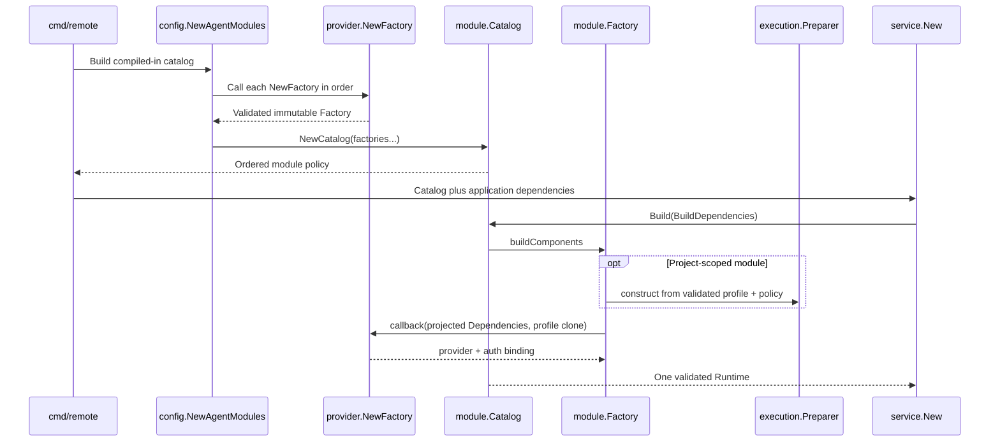

# Module contract and registration

An agent becomes part of Remote only through an explicitly registered
provider-owned factory. Registration builds one ordered catalog that supplies
runtime providers, authentication bindings, capability metadata, and
provisioning profiles without maintaining separate provider lists.

## Contract layers

The narrow runtime contract is [`agent.Provider`](../../../backend/internal/agent/model.go):

```go
type Provider interface {
    ID() ProviderID
    Capabilities(context.Context, CapabilityRequest) (Capabilities, error)
    Run(context.Context, RunRequest, func(Event)) error
}
```

`ProviderID` is an open string type rather than a closed enum. A valid ID starts
with a lowercase ASCII letter and then contains only lowercase letters, digits,
or hyphens. Valid syntax alone does not enable a provider: catalog membership
is the application-level allowlist.

The module layer wraps that runtime contract with platform policy:

| Type | Responsibility |
| --- | --- |
| [`Descriptor`](../../../backend/internal/service/agent/module/factory.go) | Stable identity and label, default, execution scopes, auth policy, feature support, and skill metadata |
| [`Factory`](../../../backend/internal/service/agent/module/factory.go) | Immutable descriptor, provisioning profile, project-preparation policy, and callback that constructs runtime/auth components from narrowed dependencies |
| [`FactoryBuilder`](../../../backend/internal/service/agent/module/factory.go) | Compile-time signature for each provider package's `NewFactory` constructor |
| [`Catalog`](../../../backend/internal/service/agent/module/catalog.go) | Ordered definition validation plus project/host profile projections |
| [`Runtime`](../../../backend/internal/service/agent/module/catalog.go) | One encapsulated, validated view for provider lookup, auth bindings, descriptors, defaults, scopes, and features |

A factory owns declarations and the construction boundary, not infrastructure
mechanisms. Its profile says what the provider needs; generic host and
container services decide how and when to apply that policy. For project
scope, the module factory constructs
[`service/agent/execution.Preparer`](../../../backend/internal/service/agent/execution/preparer.go)
from the exact validated profile and the adapter's
`ProjectPreparationPolicy`.

The provider build callback is the adapter-to-service seam. It receives only
`ProjectPreparer`, the optional post-run `CredentialCollector`, and the global
credential-sync timeout. It never receives `ProjectResolver` or the full
container-provisioning ports. Native CLI flags, stdin/positional prompt
handling, wire protocols, and output parsing stay inside the concrete adapter.

## Explicit registration

[`config.NewAgentModules`](../../../backend/internal/config/agents.go) is the
composition root for compiled-in integrations:

```go
builders := []module.FactoryBuilder{
    claude.NewFactory,
    codex.NewFactory,
    minimax.NewFactory,
    kimi.NewFactory,
    antigravity.NewFactory,
}
```

It calls every builder in order and passes the resulting factories to
`module.NewCatalog`. There is deliberately no automatic package discovery.
This makes the enabled set and its presentation order reviewable in one small
file and prevents import order from changing application behavior.



Application startup begins this flow in
[`backend/cmd/remote/main.go`](../../../backend/cmd/remote/main.go). The command
also gives `Catalog.Profiles()` to the project container stack. During service
composition, [`services.go`](../../../backend/internal/service/services.go)
adapts project services to the narrow `agent.ProjectResolver`, calls
`Catalog.Build`, and distributes the resulting `Runtime` through narrow
consumer interfaces. The provider and auth registries remain private inside
the runtime, so callers cannot combine components built from different
catalogs.

Other commands build the same catalog rather than re-declaring agents:

| Consumer | Catalog view |
| --- | --- |
| [`build-base-image`](../../../backend/cmd/build-base-image/main.go) | `Profiles()` for project-scoped CLI and image policy |
| [`upgrade-workspaces`](../../../backend/cmd/upgrade-workspaces/main.go) | `Profiles()` for replacement-container provisioning |
| [`install-host-agents`](../../../backend/cmd/install-host-agents/main.go) | `HostProfiles()` for host-scoped local CLIs |
| Prompt and chat services | Provider lookup, default selection, execution scope, session/fork and feature policy |
| Auth transport and onboarding | Ordered descriptors, bindings, and access-gate readiness |
| Capability catalog | Scope-filtered runtime providers plus descriptor metadata |

## Validation stages

`module.NewFactory` defensively copies the descriptor and rejects local
contract errors:

- invalid ID, empty label, missing or repeated execution scopes;
- a default provider without host scope;
- a project scope without a profile, or a profile with another identity;
- incomplete CLI policy, unsafe version arguments, invalid install mode, or
  non-positive install/wait timeouts;
- duplicate persistent-state fields within the profile;
- unknown auth or skill modes, auth instructions inconsistent with the mode,
  external auth claiming to satisfy the access gate, or fork without resume;
- a nil factory option, project-preparation policy on a host-only module,
  Browser MCP preparation without `BrowserTools`, or credential hooks/error
  overrides without a credential policy;
- a missing build callback.

`module.NewCatalog` then checks relationships between factories: duplicate
provider IDs, multiple defaults, missing builders, and duplicate or overlapping
persistent-state devices, host directories, or container paths.

Finally, `Catalog.Build` accepts application-facing `BuildDependencies`:
`ProjectResolver`, full `ContainerDependencies`, and the global credential-sync
timeout. Each factory constructs its project preparer and projects only
`ProjectPreparer`, `CredentialCollector`, and the timeout into the provider
callback. It then verifies the result: the runtime provider ID must match the
descriptor; managed/external modes must return a binding with the same ID and
expected flow; `AuthNone` must return no binding. Provider and auth registration
is atomic from the caller's perspective: an error prevents the incomplete
runtime from being returned.

Authenticated deployments additionally call `Catalog.ValidateAccessGate`.
At least one module must offer an observable managed or no-auth path through
onboarding. External authentication cannot satisfy that requirement because
Remote cannot authoritatively observe its state.

## Ordering, defaults, and immutability

The catalog preserves registration order in descriptors, provider capability
probes, auth cards, and profile projections. `DefaultProvider(scope)` returns
the compatible module explicitly marked as default; when none is marked, it
returns the first module supporting that scope.

Factories and catalogs retain defensive copies of descriptors and profiles.
Every `Catalog.Build` invokes the provider callbacks again, so mutable auth or
provider state is fresh and internally consistent. The factory gives the
preparer and callback independent deep clones of the validated profile; neither
can mutate catalog policy or the other's snapshot. The returned `Runtime`
encapsulates both registries and delegates metadata policy to the same catalog.

Continue with [Adding an agent](07-adding-an-agent.md) for the implementation
sequence and with [Features and platform consumers](06-features-and-platform-consumers.md)
for every descriptor field's downstream effect.

## Main source locations

- [`backend/internal/agent/model.go`](../../../backend/internal/agent/model.go)
- [`backend/internal/agent/identity.go`](../../../backend/internal/agent/identity.go)
- [`backend/internal/agent/registry.go`](../../../backend/internal/agent/registry.go)
- [`backend/internal/integration/agents/`](../../../backend/internal/integration/agents)
- [`backend/internal/service/agent/module/factory.go`](../../../backend/internal/service/agent/module/factory.go)
- [`backend/internal/service/agent/module/catalog.go`](../../../backend/internal/service/agent/module/catalog.go)
- [`backend/internal/service/agent/execution/preparer.go`](../../../backend/internal/service/agent/execution/preparer.go)
- [`backend/internal/config/agents.go`](../../../backend/internal/config/agents.go)
- [`backend/internal/service/services.go`](../../../backend/internal/service/services.go)
