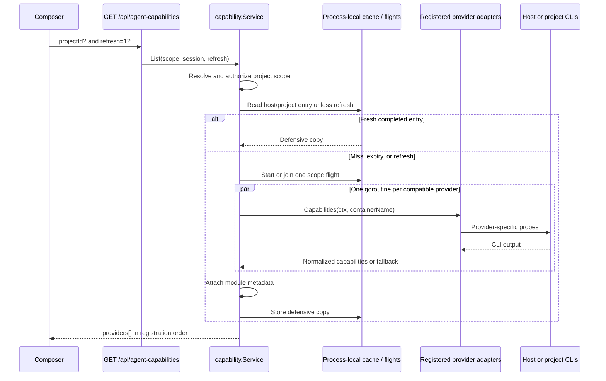

# Capabilities, cache, and refresh

Remote does not keep a compiled frontend list of provider models. The backend
asks each registered provider adapter for its current catalog, whether that is
discovered from an installed CLI/account or declared by the provider adapter,
normalizes those answers, and exposes one catalog to every client.

The main contracts are:

- [`agent.CapabilityProvider`](../../../backend/internal/agent/model.go) and the
  normalized models in
  [`capability_model.go`](../../../backend/internal/agent/capability_model.go);
- the host/container command boundary in
  [`integration/agents/runtime/capability_command.go`](../../../backend/internal/integration/agents/runtime/capability_command.go);
- aggregation, authorization, deadlines, and descriptor decoration in
  [`service/agent/capability/service.go`](../../../backend/internal/service/agent/capability/service.go);
- completed-result caching in
  [`cache.go`](../../../backend/internal/service/agent/capability/cache.go) and
  in-flight request coalescing in
  [`flight.go`](../../../backend/internal/service/agent/capability/flight.go).

## Request and discovery flow

The endpoint is `GET /api/agent-capabilities`:

- no `projectId` means host discovery for a loose chat;
- `projectId=<id>` loads that project, verifies the caller is an administrator
  or project member, and probes its current container;
- `refresh=1` bypasses a completed backend cache entry.

A project capability request does **not** start a stopped or missing container.
The adapters still run their `lxc exec` probes, which normally produce
fallback/degraded results. Start the project first, then refresh.

Capability discovery deliberately bypasses `agent.ProjectPreparer` and
`runtime.BuildContainerCommand`: it does not reconcile lifecycle, provision
CLIs or credentials, publish workspace assets, or load project secrets.
Provider probes use
[`runtime.NewCapabilityCommand`](../../../backend/internal/integration/agents/runtime/capability_command.go)
to run directly on the host or in the already-running selected container.

The cache key is `host` or
`project:<project-id>:<container-name>`. Providers that do not declare the
selected `host` or `project` execution scope are filtered before discovery.
The remaining providers are probed concurrently, while their results retain
the catalog's explicit registration order.

Provider probe failures do not fail the whole HTTP request. An adapter returns
the best conservative catalog it can, normally with `source: "fallback"` or a
short `warning`. The aggregator makes the registered provider ID and module
label authoritative, attaches descriptor metadata, changes missing sources to
`fallback`, and turns nil model/mode slices into JSON arrays. Top-level errors
are reserved for request failures such as a missing project or denied access.

## Provider-specific parsing

All command output is parsed inside the provider package. The shared catalog
never parses a provider protocol.

| Provider | Primary discovery | Fallback and partial behavior |
| --- | --- | --- |
| Claude | Runs local `/model`, parses its available selection aliases, and resolves each alias to a versioned display label with up to four workers. It runs `/effort` in parallel. | `--help` can supply effort choices. Failure to read `/model` uses the conservative built-in selection catalog; unresolved aliases keep fallback labels and a warning. Fast mode is exposed only on eligible Auto/Opus choices. |
| Codex | Starts `codex app-server`, initializes the experimental API, reads every paginated `model/list` page, and requests `collaborationMode/list`. Model records retain per-model efforts, service tiers, and defaults. | `codex debug models` is the structured model fallback when app-server discovery fails. It cannot supply collaboration modes, so the result carries a warning. Total failure returns an Auto-only fallback. Capability probes explicitly clear `OPENAI_API_KEY`. |
| MiniMax | Returns the provider-owned `MiniMax-M3` catalog with Think-Off/Adaptive reasoning and Default/Plan modes. It is project-scoped and performs no credential-bearing discovery probe. | The backend may cache the same static catalog before setup, but the frontend presents MiniMax as locked and withholds its model UI until managed auth reports a key; launch performs the authoritative key check. |
| Kimi | Reads `kimi provider list --json`; the plain `provider list` supplies the configured default, and `kimi --help` supplies the Plan hint. Aliases and their overrides are normalized into model records. | Failure of the JSON catalog returns an Auto-only fallback. Failure of only the plain/help commands preserves models and adds a warning. |
| Antigravity | Parses model display names from `agy models` and effort/mode choices from `agy --help`. | When the model command fails, the adapter returns fallback controls plus an `unavailableReason` explaining where to sign in. Project sign-in happens in the project terminal. |

Host probes execute the provider binary directly and inherit the backend
environment plus provider overrides. Project probes use `lxc exec --cwd
/workspace`, passing only explicitly declared environment overrides to that
invocation. See each provider's `capabilities.go` and `capability_parser.go`;
Claude also uses `model_catalog.go` and `effort_catalog.go`, while Codex uses
`capability_app_server.go` and `capability_debug.go`.

The normalized response carries:

- provider identity, label, source, warning, and optional unavailable reason;
- models with their own reasoning-effort and service-tier choices and defaults;
- provider-native modes;
- module metadata: default flag, execution scopes, authentication policy,
  session support, skill strategy, Browser tools, and scheduled tools.

`version` exists as an optional response field, but the current provider
capability adapters do not populate it. Installed-version enforcement belongs
to provisioning, not model discovery.

## One global capability deadline

`AGENT_CAPABILITY_TIMEOUT` is the only capability-discovery timeout policy. It
uses Go duration syntax, defaults to `30s`, and accepts `0` to disable the
catalog-level deadline. Invalid or negative values fall back to `30s`.
[`config.Load`](../../../backend/internal/config/config.go) parses it into the
global `AgentOptions`; service composition passes that value to the capability
catalog once, rather than reading a timeout from each provider package.

The deadline applies independently to each provider's **complete** discovery
operation, not to each subprocess. Primary commands, pagination, alias
resolution, and fallbacks all share that provider's one context. Since
providers run concurrently, a slow provider does not consume another
provider's budget.

The per-profile `InstallTimeout` and `WaitTimeout`, provider login timeouts,
and normal agent-run lifecycle are separate policies. They must not be used as
capability deadlines.

An in-flight discovery leader uses a context detached from the first browser's
cancellation. A navigating browser may stop waiting, but the shared work
continues for other callers and can populate the cache. The per-provider
deadline remains the backstop. Disabling it with `0` therefore also removes
that backstop.

## Backend cache semantics

The authoritative cache is memory inside the backend process. It is not stored
in the database, on disk, or in Redis.

| Result for one scope | TTL |
| --- | ---: |
| Every provider is `live` and warning-free | 24 hours |
| Any provider is fallback or has a warning | 2 hours |

These TTL defaults live in `config.AgentOptions` and are injected into the
capability service at startup. The shorter TTL applies to the **whole scope
catalog**, not only the degraded provider. Expiry is lazy: the next read
deletes the expired entry and starts discovery. Values are cloned on both
store and return so a consumer cannot mutate shared cache state.

Concurrent requests for the same scope share one discovery flight. Flights
are removed as soon as they complete; the completed cache then owns
freshness. A refresh does not start a competing second probe when a flight for
that scope is already running—it joins the existing flight, whose result
replaces the completed entry.

There is no cache-delete API. Restarting or deploying the backend clears all
entries because the cache is process-local.

## Frontend state and invalidation

The frontend store in
[`agentCapabilityCatalogStore.ts`](../../../frontend/src/state/agents/agentCapabilityCatalogStore.ts)
is a presentation cache, not the freshness authority. It is held only for the
open page, keyed by normalized user plus host/project scope. It keeps the last
catalog visible during reloads, coalesces duplicate browser requests, and is
lost on page reload.

| Event | What happens |
| --- | --- |
| A composer scope mounts | The frontend requests the scope; the backend may serve its valid entry. |
| **Refresh models** | Sends `refresh=1`, bypassing a completed backend entry. |
| A managed provider's authenticated state changes, or a login reaches completed with a new start revision | Every currently observed scope for that user is force-refreshed. Intermediate URL/code/error/warning changes alone do not trigger it. |
| Sidebar **Start project** | That project's scope is force-refreshed after start succeeds. |
| Project is deleted | The frontend removes its page-memory entry. |
| Backend restarts/deploys | All backend entries disappear; the next request discovers again. |

The following changes do not emit a general backend invalidation event:

- installing or changing a CLI without restarting the backend;
- account entitlement or provider configuration changes;
- Project workspaces Start/Restart actions outside the sidebar path;
- credentials propagated into a container later during an agent run;
- a login completed manually in a project terminal, including Antigravity.

Use **Refresh models**, wait for the TTL, or restart the backend in those
cases. For terminal-based project login, refresh after the login completes so
the probe sees the container's new state.

## Tests to extend

When changing discovery or cache behavior, keep tests close to the owning
layer:

- provider probe/parser tests under `backend/internal/integration/agents/<provider>/`;
- aggregation, timeout, fallback, cache, authorization, and flight tests under
  `backend/internal/service/agent/capability/`;
- HTTP query/error mapping in
  `backend/internal/transport/http/handlers/agent_capabilities_handler_test.go`;
- page-memory coalescing and invalidation in
  `frontend/src/state/agents/agentCapabilityCatalogStore.test.ts`;
- selector correction in `frontend/src/state/chat/agentCapabilityState.test.ts`.
