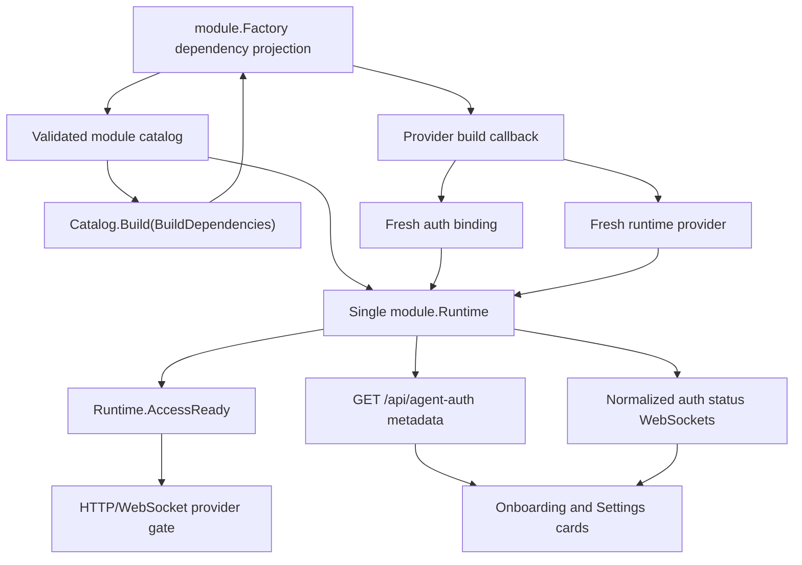

# Authentication and access

Agent authentication is declared by each provider module but executed through
provider-neutral services and transports. A factory chooses one supported auth
mode, builds the matching binding together with its runtime provider, and
lets the shared registry expose status and actions without provider-specific
frontend branches.

This is distinct from Remote user authentication. A user first needs a valid,
registered Remote session; the provider gate then decides whether the rest of
the application may open.

## Auth contract

The descriptor contract is in
[`module/factory.go`](../../../backend/internal/service/agent/module/factory.go), and
the runtime binding is in
[`auth/binding.go`](../../../backend/internal/service/agent/auth/binding.go).

| Descriptor mode | Binding | Behavior | May satisfy onboarding gate? |
| --- | --- | --- | --- |
| `managed-code` | `NewCodeBinding` | Remote starts an interactive CLI, extracts an authorization URL, accepts a pasted code, and streams status. | Yes |
| `managed-device` | `NewDeviceBinding` | Remote starts a device-login CLI, extracts its URL/code, waits for completion, and streams status. | Yes |
| `external` | `NewExternalBinding` | The provider owns login outside Remote's managed flow. The binding exposes no mutation or live status service. | No |
| `none` | No binding | No provider sign-in is required. The generic auth catalog reports the module ready. | Yes, when explicitly declared |

Every non-`none` descriptor must provide user-facing `AuthInstructions` and a
binding with the same provider ID and matching flow. Managed bindings must be
available; `none` must not build one. Factory/runtime construction fails when
those identities or modes drift.

An external module cannot declare `SatisfiesAccessGate`: Remote has no
authoritative status signal with which to open the gate. A catalog used by an
authenticated deployment must contain at least one managed or no-auth module
marked as a gate provider, otherwise service startup fails. Multiple modules
may be eligible; the gate opens when any one is ready.

## Startup and access-gate flow



`module.Catalog.Build` creates one `module.Runtime` atomically from the same
ordered factories. That runtime keeps the provider and auth registries private
and exposes consistent bindings, descriptors, readiness, and lookup methods.
Auth services are fresh for each runtime; packages must not retain mutable
login state in a global singleton.

When Remote user authentication is enabled, middleware applies the gates in
this order:

1. the caller has a valid Remote session;
2. the account is registered;
3. local-administrator setup is complete;
4. at least one module declared as an access gate is ready.

Agent-auth routes stay reachable before step 4 so onboarding can be completed.
Reading the auth catalog/status is available to registered users after local
admin setup. Starting, submitting, or canceling a managed login is restricted
to administrators. When application auth is disabled, those mutation handlers
allow the local caller.

The frontend calculates the same readiness from `GET /api/agent-auth`: a gate
provider must have `status.authenticated: true`. `none` modules receive that
status synthetically. The shared cards are visible to registered users, but
the backend permits login mutations only for administrators; a non-admin
member must wait for an administrator to complete provider setup.

## HTTP and WebSocket surfaces

The normalized catalog is:

```text
GET /api/agent-auth
```

It returns providers in module registration order with ID, label, default,
execution scopes, auth mode/instructions/gate policy, and normalized status.

Existing managed flows use provider-derived mutation routes:

```text
POST /api/<provider>/login/start    # managed-code
POST /api/<provider>/login/code     # managed-code
POST /api/<provider>/login/cancel   # managed-code
POST /api/<provider>/login/device   # managed-device
```

`/ws/agent-auth/<provider>` streams the stable normalized `Snapshot` used by
the frontend. The older `/api/<provider>/auth-status` and
`/ws/<provider>/auth-status` routes expose provider-specific status payloads
for compatibility. External bindings have no live stream or login mutations;
their catalog entry supplies instructions instead. A `none` module has no auth
binding and therefore no provider-specific routes.

Route registration is generic and iterates the built runtime bindings. Adding
another provider that uses an existing mode does not require another handler,
WebSocket implementation, frontend card, or route constant.

## Current provider behavior

| Provider | Mode | Host login and readiness | Project behavior |
| --- | --- | --- | --- |
| Claude | `managed-code` | Runs `claude auth login --claudeai` in a PTY, reads the Anthropic URL, and accepts the pasted authorization code. A Claude credential file under `~/.claude` marks it authenticated. | Host credentials are seeded to the project on launch/run and successful project runs may sync updated files back. |
| Codex | `managed-device` | Runs `codex login --device-auth` with `OPENAI_API_KEY` removed. A non-empty auth mode other than `apikey` is considered authenticated. Malformed or mode-less JSON currently becomes `unknown` and also passes this readiness check; API-key auth produces a warning and is not considered authenticated. | An explicitly API-key host record blocks launch and `OPENAI_API_KEY` is cleared. A newer project-local `auth.json` is not pre-inspected and can still be used; after a successful run its pull-back error is only logged. |
| MiniMax | `managed-api-key` | An admin submits or removes a write-only Token Plan subscription key in Settings. Remote rejects keys without the documented `sk-cp-…` prefix, then verifies the key with the non-generation `GET /v1/token_plan/remains` endpoint before saving it; status exposes only whether a validated supported key exists. Standard pay-as-you-go API keys are unsupported. | Project-only. The host-managed key is injected as an environment variable into the isolated Codex process and is not written into its generated model catalog. |
| Kimi | `managed-device` | Runs `kimi login`; any regular file under `~/.kimi-code/credentials` marks it authenticated. | The persistent project home can retain project-only credentials. Host credentials are synchronized according to the profile's directory policy. |
| Antigravity | `external` | Remote has no managed host login/status UI. An operator-prepared host login may support loose chats, but is outside the normal product flow. | Run `agy` in the project terminal and complete its URL/code flow. State survives replacement in the project's persistent Antigravity directory; refresh models afterward. |

Claude, Codex, Kimi, and MiniMax host identities are installation-wide singletons. They
are not per Remote user, and their credentials are shared with projects through
the provisioning policy. Antigravity's supported login is project-local and
shared with everyone who can access that project.

## Auth timeout ownership

Authentication handshakes have provider-specific lifecycle limits because the
upstream protocols differ. These are intentionally unrelated to the global
capability-discovery deadline:

| Provider | Relevant current limits |
| --- | --- |
| Claude | 15 seconds to observe the URL, 10 minutes for the login process, 30 seconds to exit after code submission |
| Codex | 8 seconds to observe device-login details, 16-minute process limit, 15-minute displayed login TTL |
| Kimi | 8 seconds to observe device-login details, 30-minute process limit, 29-minute displayed login TTL |

The shared `CodeService` owns PTY/session lifecycle, state subscriptions,
cancellation, and sanitized/truncated provider-facing errors. The shared
generic `DeviceService` owns device process lifecycle and subscriptions;
provider config supplies command syntax, URL/code patterns, authentication
detection, and completion wording.

`AGENT_CAPABILITY_TIMEOUT` does not alter login duration, credential transfer,
CLI installation, or normal agent runs.

## Authentication changes and model discovery

Authentication and capability caching are separate backend subsystems. The
frontend force-refreshes every currently mounted capability scope for that
browser/user when a managed provider's authenticated flag changes, or when a
login reaches completed with a new start revision. Intermediate URL, code,
error, and warning changes do not trigger that refresh. It does not globally
delete the backend cache or proactively seed every project container.

The next provider run performs profile-driven credential preparation. A manual
terminal login is not visible to the managed auth registry, so use **Refresh
models** after it. See
[`03-capabilities-cache-and-refresh.md`](03-capabilities-cache-and-refresh.md)
for the complete invalidation rules and
[`05-provisioning-and-updates.md`](05-provisioning-and-updates.md) for credential
placement.

## Adding authentication for a provider

When an existing mode fits:

1. Implement the provider-owned `NewAuth()` configuration when using a managed
   flow, or create an external binding when login is provider-owned.
2. Declare the mode, instructions, and gate eligibility in the provider's
   `NewFactory()`.
3. Build the binding inside the factory callback and use the exact descriptor
   provider ID.
4. Add provider auth tests and factory/catalog identity tests.
5. If credentials must reach project containers, describe them in `Profile()`;
   auth transport itself must not call LXD.

A fundamentally different login protocol is a contract change. Add a new
module auth mode, binding operations and normalized snapshot semantics, generic
HTTP/WebSocket behavior, frontend rendering/actions, access-gate validation,
and tests as one deliberate feature. Do not hide a new protocol behind one of
the existing mode names.

Relevant code:

- provider-neutral binding and registry:
  `backend/internal/service/agent/auth/{binding,registry}.go`;
- shared code/device services:
  `backend/internal/service/agent/auth/{code,device}.go`;
- provider configurations: `backend/internal/integration/agents/<provider>/auth.go`;
- HTTP catalog/actions:
  `backend/internal/transport/http/handlers/agent_auth_handler.go`;
- status WebSockets: `backend/internal/transport/ws/agent_auth_socket.go`;
- frontend orchestration:
  `frontend/src/state/hooks/auth/useAgentAuthRegistry.ts` and
  `frontend/src/ui/settings/AgentAuthSettings.tsx`.
