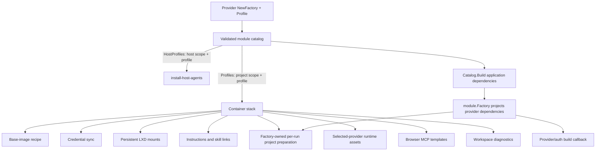

# Provisioning and updates

Provider packages own provisioning **policy** through a declarative
`Profile()`. Generic host, image, LXD, filesystem, credential, workspace, and
browser services own the **mechanism** that applies it. The shared agent
execution service coordinates per-run project preparation; provider packages
declare their small policy differences and still construct native host/project
CLI arguments, prompt transport, and run/probe protocols.

The contract is defined in
[`provisioning/profile.go`](../../../backend/internal/agent/provisioning/profile.go).
Each provider passes its profile separately from its public descriptor to
`module.NewFactory` in `factory.go`. The factory validates and retains a
defensive snapshot; consumers that only need metadata never receive
installation or filesystem policy.

## Profile contract

```go
type Profile struct {
    ID                  string
    CLI                 CLISpec
    Credentials         CredentialSpec
    PersistentState     []PersistentDirectory
    Instructions        *InstructionTarget
    WorkspaceSkills     *WorkspaceSkills
    RuntimeAssets       []RuntimeAsset
    BrowserMCPTemplates []TemplateFile
}
```

| Section | Policy owned by the provider |
| --- | --- |
| `CLI` | Human name/image label, binary, version arguments, strict semver pin, npm package or pinned script, install mode, verification flags, install timeout, and concurrent-install wait timeout |
| `Credentials` | Fixed files or a dynamic directory, host/container locations, required push/pull behavior, launch seeding, modes, and legacy LXD devices to remove |
| `PersistentState` | Stable LXD device name, private host directory name, and absolute container path below `/root` |
| `Instructions` | Destination and content-hash path for Remote's shared agent instructions |
| `WorkspaceSkills` | Provider compatibility home under `/workspace` and optional provider-home mirror directory |
| `RuntimeAssets` | Non-secret provider configuration published before every selected-provider run |
| `BrowserMCPTemplates` | Provider-specific MCP configuration files, hashes, modes, and directories |

Profiles are cloned when entering or leaving the module catalog. During
`Catalog.Build`, the module factory gives its shared project preparer and the
provider callback independent deep clones of the same validated profile. A
consumer cannot mutate catalog policy, another consumer's snapshot, or embedded
template bytes.

Factory and catalog validation fail before serving traffic when a project
module has no profile, profile/provider IDs differ, CLI policy is incomplete,
the version is not strict semver, required version arguments are absent,
install/wait timeouts are not positive, install mode data is missing, a project
image label is empty, persistent paths are unsafe, or persistent mounts collide
within/across providers. A host-only remote API integration may omit a profile;
a project-capable module may not.

## One profile, several consumers



`Catalog.HostProfiles()` selects only modules with `host` scope and a profile.
`Catalog.Profiles()` selects only modules with `project` scope and a profile.
Both preserve registration order and return defensive copies.

The application, `cmd/build-base-image`, `cmd/upgrade-workspaces`, and
`cmd/install-host-agents` each build the same explicit catalog. There is no
parallel provider list in infrastructure shell.

## Version pins and host convergence

All external pins live in
[`backend/internal/agent/provisioning/versions.env`](../../../backend/internal/agent/provisioning/versions.env).
`infra/versions.env` is a symlink to it, while the backend embeds the same file
through `versions.go`. `MustCLIVersion` fails fast on a missing or malformed
strict semver pin.

After selecting the target checkout and installing Node/Go, the infrastructure
application step runs:

```text
cd backend && go run ./cmd/install-host-agents --prefix "$INSTALL_DIR/data/host-clis"
```

The command reads `HostProfiles()` and converges providers sequentially into
one application-owned prefix. npm profiles receive that explicit prefix and
script profiles receive the exact managed executable path. The installer,
systemd unit, and login-shell profile put the prefix's `bin` directory first
on `PATH`. Before accepting a provider, convergence verifies both the managed
executable's exact pin and that a normal command lookup resolves to that same
path. For a checked CLI it runs the profile's version arguments with the application-wide
`config.AgentOptions.HostCLIVersionTimeout`, currently 15 seconds, and requires
the **exact host pin**. Missing/stale npm and image-repair profiles install their exact npm
package pin; script profiles run their pinned install program. The profile's
`InstallTimeout` bounds the mutation. Post-install verification receives a
fresh version-probe budget. Canceled commands run in their own process group,
receive TERM, then KILL after a short grace period so descendants do not strand
the updater.

Preview this catalog-derived plan without changing the host:

```bash
cd backend
go run ./cmd/install-host-agents -plan
```

## Project base image

`cmd/build-base-image` passes `Catalog.Profiles()` into the container stack. The
image builder:

1. launches a disposable Ubuntu 24.04 container;
2. verifies IPv4 egress;
3. generates the shared system/Node/tool recipe plus every project profile's
   CLI install;
4. installs Agent Browser/Chromium and code-server;
5. stops the builder and publishes `futrx-remote-dev-base`;
6. removes the disposable builder.

Npm-backed CLIs are installed together at their exact package pins.
`InstallWithScript` contributes a provider-owned, self-contained, idempotent,
pinned shell program. The generated recipe shell-quotes packages, binaries,
and version arguments, checks every binary, and reports configured versions.

The base image contains tools, not project identity. Credentials and durable
provider state are added through project-specific mounts and provisioning.

## Per-run container preparation

The base image is an optimization, not the only readiness check. Before a
project run, each provider delegates to
[`service/agent/execution.Preparer`](../../../backend/internal/service/agent/execution/preparer.go),
constructed by the generic module factory with the validated profile and its
declared `ProjectPreparationPolicy`. Provider callbacks receive the resulting
`ProjectPreparer`; they do not receive `ProjectResolver` or full container
ports. Partial dependency wiring is rejected after the project is
started/reconciled and before any provisioning port is used; the zero port set
is allowed in focused/test composition and skips the container-provisioning
phase.

The current common sequence is:

1. reconcile/start the project container;
2. ensure the provider CLI is ready;
3. seed credentials when that provider has a credential policy;
4. publish shared agent instructions;
5. publish the selected profile's non-secret runtime assets;
6. converge workspace skill links;
7. migrate shared browser assets where applicable;
8. when Browser was selected and supported, provision MCP and start the shared
   browser core;
9. when Scheduled Tasks was selected and supported, publish its CLI/skill;
10. ensure `boot.autostart`;
11. load project secrets on a best-effort basis and return the prepared target;
12. build the shared `lxc exec` envelope, then run the provider's native CLI
    transport with short-lived runtime capabilities taking precedence over
    project secrets.

The preparer emits `system/container_starting` before reconciliation only when
the stored status is not running; it still calls `Start` every time. It emits
`system/container_preparing` only when nonzero container ports enter the
provisioning phase.

CLI-specific error wording, credential prechecks, strict versus best-effort
skill links, and Browser asset/runtime participation are explicit options in
the provider's `factory.go`. The sequence and error ownership are implemented
once rather than copied into every `command.go`.

On the normal path the CLI provisioner only runs the provider's version command.
Container readiness accepts a detected semver at least as new as the pin. A
missing/stale CLI is repaired as follows:

- `script`: run the provider's install script;
- `image-repair`: run the complete current base-image CLI recipe;
- `npm`: install the exact package when npm exists, otherwise use the complete
  recipe to repair old containers that predate Node/npm.

Concurrent prompts notice a matching npm install and wait up to the profile's
`WaitTimeout`; mutations use `InstallTimeout`. If one installer reports failure
but another concurrent install made the CLI ready, readiness wins. Required
post-install verification fails the run when the binary/version is still
unavailable.

These install/wait limits are provider provisioning policy. They are not the
global capability-discovery timeout described in
[`03-capabilities-cache-and-refresh.md`](03-capabilities-cache-and-refresh.md).

## Persistent provider state

Every project workspace is mounted at `/workspace`. Provider
`PersistentState` adds sibling private directories under:

```text
<project-parent>/agent-home/<profile HostDirectory>
```

Each becomes a writable LXD disk at the provider's declared path below `/root`.
The lifecycle service creates/remaps these host directories and sets mode
`0700`. When adding a durable mount to an existing container, it refuses to
modify a busy container, pulls existing in-container state into an empty host
directory, changes the LXD device while stopped, restarts as needed, and
verifies the mount is active. This is why provider sessions and project-local
login can survive container replacement and workspace image upgrades.

The module catalog rejects duplicate device names or host directories and
equal/nested container mount paths across providers. The lifecycle service
validates the same safety boundary again before touching LXD.

Current durable paths are:

| Provider | LXD device | Private host directory | Container path |
| --- | --- | --- | --- |
| Claude | `claude-home` | `claude` | `/root/.claude` |
| Codex | `codex-home` | `codex` | `/root/.codex` |
| MiniMax | `minimax-home` | `minimax` | `/root/.minimax` |
| Kimi | `kimi-home` | `kimi` | `/root/.kimi-code` |
| Antigravity | `antigravity-home` | `antigravity` | `/root/.gemini/antigravity-cli` |

## Credential synchronization

The credential service applies either a fixed-file or dynamic-directory shape
without knowing the provider. Its concrete `CredentialSynchronizer` implements
two deliberately segregated ports: `CredentialProvisioner.Ensure` is exposed
only to shared pre-run preparation, while `CredentialCollector.SyncFromContainer`
is the only credential operation projected into provider callbacks for
optional post-success pull-back.

For fixed files it first removes declared legacy credential devices, then
validates all required host files before creating the provider directory or
pushing files. It creates that directory with mode `0700` and pushes a host
file only when it is newer than the container copy. Optional missing files are
skipped. Pull-required files must exist after a successful run; pulled files
are stored with mode `0600`.

For dynamic directories it discovers regular files, creates declared container
directories, and transfers each file at mode `0600`. Policy can allow an
already-authenticated container when the host has no files, treat unavailable
sync as a no-op, or avoid pulling project-only state until a host identity
already exists.

| Provider | Current credential policy |
| --- | --- |
| Claude | Seeds `/root/.claude.json` (required) and optional `/root/.claude/.credentials.json`; both relevant credential forms can be pulled back. Launch seeding is enabled. |
| Codex | Seeds and pulls `/root/.codex/auth.json`; explicitly detected API-key mode in the host record is rejected, and subscription auth is the intended flow. A newer project-local record is not pre-inspected, and the current readiness check also accepts an `unknown` mode, as documented in [Authentication and access](04-authentication-and-access.md#current-provider-behavior). Launch seeding is enabled. |
| Kimi | Synchronizes regular files under `.kimi-code/credentials`; container-only login is allowed, launch seeding is disabled, and host-empty state remains project-local. |
| Antigravity | Declares no credential transfer because the CLI has no stable documented token subpath. Its project-local login/state survives through the persistent directory. |

Claude, Codex, and Kimi attempt a bounded pull after a **successful** project
run. The shared `config.AgentOptions.CredentialSyncTimeout` currently defaults
to 30 seconds. `service.New` passes it through application-facing
`module.BuildDependencies`; each module factory then projects the collector and
timeout through provider-facing `module.Dependencies`. Providers that support
pull-back retain those narrow dependencies. The
follow-up uses a background context so completion is not lost when the prompt
context ends; sync failures are logged and do not turn the completed agent run
into an error. Antigravity has no sync step.

## Instructions, runtime assets, skills, Browser, and schedules

Remote renders one embedded instruction template with the installation's public
hostname. The workspace provisioner publishes it idempotently to every
profile-declared instruction target, grouping targets that share a hash marker.
Claude currently targets `/root/.claude/CLAUDE.md`; Codex targets
`/root/.codex/AGENTS.md`; MiniMax targets `/root/.minimax/AGENTS.md`. Shared project preparation asks the workspace
provisioner to converge the configured targets; provider command code does not
embed instruction text itself.

The [`runtimeassets.Adapter`](../../../backend/internal/integration/containers/runtimeassets/adapter.go)
separately publishes only the selected profile's
`RuntimeAssets`. Keeping that adapter out of the shared workspace
provisioner prevents provider-specific runtime configuration from being
conflated with installation-wide instructions and cross-provider skill links.
It verifies the destination bytes even when the in-container hash marker is
current, because both files live in a root-writable provider home.

The canonical project skill directory is `/workspace/.agents/skills`.
`WorkspaceSkills` creates compatibility links such as
`/workspace/.claude/skills`, `/workspace/.codex/skills`, and
`/workspace/.minimax/skills`, migrates legacy children into the canonical
directory when safe, and can mirror canonical
skills into a provider-home directory (currently Codex's
`/root/.codex/skills` and MiniMax's `/root/.minimax/skills`). The module descriptor's skill strategy controls how a
selected skill reaches the prompt: slash-style skill trigger, dollar mention,
explicit instruction path, or disabled.

Browser installation is shared, but provider launch wiring is opt-in through
`Features.BrowserTools`. Claude declares an MCP JSON template in its profile;
Codex and MiniMax add equivalent app-server config through the shared harness
argument builder. When Browser is selected for Claude, Codex, or MiniMax,
their factory options ask the shared preparer to ensure `@playwright/mcp`,
publish configured templates, and start the container's browser core. Generic
browser script/skill migration is best-effort; required MCP/core setup fails
the run.

Scheduled-task tooling is provider-neutral. A module must declare
`ScheduledTools`; the prompt service issues a short-lived scoped grant and sets
the run flag, then shared project preparation publishes `remote-schedule` and
its skill for the run that needs it.

On first launch or after mount changes, the launch provisioner performs
credential seeding, skill links, browser script/skill/nesting, scheduled tools,
and code-server setup in a stable order. Those launch steps are deliberately
best-effort so optional tooling cannot prevent the container from starting.
Shared run preparation repeats the required pieces and surfaces failures that
would make that selected run unusable.

## Current CLI policy

| Provider | Install mode | Binary/version command | Install / concurrent wait |
| --- | --- | --- | ---: |
| Claude | npm `@anthropic-ai/claude-code` | `claude --version` | 5m / 2m |
| Codex | npm `@openai/codex` | `codex --version` | 5m / 2m |
| MiniMax | npm `@openai/codex` (shared harness) | `codex --version` | 5m / 2m |
| Kimi | image repair using `@moonshot-ai/kimi-code` | `kimi --version` | 8m / 5m |
| Antigravity | pinned release archive script with per-architecture SHA-512 verification | `agy --version` | 8m / 5m |

Read exact versions and checksums from `versions.env`; do not duplicate them in
documentation or tests.

## Deployment and release implications

An application-only deployment rebuilds the frontend/backend and restarts the
service. It does **not** converge host CLIs, rebuild the base image, or replace
existing workspace containers. Therefore a change to any of the following
requires a minor/major release and the full infrastructure updater:

- an agent CLI pin, package, install script, version command, or install mode;
- host/project execution scope when it changes which environments need a CLI;
- credentials, persistent state, instructions, skill links, or Browser MCP
  profile policy;
- the factory/profile/catalog contracts or host/base-image installers;
- infrastructure needed by a provider CLI.

`infra/update.sh` first resolves the requested ref and re-executes the selected
checkout before reading manifests. It then converges host dependencies and
catalog-derived host CLIs, rebuilds/restarts the application, force-rebuilds
the project base image, and recycles eligible workspaces onto that image. Busy
workspace detection is best-effort; use a maintenance window. The
`--skip-workspaces` option intentionally omits the image rebuild/recycle and is
not sufficient for a profile/toolchain change.

Release classification rejects an application-only patch when changes touch
protected infrastructure paths, including:

- `backend/internal/agent/provisioning`;
- provider `assets/`, `factory*.go`, `profile*.go`, `install*.go`, and
  `provisioning*.go` under `backend/internal/integration/agents`;
- `backend/internal/config/agents.go` and
  `backend/internal/service/agent/module`;
- host-agent installer/runtime and container-image services;
- the relevant `infra/` installer/updater paths.

For QA, use a pushed immutable ref and run the full updater rather than
`deploy-app`:

```bash
npm run qa:update -- <ref>
```

After it completes, verify the deployed SHA, host CLI versions, published base
image, recycled workspace versions, persistent provider state, and public
health. Use an install test on a rebuilt VM as well when fresh-install behavior
changed.

## Tests to extend

Provisioning changes should normally cover:

- provider `profile_test.go` and factory/catalog declarations;
- module validation and cross-provider mount collision tests;
- host plan/install/version/process-group behavior;
- base-image recipe quoting and provider inclusion;
- runtime container CLI readiness/repair;
- credential shape and transfer behavior;
- persistent mount migration and lifecycle behavior;
- instructions, runtime assets, skill links, Browser templates, and launch order;
- infrastructure host-install, updater, and release-classification shell tests.

Run backend build/tests/vet, focused race tests, frontend tests/build when the
public descriptor shape changes, every `infra/tests/*-test.sh`, and
`.github/scripts/classify-release-test.sh` before release.
