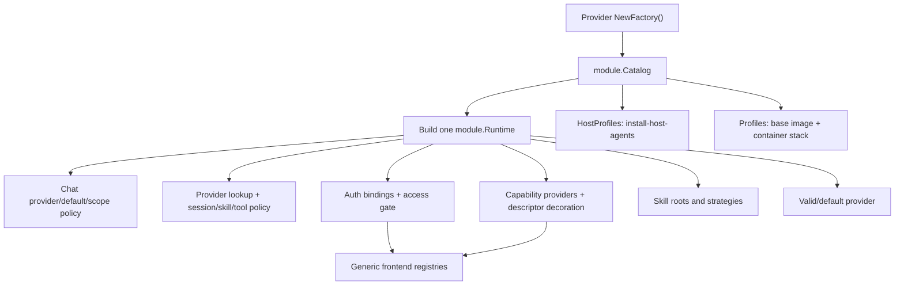
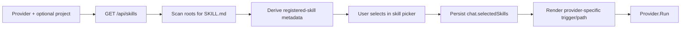
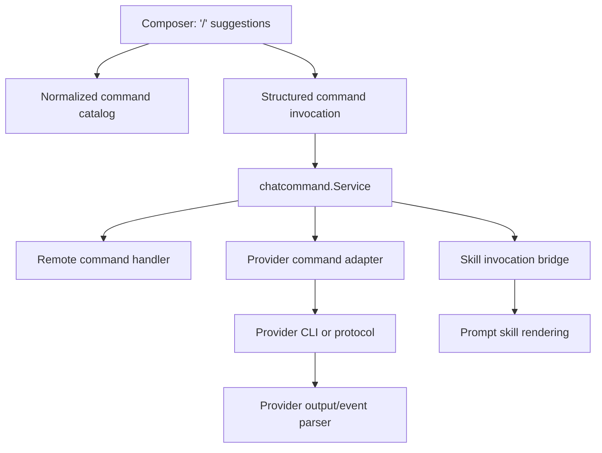

# Features and platform consumers

An agent factory does more than construct a runtime. Its
[`module.Descriptor`](../../../backend/internal/service/agent/module/factory.go)
is the shared metadata and feature-policy record used by chat creation, prompt
orchestration, authentication, capabilities, skills, user settings, and the
frontend. Its separate provisioning profile drives host installation,
workspace provisioning, and diagnostics.

The catalog is therefore a single source of declarations, not a magic plugin
runtime: each provider still has to implement the behavior it advertises.

## Descriptor-to-consumer map

| Descriptor field | Main consumers | Effect |
| --- | --- | --- |
| `ID` | module, runtime, and auth registries; chats; settings; API routes | Stable lowercase identity for lookup, persistence, and URLs. |
| `Label` | auth/capability APIs, frontend, instruction-style skill prompts | Human-readable name; descriptor value overrides a label returned by capability probing. |
| `Default` | chat and user-settings services | Preferred default in every compatible scope. The catalog rejects multiple defaults and a default without host scope. If none is declared, the first compatible module wins. |
| `ExecutionScopes` | chat create/update/run, capability discovery, skills, profile selection | Controls whether the provider may be used for loose host chats, project chats, or both. |
| `Auth`, `AuthInstructions`, and optional `APIKeyAuth` | auth registry, HTTP/WebSocket routes, onboarding and Settings | Selects `managed-code`, `managed-device`, `managed-api-key`, `external`, or `none` behavior and supplies an HTTPS key-creation URL when required. |
| `SatisfiesAccessGate` | startup validation and auth middleware | Allows an authenticated deployment to open after a managed binding authenticates, or immediately for `none`. External auth cannot satisfy the gate. |
| `LegacySkillRoots` | skill catalog | Adds provider-specific host skill locations behind the canonical `.agents/skills` root. |
| `Features.Sessions` | prompt service and chat forking | Enables saved-session resume and, separately, native fork. Fork requires resume. |
| `Features.Skills` | skill catalog and prompt preparation | Chooses no selected-skill injection, slash-style skill triggers, dollar mentions, or `SKILL.md` instructions. `slash-command` describes skill delivery; it is not a general composer-command system. |
| `Features.BrowserTools` | capability API and prompt service | Allows the selected `browser` skill to request browser provisioning and provider launch wiring. |
| `Features.ScheduledTools` | skill catalog, prompt service, capability API/frontend | Advertises the Scheduled Tasks skill and permits issue/provisioning of a scoped schedule grant. |
| `Features.ExecutionPolicies` | capability API and frontend composer | Exposes approval and sandbox policy controls for providers whose harness accepts both normalized policies. |

The provisioning `Profile` is a separate private field of `module.Factory`,
not descriptor metadata. Only `Profiles()` and `HostProfiles()` expose cloned
policy to host/container composition. During runtime construction, the factory
uses one validated clone for its project preparer and injects an independent
clone into the provider build callback.

`Runtime.WorkspaceSkillHome(provider)` is a narrow projection derived from the
validated private profile. It lets the project skill catalog find the
provider's compatibility root without putting filesystem policy into the
public descriptor.

All descriptor and profile snapshots are defensive copies. Mutating a value
returned by `Descriptor()`, `Descriptors()`, `Profiles()`, or `HostProfiles()`
does not change the catalog.

## Current built-in declarations

| Provider | Default | Scopes | Auth | Sessions | Skills | Browser | Scheduled Tasks | Execution policies |
| --- | ---: | --- | --- | --- | --- | ---: | ---: | ---: |
| Claude | No | host, project | managed code | resume, fork | slash-style skill trigger | Yes | Yes | No |
| Codex | Yes | host, project | managed device | resume, fork | dollar mention | Yes | Yes | Yes |
| MiniMax | No | project | managed API key | resume, fork | dollar mention | Yes | Yes | Yes |
| Kimi | No | host, project | managed device | resume | instructions | No | Yes | No |
| Antigravity | No | host, project | external | resume | instructions | No | Yes | No |

All five current modules run local CLIs and attach provisioning profiles. MiniMax
reuses Codex's app-server harness with a separate home and provider config. The
contract also permits a host-only remote integration with no profile and a
no-auth module with no binding.

## Current feature inventory

`module.Features` is intentionally small. A field belongs there only when
shared platform consumers need a stable provider declaration before a run
starts. The current feature contracts are:

| Feature | Declaration | Shared platform behavior | Provider responsibility | Activation |
| --- | --- | --- | --- | --- |
| Sessions | `Features.Sessions.Resume` and `.Fork` | Persists provider-keyed session IDs, controls resume input, and preserves eligible sessions when chats fork. | Emit native session IDs and translate resume/fork into the native command or protocol. | Automatic when a saved session exists; fork is requested by the chat workflow. |
| Skills | `Features.Skills` strategy | Discovers skill metadata, stores explicit chat selections, and renders the selected skills into the effective prompt. | Make the declared slash, dollar, or instruction-path form usable in the provider runtime. | User selection in the skill picker; scheduled runs may add the reserved Scheduled Tasks skill. |
| Browser tools | `Features.BrowserTools` | Publishes support metadata and gates browser preparation and activity keepalive after the Browser skill is selected. | Pass working native MCP/tool configuration into the run. | The `browser` skill is selected and the provider declaration permits it. |
| Scheduled Tasks | `Features.ScheduledTools` | Advertises the reserved project skill, issues and revokes a scoped grant, provisions the schedule CLI/skill, and injects runtime-only variables. | Preserve the runtime environment through the native host/container launch. | The Scheduled Tasks skill is selected, or the turn is executing a scheduled task. |
| Execution policies | `Features.ExecutionPolicies` | Shows the Approvals and Sandbox composer controls and persists the selected normalized policies. | Forward both policies through the provider harness on thread and turn requests. | Automatic for every turn when the provider declares support. |

Several adjacent contracts are deliberately not fields of `Features`:

- identity, label, default, execution scope, and authentication are stable
  module descriptor policy with their own validation and consumers;
- models, modes, reasoning efforts, and service tiers are environment/account
  data returned by live capability discovery rather than static promises;
- CLI installation, credentials, persistent state, instructions, runtime
  templates, workspace links, and Browser templates are private
  provisioning-profile policy;
- parser formats, command flags, protocol deadlines, and fallback behavior are
  provider adapter details unless a shared application workflow needs to see
  them.

Do not add a boolean to `Features` merely because one provider has a new CLI
flag. Add a declaration only when it changes what generic services or the
frontend may safely expose.

## Where the catalog is consumed

[`cmd/remote/main.go`](../../../backend/cmd/remote/main.go) calls the explicit
composition root once. Project profiles configure
[`config.NewContainerStack`](../../../backend/internal/config/containers.go),
and [`service.New`](../../../backend/internal/service/services.go) builds one
`module.Runtime` and injects it through each consumer's narrow interface. This
keeps registration order, identity, auth, and metadata consistent across all
views.

The same compiled catalog is also used outside the server:

- [`cmd/install-host-agents`](../../../backend/cmd/install-host-agents/main.go)
  consumes `HostProfiles()` and converges host CLIs sequentially;
- [`cmd/build-base-image`](../../../backend/cmd/build-base-image/main.go)
  consumes project `Profiles()` to build the reusable LXD image;
- [`cmd/upgrade-workspaces`](../../../backend/cmd/upgrade-workspaces/main.go)
  rebuilds the project container stack from the same profiles before replacing
  eligible containers.

A provider added only to its local package but not to
[`config.NewAgentModules`](../../../backend/internal/config/agents.go) is
inert: it will not be installed, discovered, authenticated, selected, or run.

## Identity, order, defaults, and scope

Incoming chat/settings IDs are normalized with `strings.TrimSpace` plus
lowercase. A factory's descriptor ID is not rewritten: it must already match
the grammar implemented by
[`agent.ValidProviderID`](../../../backend/internal/agent/identity.go), beginning
with `a-z` and followed only by `a-z`, `0-9`, or `-`. IDs are used in route
segments and persisted maps, so changing an ID is a data migration, not a
cosmetic rename.

[`module.NewCatalog`](../../../backend/internal/service/agent/module/catalog.go)
preserves the order from the explicit configuration builder list. That order is
used by descriptors, provisioning profiles, runtime registration, auth
bindings, capability responses, and default fallback. The catalog rejects an
empty set, duplicate IDs, multiple defaults, and cross-provider persistent
mount collisions.

`DefaultProvider(scope)` returns the explicit default when it supports the
requested scope; otherwise it returns the first compatible module. Chat
creation and user-settings defaults use it. A saved provider is still checked
for catalog membership and the chat's current scope.

Scope has concrete consequences:

- `host` allows loose-chat execution, host capability discovery, host skills,
  and inclusion in `HostProfiles()` when a profile exists;
- `project` allows project chat creation/run, project capability discovery,
  project skills, and inclusion in `Profiles()`;
- any project-scoped module must supply a complete provisioning profile;
- a host-only API adapter may omit a profile because there is no local CLI to
  install.

The prompt boundary checks scope again even though chat create/update already
validate it. This protects old or manually edited stored chat records.

## Authentication and access

Factories build the provider runtime and auth binding in one callback.
[`Factory.buildComponents`](../../../backend/internal/service/agent/module/factory.go)
checks that provider ID, auth binding ID, declared auth mode, and actual auth
flow agree.

The four supported modes are:

| Mode | Binding | Platform behavior |
| --- | --- | --- |
| `managed-code` | `auth.NewCodeBinding` | Remote starts an interactive code-paste CLI flow and exposes start/submit/cancel actions. |
| `managed-device` | `auth.NewDeviceBinding` | Remote starts a device login and exposes URL/code/progress. |
| `managed-api-key` | `auth.NewAPIKeyBinding` | Remote exposes a write-only key form plus configured/unconfigured status and save/remove actions. |
| `external` | `auth.NewExternalBinding` | Remote shows instructions only; there is no managed status stream or mutation action. |
| `none` | no binding | Provider is treated as authenticated; instructions must be empty. |

The normalized catalog is `GET /api/agent-auth`. Every non-`none` binding gets
provider-ID-derived legacy status routes; an external binding has no usable
status stream. Managed bindings additionally receive their flow-specific action
routes and `/ws/agent-auth/<provider>`. Route construction is generic in
[`AgentAuthHandler`](../../../backend/internal/transport/http/handlers/agent_auth_handler.go)
and [`AgentAuthSocket`](../../../backend/internal/transport/ws/agent_auth_socket.go).

An authenticated deployment calls `ValidateAccessGate` at service startup. At
least one module must declare `SatisfiesAccessGate`; managed providers are
ready only when their live binding is authenticated, and a no-auth gate is
ready immediately. External auth cannot be a gate because Remote has no
authoritative status signal for it.

The frontend's
[`useAgentAuthRegistry`](../../../frontend/src/state/hooks/auth/useAgentAuthRegistry.ts)
loads the ordered catalog and opens normalized sockets only for managed modes.
Settings/onboarding cards are generated from the returned descriptors. A
fundamentally new auth mode is therefore not “just another provider”: it needs
coordinated changes to the Go enums/validation, binding contract, handlers,
frontend types/state, and UI.

## Capability metadata and the frontend

Each runtime adapter discovers provider-native models and controls, then
[`capability.Service.decorate`](../../../backend/internal/service/agent/capability/service.go)
overwrites shared metadata from the descriptor: label, default, scopes,
authentication, sessions, skills, browser support, and schedule support. The
registered provider ID is authoritative even if the adapter returned another
or empty ID.

The capability service filters providers by execution scope and preserves
catalog order. `GET /api/agent-capabilities` supplies the frontend with all
provider/model options for the selected host/project environment. The
frontend treats provider IDs as strings and renders options from that response
through
[`agentCapabilityState`](../../../frontend/src/state/chat/agentCapabilityState.ts),
so a normal provider addition requires no provider-specific picker component.

Managed providers that are not authenticated are disabled using the auth
catalog. A capability adapter may separately return `UnavailableReason`, for
example when a CLI is installed but its project-local sign-in is absent.
Warnings do not disable a provider; they indicate partial/fallback discovery.

The frontend has a temporary built-in `codex` fallback while settings are
loading, but server-side chat and user-settings defaults come from the module
catalog. If the explicit default changes, add regression coverage for initial
frontend loading as well as the backend default path.

## Session consumers

The descriptor does not parse sessions; it tells orchestration whether an
adapter can use them.

- `Resume=false` prevents a saved provider session ID from entering
  `RunRequest`.
- `Fork=true` allows chat fork to preserve the selected provider's session and
  set `ForkPending`; validation rejects fork without resume.
- Session IDs are persisted in a provider-keyed map, so a fifth provider does
  not require a new chat field or store schema.
- The four provider-named fields in backend and frontend models are temporary
  compatibility mirrors. Do not add another named field for a new provider.
- Changing providers keeps each provider's independent session in the map, so
  switching back may resume it. Rewind clears all provider sessions.

See [`chat.Meta`](../../../backend/internal/service/chat/model.go),
[`chat.Service.Fork`](../../../backend/internal/service/chat/service.go), and
[`prompt.emitAgentEvent`](../../../backend/internal/service/prompt/agent_events.go).

## Skill consumers

[`skills.Service`](../../../backend/internal/service/skills/service.go) reads
the canonical host/project `.agents/skills` roots plus any declared legacy
roots. `Runtime.WorkspaceSkillHome` derives the provider compatibility root
from the validated profile; the skill service uses it only when it resolves
safely below `/workspace`. Hidden subdirectories are skipped and duplicate
provider/source/command entries are removed.

Remote does not semantically infer a skill from prompt text. Catalog discovery
is a deterministic filesystem operation, and activation is an explicit chat
selection:

For each readable `SKILL.md`, the catalog derives only this small public
record:

| Field | Source |
| --- | --- |
| `command` | Parent directory name. A `command` front-matter field is not read. |
| `name` | Front-matter `name`; for a file without front matter, the first Markdown H1; otherwise `command`. |
| `description` | Front-matter `description`, when present. |
| `source` | The scanned root: normally `user` or `project`; `remote` is used for a synthetic platform skill. |
| `provider` | The provider requested from the catalog. It is not inferred from the file contents. |

The canonical skill root is queried in the context of the selected provider.
Remote therefore does not prove that a skill is semantically compatible with
that provider; the module declaration and provider implementation are the
compatibility promise. Provider-specific legacy roots limit discovery by
location, not by metadata embedded in `SKILL.md`.

The frontend loads this catalog through
[`skillApi`](../../../frontend/src/api/agents/skillApi.ts), and the picker
performs only a text filter over catalog metadata. Selecting an entry stores a
normalized `SkillRef` on the chat. The prompt WebSocket still carries prompt
text only; the prompt service reads the durable selection from chat metadata.
Changing providers clears the selection. Remote does not automatically select
a skill because its name or description resembles the current prompt. Any
additional automatic matching performed after launch is provider-native and
outside this catalog.

`Features.Skills=none` returns an empty provider skill list. Other strategies
control how an already selected skill reaches the provider:

- `slash-command` prefixes `/skill-name` lines (currently Claude);
- `dollar-mention` adds a `$skill-name` instruction (currently Codex);
- `instructions` tells the provider to read the canonical host/project
  `SKILL.md` path (currently Kimi and Antigravity).

These are selected-skill delivery strategies, not a general-purpose user
command parser. They do not install or translate provider-native skills by
themselves. The profile declares required workspace/home links, and the
factory's preparation policy plus the shared preparer must make them usable.

When project scoped and `ScheduledTools=true`, the skill catalog adds Remote's
reserved Scheduled Tasks skill if no copy already exists. The prompt service
then issues a short-lived capability; shared project preparation publishes the
schedule CLI/skill for an enabled run.

## Browser consumers

`BrowserTools=true` makes browser support visible in capabilities and permits
the prompt service to set `RunRequest.EnableBrowser` when the user selected the
`browser` skill. That declaration alone does not connect the provider:

1. the profile may need provider-specific Browser MCP template files;
2. the factory's shared project-preparation options must request the browser
   asset and/or MCP/core paths it needs;
3. the CLI launch must receive its native MCP/config arguments;
4. provider tests must demonstrate that browser wiring appears only when
   enabled.

Claude, Codex, and MiniMax currently select the shared preparer's full MCP/core
launch path. A module must not claim `BrowserTools` merely because the generic
browser skill exists.
The prompt service also keeps project browser activity alive once per minute
during an enabled run so the browser reaper does not stop an active session.

## Scheduled Tasks consumers

`ScheduledTools=true` allows both interactive and scheduled turns to use
Remote's provider-neutral schedule tooling. The prompt service rejects this
feature in loose chats, issues the appropriate short-lived grant, places only
valid backend-issued variables in `RuntimeEnv`, and revokes the grant at the
end of the run.

Providers do not parse the grant. Shared project preparation calls
`ScheduleTools.Ensure`; the provider passes `RuntimeEnv` through the common
container-command builder. The same provider run/event pipeline is used for
interactive and scheduled turns;
the resulting chat events receive `ScheduledTaskID` at the prompt boundary.

## Provisioning and diagnostic consumers

`Profile` separates provider-owned policy from environment-owned mechanisms:

- `HostProfiles()` drives exact pinned host CLI convergence;
- project `Profiles()` drive the base image, per-run CLI repair, credential
  transfer, persistent disk devices, instruction publication, skill links,
  Browser MCP assets, lifecycle migration, and container inspection;
- `Catalog.Build` supplies application-facing project/container dependencies to
  each factory; the factory constructs shared preparation from one defensive
  profile clone and gives its provider callback only a preparer, optional
  credential collector, global sync timeout, and an independent profile clone.

The callback uses its injected snapshot only for provider-native behavior that
still needs it, such as post-run credential sync. It neither constructs shared
preparation nor calls `Profile()` again, so validated provisioning and runtime
execution cannot silently drift to different policy definitions.

Project inspection exposes generic `agents` and `authBundles` arrays. The
named Claude/Codex diagnostic fields are compatibility mirrors only. New
providers should appear through the generic arrays rather than extending the
project response with another named field.

Any new or changed CLI/profile affects host or container state. It must be
released as a minor/major full-infrastructure update; an app-only deploy does
not install host CLIs, rebuild the base image, or recycle existing workspaces.

## Adding a cross-provider feature

Start with ownership, not with a new descriptor flag. A product feature may
cross several layers, but each piece still has one role:

| Question | Correct extension point |
| --- | --- |
| Must generic consumers know a stable provider promise before execution? | Add the smallest precise field or strategy to `module.Descriptor.Features`. |
| Does support vary with CLI version, account, project, or environment? | Add normalized data to `agent.Capabilities` and discover it in each provider capability adapter. |
| Does Remote own a workflow, authorization decision, state transition, or lifecycle? | Add an application service under `internal/service`; depend on a narrow provider-neutral port when native work is required. |
| Is this native CLI syntax, protocol, input translation, or output translation? | Keep it in `internal/integration/agents/<provider>`. Output parsers translate native output only. |
| Does a run require files, packages, credentials, durable directories, or container preparation? | Extend the provisioning profile or shared preparer policy instead of copying setup into provider command code. |
| Must the frontend list or invoke it? | Expose a normalized HTTP/WebSocket contract and implement generic frontend state/UI against that contract. |

One feature often needs several rows. That does not justify putting the whole
feature in one package: the application service owns the use case, adapters own
native translation, provisioning owns environment convergence, and transports
own delivery.

Use this sequence:

1. **Define behavior and lifecycle.** State what activates the feature, whether
   it is per request, per chat, per provider session, or persistent, what state
   survives restart, and what unsupported means. Preserve that distinction in
   types; for example, do not represent a one-turn action as a durable chat
   preference.
2. **Choose the neutral contract.** Put shared request/result data in
   `internal/agent` only when application policy and concrete adapters both need
   it. Introduce a role-specific interface rather than adding unrelated methods
   to `agent.Provider`. An interface needs a real policy/detail boundary, test
   seam, or multiple implementations.
3. **Declare only shared policy.** Use a boolean for a true yes/no promise, a
   strategy enum when supported providers deliver the behavior differently, or
   capability records when the available values are dynamic. Add factory and
   catalog validation for cross-field invariants and invalid combinations.
4. **Implement the application workflow.** A service owns authorization,
   orchestration, persistence, cancellation, and errors. Add behavior to the
   prompt service only when it is genuinely part of assembling or supervising
   every agent run; otherwise give the capability its own service. Shared
   services must not import or switch on Claude, Codex, MiniMax, Kimi, or Antigravity.
5. **Implement provider adapters.** Translate the neutral operation into each
   native CLI/protocol, and translate native results back into neutral types.
   Keep provider command builders and protocol deadlines local. Change an
   event parser only when the provider emits a new output shape—not to recognize
   application input.
6. **Wire registration and dependencies.** The provider factory advertises the
   demonstrated behavior and builds any provider implementation from narrowed
   dependencies. If the feature produces another live provider component,
   extend `module.Components` and `module.Runtime` with an explicit optional
   registry projection and validate its provider identity; do not scatter type
   assertions across consumers. Application config composes generic services
   once. Adding a supporting provider should extend registration, not add
   branches throughout consumers.
7. **Add provisioning only when required.** Declare install/state/file policy
   in the profile and add a shared preparer option when several adapters need the
   same lifecycle. Keep host/project scope differences explicit. Reassess the
   infrastructure release class whenever host or container state changes.
8. **Expose a normalized transport.** Controllers/WebSockets validate external
   input, call one application service, and map its result. Prefer structured
   messages over making multiple clients parse the same command string. The
   frontend renders catalogs by identity and capability rather than provider
   switches.
9. **Prove both declaration and behavior.** Test contract validation, service
   policy, every native translation, unsupported paths, transport mapping, and
   generic frontend rendering. Preserve error text, ordering, timing, and event
   shape where the change extends existing behavior.
10. **Update the extension guide and release rules.** Document activation,
    ownership, provider support, persistence, security implications, and any
    provisioning/release consequence. A declaration without adapter and
    end-to-end evidence remains an incomplete feature.

### Worked design: general chat commands

General user commands are not implemented today. In particular,
`SkillsSlashCommand` means “deliver an explicitly selected skill as
`/skill-name`”; it must not be widened into a general command system.

If general commands are added, model the semantic capability as **chat
commands**. “Slash command” is only the composer syntax—the same operation may
later be invoked by a button, shortcut, API client, or automation. The
recommended application owner is a dedicated `chatcommand.Service`, separate
from `skills.Service` and provider event parsers.

The presentation catalog may combine three sources while preserving their
different execution semantics:

| Source | Example | Execution owner | Lifecycle |
| --- | --- | --- | --- |
| Remote application | `/clear`, `/cancel`, `/new` | Registered application command handler | One invocation; may mutate Remote state without launching a provider. |
| Provider-native | `/compact`, `/context` | Selected provider's narrow command adapter | One native operation against the relevant provider/session. |
| Skill entry | `/code-review` | Existing skill catalog plus prompt-skill renderer | Today selection is durable chat metadata; a future one-turn skill invocation must be represented separately. |

The command service should own command identity, availability, argument
validation, authorization, dispatch, and collision rules. The backend remains
authoritative even if the frontend recognizes the leading `/` for suggestions.
Send a structured invocation such as command name plus raw/typed arguments over
the transport rather than sending ambiguous prompt text and independently
parsing it in the browser and server.

Do not add `Features.Commands=true` for Remote-owned commands: they are platform
capabilities, not provider promises. For provider-native commands, use static
module metadata only when support is stable; use live capability records when
the command set varies by CLI/account/environment. If native execution differs
from `Provider.Run`, introduce a narrow optional command-execution port and let
supporting factories register it. If all supported providers can safely accept
the command as ordinary prompt input, no extra interface is earned.

Decide namespace precedence before implementation. A Remote command, a native
provider command, and a skill may share the same visible name; silently choosing
one is unsafe. The normalized descriptor should retain source/kind identity,
and the UI should label ambiguous entries. Likewise, do not store a one-shot
command in `chat.SelectedSkills`: selected skills currently persist across
future prompts and have a different lifecycle.

The existing provider event parser remains downstream. It changes only if a
native command produces a previously unsupported output event. Command
recognition, validation, and dispatch never belong in `parser.go`.

## Declaration does not equal implementation

Before enabling a feature flag, verify both sides of the contract:

| Declaration | Required adapter/platform evidence |
| --- | --- |
| `Resume` | Native session ID is emitted, stored, and translated back into the next launch. |
| `Fork` | Native fork operation creates a different provider session without mutating the parent. |
| `Skills` | Generated trigger/path is valid for the provider's CLI and provisioned filesystem. |
| `BrowserTools` | Provider command receives working browser MCP/tool configuration. |
| `ScheduledTools` | Shared project preparation provisions the tool; the provider forwards the issued environment through the common command builder. |
| `ExecutionPolicies` | The provider forwards both normalized approval and sandbox policies, and supports the resulting interaction requests. |
| capability model/effort/tier/mode | The run adapter actually forwards every selectable value, or deliberately omits it from discovery. |
| project scope | Profile plus `ProjectPreparer` policy and provider command can prepare, run, and preserve state in a project container. |
| host scope | Host auth, command environment, cwd, and CLI availability are supported. |

This distinction matters for future agents: passing factory validation proves
that the declaration is structurally coherent. Provider tests prove that the
native integration actually honors it.
