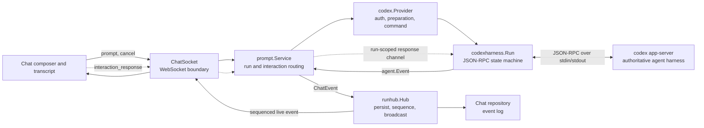
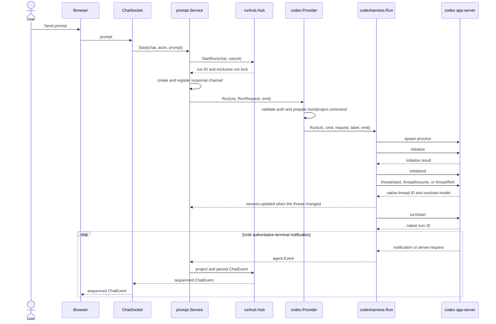
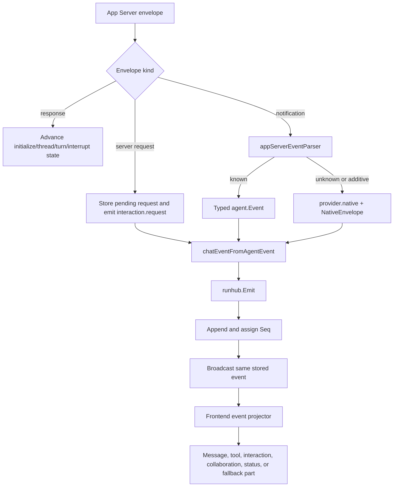
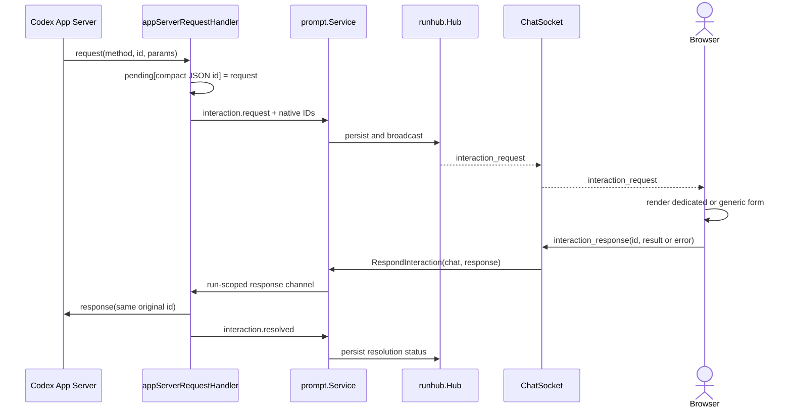
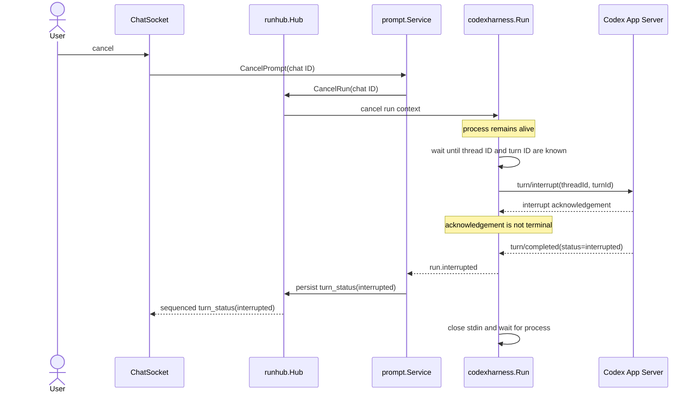
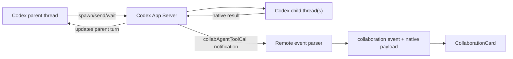

# Codex App Server architecture

Remote integrates Codex through the official
[`codex app-server` JSON-RPC interface](https://developers.openai.com/codex/app-server/).
Codex owns the agent harness, native thread and turn state, tool execution, and
subagent orchestration. Remote is the UI client: it starts the process,
transports protocol messages, retains native identity and payloads, projects
known activity into chat concepts, and sends explicit user decisions back to
the original server request.

This chapter describes the production path. The older
[`codex/parser.go`](../../../backend/internal/integration/agents/codex/parser.go)
parses `codex exec --json` fixtures but is not used for production App Server
turns.

## Components and ownership

| Component | Owns | Must not own |
| --- | --- | --- |
| Codex App Server | Native threads, turns, tools, approvals, questions, subagents, and terminal status | Remote chat persistence or UI rendering |
| [`codex.Provider`](../../../backend/internal/integration/agents/codex/provider.go) | Codex identity, authentication rules, host/project preparation, command environment, and credential sync | JSON-RPC lifecycle or frontend state |
| [`codexharness`](../../../backend/internal/integration/agents/codexharness) | JSON-RPC framing, run state, pending requests, native interruption, event parsing, and stderr/process cleanup | User policy decisions or chat storage |
| [`prompt.Service`](../../../backend/internal/service/prompt/service.go) | One active run per chat, `RunRequest` construction, run-scoped interaction routing, and agent-to-chat projection | Provider-native JSON-RPC rules |
| [`runhub.Hub`](../../../backend/internal/service/runhub/hub.go) | Append-before-broadcast ordering, event sequence numbers, subscriptions, and cancellation handle | Provider protocol state |
| Browser chat state | Rendering known parts, generic fallbacks, and collecting explicit user decisions | Inventing provider responses or native IDs |

The `codexharness` package is shared by Codex and MiniMax because both speak
the Codex App Server protocol. Each provider still owns its provider ID, label,
credentials, endpoint configuration, model catalog, and `CODEX_HOME`. Shared
harness code must therefore emit `RunRequest.Provider`, not a hard-coded Codex
identity.

## Starting a turn

The prompt service builds a provider-neutral
[`agent.RunRequest`](../../../backend/internal/agent/model.go). In addition to
the prompt, model, mode, session, project, and feature flags, it carries the
selected reasoning effort, service tier, approval policy, sandbox policy, and
a receive-only channel for interaction responses.

[`codex.Provider.buildCmd`](../../../backend/internal/integration/agents/codex/command.go)
uses `context.WithoutCancel` for the process command. This is deliberate: a
user cancellation must reach the App Server as `turn/interrupt`; cancelling
the Remote request context must not kill the process before that exchange can
complete. Process termination remains the cleanup path for protocol or
transport failure.

The harness creates a fresh App Server process for each Remote run. Native
continuity survives because the returned Codex thread ID is stored in chat
metadata and supplied as `ResumeID` on a later run. A missing resumed thread is
mapped to `agent.ErrSessionNotFound`, after which the prompt service clears the
stale session and retries with bounded visible history.

## Identity domains

Several IDs coexist and are intentionally not interchangeable:

| ID | Meaning | Storage |
| --- | --- | --- |
| Remote chat ID | Identifies the chat, run lock, subscription room, and interaction route | Chat metadata and routes |
| Remote `ChatEvent.TurnID` | Groups persisted events produced by one Remote prompt execution | Every projected event for that run |
| Native thread ID | Codex conversation identity used by start, resume, and fork | Provider session metadata and `NativeEnvelope.ThreadID` |
| Native turn ID | Codex turn identity required for interruption and correlation | Harness run state and `NativeEnvelope.TurnID` |
| Native item ID | Correlates messages, tools, and collaboration updates | Typed event ID and `NativeEnvelope.ItemID` |
| JSON-RPC request ID | Correlates one server request with exactly one client response | Pending-request map and `InteractionID` |

[`agent.NativeEnvelope`](../../../backend/internal/agent/model.go) is the
lossless correlation record. It carries a schema version, method, native IDs,
and the original notification params. The request ID is stored as compact JSON
so numeric `7` and string `"7"` remain different keys.

## App Server output to persisted chat

The run loop selects concurrently over App Server stdout, browser interaction
responses, Remote cancellation, and the interrupt timeout. Each decoded
envelope follows one of three paths:

1. A response without `method` advances a Remote-issued request such as
   `initialize`, thread creation, `turn/start`, or `turn/interrupt`.
2. A `method` plus `id` is a server-to-client request. It remains pending until
   Remote sends a response with that exact ID or the server resolves it.
3. A `method` without `id` is a notification. Known shapes produce typed
   events; unknown valid shapes produce `provider.native` instead of being
   discarded.

The main projections are:

| Harness event | Persisted chat event | Frontend representation |
| --- | --- | --- |
| `assistant.delta`, `reasoning.delta` | `assistant_text`, `thinking` | Text or thinking part |
| `tool.started`, `tool.completed` | `tool_use_start`, `tool_use_end` | Tool part correlated by item ID |
| `interaction.request`, `interaction.resolved` | `interaction_request`, `interaction_resolved` | Interactive decision card |
| `collaboration` | `collaboration` | Subagent orchestration card |
| `turn.status`, `run.interrupted` | `turn_status` | Live/terminal turn status |
| `usage.updated`, `run.completed` | `usage_update`, `complete` | Running and final usage |
| `provider.native` | `provider_event` | Expandable generic provider card |
| `session.updated` | `session` | Provider session metadata update |

[`prompt.chatEventFromAgentEvent`](../../../backend/internal/service/prompt/agent_events.go)
copies native, interaction, and status fields into the chat event.
[`filechat.eventRecord`](../../../backend/internal/stores/filechat/records.go)
persists those fields. `runhub.Emit` appends before broadcasting, so replay and
live clients receive the same sequenced representation.

The frontend folds replayed and live events through the same
[`chatEventStateProjector`](../../../frontend/src/state/hooks/chat/chatEventStateProjector.ts)
and
[`chatMessageBlockBuilder`](../../../frontend/src/state/hooks/chat/chatMessageBlockBuilder.ts).
This is why an interaction, unknown provider event, or final subagent report
survives reconnection instead of existing only as transient UI state.

## Server-initiated interactions

Questions, approvals, permission requests, MCP elicitation, and unknown future
request methods all use one correlated round trip.

The browser response is not a new prompt and does not start another turn.
[`ChatSocket`](../../../backend/internal/transport/ws/chat_socket.go) accepts an
`interaction_response` message and passes it to
[`prompt.Service.RespondInteraction`](../../../backend/internal/service/prompt/service.go).
The service routes it to the active run through a bounded channel. The harness
validates the JSON result/error and writes a response using the original raw
JSON-RPC ID.

The handler never chooses approval or elicitation policy on the user's behalf.
Dedicated UI supports user input, approvals, permissions, and elicitation;
unknown methods have a generic JSON response form. String and numeric request
IDs cannot collide, duplicate IDs fail the run, and a response for an unknown
ID is rejected.

Secret answers travel only in the browser response and the App Server wire
message. The resolved chat event records status, not the response value. The
question request itself remains replayable so the UI can honor fields such as
`isSecret`, `isBlocking`, and `autoResolutionMs` without persisting the answer.
Server-side resolution removes the pending request; any request still pending
when the turn ends is resolved locally with `turn_ended` status.

### Interaction route lifetime

The prompt service maintains one response route per active chat run:

- `runhub.StartRun` first enforces one active run per chat;
- `prompt.Service.Start` creates a buffered response channel and associates it
  with the returned run ID;
- WebSocket responses are accepted only while that route exists;
- cleanup removes the route only when its run ID still matches, preventing an
  older run from deleting a newer route; and
- the route is process memory, so a backend restart cannot reattach to an
  already-running interaction.

## Cancellation and terminal state

The harness sends `turn/interrupt` once and starts a ten-second deadline after
the interrupt is sent. It continues reading notifications because only
`turn/completed` is authoritative. `completed`, `failed`, and `interrupted`
map to distinct events; an unknown terminal status is treated as failure, not
success. If the deadline expires or the process closes without a terminal
notification, the harness returns a `runtime.ProcessError` and kills the
process as cleanup.

Error notifications decode the nested App Server error and retain whether the
server will retry. Retryable errors produce `status=retrying`; non-retryable
errors produce `status=terminal`. A terminal turn also resolves every pending
interaction so replay cannot leave a decision card permanently pending.

## Subagent orchestration and reporting

Codex, not Remote, spawns subagents and transports their results back to the
parent agent. Remote observes this through `collabAgentToolCall` items. It must
not create its own child lifecycle or synthesize a second report channel.

The collaboration projection retains the native item ID, operation name,
status, sender thread, receiver threads, prompt/model metadata, and
`agentsStates`. Completed child messages remain inside the native item payload
and are rendered by
[`CollaborationCard`](../../../frontend/src/ui/chat/messages/CollaborationCard.tsx).
The frontend upserts collaboration parts by item ID, so a later completed
snapshot replaces the earlier in-progress snapshot without losing the final
report. Transcript replay uses the same projection.

When diagnosing “the subagent never reported back,” separate two paths:

1. **Codex orchestration:** whether the App Server delivered the child result
   to the parent thread. This remains provider-owned.
2. **Remote observability:** whether the `collabAgentToolCall` notification was
   parsed, persisted, replayed, and rendered. Inspect the native envelope and
   collaboration event at each Remote boundary.

The generic provider-event fallback ensures a new collaboration method or an
additive payload is still visible even before Remote gains a dedicated typed
projection.

## Capability discovery is a separate App Server session

Capability discovery does not reuse a chat turn or its harness state. Codex
starts a separate App Server probe in
[`capability_app_server.go`](../../../backend/internal/integration/agents/codex/capability_app_server.go):

1. send `initialize` and wait for success;
2. send `initialized`;
3. page through `model/list`;
4. request `collaborationMode/list`; and
5. normalize the result into `agent.Capabilities` for the shared cache and
   composer.

Remote retains each model's reasoning efforts, service tiers, defaults, input
modalities, multi-agent and personality metadata, upgrade metadata, and raw
record. Collaboration modes retain their provider-selected model and reasoning
preset. Selecting a mode can therefore apply the server's preset rather than
recreating Plan policy locally. Discovery failure falls back to `codex debug
models`, then to an Auto-only catalog, with warning/source state preserved.

See [Capabilities, cache, and refresh](03-capabilities-cache-and-refresh.md)
for cache keys, timeouts, fallback TTLs, and UI refresh behavior.

## Invariants for future changes

- Keep provider-owned JSON and lifecycle semantics inside `codexharness` or
  the concrete provider adapter; do not teach generic services Codex methods.
- Never answer a server request without an explicit browser response or an
  authoritative server resolution.
- Preserve the original JSON-RPC ID and native thread, turn, and item IDs.
- Give every valid notification either a typed projection or a persisted
  `provider.native` fallback.
- Persist before broadcasting so reconnect and replay produce the same UI.
- Treat `turn/completed` as the terminal authority; an interrupt response is
  only an acknowledgement.
- Keep process cancellation distinct from native turn interruption.
- Keep `codexharness` provider-neutral because MiniMax also uses it.
- Never persist secret interaction response values.
- Add production App Server tests when changing JSON-RPC framing or lifecycle;
  legacy `codex exec --json` parser tests are not a substitute.

The compatibility audit and remaining structured-output work are tracked in
[Codex App Server compatibility gaps](issues/codex-app-server-compatibility.md).
