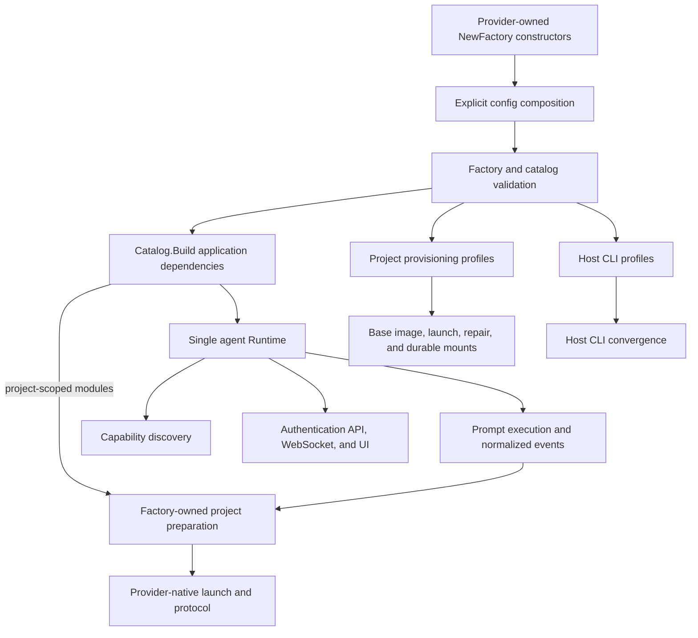

# Agent integration developer guide

This guide explains how Remote turns provider-owned agent code into one
validated, provider-neutral platform: how modules are registered, how CLI
output is parsed, how authentication and capabilities reach the frontend, and
how provisioning policy reaches the host and project containers.

Remote's agents are explicit, compiled-in modules. It does not scan directories,
run package `init` hooks, or load plugins at runtime. Adding a source directory
does nothing until its `NewFactory` constructor is added to the configuration
composition list.

## Mental model

The words in this guide have distinct meanings:

| Term | Meaning |
| --- | --- |
| Provider | The runtime adapter that translates a neutral run into one provider's CLI or protocol and emits neutral events |
| Module | The complete integration: descriptor, preparation policy, provider factory, authentication binding, features, and optional provisioning profile |
| Factory | A generic validated module that owns shared preparation construction and invokes a provider-owned callback with narrowed dependencies |
| Catalog | The validated, ordered collection of module factories used by every agent subsystem |
| Runtime | The live provider/auth registries plus catalog policy, exposed as one consistent object |
| Profile | Declarative CLI installation, persistent-state, credential, instruction, skill, and Browser MCP policy |
| Project preparer | Factory-owned shared service that starts a project and applies profile-driven run prerequisites under the provider's declared policy |

The catalog is the immutable definition source, while `module.Runtime` is the
single live projection exposed to application consumers. It encapsulates the
provider and authentication registries and keeps them tied to the same
validated catalog. Each provider package owns its CLI flags, protocols,
parsers, authentication adapter, capability discovery, and provisioning
policy. Shared services enforce scope and feature declarations and apply
provisioning without provider-specific branches.

The package boundary is intentional: `internal/agent` contains provider-neutral
contracts and provisioning policy types; `internal/integration/agents`
contains concrete CLI, protocol, parser, auth, and profile adapters plus their
shared process/LXC execution mechanics; `internal/service/agent` contains cross-provider
application workflows such as module construction, authentication lifecycle,
capability aggregation, and project preparation; `internal/config` owns
application composition and application-wide agent settings. Concrete adapters
depend inward on neutral contracts and services. Services never import or
switch on a concrete provider type.

## Registration and parsing are separate paths

Registration happens once when a process builds the explicit module catalog.
Parsing happens later inside the selected provider adapter, and there are two
independent parser families:

| Path | Provider-native input | Normalized output | Consumer |
| --- | --- | --- | --- |
| Agent run | JSONL, JSON-RPC notifications, or raw stdout | `agent.Event` | Prompt service, chat store, WebSocket clients |
| Capability discovery | Model/help/config output from the installed CLI | `agent.Capabilities` | Capability cache, API, composer controls |

A provider may use the shared line-process runner, own a JSON-RPC loop, or
stream raw chunks. It must still emit the same provider-neutral contracts.
Capability parsing never parses a live chat turn, and runtime event parsing
never owns the model catalog.

## Documents

| Document | Explains |
| --- | --- |
| [Module contract and registration](01-module-contract-and-registration.md) | Factory ownership, validation, catalog construction, startup wiring, and catalog consumers |
| [Runtime and event parsing](02-runtime-and-event-parsing.md) | Neutral run requests, CLI execution, provider-local parsers, normalized events, cancellation, and sessions |
| [Capabilities, cache, and refresh](03-capabilities-cache-and-refresh.md) | Host/project discovery, provider probes, normalization, timeout, fallback behavior, cache keys, and invalidation |
| [Authentication and access](04-authentication-and-access.md) | Auth modes and bindings, onboarding gate policy, credentials, API routes, WebSockets, and generic frontend rendering |
| [Provisioning and updates](05-provisioning-and-updates.md) | Profiles, host installation, base images, runtime repair, persistent state, and release paths |
| [Features and platform consumers](06-features-and-platform-consumers.md) | Current feature inventory, consumers, cross-layer extension workflow, and a worked general-command design |
| [Adding an agent](07-adding-an-agent.md) | End-to-end implementation checklist, example factory, required tests, documentation, and release validation |
| [Codex App Server architecture](08-codex-app-server-architecture.md) | Production JSON-RPC lifecycle, interaction round trips, native event persistence, cancellation, subagent reporting, and capability discovery |
| [Codex App Server compatibility gaps](issues/codex-app-server-compatibility.md) | Open UI-client gaps, evidence, target boundary, implementation order, and acceptance criteria |

## Core invariants

- A provider ID is stable, lowercase, and unique across the catalog.
- Registration order is intentional and is preserved in runtime,
  authentication, provisioning, and capability views.
- A project-scoped module has a complete provisioning profile. A host-only
  remote integration may omit one.
- A factory builds fresh runtime and authentication state; it does not retain a
  mutable singleton between catalog builds.
- Authentication mode, binding flow, runtime identity, and profile identity
  agree with the descriptor.
- Feature declarations are promises to shared services and the frontend, not
  decorative metadata.
- Providers own policy and translation; generic services own orchestration and
  host/container mechanisms.
- Factory dependencies give project providers only the shared
  `ProjectPreparer`, optional post-run `CredentialCollector`, and global sync
  timeout; they do not expose the project resolver or full container ports.
  Provider adapters use that preparer rather than importing project services
  or copying lifecycle/provisioning sequences into command files.

Invalid modules fail during catalog construction or application startup rather
than appearing partially in the UI.

## Related architecture

This developer guide focuses on extension mechanics. For the surrounding
system behavior, read:

- [Chat and agents](../../02-workspaces/04-chat-and-agents.md) for the complete
  prompt and capability flow.
- [Authentication, users, and access](../../02-workspaces/02-auth-users-and-access.md)
  for application and provider access gates.
- [Projects and containers](../../02-workspaces/03-projects-and-containers.md)
  for workspace lifecycle and durable state.
- [API and realtime transport](../../03-platform/08-api-and-realtime.md) for
  agent HTTP and WebSocket surfaces.
- [Deployment and operations](../../04-operations/09-deployment-and-operations.md)
  for host convergence, base images, capability timeout, and update paths.
- [Threat model](../../threat-model.md) and
  [known limitations](../../known-limitations.md) before adding credentials,
  unattended powers, or new network behavior.
