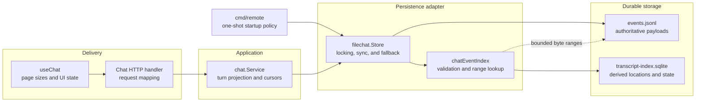
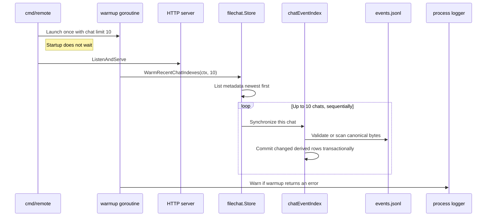

# Ownership and startup warming

The transcript index is a persistence optimization with a small startup policy
at the composition boundary. It does not introduce another source of truth or
move transcript projection rules into storage.

## Layer ownership

The layers have deliberately different responsibilities:

| Layer | Owns |
| --- | --- |
| `cmd/remote` | Process composition and launching the non-blocking, one-shot warmup |
| `stores.Stores` | Exposing the startup-only warmer capability at the composition boundary |
| `filechat.Store` | Per-chat locking, choosing indexed or canonical reads, and preserving availability |
| `chatEventIndex` | SQLite schema, validation, synchronization, offsets, and turn ranges |
| `chat.Service` | Complete-turn projection, compaction, cursors, and `HasMore` behavior |
| Frontend | Requesting 10 turns initially and 20 turns for older pages |

The goroutine belongs to the command because concurrency is currently only a
process-start policy. Index mechanics stay in `filechat`; the store does not
decide when the application should launch background work.

## Async startup flow

The metadata list is ordered by `LastMessageAt`, so the worker selects up to
the 10 most recently active chats. It processes those chats sequentially in
one goroutine. For a missing index, synchronization scans the whole currently
observed JSONL file; for an existing index, it validates or extends the durable
state. Other chats remain lazy.

The HTTP server begins accepting requests immediately. If an open request and
the worker target the same chat, the store's per-chat lock serializes their
index work. SQLite uses WAL and a small connection pool, so reads for already
indexed chats can continue while another chat is being backfilled. Derived
index writes still serialize; simply adding more warmup goroutines would not
guarantee lower latency.

## When this should become a service

There is no general-purpose “goroutine layer.” Keep this as a command-local
starter while it is one call, one limit, and warning-only failure handling. A
dedicated background service becomes useful if the feature gains lifecycle or
policy of its own, such as:

- retries or backoff;
- a bounded work queue or configurable concurrency;
- interactive-chat prioritization;
- progress, metrics, health, or an administrative trigger;
- coordinated `Start` and `Close` behavior during shutdown.

At that point, the service should own its context, worker group, and scheduling
policy while continuing to depend on a narrow warmer interface. The
`filechat` adapter should still own only persistence and index mechanics.
