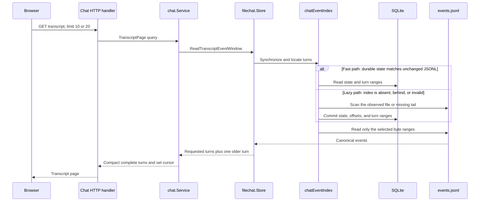
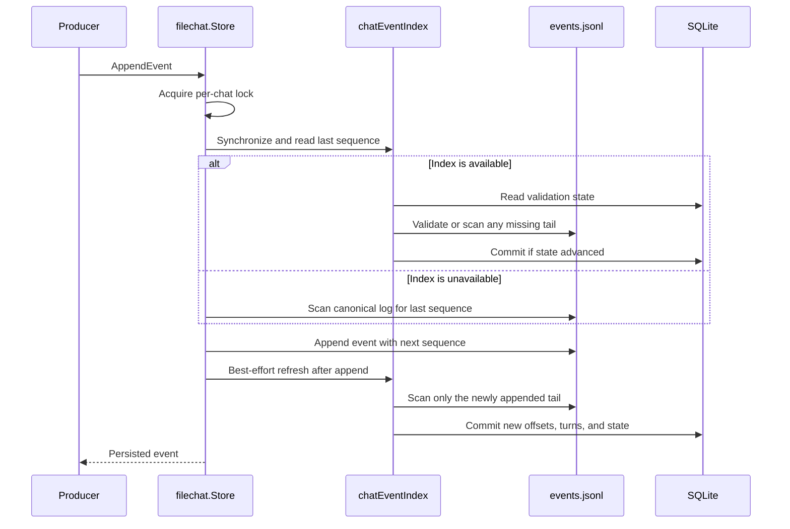
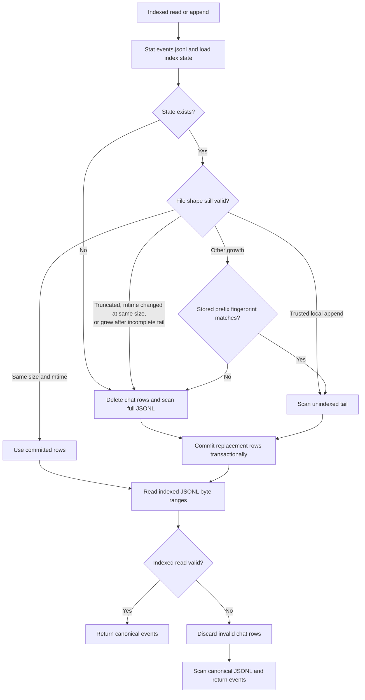

# Reads, writes, and recovery

The durable index accelerates history by mapping complete turns to event byte
ranges. It never replaces the JSONL event log and never stores event payloads.

## Open and read flow

The initial browser request asks for 10 complete turns. **Load older messages**
asks for 20 complete turns per page. The storage window includes one
additional older turn so the application service can preserve cursor and
`HasMore` semantics.

For an unchanged, previously indexed chat, synchronization is a file-stat and
durable-state validation followed by range lookup and bounded JSONL reads. It
does not rebuild the derived rows on every reopen. For an unindexed chat, the
first request performs the lazy backfill before it can locate the requested
turns.

## Append and incremental synchronization

The JSONL append is authoritative. The derived refresh normally scans only the
new tail and commits all observed changes in one transaction. If that refresh
fails, the append remains valid; the next indexed read or append retries
synchronization from canonical storage.

## Validation and recovery

Validation uses file size, modification time, incomplete-tail state, and a
rolling prefix fingerprint before untrusted growth. Truncation, a same-size
mtime change, growth after an incomplete tail, or a mismatched prefix triggers
a transactional rebuild for that chat. Normal growth extends the existing
rows. The fast path trusts unchanged size and mtime, so an out-of-band
same-size rewrite that also preserves mtime is not detectable. An invalid
offset or range is discarded and the request falls back to a full canonical
scan.

An unknown schema version is replaced rather than migrated because all rows
are derived. If SQLite is corrupt when opened, Remote removes the index files
and recreates them. Operators may likewise delete
`DATA_DIR/transcript-index.sqlite` while Remote is stopped; it will be rebuilt
from JSONL. Losing or rebuilding the index never changes transcript content.
