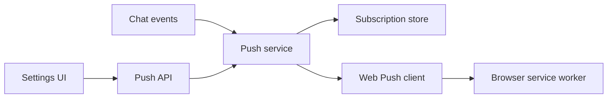

# Components and state

The feature is split into five main parts. Each part has one clear job.

## Responsibilities

| Part | Responsibility |
| --- | --- |
| Settings UI | Shows support, permission, subscription, test, and error states |
| Push API | Authenticates the user and accepts subscriptions and presence updates |
| Push service | Chooses recipients and sends notifications to their devices |
| Subscription store | Persists the VAPID key and per-user browser subscriptions |
| Web Push client | Encrypts payloads and safely connects to push providers |
| Service worker | Displays notifications and routes clicks into the application |

## State locations

| State | Location | Lifetime |
| --- | --- | --- |
| VAPID key pair | `DATA_DIR/webpush-vapid.json` | Until deliberately rotated |
| Browser subscriptions | `DATA_DIR/push-subscriptions/` | Until disabled, retired, logout, or user removal |
| Presence claims | Backend memory | Claims live for 55 seconds; revisions are bounded per user |
| Parked-question state | Backend memory | Until a user, completion, or error event |
| Browser permission and subscription | Browser profile | Controlled by the browser and user |

At startup, Remote loads or creates the VAPID key, verifies the key pair, and
constructs the Web Push client. If that fails, notifications are disabled but
the rest of Remote still starts normally.

## Main source locations

- [`backend/internal/service/push_notifier.go`](../../../backend/internal/service/push_notifier.go)
- [`backend/internal/service/push/`](../../../backend/internal/service/push/)
- [`backend/internal/integration/webpush/`](../../../backend/internal/integration/webpush/)
- [`backend/internal/stores/filepush/`](../../../backend/internal/stores/filepush/)
- [`frontend/src/api/pushSubscriptionApi.ts`](../../../frontend/src/api/pushSubscriptionApi.ts)
- [`frontend/src/state/push/pushPresenceState.ts`](../../../frontend/src/state/push/pushPresenceState.ts)
- [`frontend/public/sw.js`](../../../frontend/public/sw.js)
