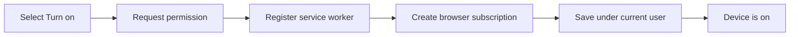
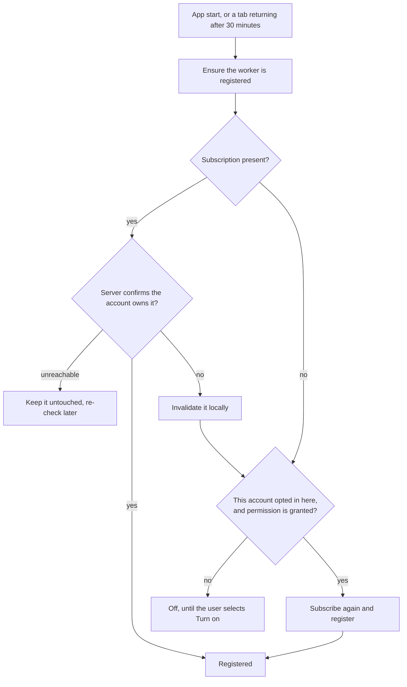

# Device subscription lifecycle

Notifications are enabled separately on each browser or installed PWA.

## Turn notifications on

The browser subscription contains:

- an HTTPS endpoint owned by the browser's push provider;
- a P-256 public key used to encrypt messages for the device; and
- an authentication secret.

Remote validates all three values before storing the subscription. One user
may store up to 20 device subscriptions.

## UI states

| State | Meaning |
| --- | --- |
| Loading | Remote is checking the server and browser |
| Blocked | Push is unsupported, server-side push is disabled, or permission was denied |
| Off | This browser has no subscription owned by the current account |
| On | This browser holds a subscription for the current account |

On every authenticated app startup, Remote compares the browser's exact
endpoint with the current user's stored endpoints. An endpoint left by another
account is invalidated locally before it can be treated as enabled.

## Keeping a device registered

A browser subscription is not durable. A push service may retire an endpoint
after a long idle period, a browser may drop a worker registration, and a
restored `DATA_DIR` may no longer contain the server's record of a device. None
of those is the user withdrawing consent, so Remote restores the registration
instead of reporting the device as off.

Two rules make this safe:

- **A restore never prompts.** It runs only when the browser has already
  granted permission. The permission dialog belongs to **Turn on** alone.
- **A restore is per account.** Each browser remembers which accounts turned
  notifications on in it (`localStorage`, key `remote.futrx.pushOptIn`), so a
  shared browser never subscribes someone who never asked. The record holds
  SHA-256 fingerprints, never addresses, so it cannot enumerate who has signed
  in on a shared machine. Turning notifications off, or signing out, forgets
  the account immediately.

The service worker covers the case the app cannot see, because the app is not
running: when a push service retires an endpoint it fires
`pushsubscriptionchange`, and the worker confirms the current session owns the
retired endpoint, subscribes again with the same application server key,
registers the replacement, and deletes the retired one. A rotation it cannot
attribute to the signed-in account is left for the app to restore, which is the
only place the per-account opt-in is known.

An unsubscribe is never used as a way to express uncertainty. On Safari,
removing the last subscription also removes the site's notification permission,
which is what puts the "Allow notifications?" prompt back in front of the user.

## Turn notifications off

Remote performs these steps in order:

1. Read the browser's current subscription.
2. Delete its endpoint from the current user's server record.
3. Ask the browser to unsubscribe the endpoint.

Deleting server state first avoids leaving an unreachable endpoint in the
store when a later API request fails.

Signing out performs the same server and browser cleanup before clearing the
session. As a second boundary, the service worker verifies its exact endpoint
against the current session before displaying every incoming push. A logged-out
or different account cannot display the previous user's notification: without a
session the worker stays silent, and an endpoint the server reports as
belonging to someone else is invalidated on the spot.

## VAPID key changes

The key pair lives in `DATA_DIR` and survives updates; only losing or rotating
it deliberately changes it. When the public key does change, an old
subscription cannot be reused for delivery, so Remote removes it, creates one
with the new key, and saves the replacement on the server — during a restore as
well as on the next enable action. A browser that does not expose the key its
subscription was signed with is left alone, because an unprovable mismatch is
not worth the permission a replacement can cost.

## Account and user cleanup

A browser subscription belongs to the whole origin, while Remote stores it
under one user. Exact endpoint ownership, startup reconciliation, and logout
cleanup keep those identities aligned in a shared browser.

Removing a user deletes all of their push subscriptions and removes them from
every project access list before deleting the user record.
