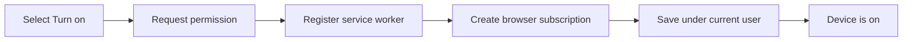

# Device subscription lifecycle

Notifications are enabled separately on each browser or installed PWA.

## Turn notifications on

The browser subscription contains:

- an HTTPS endpoint owned by the browser's push provider;
- a P-256 public key used to encrypt messages for the device; and
- an authentication secret.

Remote validates all three values before storing the subscription. One user
may store up to 20 device subscriptions.

## UI states

| State | Meaning |
| --- | --- |
| Loading | Remote is checking the server and browser |
| Blocked | Push is unsupported, server-side push is disabled, or permission was denied |
| Off | This browser has no subscription owned by the current account |
| On | The server confirms this exact endpoint belongs to the current account |

On every authenticated app startup, Remote compares the browser's exact
endpoint with the current user's stored endpoints. An endpoint left by another
account is invalidated locally before it can be treated as enabled.

## Turn notifications off

Remote performs these steps in order:

1. Read the browser's current subscription.
2. Delete its endpoint from the current user's server record.
3. Ask the browser to unsubscribe the endpoint.

Deleting server state first avoids leaving an unreachable endpoint in the
store when a later API request fails.

Signing out performs the same server and browser cleanup before clearing the
session. As a second boundary, the service worker verifies its exact endpoint
against the current session before displaying every incoming push. A logged-out
or different account cannot display the previous user's notification.

## VAPID key changes

When the public VAPID key changes, an old subscription cannot be reused for
delivery. The next enable action removes the old browser subscription, creates
one with the new key, and saves the replacement on the server.

## Account and user cleanup

A browser subscription belongs to the whole origin, while Remote stores it
under one user. Exact endpoint ownership, startup reconciliation, and logout
cleanup keep those identities aligned in a shared browser.

Removing a user deletes all of their push subscriptions and removes them from
every project access list before deleting the user record.
