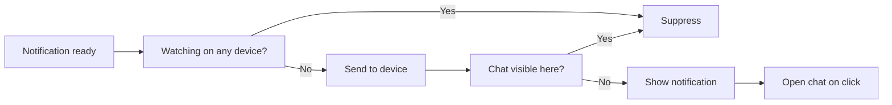

# Presence, display, and click routing

Remote checks whether the user is already viewing a chat before showing an
alert. The backend handles other devices; the service worker handles the
receiving device.

## Backend presence

The focused page reports its user, page-local client ID, and visible chat. It
refreshes that claim every 20 seconds. The backend considers the claim valid
for 55 seconds.

Claims are tracked per browser tab so one background tab cannot cancel another
focused tab's presence. Every claim, heartbeat, and release carries a
monotonically increasing revision. The backend accepts only the newest
revision for that tab and retains releases as bounded tombstones, so a delayed
older claim cannot revive presence.

Presence lives only in memory; a backend restart may cause an extra
notification but does not lose durable application state.

## Service-worker check

After receiving a push, the service worker asks visible windows which chat is
focused. It waits up to 400 milliseconds:

- a matching chat suppresses the notification;
- no matching response displays it.

The worker favors an extra alert over silently losing one. Its only offline
cache entry is the self-contained `/offline.html` navigation fallback; it does
not cache the app shell, API responses, or project data.

## Notification display

Question notifications request stronger attention through high urgency,
interaction persistence, and vibration where supported. Notifications use a
tag based on the chat ID, so a newer alert for the same chat replaces the old
one.

## Click routing

- If a Remote window exists, the worker focuses it and sends an `open-chat`
  message.
- If no window exists, the worker opens `/?chat=<id>`.
- During cold startup, the application consumes that query parameter and
  selects the requested chat.
