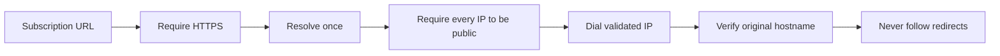

# Security and failure model

A subscription endpoint is supplied by the browser but ultimately causes the
server to make an outbound request. Remote therefore treats every endpoint as
an SSRF boundary.

## Safe outbound connection

The transport also:

- rejects credentials, fragments, opaque URLs, localhost, and oversized URLs;
- blocks private, loopback, link-local, multicast, reserved, metadata, NAT64,
  and other non-public address ranges;
- rejects a hostname when even one DNS answer is unsafe;
- disables environment HTTP proxies; and
- pins the checked DNS result into the real connection to prevent DNS
  rebinding.

## Encryption and secrets

- The VAPID private key remains in `DATA_DIR` with mode `0600`.
- Subscription files contain endpoint capabilities and client encryption keys
  and also use mode `0600`.
- `webpush-go` encrypts the payload and signs the request.
- The push provider routes ciphertext to the browser.
- Logs include only the endpoint hostname, never its full capability URL.
- The browser-side opt-in record stores SHA-256 fingerprints of accounts, so
  `localStorage` on a shared machine does not enumerate this server's users —
  matching the hashed filenames of the server's subscription store.

## Failure behavior

| Failure | Behavior |
| --- | --- |
| VAPID initialization fails | Delivery is disabled; subscription cleanup remains available |
| Invalid endpoint or keys | Subscription request is rejected |
| Unsafe DNS result | Connection is refused |
| Redirect | Response is returned as failure and not followed |
| `404` or `410` | Subscription is removed |
| Timeout, `429`, `5xx`, TLS, or protocol error | Failure is logged without retry |
| Presence state is lost | A redundant notification may be displayed |
| Ownership cannot be verified (backend restarting, offline) | Nothing is displayed; the device registration is kept and re-checked |
| Worker receives a push with no session | Nothing is displayed; the registration is kept for the next sign-in |
| Push service retires an endpoint | The worker re-registers the device when the session owns the retired endpoint; otherwise the app restores it on its next start |
| Server has no record of a device that opted in here | The subscription is re-created silently, without a new permission prompt |
| Server definitively rejects the re-created device (device cap, invalid keys) | The opt-in is forgotten so restore stops retrying; "Turn on" surfaces the same error to the user |

## Remaining release-safety work

1. Notification previews include chat titles and truncated backend errors that
   may appear on a lock screen.
2. Delivery has no bounded worker queue or transient retry policy.

Displaying a notification is gated on a live ownership check, so keeping an
unverified registration cannot reveal another account's alert. Discarding one
can cost the browser's notification permission outright — Safari drops the
permission with the site's last subscription — so uncertainty suppresses
display, never registration.

Web Push encryption protects data in transit. It does not replace correct
audience selection, account lifecycle cleanup, or lock-screen privacy policy.
