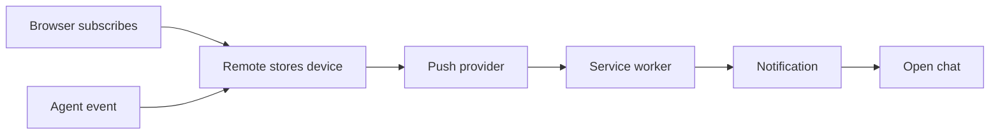

# Push notifications developer guide

This guide explains how Remote registers a device, creates a notification,
sends it through Web Push, suppresses unnecessary alerts, and opens the correct
chat when the notification is selected.

## Complete flow

There are two paths into the same system:

- **Setup:** the browser creates a subscription and Remote stores it for the
  signed-in user.
- **Delivery:** a relevant agent event becomes an encrypted push message for
  that user's devices.

## Documents

| Document | Explains |
| --- | --- |
| [Components and state](01-components-and-state.md) | The main pieces and where state lives |
| [Device subscription lifecycle](02-device-subscription-lifecycle.md) | Turning notifications on and off |
| [Event-to-delivery pipeline](03-event-to-delivery-pipeline.md) | Turning an agent event into Web Push |
| [Presence, display, and click routing](04-presence-display-and-click-routing.md) | Avoiding redundant alerts and opening chats |
| [Security and failure model](05-security-and-failure-model.md) | Outbound-request protection and known gaps |

## Notification types

| Event | Notification |
| --- | --- |
| Agent calls `AskUserQuestion` | The agent needs an answer |
| Interactive turn completes | Turn finished |
| Interactive run fails | Run failed |
| Scheduled run completes or fails | Scheduled task result |
| User selects **Send a test** | Test notification |
